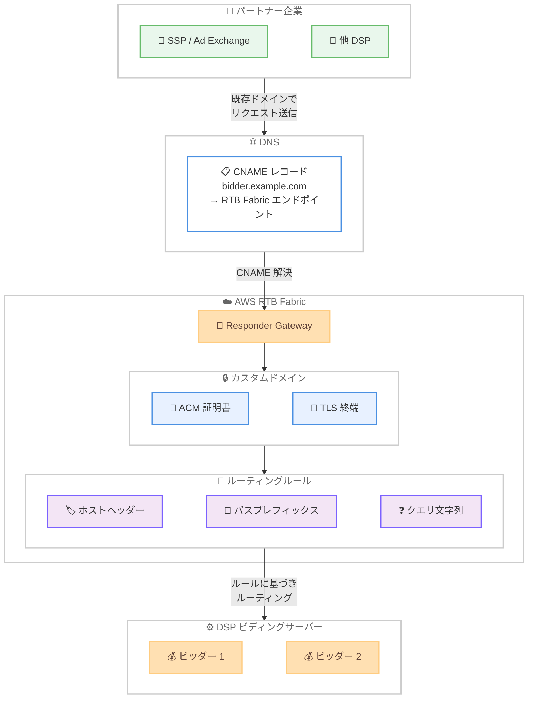

# AWS RTB Fabric - カスタムドメインによるリアルタイムビディングワークロードのサポート

**リリース日**: 2026 年 5 月 14 日
**サービス**: AWS RTB Fabric
**機能**: External Link 経由のリアルタイムビディングトランザクション向けカスタムドメイン

📊 [このアップデートのインフォグラフィックを見る](https://takech9203.github.io/aws-news-summary/20260514-aws-rtb-fabric-custom-domains.html)

## 概要

AWS RTB Fabric が External Link 経由で受信するリアルタイムビディング (RTB) トランザクションに対し、カスタムドメインのサポートを開始しました。AdTech 企業は自社が所有するドメインを RTB Fabric のゲートウェイに関連付けることで、パートナー企業にエンドポイント設定の変更を求めることなく、既存のパブリックエンドポイントを維持したまま RTB Fabric の低コスト・低レイテンシーなネットワーキングを活用できるようになります。

この機能は DNS CNAME 設定と URL パターンベースのルーティングルールをサポートしており、DSP (Demand-Side Platform) や SSP (Supply-Side Platform) は既存の DNS レコードを RTB Fabric に向けるだけで移行が完了します。RTB Fabric は標準的なクラウドネットワーキングコストを最大 80% 削減し、1 桁ミリ秒のレイテンシーを実現するサービスです。

**アップデート前の課題**

- RTB Fabric を利用するためにはパートナー企業がエンドポイント設定を RTB Fabric のデフォルトドメインに変更する必要があり、移行のハードルが高かった
- 既存のパブリックドメイン (例: `bidder.company.com`) を維持したまま RTB Fabric を導入する手段がなかった
- 複数のパートナーから異なる URL パターンでトラフィックを受信する場合、パスやホストヘッダーに基づく柔軟なルーティングが困難だった

**アップデート後の改善**

- 自社所有のドメインを DNS CNAME で RTB Fabric に向けるだけで、パートナー側のエンドポイント変更なしに RTB Fabric を導入可能になった
- ACM 証明書をゲートウェイに関連付けることで、カスタムドメインでの TLS 終端が実現した
- URL パターンベースのルーティングルールにより、ホストヘッダー、パスプレフィックス、クエリ文字列などの条件で柔軟にトラフィックをルーティングできるようになった

## アーキテクチャ図



パートナー企業は既存のドメイン (`bidder.example.com`) を使用してリクエストを送信します。DNS CNAME レコードが RTB Fabric のエンドポイントに解決され、RTB Fabric はカスタムドメインで TLS を終端した後、URL パターンベースのルーティングルールに基づいてトラフィックを適切なビディングサーバーに転送します。

## サービスアップデートの詳細

### 主要機能

1. **カスタムドメイン設定**
   - 自社所有のドメインを RTB Fabric ゲートウェイに関連付け可能
   - DNS CNAME レコードを RTB Fabric エンドポイントに設定するだけで移行完了
   - パートナー企業側のエンドポイント設定変更が不要

2. **ACM 証明書の関連付け**
   - AWS Certificate Manager (ACM) の証明書をゲートウェイに関連付けることでカスタムドメインでの TLS 終端を実現
   - 証明書のライフサイクル管理 (関連付け、関連解除、ステータス監視) を API で制御
   - 複数の証明書を 1 つのゲートウェイに関連付け可能

3. **URL パターンベースのルーティングルール**
   - ホストヘッダー (完全一致、ワイルドカード) によるルーティング
   - パスプレフィックスまたはパス完全一致によるルーティング
   - クエリ文字列の値一致またはキー存在チェックによるルーティング
   - 優先度 (priority) 設定による複数ルールの順序制御

## 技術仕様

### ルーティングルール条件

| 条件タイプ | パラメータ | 説明 |
|------|------|------|
| ホストヘッダー完全一致 | `hostHeader` | 指定したホスト名に完全一致するリクエストをルーティング |
| ホストヘッダーワイルドカード | `hostHeaderWildcard` | ワイルドカードパターンに一致するホスト名をルーティング |
| パスプレフィックス | `pathPrefix` | 指定したプレフィックスで始まる URL パスをルーティング |
| パス完全一致 | `pathExact` | 指定したパスに完全一致する URL をルーティング |
| クエリ文字列値一致 | `queryStringEquals` | 指定したキーと値のペアがクエリ文字列に含まれる場合にルーティング |
| クエリ文字列キー存在 | `queryStringExists` | 指定したキーがクエリ文字列に存在する場合にルーティング |

### 証明書関連付けステータス

| ステータス | 説明 |
|------|------|
| `PENDING_ASSOCIATION` | 証明書の関連付け処理中 |
| `ASSOCIATED` | 証明書が正常に関連付けられた状態 |
| `PENDING_DISASSOCIATION` | 証明書の関連解除処理中 |
| `DISASSOCIATED` | 証明書が関連解除された状態 |
| `FAILED` | 関連付けまたは関連解除に失敗 |

### API 変更履歴

| 日付 | サービス | 変更内容 |
|------|----------|----------|
| 2026/05/13 | [RTBFabric](https://awsapichanges.com/archive/changes/74501c-rtbfabric.html) | 9 new methods - カスタムドメイン設定および Link ルーティングルール関連の API を追加 |

### 新規追加された API メソッド

今回のカスタムドメイン機能追加により、以下の 9 つの API メソッドが新規追加されました。

**証明書管理:**
- **AssociateCertificate**: ACM 証明書をゲートウェイに関連付け
- **DisassociateCertificate**: ゲートウェイから証明書の関連付けを解除
- **GetCertificateAssociation**: 証明書の関連付けステータスを取得
- **ListCertificateAssociations**: ゲートウェイに関連付けられた証明書の一覧を取得

**ルーティングルール管理:**
- **CreateLinkRoutingRule**: Link に URL パターンベースのルーティングルールを作成
- **GetLinkRoutingRule**: ルーティングルールの詳細を取得
- **UpdateLinkRoutingRule**: ルーティングルールの条件や優先度を更新
- **DeleteLinkRoutingRule**: ルーティングルールを削除
- **ListLinkRoutingRules**: Link のルーティングルール一覧を取得

### 設定例

```json
{
  "conditions": {
    "hostHeader": "bidder.example.com",
    "pathPrefix": "/openrtb/v2/",
    "queryStringEquals": {
      "key": "format",
      "value": "json"
    }
  },
  "priority": 100
}
```

## 設定方法

### 前提条件

1. AWS RTB Fabric の利用が有効化されていること
2. Responder Gateway が作成済みであること
3. カスタムドメインの DNS 管理権限を有していること
4. ACM でカスタムドメインの証明書が発行済みであること

### 手順

#### ステップ 1: ACM 証明書の準備

```bash
# ACM で証明書をリクエスト（事前に完了していること）
aws acm request-certificate \
  --domain-name bidder.example.com \
  --validation-method DNS
```

カスタムドメイン用の TLS 証明書を ACM で発行します。DNS 検証を完了し、証明書のステータスが `ISSUED` になっていることを確認してください。

#### ステップ 2: ゲートウェイに証明書を関連付け

```bash
aws rtb-fabric associate-certificate \
  --gateway-id gw-0123456789abcdef0 \
  --acm-certificate-arn arn:aws:acm:us-east-1:123456789012:certificate/abc-def-123
```

RTB Fabric のゲートウェイに ACM 証明書を関連付けます。これによりカスタムドメインでの TLS 終端が有効になります。ステータスが `ASSOCIATED` になるまで待機してください。

#### ステップ 3: DNS CNAME レコードの設定

```bash
# Route 53 を使用する場合の例
aws route53 change-resource-record-sets \
  --hosted-zone-id Z0123456789 \
  --change-batch '{
    "Changes": [{
      "Action": "CREATE",
      "ResourceRecordSet": {
        "Name": "bidder.example.com",
        "Type": "CNAME",
        "TTL": 300,
        "ResourceRecords": [{
          "Value": "gw-0123456789abcdef0.rtbfabric.us-east-1.amazonaws.com"
        }]
      }
    }]
  }'
```

カスタムドメインの DNS CNAME レコードを RTB Fabric ゲートウェイのエンドポイントに設定します。Route 53 以外の DNS プロバイダーでも同様に CNAME レコードを作成できます。

#### ステップ 4: ルーティングルールの作成

```bash
aws rtb-fabric create-link-routing-rule \
  --gateway-id gw-0123456789abcdef0 \
  --link-id link-0123456789abcdef0 \
  --priority 100 \
  --conditions '{
    "hostHeader": "bidder.example.com",
    "pathPrefix": "/openrtb/v2/"
  }'
```

Link に対してルーティングルールを作成し、カスタムドメインのホストヘッダーと URL パスに基づいてトラフィックを適切にルーティングします。優先度の数値が低いルールが先に評価されます。

#### ステップ 5: 設定の確認

```bash
# 証明書関連付けの確認
aws rtb-fabric get-certificate-association \
  --gateway-id gw-0123456789abcdef0 \
  --acm-certificate-arn arn:aws:acm:us-east-1:123456789012:certificate/abc-def-123

# ルーティングルールの確認
aws rtb-fabric list-link-routing-rules \
  --gateway-id gw-0123456789abcdef0 \
  --link-id link-0123456789abcdef0
```

証明書の関連付けステータスが `ASSOCIATED`、ルーティングルールのステータスが `ACTIVE` であることを確認します。

## メリット

### ビジネス面

- **パートナー移行の摩擦を排除**: パートナー企業にエンドポイント設定の変更を依頼する必要がなくなり、RTB Fabric 導入の障壁を大幅に低減
- **ブランドの維持**: 自社ドメインを継続使用することで、パートナーとの信頼関係や契約上のエンドポイント要件を維持
- **最大 80% のコスト削減を即座に実現**: 既存のトラフィックフローを変更せずに RTB Fabric の低コストネットワーキングに移行可能

### 技術面

- **DNS ベースの簡単な移行**: CNAME レコードの設定だけで RTB Fabric への移行が完了し、アプリケーション側の変更が不要
- **柔軟なルーティング制御**: ホストヘッダー、パス、クエリ文字列に基づく高度なルーティングにより、複数パートナーからのトラフィックを 1 つのゲートウェイで効率的に管理
- **1 桁ミリ秒のレイテンシー維持**: カスタムドメインを使用しても RTB Fabric の超低レイテンシー性能は維持される

## デメリット・制約事項

### 制限事項

- 利用可能リージョンが現時点で 6 リージョンに限定されている
- ACM 証明書はゲートウェイと同じリージョンで発行する必要がある
- カスタムドメインの DNS 伝播にはプロバイダーに依じた遅延が生じる場合がある

### 考慮すべき点

- DNS CNAME はゾーンの頂点 (ゾーン Apex) には設定できないため、サブドメインの使用が必要
- 複数のルーティングルールを設定する場合、優先度の設計を慎重に行う必要がある
- 証明書の有効期限管理と自動更新の設定を確認する必要がある

## ユースケース

### ユースケース 1: DSP の RTB Fabric 移行

**シナリオ**: DSP が数百の SSP パートナーからビッドリクエストを受信しているが、全パートナーにエンドポイント変更を依頼するのは現実的ではない。カスタムドメインを使用して透過的に RTB Fabric に移行する。

**実装例**:
```bash
# 既存のドメイン bidder.dsp-company.com を維持
aws rtb-fabric associate-certificate \
  --gateway-id gw-abc123 \
  --acm-certificate-arn arn:aws:acm:us-east-1:123456789012:certificate/xyz

# DNS CNAME を RTB Fabric に向ける
# bidder.dsp-company.com CNAME gw-abc123.rtbfabric.us-east-1.amazonaws.com
```

**効果**: 数百のパートナー企業に影響を与えずに RTB Fabric へ移行し、ネットワーキングコストを最大 80% 削減。

### ユースケース 2: マルチパートナールーティング

**シナリオ**: 1 つのドメインで複数の SSP から異なる URL パスでビッドリクエストを受信しており、パスに基づいて異なるビディングロジックにルーティングしたい。

**実装例**:
```bash
# /openrtb/ パスのトラフィックをルーティング
aws rtb-fabric create-link-routing-rule \
  --gateway-id gw-abc123 \
  --link-id link-ssp-a \
  --priority 100 \
  --conditions '{"pathPrefix": "/openrtb/v2/"}'

# /vast/ パスのトラフィックを別の Link にルーティング
aws rtb-fabric create-link-routing-rule \
  --gateway-id gw-abc123 \
  --link-id link-video \
  --priority 200 \
  --conditions '{"pathPrefix": "/vast/"}'
```

**効果**: 1 つのゲートウェイとドメインで複数のトラフィックタイプを効率的に管理し、URL パターンに基づく柔軟なルーティングを実現。

### ユースケース 3: 段階的な移行とテスト

**シナリオ**: RTB Fabric への移行をリスクを最小化しながら段階的に実施したい。ワイルドカードホストヘッダーを使用してテスト用サブドメインから移行を開始する。

**実装例**:
```bash
# テスト用サブドメインのルーティングルールを作成
aws rtb-fabric create-link-routing-rule \
  --gateway-id gw-abc123 \
  --link-id link-test \
  --priority 50 \
  --conditions '{"hostHeader": "test-bidder.example.com"}'

# 本番ドメインのルーティングルールを後から追加
aws rtb-fabric create-link-routing-rule \
  --gateway-id gw-abc123 \
  --link-id link-prod \
  --priority 100 \
  --conditions '{"hostHeader": "bidder.example.com"}'
```

**効果**: テスト用サブドメインで動作確認を行った後、本番ドメインの CNAME を切り替えることで、リスクを最小化した段階的な移行が可能。

## 料金

AWS RTB Fabric のカスタムドメイン機能に関する追加料金の詳細は公式発表では明示されていません。RTB Fabric 自体は標準的なクラウドネットワーキングコストを最大 80% 削減するとされています。ACM の証明書は無料で利用可能です。詳細は AWS の公式料金ページを参照してください。

## 利用可能リージョン

以下の 6 リージョンで利用可能です。

| リージョン名 | リージョンコード |
|------|------|
| 米国東部 (バージニア北部) | us-east-1 |
| 米国西部 (オレゴン) | us-west-2 |
| アジアパシフィック (シンガポール) | ap-southeast-1 |
| アジアパシフィック (東京) | ap-northeast-1 |
| 欧州 (フランクフルト) | eu-central-1 |
| 欧州 (アイルランド) | eu-west-1 |

## 関連サービス・機能

- **AWS Certificate Manager (ACM)**: カスタムドメインの TLS 証明書を管理し、RTB Fabric ゲートウェイに関連付けるために使用
- **Amazon Route 53**: カスタムドメインの DNS CNAME レコードを管理し、トラフィックを RTB Fabric に向けるために使用
- **AWS RTB Fabric ヘルスチェック**: 2026 年 4 月に追加されたヘルスチェック機能と組み合わせることで、カスタムドメイン経由のトラフィックを正常なインスタンスにのみルーティング可能

## 参考リンク

- 📊 [インフォグラフィック](https://takech9203.github.io/aws-news-summary/20260514-aws-rtb-fabric-custom-domains.html)
- [公式発表 (What's New)](https://aws.amazon.com/about-aws/whats-new/2026/05/aws-rtb-fabric-custom-domains/)
- [AWS RTB Fabric ドキュメント](https://docs.aws.amazon.com/rtb-fabric/latest/userguide/)
- [AWS RTB Fabric 料金ページ](https://aws.amazon.com/rtb-fabric/pricing/)

## まとめ

AWS RTB Fabric のカスタムドメインサポートは、AdTech 企業が既存のパブリックエンドポイントを維持したまま RTB Fabric の低コスト・低レイテンシーネットワーキングに移行するための重要なアップデートです。DNS CNAME 設定と URL パターンベースのルーティングルールにより、パートナー企業への影響なしに透過的な移行が実現します。RTB Fabric を検討している DSP や SSP は、カスタムドメイン機能を活用してパートナーとの既存の接続を維持しながら段階的な移行を進めることを推奨します。
