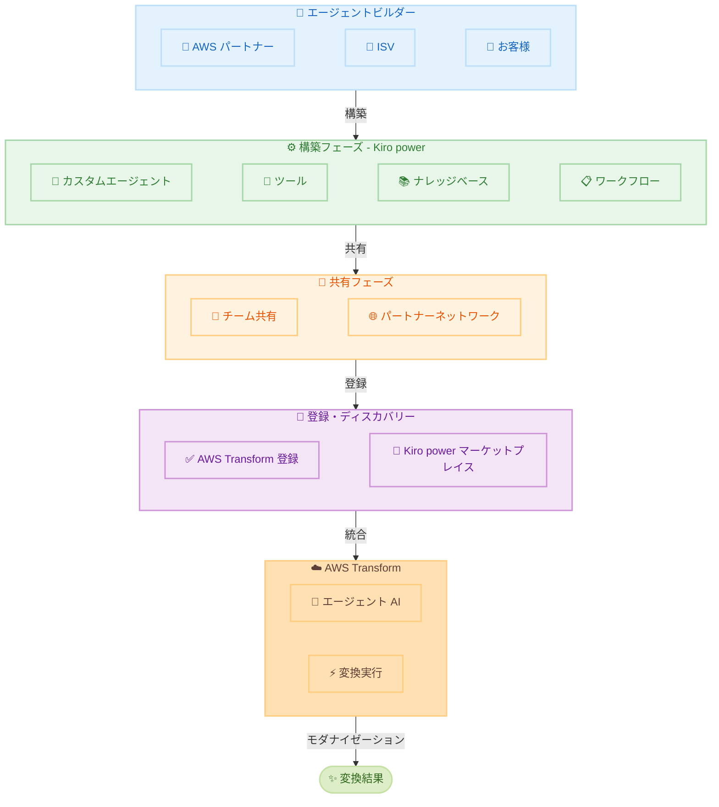

# AWS Transform - Agent Builder Toolkit (Kiro power)

**リリース日**: 2026 年 5 月 14 日
**サービス**: AWS Transform
**機能**: Agent Builder Toolkit (Kiro power)

## 概要

AWS Transform composability イニシアチブの一環として、AWS Transform 向けの Agent Builder Toolkit (Kiro power) が一般提供 (GA) されました。このツールキットにより、AWS パートナーおよびお客様が、自社固有のモダナイゼーション要件に合わせたカスタム変換エージェントを構築し、AWS Transform とシームレスに連携させることが可能になります。

Migration and Modernization Competency パートナー、ISV、またはお客様は、独自のエージェント、ツール、ナレッジベース、ワークフローを AWS Transform のエージェント AI 機能と統合することで、差別化されたトランスフォーメーションソリューションを構築できます。Agent Builder Toolkit は変換エージェントのエンドツーエンドライフサイクルを提供します。Kiro power を使用してエージェントを構築し、チームやパートナーネットワーク間で共有し、AWS Transform に登録してディスカバリーを可能にします。

**アップデート前の課題**

- AWS Transform の変換機能は AWS が提供する組み込みエージェントに限定されており、パートナーや顧客独自のモダナイゼーション手法を統合する手段がなかった
- ISV やパートナーが独自のトランスフォーメーションツールを AWS Transform エコシステムに組み込むための標準的な仕組みが存在しなかった
- カスタムエージェントの構築、共有、ディスカバリーのライフサイクル管理が統一されていなかった

**アップデート後の改善**

- Kiro power を使用して、特定のモダナイゼーション要件に合わせたカスタム変換エージェントを構築できるようになった
- 構築したエージェントをチームやパートナーネットワーク間で共有し、AWS Transform に登録してディスカバリー可能にするエンドツーエンドのライフサイクルが提供された
- Kiro power マーケットプレイスでエージェントを公開・発見できるようになり、エコシステムの拡張が容易になった

## アーキテクチャ図

この図は Agent Builder Toolkit のエンドツーエンドライフサイクルを示しています。パートナーや顧客が Kiro power でエージェントを構築し、共有・登録を経て AWS Transform と統合される流れを表現しています。

## サービスアップデートの詳細

### 主要機能

1. **カスタム変換エージェントの構築**
   - Kiro power を使用してモダナイゼーション要件に特化したエージェントを構築
   - 独自のツール、ナレッジベース、ワークフローを統合可能
   - AWS Transform のエージェント AI 機能との連携を保証

2. **エンドツーエンドのライフサイクル管理**
   - 構築 (Build): Kiro power でエージェントを開発
   - 共有 (Share): チームやパートナーネットワーク間で配布
   - 登録 (Register): AWS Transform に登録してディスカバリーを有効化

3. **Kiro power マーケットプレイス**
   - 構築したエージェントの公開と発見のためのマーケットプレイス
   - パートナーやお客様が作成したエージェントを検索・利用可能
   - エコシステム全体での再利用性を促進

4. **AWS Transform composability イニシアチブ**
   - パートナーと ISV がエコシステムに貢献するための枠組み
   - 差別化されたトランスフォーメーションソリューションの構築を支援
   - 組み合わせ可能な変換機能による柔軟な対応

## 技術仕様

### 対象ユーザーと用途

| 対象 | 用途 |
|------|------|
| Migration and Modernization Competency パートナー | パートナー独自のモダナイゼーション手法をエージェントとして提供 |
| ISV | 自社ソフトウェアに特化した変換エージェントを構築・販売 |
| お客様 | 自社固有の技術スタックに合わせたカスタムエージェントを構築 |

### Composability アーキテクチャ

| コンポーネント | 説明 |
|------|------|
| エージェント | モダナイゼーションタスクを実行するカスタム AI エージェント |
| ツール | エージェントが使用する変換ツールセット |
| ナレッジベース | ドメイン固有の知識や変換パターンの集合 |
| ワークフロー | 変換プロセスのオーケストレーション定義 |

## 設定方法

### 前提条件

1. AWS Transform へのアクセス権限
2. Kiro power マーケットプレイスへのアクセス
3. エージェント構築に必要なドメイン知識とツール

### 手順

#### ステップ 1: Kiro power でエージェントを構築

Kiro power 環境でカスタム変換エージェントを開発します。独自のツール、ナレッジベース、ワークフローを定義し、AWS Transform のエージェント AI 機能と統合するための設定を行います。

#### ステップ 2: エージェントの共有

構築したエージェントをチームメンバーやパートナーネットワークと共有します。アクセス制御を設定し、適切な範囲で利用可能にします。

#### ステップ 3: AWS Transform への登録

エージェントを AWS Transform に登録してディスカバリーを有効にします。Kiro power マーケットプレイスへの公開により、他のユーザーがエージェントを発見・利用できるようになります。

## メリット

### ビジネス面

- **差別化されたソリューション**: パートナーや ISV が独自の変換ソリューションを構築し、市場での差別化を実現
- **エコシステムの拡大**: マーケットプレイスを通じた新しい収益機会の創出
- **迅速なモダナイゼーション**: 特定のドメインに最適化されたエージェントにより、変換プロジェクトの効率が向上

### 技術面

- **柔軟な統合**: 独自のツール、ナレッジベース、ワークフローを AWS Transform のエージェント AI と組み合わせ可能
- **再利用性**: 構築したエージェントをマーケットプレイスで共有し、組織全体で再利用
- **エンドツーエンド管理**: 構築から登録・ディスカバリーまでの一貫したライフサイクル管理

## デメリット・制約事項

### 制限事項

- Agent Builder Toolkit の利用には Kiro power マーケットプレイスへのアクセスが必要
- カスタムエージェントの品質と動作保証はビルダーの責任
- AWS Transform のエージェント AI 機能との互換性を維持する必要がある

### 考慮すべき点

- カスタムエージェントの構築にはモダナイゼーションのドメイン知識が必要
- パートナーネットワーク間での共有にはガバナンスとセキュリティの考慮が必要
- エージェントの更新・メンテナンスのライフサイクルを計画する必要がある

## ユースケース

### ユースケース 1: パートナーによる業界特化型変換エージェント

**シナリオ**: Migration and Modernization Competency パートナーが、金融業界特有の COBOL メインフレームアプリケーションを Java マイクロサービスに変換するためのエージェントを構築する。

**効果**: 業界固有のコンプライアンス要件やビジネスロジックの変換パターンをナレッジベースとして組み込むことで、汎用的な変換ツールでは対応困難なケースを効率的に処理できる。

### ユースケース 2: ISV によるフレームワーク移行エージェント

**シナリオ**: ISV が自社の SaaS プラットフォームへの移行を支援するカスタムエージェントを構築し、Kiro power マーケットプレイスで公開する。

**効果**: 顧客がマーケットプレイスからエージェントを発見して利用できるため、ISV の顧客獲得と移行プロジェクトの効率化を同時に実現できる。

### ユースケース 3: エンタープライズ顧客による社内標準化

**シナリオ**: 大規模エンタープライズが自社のコーディング標準、アーキテクチャパターン、セキュリティポリシーに準拠した変換エージェントを構築し、社内の複数チームで共有する。

**効果**: 組織全体で一貫したモダナイゼーション品質を維持しながら、各チームが自律的に変換プロジェクトを進められるようになる。

## 料金

Agent Builder Toolkit の料金に関する具体的な情報は公式発表に含まれていません。AWS Transform の料金体系に準じるものと想定されます。詳細は [AWS Transform 料金ページ](https://aws.amazon.com/transform/pricing/) を確認してください。

## 利用可能リージョン

Kiro power マーケットプレイスで利用可能です。AWS Transform が提供されているリージョンで使用できます。詳細な対応リージョンについては [AWS Transform のドキュメント](https://aws.amazon.com/transform/) を確認してください。

## 関連サービス・機能

- **[AWS Transform](https://aws.amazon.com/transform/)**: エージェント AI を活用してレガシーシステムとコードをモダナイズするサービス
- **[AWS Transform composability イニシアチブ](https://aws.amazon.com/transform/partners/)**: パートナーと ISV がエコシステムに貢献するための枠組み
- **Kiro power**: エージェント構築と共有のためのプラットフォーム
- **AWS Migration and Modernization**: マイグレーションとモダナイゼーションの総合的なサービスポートフォリオ

## 参考リンク

- [公式発表 (What's New)](https://aws.amazon.com/about-aws/whats-new/2026/05/aws-transform-agent-builder-toolkit/)
- [AWS Transform](https://aws.amazon.com/transform/)
- [AWS Transform Partners - Composability Initiative](https://aws.amazon.com/transform/partners/)

## まとめ

AWS Transform 向け Agent Builder Toolkit (Kiro power) の GA により、AWS パートナー、ISV、顧客が独自のモダナイゼーションエージェントを構築・共有・登録できるエコシステムが整備されました。Migration and Modernization に関わる組織は、Kiro power マーケットプレイスを活用して、自社のドメイン知識やツールを活かした差別化されたトランスフォーメーションソリューションの構築を検討することを推奨します。
