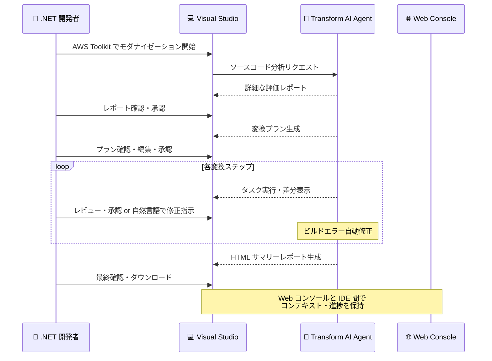

# AWS Transform - Visual Studio 向けエージェント型 AI アシスタント

**リリース日**: 2026 年 5 月 14 日
**サービス**: AWS Transform
**機能**: AWS Toolkit for Visual Studio におけるインタラクティブエージェント型 AI アシスタント

📊 [このアップデートのインフォグラフィックを見る](https://takech9203.github.io/aws-news-summary/20260514-aws-transform-ai-assistant.html)

## 概要

AWS Transform に、AWS Toolkit for Visual Studio 向けのインタラクティブなエージェント型 AI アシスタントが追加されました。これにより、.NET 開発者は IDE 内で会話形式のステップバイステップガイドを通じて、アプリケーションのモダナイゼーションを実行できるようになります。

このアシスタントは、可視性 (visibility)、チェックポイント機能 (checkpointing)、高度なステアリング機能 (enhanced steering) を提供します。エージェントがソースコードを分析し、詳細な評価レポートを提示した後、変換プランを生成して各モダナイゼーションタスクをインタラクティブに実行します。開発者は各ステップをレビュー、編集、承認してから次に進めるため、Web コンソールに切り替える必要がなくなりました。

Visual Studio に加えて、Kiro power for AWS Transform や AWS Transform MCP エージェントを通じて、Kiro やその他の AI コーディングアシスタントからも同様のエージェント機能を利用できます。

**アップデート前の課題**

- .NET アプリケーションのモダナイゼーションは Web コンソール上で実行する必要があり、IDE での開発作業との間に大きなコンテキストスイッチが発生していた
- 変換プロセスの各ステップに対する細かい制御が困難で、開発者がプロセスを一時停止して差分を確認したり、方向性を変えることが容易ではなかった
- ビルドエラーが発生した際の対応は手動で行う必要があり、変換プロセスの中断と再開が煩雑だった
- コンソールで開始したプロジェクトを IDE で継続する場合、コンテキストや進捗の引き継ぎができなかった

**アップデート後の改善**

- Visual Studio 内で会話形式のインタラクティブなモダナイゼーション体験が実現し、IDE を離れずに全工程を完了できるようになった
- 各ステップでの一時停止、差分確認、カスタムプランのアップロード、自然言語による指示が可能になった
- エージェントがビルドエラーを自動修正し、詳細なワークログと HTML サマリーレポートを生成するようになった
- Web コンソールで開始したプロジェクトを Visual Studio で完全なコンテキストを維持したまま継続できるようになった

## アーキテクチャ図



開発者がエージェントと対話しながら段階的にモダナイゼーションを進めるワークフローを示しています。各ステップで開発者の承認を得てから次に進む設計により、安全で制御されたモダナイゼーションが実現します。

## サービスアップデートの詳細

### 主要機能

1. **インタラクティブなステップバイステップ変換**
   - エージェントがソースコードを分析し、詳細な評価レポートを提供
   - 変換プランを自動生成し、開発者が確認・編集可能
   - 各ステップをレビュー・承認してから実行するため、予期しない変更を防止

2. **高度なステアリング機能**
   - 任意のステップで一時停止し、生成された差分を確認可能
   - カスタムプランのアップロードによる変換方針の上書き
   - 自然言語でエージェントに方向性を指示可能
   - 各ステップの編集・承認によるきめ細かい制御

3. **自動ビルドエラー修正**
   - 変換中に発生するビルドエラーをエージェントが自動検出・修正を試行
   - 詳細なワークログにより修正内容の透明性を確保
   - 手動介入が必要な場合は明確に通知

4. **クロス環境コンテキスト保持**
   - Web コンソールでモダナイゼーションプロジェクトを開始し、Visual Studio で継続可能
   - 完全なコンテキストと進捗が両環境間で保持される
   - ワークフローの再開始や再設定が不要

5. **マルチツール対応**
   - Kiro power for AWS Transform を通じた Kiro からの利用
   - AWS Transform MCP エージェントによる他の AI コーディングアシスタントからのアクセス
   - 統一されたツール体験によるコンテキストスイッチの削減

## 技術仕様

### 対応環境と要件

| 項目 | 詳細 |
|------|------|
| 対象 IDE | Visual Studio (AWS Toolkit for Visual Studio) |
| 対象言語 | .NET アプリケーション |
| 追加アクセス | Kiro (Kiro power)、MCP 対応エージェント |
| 出力形式 | HTML サマリーレポート (ダウンロード可能) |
| コンテキスト保持 | Web コンソール - IDE 間で完全同期 |

### エージェントの動作フロー

| フェーズ | 動作 | 開発者の関与 |
|----------|------|--------------|
| 分析 | ソースコード解析、依存関係マッピング | 分析結果の確認 |
| 評価 | 詳細な評価レポート生成 | レポートレビュー |
| プランニング | 変換プラン自動生成 | プラン確認・編集・承認 |
| 実行 | ステップごとのタスク実行 | 差分レビュー・承認・方向修正 |
| 修正 | ビルドエラー自動修正 | 修正内容の確認 |
| 完了 | HTML サマリーレポート・次のステップ提案 | 最終確認・ダウンロード |

## 設定方法

### 前提条件

1. Visual Studio がインストールされていること
2. AWS Toolkit for Visual Studio の最新バージョンがインストールされていること
3. AWS アカウントと適切な IAM 権限が設定されていること
4. モダナイズ対象の .NET アプリケーションのソースコードが利用可能であること

### 手順

#### ステップ 1: AWS Toolkit for Visual Studio のインストール・更新

Visual Studio Marketplace から最新の AWS Toolkit for Visual Studio をダウンロードしてインストールします。既にインストール済みの場合は最新バージョンに更新してください。

#### ステップ 2: Visual Studio でモダナイゼーションを開始

Visual Studio 内で AWS Transform のエージェント型 AI アシスタントを起動し、対象の .NET プロジェクトに対してモダナイゼーションを開始します。エージェントが自動的にソースコードの分析を開始します。

#### ステップ 3: 評価レポートの確認と変換プランの承認

エージェントが生成した評価レポートと変換プランを確認します。必要に応じてプランを編集するか、カスタムプランをアップロードして方針を指定します。

#### ステップ 4: インタラクティブな変換の実行

各変換ステップをレビュー・承認しながら進めます。一時停止して差分を確認したり、自然言語でエージェントに指示を出して方向性を調整できます。

#### ステップ 5: サマリーレポートの確認

変換完了後、エージェントが生成する HTML サマリーレポートをダウンロードし、変換結果と推奨される次のステップを確認します。

### 代替: Web コンソールからの開始

```
AWS Transform Web コンソール → プロジェクト作成 → Visual Studio で継続
```

Web コンソールでモダナイゼーションプロジェクトを開始し、その後 Visual Studio で同一プロジェクトを開くことで、コンテキストを維持したまま IDE での作業に移行できます。

## メリット

### ビジネス面

- **モダナイゼーション期間の短縮**: インタラクティブなガイド付き体験により、.NET アプリケーションの移行期間を大幅に削減
- **コンテキストスイッチの排除**: IDE を離れることなく変換作業を完了でき、開発者の生産性が向上
- **リスクの低減**: 各ステップのレビュー・承認により、予期しない変更やエラーを事前に防止

### 技術面

- **きめ細かい制御**: 一時停止、差分確認、自然言語指示により、変換プロセスを完全に制御
- **自動エラー修復**: ビルドエラーの自動修正により、手動デバッグの工数を削減
- **ワークフロー継続性**: Web コンソールと IDE 間でシームレスにコンテキストを引き継ぎ、中断なく作業を継続
- **透明性**: 詳細なワークログと HTML サマリーレポートにより、変換プロセスの全貌を可視化

## デメリット・制約事項

### 制限事項

- 現時点では Visual Studio のみが対象であり、VS Code でのエージェント型 AI アシスタント体験は別途提供
- .NET アプリケーションに特化した機能であり、他の言語・フレームワークには直接適用されない
- 自動ビルドエラー修正は試行であり、すべてのエラーを自動的に解決できるわけではない

### 考慮すべき点

- エージェントが生成する変換プランの品質はソースコードの複雑さや規模に依存する
- 大規模なレガシーアプリケーションでは、各ステップのレビューに相応の時間が必要になる可能性がある
- Web コンソールと IDE 間のコンテキスト同期にはネットワーク接続が必要

## ユースケース

### ユースケース 1: レガシー .NET Framework から .NET 8 への移行

**シナリオ**: 社内の大規模な .NET Framework 4.8 アプリケーションを .NET 8 にモダナイズする必要がある。複数のプロジェクトと複雑な依存関係があり、段階的な移行が求められる。

**実装例**:
```
1. Visual Studio で対象ソリューションを開く
2. AWS Transform AI アシスタントを起動
3. エージェントが依存関係を分析し、推奨移行順序を提示
4. 各プロジェクトを優先度順にステップバイステップで変換
5. ビルドエラーはエージェントが自動修正を試行
6. 各ステップの差分を確認・承認して進行
```

**効果**: 数ヶ月かかる手動移行作業を大幅に短縮し、ビルドエラーの自動修正により開発者の負担を軽減

### ユースケース 2: チームリードによる Web コンソールからの計画と開発者による実行

**シナリオ**: チームリードが Web コンソールでモダナイゼーション戦略を計画し、各開発者が Visual Studio で担当部分を実装する。

**実装例**:
```
1. チームリードが Web コンソールでプロジェクト作成・変換プラン策定
2. 開発者が Visual Studio で同一プロジェクトを開く
3. 完全なコンテキストと進捗が自動的に引き継がれる
4. 開発者がカスタムプランをアップロードして詳細な方針を追加
5. インタラクティブに変換を実行・レビュー
```

**効果**: 計画と実行の分離による効率的なチーム協業を実現し、コンテキストの損失を防止

### ユースケース 3: MCP エージェント経由での自動化パイプライン統合

**シナリオ**: CI/CD パイプラインに AWS Transform のモダナイゼーション機能を組み込み、コード変更のプルリクエスト時に自動的にモダナイゼーション提案を生成する。

**実装例**:
```
1. AWS Transform MCP エージェントを CI/CD パイプラインに設定
2. プルリクエスト時にエージェントがソースコードを分析
3. モダナイゼーション提案を自動生成
4. 開発者が Kiro または Visual Studio で提案を確認・適用
5. 変換結果を同一プルリクエストに反映
```

**効果**: 継続的なモダナイゼーションを開発プロセスに自然に組み込み、技術的負債の蓄積を防止

## 料金

AWS Transform の料金は、変換されるコードの行数とジョブの実行時間に基づきます。詳細な料金体系については AWS Transform の料金ページを参照してください。

## 利用可能リージョン

以下の 8 リージョンで利用可能です。

| リージョン名 | リージョンコード |
|--------------|------------------|
| 米国東部 (バージニア北部) | us-east-1 |
| カナダ (中部) | ca-central-1 |
| 欧州 (フランクフルト) | eu-central-1 |
| 欧州 (ロンドン) | eu-west-2 |
| アジアパシフィック (ムンバイ) | ap-south-1 |
| アジアパシフィック (ソウル) | ap-northeast-2 |
| アジアパシフィック (シドニー) | ap-southeast-2 |
| アジアパシフィック (東京) | ap-northeast-1 |

## 関連サービス・機能

- **AWS Toolkit for Visual Studio**: Visual Studio に AWS 開発ツールを統合する拡張機能。本アップデートの実行環境
- **Kiro**: AWS が提供する AI 搭載 IDE。Kiro power for AWS Transform を通じて同様のエージェント機能を利用可能
- **AWS Transform MCP エージェント**: Model Context Protocol を通じた AWS Transform へのプログラマティックアクセス
- **AWS Migration Hub**: マイグレーションとモダナイゼーションの進捗を一元管理するサービス

## 参考リンク

- 📊 [インフォグラフィック](https://takech9203.github.io/aws-news-summary/20260514-aws-transform-ai-assistant.html)
- [公式発表 (What's New)](https://aws.amazon.com/about-aws/whats-new/2026/05/aws-transform-ai-assistant)
- [AWS Transform for Windows .NET](https://aws.amazon.com/transform/windows-dotnet/)
- [AWS Toolkit for Visual Studio (Visual Studio Marketplace)](https://marketplace.visualstudio.com/items?itemName=AmazonWebServices.AWSToolkitforVisualStudio2022)
- [Kiro power for AWS Transform](https://kiro.dev/powers/)

## まとめ

AWS Transform の Visual Studio 向けエージェント型 AI アシスタントは、.NET 開発者にとってモダナイゼーション体験を根本的に変えるアップデートです。IDE 内での会話形式のインタラクティブな操作、各ステップのレビューと承認、ビルドエラーの自動修正により、安全かつ効率的なアプリケーション変換が実現します。東京リージョンを含む 8 リージョンで利用可能であり、日本の .NET 開発者は即座にこの機能を活用してレガシーアプリケーションのモダナイゼーションを加速できます。
