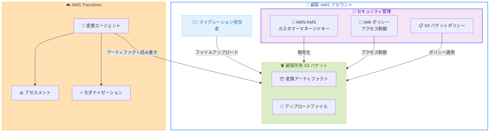

# AWS Transform - 顧客所有アーティファクトストアのサポート

**リリース日**: 2026年5月14日
**サービス**: AWS Transform
**機能**: Customer-owned Artifact Stores

📊 [このアップデートのインフォグラフィックを見る](https://takech9203.github.io/aws-news-summary/20260514-aws-transform-customer-owned-artifact.html)

## 概要

AWS Transform が顧客所有の Amazon S3 バケットをアーティファクトストアとしてサポートするようになりました。AWS Transform は、アセスメント、マイグレーション、モダナイゼーションを単一の AI 駆動エクスペリエンスに統合し、企業のフルトランスフォーメーションジャーニーをガイドするサービスです。今回のアップデートにより、変換アーティファクトの保存場所とセキュリティ管理を顧客が完全にコントロールできるようになりました。

この機能は、規制産業の企業がデータ主権やコンプライアンス要件を満たしながら AWS Transform を活用するために設計されています。自社の S3 バケットを構成し、AWS KMS キーによる暗号化やアクセスポリシーの管理を自社の AWS アカウント内で完結できます。

**アップデート前の課題**

- 変換アーティファクトの保存場所を顧客側でコントロールできなかった
- 規制産業の企業がデータ主権要件を満たすために追加の対策が必要だった
- 複数の AWS アカウントにまたがるアーティファクトの一元管理が困難だった
- マイグレーション担当者がファイルを変換エージェントに直接提供する手段が限られていた

**アップデート後の改善**

- 自社の S3 バケットを AWS Transform のアーティファクトストアとして構成可能になった
- AWS KMS カスタマーマネージドキーによるアーティファクトの暗号化が可能になった
- 自社 AWS アカウント内でアクセスポリシーを直接管理できるようになった
- マイグレーション担当者がバケットにファイルを直接アップロードし、変換エージェントが即座に利用できるようになった
- 複数の AWS アカウントにまたがるアーティファクトストレージの一元化が可能になった

## アーキテクチャ図



顧客所有の S3 バケットを AWS Transform のアーティファクトストアとして構成し、KMS 暗号化と IAM ポリシーによるセキュリティ管理を自社アカウント内で完結させるアーキテクチャを示しています。

## サービスアップデートの詳細

### 主要機能

1. **顧客所有 S3 バケットの構成**
   - 自社の Amazon S3 バケットを AWS Transform のアーティファクトストアとして指定可能
   - 既存のバケットを利用でき、新規作成も可能
   - バケットのライフサイクルポリシーやバージョニングも顧客が管理

2. **AWS KMS カスタマーマネージドキーによる暗号化**
   - 自社の AWS KMS キーを使用してアーティファクトを暗号化可能 (オプション)
   - キーのローテーションポリシーを顧客が制御
   - 暗号化キーへのアクセスを自社で完全に管理

3. **自社アカウントでのアクセスポリシー管理**
   - IAM ポリシーによるきめ細かなアクセス制御
   - S3 バケットポリシーによるクロスアカウントアクセスの管理
   - AWS CloudTrail による全アクセスの監査ログ取得

4. **直接ファイルアップロードと即時利用**
   - マイグレーション担当者がバケットにファイルを直接アップロード可能
   - アップロードされたファイルを変換エージェントが即座に利用
   - 複数の AWS アカウントにまたがるアーティファクトの一元管理

## 技術仕様

### 構成要素

| 項目 | 詳細 |
|------|------|
| ストレージ | Amazon S3 (顧客所有バケット) |
| 暗号化 | AWS KMS カスタマーマネージドキー (オプション) |
| アクセス制御 | IAM ポリシー、S3 バケットポリシー |
| 監査 | AWS CloudTrail によるアクセスログ |
| マルチアカウント | 複数 AWS アカウントからの一元管理をサポート |

### セキュリティ設定例

```json
{
  "Version": "2012-10-17",
  "Statement": [
    {
      "Sid": "AllowTransformServiceAccess",
      "Effect": "Allow",
      "Principal": {
        "Service": "transform.amazonaws.com"
      },
      "Action": [
        "s3:GetObject",
        "s3:PutObject",
        "s3:ListBucket"
      ],
      "Resource": [
        "arn:aws:s3:::my-transform-artifacts",
        "arn:aws:s3:::my-transform-artifacts/*"
      ],
      "Condition": {
        "StringEquals": {
          "aws:SourceAccount": "123456789012"
        }
      }
    }
  ]
}
```

## 設定方法

### 前提条件

1. AWS Transform へのアクセス権限を持つ AWS アカウント
2. アーティファクト保存用の Amazon S3 バケット
3. (オプション) 暗号化用の AWS KMS カスタマーマネージドキー

### 手順

#### ステップ 1: S3 バケットの準備

```bash
# アーティファクト用 S3 バケットの作成
aws s3 mb s3://my-company-transform-artifacts --region us-east-1

# バージョニングの有効化 (推奨)
aws s3api put-bucket-versioning \
  --bucket my-company-transform-artifacts \
  --versioning-configuration Status=Enabled
```

アーティファクト保存用の S3 バケットを作成し、バージョニングを有効化します。バージョニングにより、アーティファクトの変更履歴を追跡できます。

#### ステップ 2: KMS キーの作成 (オプション)

```bash
# カスタマーマネージドキーの作成
aws kms create-key \
  --description "AWS Transform artifact encryption key" \
  --key-usage ENCRYPT_DECRYPT

# キーエイリアスの設定
aws kms create-alias \
  --alias-name alias/transform-artifacts-key \
  --target-key-id <key-id>
```

アーティファクトの暗号化に使用する KMS キーを作成します。このキーを使用することで、データの暗号化を自社で完全に制御できます。

#### ステップ 3: AWS Transform でのバケット構成

AWS Transform コンソールまたは API を使用して、自社の S3 バケットをアーティファクトストアとして構成します。詳細な手順は [AWS Transform User Guide](https://docs.aws.amazon.com/transform/latest/userguide/custom-s3-bucket.html) を参照してください。

## メリット

### ビジネス面

- **データ主権の確保**: アーティファクトが自社管理のバケットに保存されるため、データの所在地と管理権限を完全にコントロール可能
- **コンプライアンス対応**: 規制産業 (金融、医療、政府機関など) のデータ保管要件を満たしやすくなる
- **ガバナンスの強化**: 既存のデータガバナンスフレームワークにアーティファクト管理を統合可能

### 技術面

- **セキュリティの向上**: カスタマーマネージドキーによる暗号化と IAM ポリシーによるきめ細かなアクセス制御
- **運用効率の改善**: 複数アカウントのアーティファクトを一元管理し、マイグレーション担当者が直接ファイルをアップロード可能
- **監査の容易さ**: CloudTrail による全アクセスログの取得と、既存の監視ツールとの統合

## デメリット・制約事項

### 制限事項

- S3 バケットのストレージコストは顧客負担となる
- KMS キーの管理 (ローテーション、削除保護など) は顧客の責任
- バケットポリシーの誤設定により AWS Transform のアクセスが遮断される可能性がある

### 考慮すべき点

- バケットポリシーと IAM ポリシーの適切な設定が必要 (設定ミスによるサービス中断リスク)
- 既存のデータライフサイクルポリシーとの整合性を確認する必要がある
- マルチアカウント構成の場合、クロスアカウントアクセス権限の設計が必要

## ユースケース

### ユースケース 1: 金融機関のレガシーシステム移行

**シナリオ**: 金融機関が COBOL ベースのメインフレームアプリケーションを AWS にモダナイズする際、変換アーティファクト (ソースコード分析結果、変換計画、中間コードなど) を自社管理の暗号化バケットに保存する必要がある。

**実装例**:
```bash
# 金融規制準拠のバケット設定
aws s3api put-bucket-encryption \
  --bucket financial-transform-artifacts \
  --server-side-encryption-configuration '{
    "Rules": [{
      "ApplyServerSideEncryptionByDefault": {
        "SSEAlgorithm": "aws:kms",
        "KMSMasterKeyID": "arn:aws:kms:us-east-1:123456789012:key/your-key-id"
      },
      "BucketKeyEnabled": true
    }]
  }'
```

**効果**: 金融規制 (PCI DSS、SOX など) のデータ保管要件を満たしながら、AI 駆動の変換サービスを活用可能。

### ユースケース 2: マルチアカウント環境でのアーティファクト一元管理

**シナリオ**: 大規模企業が複数の AWS アカウント (開発、ステージング、本番) にまたがるマイグレーションプロジェクトを実施する際、全アカウントの変換アーティファクトを中央の共有バケットに集約する。

**実装例**:
```json
{
  "Version": "2012-10-17",
  "Statement": [
    {
      "Sid": "CrossAccountTransformAccess",
      "Effect": "Allow",
      "Principal": {
        "AWS": [
          "arn:aws:iam::111111111111:root",
          "arn:aws:iam::222222222222:root",
          "arn:aws:iam::333333333333:root"
        ]
      },
      "Action": ["s3:GetObject", "s3:PutObject"],
      "Resource": "arn:aws:s3:::central-transform-artifacts/*"
    }
  ]
}
```

**効果**: プロジェクト全体のアーティファクトを一元管理し、チーム間の可視性とコラボレーションを向上。

### ユースケース 3: 医療機関のデータ主権準拠

**シナリオ**: 医療機関がアプリケーションのモダナイゼーションを実施する際、患者データを含む可能性のある変換アーティファクトを特定のリージョン内に保持し、HIPAA 準拠のアクセス管理を適用する。

**実装例**:
```bash
# リージョン固定のバケット作成
aws s3 mb s3://healthcare-transform-artifacts --region us-east-1

# パブリックアクセスの完全ブロック
aws s3api put-public-access-block \
  --bucket healthcare-transform-artifacts \
  --public-access-block-configuration \
  BlockPublicAcls=true,IgnorePublicAcls=true,BlockPublicPolicy=true,RestrictPublicBuckets=true
```

**効果**: HIPAA のデータ保管要件を満たしながら、変換プロセスの効率を維持。

## 料金

本機能自体に追加料金は発生しませんが、以下のコストが顧客負担となります。

### 料金例

| 使用量 | 月額料金 (概算) |
|--------|------------------|
| S3 ストレージ 100 GB (Standard) | 約 $2.30 |
| S3 リクエスト 100 万回 (PUT/GET) | 約 $5.50 |
| KMS API 呼び出し 10 万回 | 約 $0.30 |

※ AWS Transform 自体の料金は別途適用されます。

## 利用可能リージョン

AWS Transform が提供されているすべての AWS リージョンで利用可能です。

## 関連サービス・機能

- **Amazon S3**: アーティファクトの保存先となるオブジェクトストレージサービス
- **AWS KMS**: アーティファクトの暗号化に使用するキー管理サービス
- **AWS IAM**: アーティファクトへのアクセス制御を管理する ID 管理サービス
- **AWS CloudTrail**: アーティファクトへのアクセスを監査するログサービス
- **AWS PrivateLink**: AWS Transform へのプライベート接続を提供 (2026年1月リリース済み)

## 参考リンク

- 📊 [インフォグラフィック](https://takech9203.github.io/aws-news-summary/20260514-aws-transform-customer-owned-artifact.html)
- [公式発表 (What's New)](https://aws.amazon.com/about-aws/whats-new/2026/05/aws-transform-customer-owned-artifact/)
- [AWS Transform User Guide - Custom S3 Bucket](https://docs.aws.amazon.com/transform/latest/userguide/custom-s3-bucket.html)
- [AWS Transform 製品ページ](https://aws.amazon.com/transform/)
- [Amazon S3 料金ページ](https://aws.amazon.com/s3/pricing/)
- [AWS KMS 料金ページ](https://aws.amazon.com/kms/pricing/)

## まとめ

AWS Transform の顧客所有アーティファクトストアサポートは、規制産業の企業がデータ主権とコンプライアンス要件を維持しながら AI 駆動のトランスフォーメーションサービスを活用するための重要なアップデートです。自社の S3 バケット、KMS キー、IAM ポリシーを使用してアーティファクトを完全に管理できるため、既存のセキュリティフレームワークとシームレスに統合できます。金融、医療、政府機関など厳格なデータ管理が求められる組織は、この機能を活用してモダナイゼーションの取り組みを加速することを推奨します。
