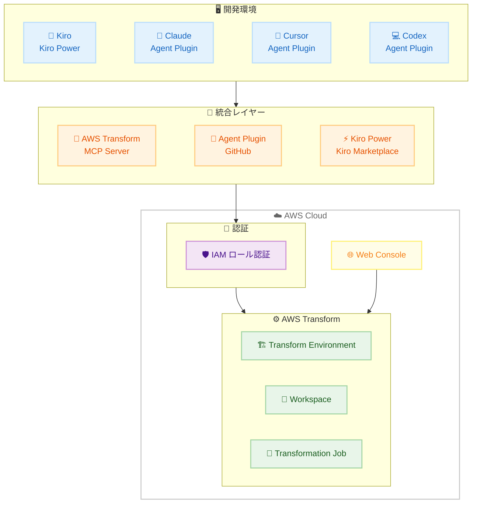

# AWS Transform - 開発者ツール統合 (Kiro, Claude, Cursor, Codex 対応)

**リリース日**: 2026年5月14日
**サービス**: AWS Transform
**機能**: エージェントプラグイン、MCP サーバー、Kiro Power による開発環境統合

📊 [このアップデートのインフォグラフィックを見る](https://takech9203.github.io/aws-news-summary/20260514-aws-transform-developer-tools.html)

## 概要

AWS Transform のエージェント機能が、Kiro、Claude、Cursor、Codex といった主要な AI 開発環境から直接利用可能になりました。AWS Transform は、数十年にわたる AWS のマイグレーションおよびモダナイゼーション経験に基づいて構築されたエージェント AI サービスで、Windows、VMware、メインフレームなどのレガシーシステムのモダナイゼーションを支援します。

今回のアップデートにより、開発者は Kiro Power、エージェントプラグイン、AWS Transform MCP サーバーの 3 つのインターフェースを通じて、好みの開発環境から AWS Transform の全機能にアクセスできるようになりました。IDE でのインタラクティブ操作、Web コンソールでのジョブ管理、MCP 経由のプログラマティックな統合のいずれにも対応しており、同一のジョブに対して一貫した状態を保ちながら複数のサーフェスを横断して作業できます。

**アップデート前の課題**

- AWS Transform の操作は Web コンソールに限定されており、開発者の日常的なワークフローとの統合が困難だった
- IDE で作業中にモダナイゼーションジョブを開始・監視するには、コンテキストの切り替えが必要だった
- プログラマティックなアクセス手段がなく、CI/CD パイプラインや自動化ワークフローとの統合が制限されていた
- 認証方式が限られており、既存の AWS クレデンシャルをそのまま活用する手段がなかった

**アップデート後の改善**

- Kiro、Claude、Cursor、Codex から直接 AWS Transform のエージェント機能を利用できるようになった
- MCP サーバーを通じたプログラマティックな統合が可能になり、自動化ワークフローとの連携が容易になった
- IAM ロール認証がサポートされ、既存の AWS クレデンシャルでそのまま Transform 環境を作成・利用できるようになった
- IDE でジョブを開始し、Web コンソールで進捗を監視し、結果を IDE で確認するといったシームレスなワークフローが実現した

## アーキテクチャ図



開発者は任意の IDE からエージェントプラグインまたは MCP サーバーを経由して AWS Transform にアクセスし、同一のジョブを IDE と Web コンソールの両方から管理できます。IAM ロール認証により、既存の AWS クレデンシャルをシームレスに利用できます。

## サービスアップデートの詳細

### 主要機能

1. **マルチサーフェス対応**
   - Kiro Power: Kiro マーケットプレイスから直接インストール可能
   - エージェントプラグイン: Claude、Cursor、Codex に対応
   - MCP サーバー: プログラマティックな統合用インターフェース
   - Web コンソール: ジョブ管理・進捗監視用

2. **一貫した状態管理**
   - IDE で開始したジョブを Web コンソールで監視可能
   - Web コンソールでの操作結果を IDE で即座に確認可能
   - 同一の Transformation Job に対して複数サーフェスからアクセスしても状態が一貫

3. **IAM ロール認証サポート**
   - 既存の AWS クレデンシャルを使用して Transform 環境を作成可能
   - IAM ロールによるきめ細かいアクセス制御
   - IDE と Web アプリの両方で同一の認証方式を利用可能

4. **対応する変換タイプ**
   - Windows アプリケーションのモダナイゼーション
   - VMware ワークロードの移行
   - メインフレームのモダナイゼーション
   - 言語バージョンアップグレード、API マイグレーション、フレームワーク更新

## 技術仕様

### アクセス方式の比較

| 方式 | 提供形態 | 主なユースケース | 入手先 |
|------|----------|------------------|--------|
| Kiro Power | Kiro IDE 拡張 | Kiro ユーザーのインタラクティブ操作 | Kiro マーケットプレイス |
| Agent Plugin | IDE プラグイン | Claude, Cursor, Codex からの利用 | GitHub |
| MCP Server | MCP プロトコル | プログラマティック統合、自動化 | GitHub |
| Web Console | ブラウザ UI | ジョブ管理、進捗監視、コラボレーション | AWS マネジメントコンソール |

### ワークフロー例

| ステップ | サーフェス | 操作 |
|----------|-----------|------|
| 1 | IDE | Transform 環境・ワークスペースの作成 |
| 2 | IDE | Transformation Job の開始 |
| 3 | Web Console | 進捗の監視・チームとのコラボレーション |
| 4 | IDE | 変換結果の確認・適用 |

## 設定方法

### 前提条件

1. AWS アカウントと適切な IAM ロール / クレデンシャル
2. 対応する IDE (Kiro、Claude、Cursor、Codex のいずれか)
3. GitHub からのエージェントプラグインまたは MCP サーバーのインストール (Kiro の場合はマーケットプレイスから)

### 手順

#### ステップ 1: エージェントプラグインのインストール

```bash
# GitHub からエージェントプラグインをクローン
git clone https://github.com/aws/aws-transform-agent-plugin
```

GitHub リポジトリからエージェントプラグインを取得し、使用する IDE に応じたインストール手順に従います。Kiro の場合は Kiro マーケットプレイスから Kiro Power として直接インストールできます。

#### ステップ 2: IAM ロール認証の設定

```json
{
  "credentials": {
    "source": "iam-role",
    "roleArn": "arn:aws:iam::123456789012:role/TransformDeveloperRole"
  }
}
```

既存の AWS クレデンシャルを使用して認証を構成します。IAM ロール認証により、IDE から Transform 環境、ワークスペース、Transformation Job を直接作成・管理できます。

#### ステップ 3: Transform 環境の作成とジョブ開始

IDE 内のエージェントプラグインまたは MCP サーバーを通じて、Transform 環境とワークスペースを作成し、変換ジョブを開始します。進捗は IDE 内または Web コンソールからリアルタイムで監視できます。

## メリット

### ビジネス面

- **開発者生産性の向上**: コンテキストの切り替えを最小限に抑え、IDE から直接モダナイゼーションを実行可能
- **チームコラボレーションの促進**: Web コンソールでの共同作業と IDE での個別作業をシームレスに統合
- **モダナイゼーションの加速**: エージェント AI と開発者の日常ワークフローの統合により、変換プロジェクトのスピードが向上

### 技術面

- **マルチ IDE 対応**: 特定のツールに依存せず、チームメンバーが好みの開発環境を利用可能
- **一貫した状態管理**: サーフェス間でのジョブ状態の同期により、信頼性の高いワークフローを実現
- **IAM 統合**: 既存の AWS セキュリティモデルとの整合性を維持しつつ、きめ細かいアクセス制御を実現
- **MCP プロトコル対応**: 標準的なプロトコルにより、カスタムツールや自動化パイプラインとの統合が容易

## デメリット・制約事項

### 制限事項

- エージェントプラグインと MCP サーバーは GitHub 経由での配布のため、バージョン管理は手動で行う必要がある
- 対応 IDE は現時点で Kiro、Claude、Cursor、Codex に限定されている
- Web コンソールと IDE 間の状態同期にはネットワーク接続が必要

### 考慮すべき点

- チームで複数の IDE を使用する場合、各環境でのプラグイン設定が必要
- IAM ロール認証のポリシー設計は、最小権限の原則に基づいて適切に構成する必要がある

## ユースケース

### ユースケース 1: IDE 内でのレガシー .NET アプリケーションモダナイゼーション

**シナリオ**: .NET Framework アプリケーションを .NET 8 にアップグレードする必要があるチームが、Kiro を使用して日常の開発作業の中でモダナイゼーションを実行

**実装例**:
```
# Kiro Power を使用してプロジェクトの変換を開始
@transform upgrade --source ./legacy-app --target dotnet8
```

**効果**: 開発者は IDE から離れることなく、変換の開始・監視・結果の適用を完結でき、プロジェクト全体のモダナイゼーション期間を短縮

### ユースケース 2: CI/CD パイプラインからの MCP 統合

**シナリオ**: 大規模なマイクロサービス群のフレームワークバージョンを一括で更新するため、MCP サーバーを CI/CD パイプラインに組み込む

**実装例**:
```json
{
  "mcpServers": {
    "aws-transform": {
      "command": "aws-transform-mcp-server",
      "args": ["--region", "us-east-1"],
      "env": {
        "AWS_ROLE_ARN": "arn:aws:iam::123456789012:role/TransformCIRole"
      }
    }
  }
}
```

**効果**: 数百のリポジトリに対する一括変換を自動化し、手動作業を大幅に削減

### ユースケース 3: チーム横断でのメインフレームモダナイゼーション

**シナリオ**: 開発チームは Cursor で作業し、プロジェクトマネージャーは Web コンソールで進捗を監視、アーキテクトは Claude で技術的な判断を行う

**実装例**:
```bash
# 各メンバーが同一の Transform Job にアクセス
# 開発者: Cursor Agent Plugin で変換実行
# PM: Web Console で進捗監視
# アーキテクト: Claude で変換方針の確認
```

**効果**: チームの役割に応じた最適なインターフェースを使用しながら、同一のジョブ状態を共有してコラボレーションが可能

## 料金

AWS Transform の料金は、変換ジョブの種類と処理量に基づきます。エージェントプラグイン、MCP サーバー、Kiro Power の利用自体には追加料金は発生しません。詳細な料金体系については AWS Transform の料金ページを参照してください。

## 利用可能リージョン

AWS Transform は以下のリージョンで利用可能です。

- 米国東部 (バージニア北部)
- ヨーロッパ (フランクフルト)

エージェントプラグインおよび MCP サーバーは GitHub で公開されており、上記リージョンの AWS Transform バックエンドに接続して使用します。

## 関連サービス・機能

- **Kiro**: AWS が提供する AI 搭載 IDE。Kiro Power として Transform エージェントを直接統合
- **AWS Transform custom**: 言語アップグレード、API マイグレーション、フレームワーク更新などの反復的な変換タスクを自動化
- **AWS Application Migration Service (MGN)**: リホストによるリフト＆シフト移行に対応
- **AWS Mainframe Modernization**: メインフレームワークロードのモダナイゼーション基盤

## 参考リンク

- 📊 [インフォグラフィック](https://takech9203.github.io/aws-news-summary/20260514-aws-transform-developer-tools.html)
- [公式発表 (What's New)](https://aws.amazon.com/about-aws/whats-new/2026/04/aws-transform-developer-tools/)
- [AWS Transform サービスページ](https://aws.amazon.com/transform/)
- [エージェントプラグイン / MCP サーバー (GitHub)](https://github.com/aws/aws-transform-agent-plugin)

## まとめ

AWS Transform のエージェント機能がマルチサーフェス対応となったことで、開発者は好みの IDE から直接レガシーシステムのモダナイゼーションを実行できるようになりました。IAM ロール認証のサポートと MCP プロトコルによるプログラマティックなアクセスにより、既存のセキュリティモデルや自動化ワークフローとの統合が容易です。大規模なモダナイゼーションプロジェクトを推進する組織にとって、開発者の生産性向上とコラボレーション強化を実現する重要なアップデートといえます。
