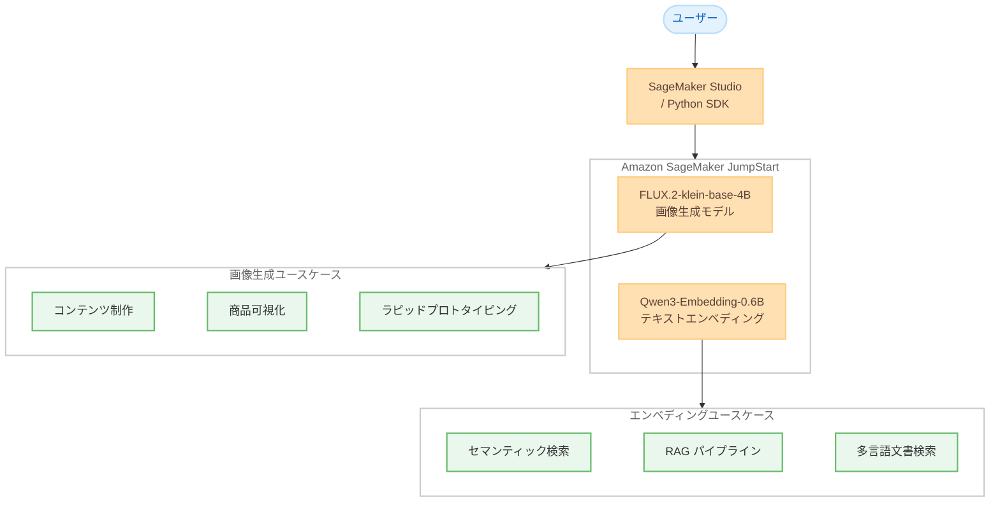

# Amazon SageMaker JumpStart - 画像生成およびテキストエンベディングモデルの追加

**リリース日**: 2026 年 5 月 14 日
**サービス**: Amazon SageMaker JumpStart
**機能**: FLUX.2-klein-base-4B および Qwen3-Embedding-0.6B モデルの提供開始

[このアップデートのインフォグラフィックを見る](https://takech9203.github.io/aws-news-summary/20260514-image-embeddings-models-on-sagemaker-jumpstart.html)

## 概要

AWS は Amazon SageMaker JumpStart において、画像生成モデル FLUX.2-klein-base-4B とテキストエンベディングモデル Qwen3-Embedding-0.6B の提供を開始した。これにより、SageMaker JumpStart で利用可能な基盤モデルのポートフォリオがさらに拡充される。

FLUX.2-klein-base-4B は Black Forest Labs が開発したコンパクトな画像生成モデルで、リアルタイムの画像生成とマルチリファレンス編集に優れている。Qwen3-Embedding-0.6B は Qwen チームが開発した多言語テキストエンベディングモデルで、100 以上の言語に対応し、検索、分類、クラスタリングなど幅広い用途に活用できる。

**アップデート前の課題**

- SageMaker JumpStart で利用可能な画像生成モデルの選択肢が限られており、軽量かつ高品質なモデルが不足していた
- 多言語対応のテキストエンベディングモデルで、コンパクトかつ高性能なものが選択肢として少なかった
- 画像生成にはハイスペックな GPU インスタンスが必要となり、コスト面で導入障壁があった

**アップデート後の改善**

- わずか 13GB の VRAM で動作する軽量な画像生成モデルが利用可能になった
- 100 以上の言語をサポートする柔軟なエンベディングモデルをワンクリックでデプロイ可能になった
- SageMaker Studio またはSageMaker Python SDK から数クリックでモデルをデプロイし、すぐに利用開始できる

## アーキテクチャ図



SageMaker JumpStart を通じて 2 つのモデルをデプロイし、それぞれのユースケースに活用する構成を示している。

## サービスアップデートの詳細

### 主要機能

1. **FLUX.2-klein-base-4B - 画像生成モデル**
   - Black Forest Labs が開発した 4B パラメータのコンパクトな画像生成モデル
   - リアルタイムでの高品質な画像生成が可能
   - マルチリファレンス編集に対応し、複数の参照画像を基にした画像編集ができる
   - わずか 13GB の VRAM で動作し、コンシューマー向けハードウェアでも実行可能
   - クリエイティブコンテンツパイプライン、商品可視化、ラピッドプロトタイピングに最適

2. **Qwen3-Embedding-0.6B - テキストエンベディングモデル**
   - Qwen チームが開発した 0.6B パラメータの軽量エンベディングモデル
   - 100 以上の言語に対応した多言語テキストエンベディング
   - 検索、分類、クラスタリング、バイテキストマイニングをサポート
   - 柔軟な出力次元 (Flexible Output Dimensions) に対応
   - インストラクション対応エンベディング (Instruction-aware Embeddings) をサポート

3. **SageMaker JumpStart による簡単デプロイ**
   - SageMaker Studio の Models セクションからワンクリックでデプロイ可能
   - SageMaker Python SDK を使用したプログラマティックなデプロイにも対応
   - AWS インフラストラクチャ上でセキュアに運用可能

## 技術仕様

### モデル比較

| 項目 | FLUX.2-klein-base-4B | Qwen3-Embedding-0.6B |
|------|---------------------|----------------------|
| 開発元 | Black Forest Labs | Qwen |
| パラメータ数 | 4B | 0.6B |
| タスク | 画像生成、マルチリファレンス編集 | テキストエンベディング |
| 最小 VRAM | 13GB | - |
| 対応言語 | - | 100 以上 |
| 出力 | 画像 | ベクトル表現 |
| 出力次元 | - | 柔軟 (可変) |

### API 変更履歴

| 日付 | サービス | 変更内容 |
|------|----------|----------|
| 2026/05/13 | [Amazon SageMaker Service](https://awsapichanges.com/archive/changes/74501c-api.sagemaker.html) | 27 updated api methods - 実行ロールセッション名モード、Flexible Training Plans、制限付きモデルパッケージの追加など |

## 設定方法

### 前提条件

1. AWS アカウントと SageMaker へのアクセス権限
2. SageMaker Studio ドメインのセットアップ済み環境
3. モデルデプロイ用の適切な IAM ロール

### 手順

#### ステップ 1: SageMaker Studio からのデプロイ

SageMaker Studio にアクセスし、左メニューの Models セクションに移動する。検索バーで「FLUX.2-klein-base-4B」または「Qwen3-Embedding-0.6B」を検索し、デプロイボタンをクリックする。

#### ステップ 2: SageMaker Python SDK を使用したデプロイ

```python
from sagemaker.jumpstart.model import JumpStartModel

# FLUX.2-klein-base-4B のデプロイ
image_model = JumpStartModel(model_id="flux-2-klein-base-4b")
image_predictor = image_model.deploy()

# Qwen3-Embedding-0.6B のデプロイ
embedding_model = JumpStartModel(model_id="qwen3-embedding-0-6b")
embedding_predictor = embedding_model.deploy()
```

SageMaker Python SDK を使用して、プログラマティックにモデルをデプロイする。model_id を指定するだけで、適切なインスタンスタイプやコンテナイメージが自動的に選択される。

#### ステップ 3: モデルの推論実行

```python
# 画像生成の例
response = image_predictor.predict({
    "prompt": "A serene landscape with mountains and a lake at sunset"
})

# テキストエンベディングの例
response = embedding_predictor.predict({
    "inputs": "This is a sample text for embedding",
    "instruction": "Retrieve relevant documents"
})
```

デプロイ完了後、predict メソッドを使用して推論を実行する。FLUX.2 にはプロンプトを、Qwen3-Embedding にはテキストとインストラクションを渡す。

## メリット

### ビジネス面

- **コスト効率の向上**: 13GB VRAM で動作する FLUX.2-klein-base-4B により、高価な GPU インスタンスが不要になり、画像生成のコストを大幅に削減できる
- **多言語対応の強化**: Qwen3-Embedding-0.6B の 100 以上の言語サポートにより、グローバル展開するアプリケーションの検索品質を向上できる
- **迅速な導入**: SageMaker JumpStart のワンクリックデプロイにより、モデルのセットアップや環境構築に費やす時間を大幅に短縮できる

### 技術面

- **軽量アーキテクチャ**: 両モデルともコンパクトなパラメータサイズで高品質な出力を実現しており、推論レイテンシーが低い
- **柔軟な出力次元**: Qwen3-Embedding-0.6B の可変出力次元により、ストレージコストと検索精度のトレードオフを調整可能
- **インストラクション対応**: Qwen3-Embedding-0.6B はタスクに応じたインストラクションを指定でき、用途に最適化されたエンベディングを生成できる

## デメリット・制約事項

### 制限事項

- FLUX.2-klein-base-4B は 4B パラメータモデルであり、より大きなモデルと比較して複雑なシーンの生成精度に限界がある可能性がある
- Qwen3-Embedding-0.6B は 0.6B パラメータであり、大規模モデルと比較して一部のタスクで精度が劣る場合がある
- SageMaker JumpStart のモデルデプロイにはリアルタイムエンドポイントの料金が発生する

### 考慮すべき点

- モデルのライセンス条件を確認し、商用利用が許可されているか事前に検証する必要がある
- 本番環境での利用前に、自社のデータセットで品質評価を実施することを推奨する

## ユースケース

### ユースケース 1: E コマース商品画像の自動生成

**シナリオ**: E コマースサイトで商品写真のバリエーションを自動生成し、カタログ制作の効率化を図る。

**実装例**:
```python
# 商品画像のバリエーション生成
response = image_predictor.predict({
    "prompt": "Product photo of a white sneaker on a minimalist background, studio lighting",
    "num_images": 4
})
```

**効果**: 商品撮影のコストと時間を削減し、多様な背景やアングルでの商品画像を迅速に生成できる。

### ユースケース 2: 多言語 RAG システムの構築

**シナリオ**: グローバル企業の社内ナレッジベースで、多言語の文書を横断的に検索可能な RAG パイプラインを構築する。

**実装例**:
```python
# 多言語文書のエンベディング生成
documents = [
    "This is an English document about cloud architecture.",
    "これはクラウドアーキテクチャに関する日本語ドキュメントです。",
    "Este es un documento en espanol sobre arquitectura en la nube."
]

embeddings = embedding_predictor.predict({
    "inputs": documents,
    "instruction": "Retrieve relevant technical documents"
})
```

**効果**: 言語の壁を超えた統合的なドキュメント検索が可能になり、グローバルチームの生産性が向上する。

### ユースケース 3: クリエイティブコンテンツパイプラインの自動化

**シナリオ**: マーケティングチームが広告バナーやソーシャルメディア投稿用の画像を大量に生成する必要がある場合に、FLUX.2 を活用してコンテンツ制作を自動化する。

**実装例**:
```python
import boto3

# バッチ処理で複数のプロンプトから画像を生成
prompts = [
    "Summer sale banner with tropical theme, vibrant colors",
    "Professional business meeting scene, modern office",
    "Tech product launch announcement, futuristic design"
]

for prompt in prompts:
    response = image_predictor.predict({"prompt": prompt})
    # S3 に保存して後続のワークフローで利用
```

**効果**: クリエイティブ制作のリードタイムを大幅に短縮し、A/B テスト用の複数バリエーションを迅速に用意できる。

## 料金

SageMaker JumpStart のモデル利用料金は、デプロイ先のインスタンスタイプと稼働時間に基づく。モデル自体の追加ライセンス料金は発生しない。

### 料金例

| インスタンスタイプ | 用途 | 時間単価 (概算、us-east-1) |
|-------------------|------|---------------------------|
| ml.g5.xlarge | FLUX.2 推論 (24GB VRAM) | $1.408/時間 |
| ml.g5.2xlarge | FLUX.2 推論 (高スループット) | $1.515/時間 |
| ml.c5.xlarge | Qwen3-Embedding 推論 | $0.238/時間 |

※ 料金は変動する可能性があるため、最新の料金は AWS 公式料金ページで確認すること。

## 利用可能リージョン

SageMaker JumpStart が利用可能なすべてのリージョンで提供される。主要なリージョンには以下が含まれる。

- 米国東部 (バージニア北部): us-east-1
- 米国東部 (オハイオ): us-east-2
- 米国西部 (オレゴン): us-west-2
- 欧州 (アイルランド): eu-west-1
- アジアパシフィック (東京): ap-northeast-1
- アジアパシフィック (シンガポール): ap-southeast-1

## 関連サービス・機能

- **Amazon SageMaker Studio**: モデルの検索、デプロイ、管理を行う統合開発環境
- **Amazon Bedrock**: マネージド型の基盤モデルサービスで、API 経由で各種モデルを利用可能
- **Amazon OpenSearch Service**: Qwen3-Embedding で生成したベクトルを格納し、ベクトル検索を実行する際に活用
- **Amazon S3**: 生成画像の保存やエンベディングデータのバッチ処理結果の格納先として利用

## 参考リンク

- [インフォグラフィック](https://takech9203.github.io/aws-news-summary/20260514-image-embeddings-models-on-sagemaker-jumpstart.html)
- [公式発表 (What's New)](https://aws.amazon.com/about-aws/whats-new/2026/05/image-embeddings-models-on-sagemaker-jumpstart/)
- [Amazon SageMaker JumpStart ドキュメント](https://docs.aws.amazon.com/sagemaker/latest/dg/studio-jumpstart.html)
- [SageMaker 料金ページ](https://aws.amazon.com/sagemaker/pricing/)

## まとめ

今回のアップデートにより、SageMaker JumpStart で軽量かつ高性能な画像生成モデルと多言語テキストエンベディングモデルが利用可能になった。特に FLUX.2-klein-base-4B は 13GB VRAM で動作する点、Qwen3-Embedding-0.6B は 100 以上の言語に対応する点が大きな差別化要因である。クリエイティブ AI アプリケーションや多言語検索システムの構築を検討している場合は、SageMaker Studio から早速試用することを推奨する。
