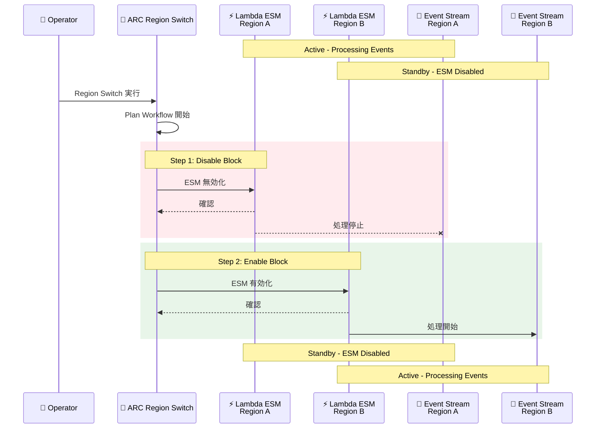

# Amazon Application Recovery Controller (ARC) - Lambda イベントソースマッピング実行ブロック

**リリース日**: 2026 年 5 月 14 日
**サービス**: Amazon Application Recovery Controller (ARC)
**機能**: Region Switch Lambda Event Source Mapping Execution Block

[このアップデートのインフォグラフィックを見る](https://takech9203.github.io/aws-news-summary/20260514-region-switch-lambda-esm-execution-block.html)

## 概要

Amazon Application Recovery Controller (ARC) の Region Switch に、Lambda イベントソースマッピング (ESM) 実行ブロックが追加された。この機能により、マルチリージョンワークロードにおけるイベントストリームの協調フェイルオーバーを自動化できるようになる。

イベント駆動アーキテクチャでは、Lambda 関数がイベントソースマッピングを使用して Kinesis、DynamoDB Streams、Amazon MSK、SQS などのイベントストリームを処理している。従来、リージョンフェイルオーバー時にこれらのイベントソースマッピングの有効化・無効化を手動で実行する必要があったが、Lambda ESM 実行ブロックによりこのプロセスが自動化される。

**アップデート前の課題**

- マルチリージョン構成でフェイルオーバーする際、各リージョンの Lambda イベントソースマッピングを手動で有効化・無効化する必要があった
- イベントストリームの切り替え忘れにより、重複処理やイベントロストが発生するリスクがあった
- クロスアカウント構成では、複数アカウントにまたがるイベントソースマッピングの管理が煩雑だった

**アップデート後の改善**

- ARC Region Switch プランにイベントソースマッピングの有効化・無効化ステップを組み込み、フェイルオーバーを自動化できるようになった
- 2 つのブロックを順序立てて構成可能: 非アクティブ化リージョンでの disable ブロックと、アクティブ化リージョンでの enable ブロック
- "ungraceful" モードでの disable ブロックのオーバーライドに対応し、緊急時の迅速なフェイルオーバーが可能になった
- ネイティブなクロスアカウントサポートにより、マルチアカウント環境での運用が簡素化された

## アーキテクチャ図



ARC Region Switch が Lambda ESM 実行ブロックを使用してフェイルオーバーを実行する際のシーケンスを示す。Disable ブロックで旧リージョンのイベント処理を停止し、Enable ブロックで新リージョンのイベント処理を開始する。

## サービスアップデートの詳細

### 主要機能

1. **Lambda ESM 実行ブロック**
   - Region Switch プランのワークフローステップとして Lambda イベントソースマッピングの有効化・無効化を定義
   - `action` パラメータで `enable` または `disable` を指定
   - リージョンごとにイベントソースマッピングの ARN を指定して制御対象を定義

2. **順序付きブロック構成**
   - 2 つのブロックを順序立てて構成可能
   - 最初に非アクティブ化リージョンの disable ブロックを実行し、次にアクティブ化リージョンの enable ブロックを実行
   - これによりイベントの重複処理を防止

3. **Ungraceful モード**
   - 緊急時には disable ブロックをスキップして直接 enable ブロックを実行可能
   - `ungraceful.behavior` を `skip` に設定することで、非アクティブ化リージョンが応答しない場合でもフェイルオーバーを継続

4. **ネイティブクロスアカウントサポート**
   - `crossAccountRole` と `externalId` を指定することで、別アカウントの Lambda イベントソースマッピングを制御可能
   - マルチアカウント戦略を採用する組織でのフェイルオーバー自動化をサポート

## 技術仕様

### 対応イベントソース

| イベントソース | 説明 |
|------|------|
| Amazon Kinesis Data Streams | リアルタイムストリーミングデータの処理 |
| Amazon DynamoDB Streams | テーブル変更イベントの処理 |
| Amazon MSK | マネージド Kafka トピックの処理 |
| Amazon SQS | キューメッセージの処理 |

### API 変更履歴

| 日付 | サービス | 変更内容 |
|------|----------|----------|
| 2026/05/13 | [ARC - Region switch](https://awsapichanges.com/archive/changes/74501c-arc-region-switch.html) | 6 updated api methods - Lambda イベントソースマッピングの有効化・無効化サポートを追加 |

### 実行ブロック設定構造

```json
{
  "executionBlockType": "LambdaEventSourceMapping",
  "executionBlockConfiguration": {
    "lambdaEventSourceMappingConfig": {
      "action": "enable | disable",
      "timeoutMinutes": 10,
      "regionEventSourceMappings": {
        "us-east-1": {
          "arn": "arn:aws:lambda:us-east-1:123456789012:event-source-mapping/uuid",
          "crossAccountRole": "arn:aws:iam::987654321098:role/ARC-CrossAccount",
          "externalId": "unique-external-id"
        }
      },
      "ungraceful": {
        "behavior": "skip"
      }
    }
  }
}
```

## 設定方法

### 前提条件

1. ARC Region Switch プランが作成済みであること
2. 対象の Lambda イベントソースマッピングが両リージョンに存在すること
3. クロスアカウントの場合、適切な IAM ロールが設定されていること
4. ARC の実行ロールに Lambda イベントソースマッピングの操作権限が付与されていること

### 手順

#### ステップ 1: Region Switch プランの作成または更新

```bash
aws arc-region-switch create-plan \
  --name "my-event-driven-failover-plan" \
  --regions '["us-east-1", "us-west-2"]' \
  --primary-region "us-east-1" \
  --recovery-approach "activePassive" \
  --workflows '[
    {
      "workflowTargetAction": "deactivate",
      "workflowTargetRegion": "us-east-1",
      "steps": [
        {
          "executionBlockType": "LambdaEventSourceMapping",
          "executionBlockConfiguration": {
            "lambdaEventSourceMappingConfig": {
              "action": "disable",
              "timeoutMinutes": 5,
              "regionEventSourceMappings": {
                "us-east-1": {
                  "arn": "arn:aws:lambda:us-east-1:123456789012:event-source-mapping/esm-uuid"
                }
              },
              "ungraceful": {
                "behavior": "skip"
              }
            }
          }
        }
      ]
    },
    {
      "workflowTargetAction": "activate",
      "workflowTargetRegion": "us-west-2",
      "steps": [
        {
          "executionBlockType": "LambdaEventSourceMapping",
          "executionBlockConfiguration": {
            "lambdaEventSourceMappingConfig": {
              "action": "enable",
              "timeoutMinutes": 5,
              "regionEventSourceMappings": {
                "us-west-2": {
                  "arn": "arn:aws:lambda:us-west-2:123456789012:event-source-mapping/esm-uuid"
                }
              }
            }
          }
        }
      ]
    }
  ]'
```

Region Switch プランを作成し、非アクティブ化ワークフローに disable ブロック、アクティブ化ワークフローに enable ブロックを設定する。

#### ステップ 2: クロスアカウント設定 (必要な場合)

```json
{
  "regionEventSourceMappings": {
    "us-east-1": {
      "arn": "arn:aws:lambda:us-east-1:987654321098:event-source-mapping/esm-uuid",
      "crossAccountRole": "arn:aws:iam::987654321098:role/ARC-ESM-CrossAccount",
      "externalId": "my-unique-external-id"
    }
  }
}
```

別のアカウントにあるイベントソースマッピングを制御する場合、crossAccountRole と externalId を指定する。対象アカウントの IAM ロールには Lambda の `UpdateEventSourceMapping` 権限が必要。

#### ステップ 3: プランの検証

```bash
aws arc-region-switch get-plan \
  --plan-id "plan-12345" \
  --query "plan.workflows"
```

作成したプランのワークフロー設定を確認し、disable ブロックと enable ブロックが正しく構成されていることを検証する。

## メリット

### ビジネス面

- **RTO の短縮**: イベントストリームの切り替えが自動化され、フェイルオーバー時間が短縮される
- **運用負荷の軽減**: 手動でのイベントソースマッピング操作が不要になり、オペレーターの負担が減少する
- **信頼性の向上**: 人為的な操作ミスによるイベントロストや重複処理のリスクが低減される

### 技術面

- **協調フェイルオーバー**: データベース、Route 53、Lambda ESM を含む包括的なフェイルオーバープランの構築が可能
- **イベント整合性の確保**: 順序付きブロックにより、古いリージョンの処理停止後に新リージョンの処理を開始することでイベントの重複を防止
- **柔軟な障害対応**: ungraceful モードにより、旧リージョンが応答不能な場合でもフェイルオーバーを実行可能

## デメリット・制約事項

### 制限事項

- タイムアウト値 (`timeoutMinutes`) の設定が必要であり、適切な値の見積もりが求められる
- ungraceful モードで disable ブロックをスキップした場合、一時的にイベントの重複処理が発生する可能性がある
- イベントソースマッピングの ARN を事前に把握し、プランに設定する必要がある

### 考慮すべき点

- フェイルオーバー後のイベント再処理やオフセット管理は、アプリケーション側で冪等性を確保する設計が必要
- クロスアカウント設定では IAM ロールの信頼関係を適切に管理する必要がある
- 既存の ARC Region Switch プランを使用している場合、Lambda ESM ブロックの追加はプランの更新として実施する

## ユースケース

### ユースケース 1: Kinesis ベースのリアルタイムデータパイプライン

**シナリオ**: 複数リージョンに展開された Kinesis Data Streams から Lambda 関数でデータを処理し、リアルタイム分析を行うシステム。プライマリリージョンの障害時にセカンダリリージョンへフェイルオーバーする必要がある。

**実装例**:
```json
{
  "steps": [
    {
      "executionBlockType": "LambdaEventSourceMapping",
      "executionBlockConfiguration": {
        "lambdaEventSourceMappingConfig": {
          "action": "disable",
          "timeoutMinutes": 5,
          "regionEventSourceMappings": {
            "us-east-1": {
              "arn": "arn:aws:lambda:us-east-1:123456789012:event-source-mapping/kinesis-processor-esm"
            }
          },
          "ungraceful": { "behavior": "skip" }
        }
      }
    }
  ]
}
```

**効果**: Kinesis からのイベント処理がリージョン間で自動的に切り替わり、データパイプラインのダウンタイムを最小化できる。

### ユースケース 2: DynamoDB Streams による CDC パイプライン

**シナリオ**: DynamoDB グローバルテーブルの変更データキャプチャ (CDC) を Lambda で処理するシステム。リージョンフェイルオーバー時に、変更イベントの処理元リージョンを切り替える必要がある。

**実装例**:
```json
{
  "workflows": [
    {
      "workflowTargetAction": "deactivate",
      "workflowTargetRegion": "us-east-1",
      "steps": [
        {
          "executionBlockType": "LambdaEventSourceMapping",
          "executionBlockConfiguration": {
            "lambdaEventSourceMappingConfig": {
              "action": "disable",
              "timeoutMinutes": 3,
              "regionEventSourceMappings": {
                "us-east-1": {
                  "arn": "arn:aws:lambda:us-east-1:123456789012:event-source-mapping/ddb-cdc-esm"
                }
              }
            }
          }
        }
      ]
    },
    {
      "workflowTargetAction": "activate",
      "workflowTargetRegion": "eu-west-1",
      "steps": [
        {
          "executionBlockType": "LambdaEventSourceMapping",
          "executionBlockConfiguration": {
            "lambdaEventSourceMappingConfig": {
              "action": "enable",
              "timeoutMinutes": 3,
              "regionEventSourceMappings": {
                "eu-west-1": {
                  "arn": "arn:aws:lambda:eu-west-1:123456789012:event-source-mapping/ddb-cdc-esm"
                }
              }
            }
          }
        }
      ]
    }
  ]
}
```

**効果**: DynamoDB グローバルテーブルのフェイルオーバーと連動して CDC 処理の切り替えが自動化される。

### ユースケース 3: マルチアカウント MSK イベント処理

**シナリオ**: 共有サービスアカウントの Amazon MSK クラスターからイベントを処理する Lambda 関数が、ワークロードアカウントに存在するマルチアカウント構成。フェイルオーバー時に両アカウントのリソースを協調して切り替える必要がある。

**実装例**:
```json
{
  "regionEventSourceMappings": {
    "us-east-1": {
      "arn": "arn:aws:lambda:us-east-1:111111111111:event-source-mapping/msk-consumer-esm",
      "crossAccountRole": "arn:aws:iam::111111111111:role/ARC-ESM-Control",
      "externalId": "arc-failover-ext-id"
    }
  }
}
```

**効果**: マルチアカウント環境でも単一の ARC プランでイベントソースマッピングの切り替えを一元管理できる。

## 料金

ARC Region Switch の利用料金に含まれる。Lambda ESM 実行ブロックの追加による追加料金は発生しない。

### 料金例

| 項目 | 料金 |
|------|------|
| Region Switch プラン | ARC Region Switch の標準料金に準拠 |
| Lambda ESM 実行ブロック | 追加料金なし |
| Lambda 関数の実行 | 標準の Lambda 料金が適用 |

## 利用可能リージョン

ARC Region Switch が利用可能な全商用リージョンで使用可能。

## 関連サービス・機能

- **Amazon Application Recovery Controller (ARC)**: マルチリージョンアプリケーションの復旧制御を提供するサービス
- **AWS Lambda イベントソースマッピング**: Kinesis、DynamoDB Streams、MSK、SQS などのイベントソースから Lambda 関数を自動起動する機能
- **ARC Region Switch**: リージョン間フェイルオーバーを自動化するプラン機能。Route 53、RDS、DocumentDB、EKS などの実行ブロックも提供
- **Amazon Kinesis Data Streams**: リアルタイムデータストリーミングサービス
- **Amazon DynamoDB Streams**: DynamoDB テーブルの変更データキャプチャ

## 参考リンク

- [インフォグラフィック](https://takech9203.github.io/aws-news-summary/20260514-region-switch-lambda-esm-execution-block.html)
- [公式発表 (What's New)](https://aws.amazon.com/about-aws/whats-new/2026/05/region-switch-lambda-esm-execution-block/)
- [ARC Region Switch ドキュメント](https://docs.aws.amazon.com/r53recovery/latest/dg/arc-region-switch.html)
- [Lambda イベントソースマッピング ドキュメント](https://docs.aws.amazon.com/lambda/latest/dg/invocation-eventsourcemapping.html)

## まとめ

ARC Region Switch への Lambda ESM 実行ブロックの追加は、イベント駆動アーキテクチャをマルチリージョンで運用するユーザーにとって重要なアップデートである。従来は手動で行っていたイベントソースマッピングの切り替えが自動化されることで、RTO の短縮と運用負荷の軽減が実現できる。マルチリージョンのイベント駆動ワークロードを運用している場合は、既存の ARC Region Switch プランに Lambda ESM 実行ブロックを追加することを推奨する。
