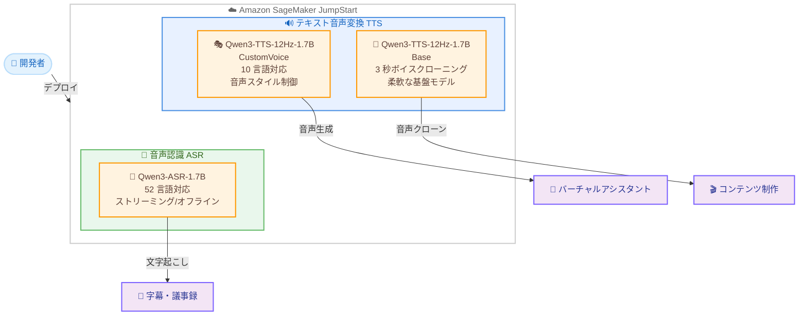

# Amazon SageMaker JumpStart - 音声認識・音声合成モデル 3 種追加

**リリース日**: 2026 年 5 月 14 日
**サービス**: Amazon SageMaker JumpStart
**機能**: Qwen3 音声モデル (TTS / ASR) の提供開始

[このアップデートのインフォグラフィックを見る](https://takech9203.github.io/aws-news-summary/20260514-speech-models-on-sagemaker-jumpstart.html)

## 概要

AWS は Amazon SageMaker JumpStart において、Qwen3 シリーズの音声モデル 3 種 (Qwen3-TTS-12Hz-1.7B-CustomVoice、Qwen3-TTS-12Hz-1.7B-Base、Qwen3-ASR-1.7B) の提供を開始した。これにより、テキストから音声への変換 (TTS) と音声からテキストへの変換 (ASR) の両方向で、多言語対応の高品質な音声 AI アプリケーションを AWS インフラストラクチャ上で構築できるようになった。

3 つのモデルはそれぞれ異なるユースケースに特化しており、カスタマイズ可能な音声スタイル制御、3 秒の音声サンプルからの高速ボイスクローニング、52 言語対応の音声認識という幅広い音声処理ニーズをカバーする。SageMaker JumpStart を通じて数クリックでデプロイが可能である。

**アップデート前の課題**

- SageMaker JumpStart で利用できる音声関連の基盤モデルの選択肢が限定的だった
- 多言語対応の TTS モデルを自前でデプロイ・管理するには、モデルの調達からインフラ構築まで大きな工数が必要だった
- 音声スタイルのカスタマイズやボイスクローニングを実現するには、専門的な ML エンジニアリングが必要だった

**アップデート後の改善**

- SageMaker JumpStart から 3 つの Qwen3 音声モデルを数クリックでデプロイ可能になった
- 10 言語以上に対応した高品質な TTS と、52 言語対応の ASR をマネージド環境で利用可能になった
- 指示ベースの音声スタイル制御や 3 秒音声からのボイスクローニングなど、高度な音声カスタマイズが容易になった

## アーキテクチャ図



3 つのモデルはそれぞれ異なる音声処理タスクに特化しており、SageMaker JumpStart を通じて統一的にデプロイ・管理できる。

## サービスアップデートの詳細

### 主要機能

1. **Qwen3-TTS-12Hz-1.7B-CustomVoice - カスタマイズ可能な多言語 TTS**
   - 10 言語に対応した多言語テキスト音声変換
   - 指示ベース (instruction-driven) で音質、感情、韻律を制御可能
   - リアルタイムインタラクティブ音声アプリケーションに最適
   - カスタマー向けバーチャルアシスタントやコンテンツ制作ワークフローに対応

2. **Qwen3-TTS-12Hz-1.7B-Base - 高速ボイスクローニング TTS**
   - 3 秒間の音声入力からの高速ボイスクローニング
   - 多言語テキスト音声変換の柔軟な基盤モデル
   - ドメイン固有の音声合成のファインチューニングに対応
   - カスタム音声アプリケーション構築の基盤として利用可能

3. **Qwen3-ASR-1.7B - 高精度自動音声認識**
   - 52 言語・方言に対応した自動音声認識
   - 複雑な音響環境でも高精度を実現
   - ストリーミングとオフラインの両モードに対応
   - 文字起こし、多言語カスタマーサポート、リアルタイム字幕に対応

## 技術仕様

### モデル比較

| 項目 | Qwen3-TTS-CustomVoice | Qwen3-TTS-Base | Qwen3-ASR |
|------|----------------------|----------------|-----------|
| モデルサイズ | 1.7B パラメータ | 1.7B パラメータ | 1.7B パラメータ |
| タスク | テキスト音声変換 | テキスト音声変換 | 音声認識 |
| 対応言語数 | 10 言語 | 多言語 | 52 言語・方言 |
| 特徴 | 音声スタイル制御 | 3 秒ボイスクローニング | ストリーミング/オフライン |
| サンプリングレート | 12Hz | 12Hz | - |
| 主要ユースケース | バーチャルアシスタント | カスタム音声生成 | 文字起こし・字幕 |

### API 変更履歴

| 日付 | サービス | 変更内容 |
|------|----------|----------|
| 2026/05/13 | [Amazon SageMaker Service](https://awsapichanges.com/archive/changes/74501c-api.sagemaker.html) | 27 updated api methods - 実行ロールセッション名モード、Flexible Training Plans、制限付きモデルパッケージの追加 |

### デプロイ方法

SageMaker JumpStart を通じた 2 つのデプロイ方法が利用可能。

**方法 1: SageMaker Studio コンソール**

SageMaker Studio の Models セクションからモデルを検索し、数クリックでデプロイする。

**方法 2: SageMaker Python SDK**

```python
from sagemaker.jumpstart.model import JumpStartModel

# CustomVoice TTS モデルのデプロイ
model = JumpStartModel(model_id="qwen3-tts-12hz-1-7b-customvoice")
predictor = model.deploy()

# 推論の実行
response = predictor.predict({
    "text": "Hello, this is a test of text-to-speech.",
    "language": "en"
})
```

## 設定方法

### 前提条件

1. AWS アカウントと SageMaker へのアクセス権限
2. SageMaker Studio ドメインのセットアップ済み環境
3. モデルデプロイ用のインスタンスクォータの確保 (GPU インスタンス推奨)

### 手順

#### ステップ 1: SageMaker Studio からモデルを検索

SageMaker Studio にアクセスし、左メニューから「Models」セクションを選択する。検索バーで「Qwen3-TTS」または「Qwen3-ASR」と入力してモデルを見つける。

#### ステップ 2: モデルのデプロイ

対象モデルを選択し、「Deploy」ボタンをクリックする。エンドポイント名、インスタンスタイプ、インスタンス数を設定してデプロイを実行する。

```python
from sagemaker.jumpstart.model import JumpStartModel

# ASR モデルのデプロイ例
model = JumpStartModel(model_id="qwen3-asr-1-7b")
predictor = model.deploy(
    instance_type="ml.g5.xlarge",
    initial_instance_count=1
)
```

エンドポイントのデプロイが完了すると、推論リクエストを送信できる状態になる。

#### ステップ 3: 推論の実行

```python
# TTS の例: テキストを音声に変換
tts_response = predictor.predict({
    "text": "本日はご来場いただき、ありがとうございます。",
    "language": "ja",
    "voice_style": "professional"
})

# ASR の例: 音声をテキストに変換
import base64
with open("audio.wav", "rb") as f:
    audio_data = base64.b64encode(f.read()).decode()

asr_response = predictor.predict({
    "audio": audio_data,
    "language": "ja"
})
```

## メリット

### ビジネス面

- **迅速な市場投入**: 数クリックでデプロイできるため、音声 AI アプリケーションの開発期間を大幅に短縮できる
- **多言語対応**: TTS で 10 言語、ASR で 52 言語に対応し、グローバル展開を容易にする
- **コスト効率**: 自前でモデルをトレーニング・ホスティングする場合と比較して、初期投資と運用コストを削減できる

### 技術面

- **統一されたデプロイ体験**: SageMaker JumpStart を通じて TTS と ASR の両方を同じワークフローで管理できる
- **カスタマイズ性**: CustomVoice モデルでは指示ベースで音声スタイルを制御でき、Base モデルではファインチューニングが可能
- **リアルタイム処理**: ASR モデルがストリーミングモードに対応しているため、リアルタイム音声アプリケーションを構築できる

## デメリット・制約事項

### 制限事項

- モデルサイズが 1.7B パラメータであるため、GPU インスタンスが必要でありランニングコストが発生する
- CustomVoice の対応言語は 10 言語に限定されており、すべての言語をカバーしているわけではない
- エンドポイントを常時稼働させる場合、アイドル時間中もコストが発生する

### 考慮すべき点

- 音声データの取り扱いにおけるプライバシーとコンプライアンス要件の確認が必要
- ボイスクローニング機能の利用においては、倫理的なガイドラインと利用規約への準拠が求められる
- 本番環境でのレイテンシ要件に応じたインスタンスタイプの選定が重要

## ユースケース

### ユースケース 1: 多言語カスタマーサポート

**シナリオ**: グローバル展開する EC サイトが、多言語対応の音声チャットボットを構築したい。

**実装例**:
```python
# CustomVoice モデルで自然な応答音声を生成
response = tts_predictor.predict({
    "text": "Thank you for your inquiry. Your order will arrive tomorrow.",
    "language": "en",
    "voice_style": "friendly, professional"
})
```

**効果**: 10 言語に対応した自然な音声応答により、顧客満足度の向上とサポートコストの削減を両立できる。

### ユースケース 2: コンテンツ制作の自動化

**シナリオ**: メディア企業が、記事コンテンツをポッドキャストや音声ニュースとして配信したい。

**実装例**:
```python
# Base モデルで特定のナレーターの声をクローン
clone_response = tts_predictor.predict({
    "text": article_text,
    "reference_audio": narrator_3sec_sample,
    "language": "ja"
})
```

**効果**: 3 秒の音声サンプルからブランド固有のナレーション音声を生成し、大量のコンテンツを効率的に音声化できる。

### ユースケース 3: リアルタイム会議文字起こし

**シナリオ**: リモートワーク環境で、多言語チームのオンライン会議をリアルタイムに文字起こし・翻訳したい。

**実装例**:
```python
# ASR モデルでストリーミング音声認識
asr_response = asr_predictor.predict({
    "audio": streaming_audio_chunk,
    "language": "auto",
    "mode": "streaming"
})
```

**効果**: 52 言語対応のリアルタイム音声認識により、多国籍チームのコミュニケーション障壁を低減し、議事録の自動生成を実現できる。

## 料金

SageMaker JumpStart でのモデル利用料金は、エンドポイントとして使用するインスタンスの稼働時間に基づく。モデル自体の追加ライセンス料は不要。

### 料金例

| インスタンスタイプ | 用途 | 時間料金 (概算、us-east-1) |
|-------------------|------|--------------------------|
| ml.g5.xlarge | 推論エンドポイント | $1.408/時間 |
| ml.g5.2xlarge | 高負荷推論 | $2.816/時間 |

※ 実際の料金は利用リージョン、インスタンスタイプ、稼働時間により変動する。最新の料金は AWS 公式サイトを参照のこと。

## 利用可能リージョン

SageMaker JumpStart が利用可能なすべてのリージョンで利用可能。主要なリージョンは以下の通り。

- 米国東部 (バージニア北部): us-east-1
- 米国西部 (オレゴン): us-west-2
- 欧州 (アイルランド): eu-west-1
- アジアパシフィック (東京): ap-northeast-1
- アジアパシフィック (シンガポール): ap-southeast-1

※ 利用可能なリージョンの最新情報は AWS 公式ドキュメントを参照のこと。

## 関連サービス・機能

- **Amazon SageMaker Studio**: モデルの検索、デプロイ、管理を行う統合開発環境
- **Amazon Polly**: AWS マネージドの TTS サービス。標準的な音声合成ニーズに対応
- **Amazon Transcribe**: AWS マネージドの ASR サービス。API ベースの音声認識を提供
- **Amazon Bedrock**: 基盤モデルへのアクセスを提供するフルマネージドサービス

## 参考リンク

- [インフォグラフィック](https://takech9203.github.io/aws-news-summary/20260514-speech-models-on-sagemaker-jumpstart.html)
- [公式発表 (What's New)](https://aws.amazon.com/about-aws/whats-new/2026/05/speech-models-on-sagemaker-jumpstart/)
- [Amazon SageMaker JumpStart ドキュメント](https://docs.aws.amazon.com/sagemaker/latest/dg/studio-jumpstart.html)
- [SageMaker 料金ページ](https://aws.amazon.com/sagemaker/pricing/)

## まとめ

今回のアップデートにより、SageMaker JumpStart を通じて高品質な音声合成と音声認識の基盤モデルを容易にデプロイできるようになった。多言語対応、音声スタイルのカスタマイズ、高速ボイスクローニングといった高度な機能を数クリックで利用開始できるため、音声 AI アプリケーションの構築を検討している開発者は、まず SageMaker Studio のモデルカタログから各モデルの性能を検証することを推奨する。
