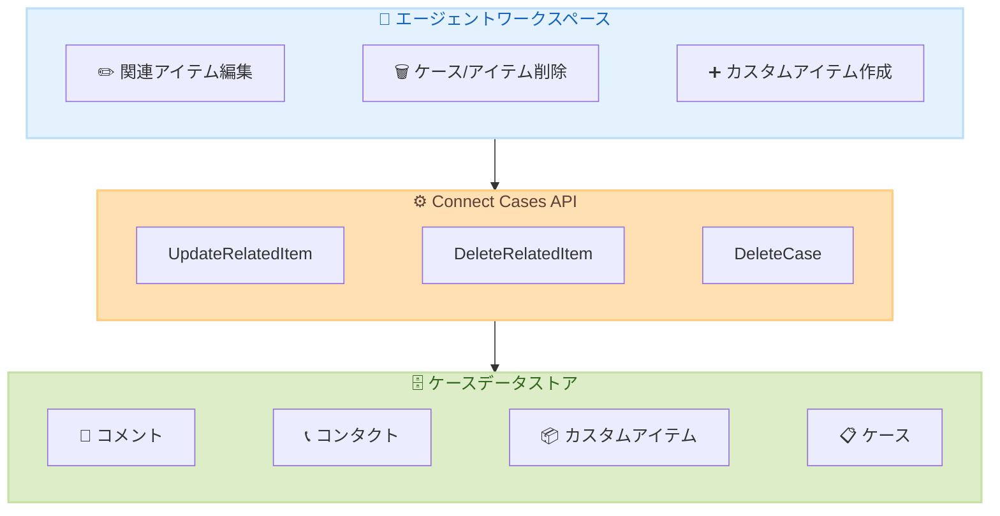

# Amazon Connect Cases - 関連アイテムの編集とケース削除がエージェントワークスペースから可能に

**リリース日**: 2026年5月15日
**サービス**: Amazon Connect Cases
**機能**: 関連アイテムの編集・削除、ケース削除

[このアップデートのインフォグラフィックを見る](https://takech9203.github.io/aws-news-summary/20260515-amazon-connect-cases-related-item.html)

## 概要

Amazon Connect Cases において、エージェントがワークスペースから直接、関連アイテムの編集・削除およびケースの削除を実行できるようになった。従来は管理者の支援が必要だったこれらの操作を、エージェントが自律的に行えるようになり、コンタクトセンターのオペレーション効率が大幅に向上する。

エージェントは、コメントの更新、誤ったケースに関連付けられたコンタクトのリンク解除、誤って作成されたケースの削除を実行できる。さらに、注文、返品、請求書などのカスタム関連アイテムの作成・編集・削除も可能となり、ケース管理の柔軟性が大きく拡張された。

**アップデート前の課題**

- 関連アイテム (コメント、コンタクトリンク等) の変更には管理者権限が必要で、エージェントだけでは修正できなかった
- 誤って作成されたケースを削除するために管理者へのエスカレーションが必要だった
- カスタム関連アイテム (注文、返品、請求書など) をエージェントが柔軟に管理する手段がなかった
- エラー修正のたびにワークフローが中断し、対応時間が長くなっていた

**アップデート後の改善**

- エージェントがワークスペースから直接、コメントの編集や関連アイテムの削除を実行可能になった
- 誤って作成されたケースをエージェント自身が削除でき、管理者への依存が解消された
- カスタム関連アイテムの CRUD 操作が可能になり、業務固有の情報をケースに柔軟に紐付けられるようになった
- エスカレーション不要でエラー修正が完結し、平均処理時間 (AHT) の短縮が期待できる

## アーキテクチャ図



エージェントワークスペースから Cases API を通じて、ケースデータの編集・削除操作が直接実行される構成を示している。

## サービスアップデートの詳細

### 主要機能

1. **関連アイテムの編集 (UpdateRelatedItem)**
   - コメントのテキスト内容を更新可能
   - カスタム関連アイテムのフィールド値を変更可能
   - `performedBy` パラメータで更新者を記録
   - Comment 型と Custom 型の関連アイテムが対象

2. **関連アイテムの削除 (DeleteRelatedItem)**
   - ケースに紐付けられた関連アイテムを削除可能
   - 誤ったコンタクトのリンク解除に使用
   - FILE 型の添付ファイルには `DeleteAttachedFile` API を使用する必要がある

3. **ケースの削除 (DeleteCase)**
   - 誤って作成されたケースを完全に削除可能
   - 削除後はケースに関連するすべてのリソース (関連アイテム、監査履歴) にアクセス不可
   - 不可逆操作であるため、削除後のデータ復旧は不可

4. **カスタム関連アイテムの CRUD 操作**
   - 注文、返品、請求書など業務固有の関連アイテムを作成・編集・削除可能
   - カスタムフィールドを柔軟に定義可能
   - フィールド数には Connect Cases のクォータ制限あり

## 技術仕様

### API エンドポイント

| API | HTTP メソッド | エンドポイント |
|-----|---------------|----------------|
| UpdateRelatedItem | PUT | `/domains/{domainId}/cases/{caseId}/related-items/{relatedItemId}` |
| DeleteRelatedItem | DELETE | `/domains/{domainId}/cases/{caseId}/related-items/{relatedItemId}` |
| DeleteCase | DELETE | `/domains/{domainId}/cases/{caseId}` |

### UpdateRelatedItem 対応コンテンツタイプ

| タイプ | 説明 | 操作 |
|--------|------|------|
| Comment | コメントのテキスト更新 | 本文と contentType を変更可能 |
| Custom | カスタム関連アイテム | フィールドの追加・変更・削除が可能 |
| Contact | コンタクトリンク | DeleteRelatedItem でリンク解除可能 |
| File | 添付ファイル | DeleteAttachedFile API で削除 |

### 重要な制約事項

| 項目 | 詳細 |
|------|------|
| Custom フィールド更新 | リクエストに含まれないフィールドは削除される (全フィールドを送信する必要あり) |
| performedBy 使用時 | DescribeUser 権限が必要 |
| システムケースフィールド | カスタム関連アイテムでは使用不可 |
| DeleteCase | 不可逆操作。関連リソースも全て削除される |
| FILE 型削除 | DeleteRelatedItem では不可。DeleteAttachedFile を使用 |

### API 変更履歴

| 日付 | サービス | 変更内容 |
|------|----------|----------|
| 2026/05/14 | [Amazon Q Connect](https://awsapichanges.com/archive/changes/bd1fb2-wisdom.html) | 1 new api method - ListModels |
| 2026/05/13 | [Amazon Connect Service](https://awsapichanges.com/archive/changes/74501c-connect.html) | 3 updated api methods - CreateRule, DescribeRule, ListRules |

### IAM 権限設定

```json
{
  "Version": "2012-10-17",
  "Statement": [
    {
      "Effect": "Allow",
      "Action": [
        "cases:UpdateRelatedItem",
        "cases:DeleteRelatedItem",
        "cases:DeleteCase"
      ],
      "Resource": "arn:aws:cases:*:*:domain/*/case/*"
    },
    {
      "Effect": "Allow",
      "Action": "connect:DescribeUser",
      "Resource": "arn:aws:connect:*:*:instance/*/agent/*",
      "Condition": {
        "StringEquals": {
          "aws:ResourceTag/Department": "Support"
        }
      }
    }
  ]
}
```

## 設定方法

### 前提条件

1. Amazon Connect インスタンスが作成済みであること
2. Amazon Connect Cases ドメインが有効化されていること
3. エージェントに適切な IAM 権限が付与されていること

### 手順

#### ステップ 1: セキュリティプロファイルの更新

Amazon Connect 管理コンソールでエージェントのセキュリティプロファイルに Cases の編集・削除権限を追加する。

```bash
# AWS CLI でセキュリティプロファイルの権限を確認
aws connect list-security-profile-permissions \
  --instance-id <instance-id> \
  --security-profile-id <security-profile-id>
```

セキュリティプロファイルに `Cases:UpdateRelatedItem`、`Cases:DeleteRelatedItem`、`Cases:DeleteCase` の権限が含まれていることを確認する。

#### ステップ 2: 関連アイテムの編集 (API 経由)

```bash
# コメントの更新
aws connectcases update-related-item \
  --domain-id "domain-12345" \
  --case-id "case-67890" \
  --related-item-id "ri-11111" \
  --content '{"comment": {"body": "Updated comment text", "contentType": "Text/Plain"}}'
```

指定したケースの関連アイテム (コメント) のテキスト内容を更新する。

#### ステップ 3: ケースの削除 (API 経由)

```bash
# ケースの削除（不可逆操作）
aws connectcases delete-case \
  --domain-id "domain-12345" \
  --case-id "case-67890"
```

指定したケースとその関連リソースを完全に削除する。この操作は取り消せないため、実行前に確認が必要。

#### ステップ 4: カスタム関連アイテムの作成

```bash
# カスタム関連アイテムの作成（注文情報）
aws connectcases create-related-item \
  --domain-id "domain-12345" \
  --case-id "case-67890" \
  --type "Custom" \
  --content '{"custom": {"fields": [{"id": "order_id", "value": {"stringValue": "ORD-2026-001"}}, {"id": "amount", "value": {"stringValue": "15000"}}]}}'
```

ケースに注文情報などのカスタム関連アイテムを紐付ける。

## メリット

### ビジネス面

- **オペレーション効率の向上**: エージェントが自律的にエラー修正を完結でき、管理者へのエスカレーションが不要になることで平均処理時間が短縮される
- **顧客満足度の改善**: 誤った情報の即時修正により、正確なケース情報に基づいたサポートを提供できる
- **管理者の負荷軽減**: 日常的なデータ修正作業が管理者からエージェントへ委譲され、管理者はより戦略的な業務に集中可能

### 技術面

- **RESTful API の提供**: UpdateRelatedItem、DeleteRelatedItem、DeleteCase の各 API により、自動化やカスタム統合が容易
- **カスタム拡張性**: カスタム関連アイテムにより、業務固有のデータ構造をケースに紐付け可能
- **監査証跡**: `performedBy` パラメータと `lastUpdatedUser` レスポンスフィールドにより、変更履歴を追跡可能

## デメリット・制約事項

### 制限事項

- DeleteCase は不可逆操作であり、削除後にケースデータを復旧する手段がない
- Custom 型の関連アイテム更新時は、全フィールドをリクエストに含める必要がある (含まれないフィールドは削除される)
- FILE 型の関連アイテムは DeleteRelatedItem API では削除できず、別途 DeleteAttachedFile API を使用する必要がある
- カスタム関連アイテムのフィールド数には Connect Cases のサービスクォータ制限がある
- システムケースフィールドはカスタム関連アイテムでは使用不可

### 考慮すべき点

- エージェントへの DeleteCase 権限付与は慎重に行う必要がある (誤削除のリスク)
- セキュリティプロファイルによる権限制御を適切に設計し、最小権限の原則を適用すべき
- 削除操作のログ監視と監査体制の整備が推奨される

## ユースケース

### ユースケース 1: 誤入力ケースの自律修正

**シナリオ**: エージェントが誤って重複ケースを作成してしまった場合、従来は管理者にエスカレーションが必要だった。

**実装例**:
```bash
# 誤って作成したケースを削除
aws connectcases delete-case \
  --domain-id "domain-12345" \
  --case-id "case-duplicate-99999"
```

**効果**: エスカレーション不要で即座に修正が完了し、エージェントの作業中断を最小限に抑えられる。

### ユースケース 2: EC サイトの注文管理との統合

**シナリオ**: カスタマーサポートで、ケースに関連する注文・返品・請求書情報をカスタム関連アイテムとして管理する。

**実装例**:
```json
{
  "content": {
    "custom": {
      "fields": [
        {"id": "order_number", "value": {"stringValue": "ORD-2026-12345"}},
        {"id": "order_status", "value": {"stringValue": "返品処理中"}},
        {"id": "refund_amount", "value": {"stringValue": "8500"}}
      ]
    }
  }
}
```

**効果**: エージェントがケース画面内で注文情報を直接確認・更新でき、複数システム間の切り替えが不要になる。

### ユースケース 3: コンタクトリンクの修正

**シナリオ**: 電話対応中にエージェントが誤って別の顧客のケースにコンタクトをリンクしてしまった場合。

**実装例**:
```bash
# 誤ったリンクを削除
aws connectcases delete-related-item \
  --domain-id "domain-12345" \
  --case-id "case-wrong-link" \
  --related-item-id "ri-contact-99999"
```

**効果**: 誤リンクの即時修正により、ケース情報の正確性を維持し、データ品質を確保できる。

## 料金

Amazon Connect Cases の料金は既存の従量課金モデルに基づく。今回追加された編集・削除機能に対する追加料金は発生しない。

| 項目 | 料金 |
|------|------|
| ケースあたりの料金 | $0.12/ケース (作成時) |
| API コール | Amazon Connect Cases API の使用量に含まれる |
| 編集・削除操作 | 追加料金なし |

※ 最新の料金情報は [Amazon Connect 料金ページ](https://aws.amazon.com/connect/pricing/) を参照。

## 利用可能リージョン

以下の 10 リージョンで利用可能。

| リージョン | リージョンコード |
|------------|------------------|
| 米国東部 (バージニア北部) | us-east-1 |
| 米国西部 (オレゴン) | us-west-2 |
| カナダ (中部) | ca-central-1 |
| 欧州 (フランクフルト) | eu-central-1 |
| 欧州 (ロンドン) | eu-west-2 |
| アジアパシフィック (ソウル) | ap-northeast-2 |
| アジアパシフィック (シンガポール) | ap-southeast-1 |
| アジアパシフィック (シドニー) | ap-southeast-2 |
| アジアパシフィック (東京) | ap-northeast-1 |
| アフリカ (ケープタウン) | af-south-1 |

## 関連サービス・機能

- **Amazon Connect**: クラウドベースのコンタクトセンターサービス。Cases はその一機能
- **Amazon Connect Cases**: ケース管理機能。顧客の問題を追跡し、解決まで管理する
- **Amazon Q in Connect**: AI を活用したエージェント支援。ケース情報と連携してリアルタイムに推奨アクションを提供
- **Amazon Connect Contact Lens**: 通話分析とコンタクト品質管理。ケースとコンタクトの関連付けに活用

## 参考リンク

- [インフォグラフィック](https://takech9203.github.io/aws-news-summary/20260515-amazon-connect-cases-related-item.html)
- [公式発表 (What's New)](https://aws.amazon.com/about-aws/whats-new/2026/05/amazon-connect-cases-related-item/)
- [Amazon Connect Cases 製品ページ](https://aws.amazon.com/connect/cases/)
- [UpdateRelatedItem API リファレンス](https://docs.aws.amazon.com/connect/latest/APIReference/API_connect-cases_UpdateRelatedItem.html)
- [DeleteCase API リファレンス](https://docs.aws.amazon.com/connect/latest/APIReference/API_connect-cases_DeleteCase.html)
- [DeleteRelatedItem API リファレンス](https://docs.aws.amazon.com/connect/latest/APIReference/API_connect-cases_DeleteRelatedItem.html)
- [Amazon Connect 料金](https://aws.amazon.com/connect/pricing/)

## まとめ

Amazon Connect Cases の関連アイテム編集・削除機能により、エージェントは管理者の支援なしにケースデータの修正や不要なケースの削除を実行できるようになった。特にカスタム関連アイテムのサポートにより、業務固有のデータ (注文、返品、請求書) をケースに柔軟に統合できる点が大きな改善である。東京リージョンを含む 10 リージョンで利用可能であり、既存の Connect Cases 環境であれば追加料金なしで利用を開始できるため、エージェントのセキュリティプロファイル設定を確認のうえ、速やかに導入を検討されたい。
