# Amazon EMR Serverless - 6 つの追加リージョンで利用可能に

**リリース日**: 2026 年 5 月 15 日
**サービス**: Amazon EMR Serverless
**機能**: リージョン拡大 (6 リージョン追加)

📊 [このアップデートのインフォグラフィックを見る](https://takech9203.github.io/aws-news-summary/20260515-amazon-emr-serverless-aws-regions.html)

## 概要

Amazon EMR Serverless が新たに 6 つの AWS リージョンで一般利用可能 (GA) になった。今回追加されたリージョンは、アジアパシフィック (ハイデラバード)、アジアパシフィック (マレーシア)、アジアパシフィック (ニュージーランド)、アジアパシフィック (台北)、アジアパシフィック (タイ)、メキシコ (中央) の 6 リージョンである。

EMR Serverless は、ペタバイト規模のデータ分析をシンプルかつコスト効率よく実行するためのサーバーレスデプロイメントオプションである。Apache Spark と Apache Hive をサポートし、クラスターの構成・最適化・チューニング・管理が不要で、きめ細かい自動スケーリング、高速な起動時間、カスタマイズ可能なワーカー設定を備えている。

今回のリージョン拡大により、アジアパシフィック地域およびラテンアメリカ地域のユーザーが、データの所在地により近い場所でサーバーレスな大規模データ分析を実行できるようになった。これはデータレジデンシー要件の遵守やレイテンシーの低減に直接貢献する。

**アップデート前の課題**

- アジアパシフィックの新興リージョン (ハイデラバード、マレーシア、ニュージーランド、台北、タイ) では EMR Serverless が利用できず、近隣の既存リージョンを使用する必要があった
- メキシコのユーザーはバージニア北部やオレゴンなど遠方のリージョンを使用する必要があり、レイテンシーやデータ主権の課題があった
- データレジデンシー規制がある地域のユーザーは、EMR Serverless の利便性を享受できなかった

**アップデート後の改善**

- 6 つの新リージョンでデータの近くにサーバーレス分析基盤を構築可能になった
- アジアパシフィック地域の 5 つの新リージョンでローカルなデータ処理が可能になり、データ主権要件への対応が容易になった
- メキシコ (中央) リージョンによりラテンアメリカのユーザーのレイテンシーが大幅に改善された

## アーキテクチャ図

```mermaid
flowchart TD
    subgraph User["👤 データエンジニア/アナリスト"]
        Submit["📤 ジョブ送信"]
    end

    subgraph EMRServerless["⚡ Amazon EMR Serverless"]
        direction LR
        Spark["🔥 Apache Spark"]
        Hive["🐝 Apache Hive"]
        Spark ~~~ Hive
    end

    subgraph Features["⚙️ 主要機能"]
        direction LR
        AutoScale["📈 自動スケーリング"]
        FastLaunch["🚀 高速起動"]
        CustomWorker["🔧 カスタムワーカー"]
        AutoScale ~~~ FastLaunch ~~~ CustomWorker
    end

    subgraph NewRegions["🌏 新規追加リージョン"]
        direction LR
        R1["🇮🇳 ハイデラバード"]
        R2["🇲🇾 マレーシア"]
        R3["🇳🇿 ニュージーランド"]
        R1 ~~~ R2 ~~~ R3
    end

    subgraph NewRegions2["🌎 新規追加リージョン"]
        direction LR
        R4["🇹🇼 台北"]
        R5["🇹🇭 タイ"]
        R6["🇲🇽 メキシコ"]
        R4 ~~~ R5 ~~~ R6
    end

    subgraph Storage["🗄️ データソース"]
        direction LR
        S3[("🪣 Amazon S3")]
        Glue["📚 AWS Glue Data Catalog"]
        S3 ~~~ Glue
    end

    Submit --> EMRServerless
    EMRServerless --> Features
    EMRServerless --> NewRegions
    EMRServerless --> NewRegions2
    EMRServerless --> Storage

    classDef cloud fill:none,stroke:#CCCCCC,stroke-width:2px,color:#666666
    classDef compute fill:#FFE0B2,stroke:#FFCC80,stroke-width:2px,color:#5D4037
    classDef storage fill:#DCEDC8,stroke:#C5E1A5,stroke-width:2px,color:#33691E
    classDef user fill:#E3F2FD,stroke:#BBDEFB,stroke-width:2px,color:#1565C0
    classDef region fill:#F3E5F5,stroke:#CE93D8,stroke-width:2px,color:#4A148C
    classDef feature fill:#E8F1FF,stroke:#4A90E2,stroke-width:2px,color:#333333

    class User user
    class EMRServerless compute
    class Features feature
    class NewRegions,NewRegions2 region
    class Storage storage
```



EMR Serverless のサーバーレスアーキテクチャにより、ユーザーはクラスター管理なしに新規リージョンでペタバイト規模のデータ分析を実行できる。

## サービスアップデートの詳細

### 主要機能

1. **サーバーレスアーキテクチャ**
   - クラスターの構成、最適化、チューニング、管理が一切不要
   - インフラストラクチャの管理から解放され、データ分析に集中可能
   - リソースのプロビジョニングとスケーリングが完全に自動化

2. **Apache Spark / Apache Hive サポート**
   - Apache Spark によるバッチ処理、インタラクティブ分析、ストリーミング処理
   - Apache Hive による SQL ベースのデータウェアハウスクエリ
   - 既存の Spark/Hive アプリケーションの移行が容易

3. **きめ細かい自動スケーリング**
   - ワークロードの需要に応じてワーカーが自動的にスケールアップ/ダウン
   - 秒単位の課金 (最低 1 分) によりコスト最適化
   - ワーカー構成 (vCPU、メモリ、ストレージ) を独立して設定可能

4. **多様なワークロードタイプ**
   - バッチ処理: 大規模 ETL ジョブの実行
   - インタラクティブ分析: EMR Studio を通じたノートブックベースの分析
   - ストリーミング: リアルタイムデータ処理パイプライン

## 技術仕様

### ワーカー構成

| 項目 | 仕様 |
|------|------|
| vCPU | 1 - 16 vCPU |
| メモリ | 2 GB - 120 GB |
| 標準エフェメラルストレージ | 20 GB - 200 GB |
| シャッフル最適化ストレージ | 最大 2 TB |
| 課金単位 | 秒単位 (最低 1 分) |

### 新規追加リージョン

| リージョン名 | リージョンコード |
|------|------|
| アジアパシフィック (ハイデラバード) | ap-south-2 |
| アジアパシフィック (マレーシア) | ap-southeast-5 |
| アジアパシフィック (ニュージーランド) | ap-southeast-7 |
| アジアパシフィック (台北) | ap-east-1 |
| アジアパシフィック (タイ) | ap-southeast-7 |
| メキシコ (中央) | mx-central-1 |

## 設定方法

### 前提条件

1. AWS アカウントと適切な IAM 権限
2. Amazon S3 バケット (出力とログ保存用)
3. ジョブ実行ロール (EMR Serverless がアクセスする AWS リソースへの権限)

### 手順

#### ステップ 1: IAM ジョブ実行ロールの作成

```bash
# 信頼ポリシーファイルを作成
cat > emr-serverless-trust-policy.json << 'EOF'
{
  "Version": "2012-10-17",
  "Statement": [
    {
      "Effect": "Allow",
      "Principal": {
        "Service": "emr-serverless.amazonaws.com"
      },
      "Action": "sts:AssumeRole"
    }
  ]
}
EOF

# IAM ロールを作成
aws iam create-role \
    --role-name EMRServerlessS3RuntimeRole \
    --assume-role-policy-document file://emr-serverless-trust-policy.json
```

EMR Serverless がジョブ実行時に S3 や Glue Data Catalog などの AWS リソースにアクセスするためのロールを作成する。

#### ステップ 2: EMR Serverless アプリケーションの作成

```bash
# 新規リージョン (例: ap-south-2) で Spark アプリケーションを作成
aws emr-serverless create-application \
    --release-label emr-7.0.0 \
    --type "SPARK" \
    --name "my-spark-app" \
    --region ap-south-2
```

指定したリージョンで EMR Serverless アプリケーションを作成する。リリースラベルで EMR のバージョンを指定する。

#### ステップ 3: ジョブの送信

```bash
# Spark ジョブを送信
aws emr-serverless start-job-run \
    --application-id <application-id> \
    --execution-role-arn <job-role-arn> \
    --job-driver '{
        "sparkSubmit": {
            "entryPoint": "s3://my-bucket/scripts/my-spark-job.py",
            "sparkSubmitParameters": "--conf spark.executor.memory=4g"
        }
    }' \
    --region ap-south-2
```

作成したアプリケーションに対してジョブを送信する。EMR Serverless が自動的にリソースをプロビジョニングし、ジョブ完了後にリソースを解放する。

## メリット

### ビジネス面

- **データレジデンシー対応**: アジアパシフィックおよびラテンアメリカの規制要件に対応し、データを地域内に保持可能
- **レイテンシー削減**: データソースに地理的に近いリージョンで処理することで、データ転送時間とコストを削減
- **グローバル展開の加速**: 新興市場での分析基盤をサーバーレスで迅速に構築可能

### 技術面

- **運用負荷ゼロ**: クラスター管理不要で、データエンジニアがビジネスロジックに集中可能
- **コスト最適化**: 使用した分だけの課金 (秒単位) で、アイドルリソースのコストが発生しない
- **弾力的なスケーリング**: ワークロードに応じた自動スケーリングで、ペタバイト規模のデータに対応

## デメリット・制約事項

### 制限事項

- 新規リージョンでは EMR Serverless の料金が他のリージョンと異なる場合がある (リージョン別料金を確認が必要)
- 一部の新規リージョンでは、関連サービス (AWS Glue、Amazon Athena など) の利用可能状況が限定される可能性がある
- ワーカーの最大 vCPU は 16、最大メモリは 120 GB の制限がある

### 考慮すべき点

- 新規リージョンへの移行時は、S3 バケットや IAM ロールのリージョン対応が必要
- 既存のクロスリージョンデータ転送パターンの見直しが推奨される
- リージョン間でのサービスクォータが異なる可能性がある

## ユースケース

### ユースケース 1: インドのデータレジデンシー対応

**シナリオ**: インドの金融企業がデータ保護法に準拠するため、顧客データをインド国内で処理する必要がある。

**実装例**:
```bash
# ハイデラバードリージョンでアプリケーションを作成
aws emr-serverless create-application \
    --release-label emr-7.0.0 \
    --type "SPARK" \
    --name "india-compliance-analytics" \
    --region ap-south-2

# インドリージョンの S3 から直接データを処理
aws emr-serverless start-job-run \
    --application-id <app-id> \
    --execution-role-arn <role-arn> \
    --job-driver '{
        "sparkSubmit": {
            "entryPoint": "s3://india-data-bucket/etl/daily-transform.py"
        }
    }' \
    --region ap-south-2
```

**効果**: データが国外に転送されることなく、インド国内でペタバイト規模の分析処理を完結できる。

### ユースケース 2: 東南アジアのリアルタイムストリーミング分析

**シナリオ**: タイやマレーシアで事業展開する EC サイトが、ユーザー行動データのリアルタイム分析を低レイテンシーで実行したい。

**実装例**:
```bash
# タイリージョンで Spark ストリーミングアプリケーションを作成
aws emr-serverless create-application \
    --release-label emr-7.0.0 \
    --type "SPARK" \
    --name "thai-streaming-analytics" \
    --initial-capacity '{
        "DRIVER": {
            "workerCount": 1,
            "workerConfiguration": {
                "cpu": "2vCPU",
                "memory": "4GB"
            }
        }
    }' \
    --region ap-southeast-7
```

**効果**: ユーザーに地理的に近い場所でリアルタイム分析を実行し、パーソナライズされた推奨事項を低レイテンシーで提供できる。

### ユースケース 3: メキシコ市場向け日次バッチ ETL

**シナリオ**: メキシコに進出した企業が、現地の売上データを日次で集計し、ビジネスインテリジェンスダッシュボードに反映したい。

**実装例**:
```bash
# メキシコリージョンで Hive アプリケーションを作成
aws emr-serverless create-application \
    --release-label emr-7.0.0 \
    --type "HIVE" \
    --name "mexico-daily-etl" \
    --region mx-central-1

# 日次 ETL ジョブを実行
aws emr-serverless start-job-run \
    --application-id <app-id> \
    --execution-role-arn <role-arn> \
    --job-driver '{
        "hive": {
            "query": "s3://mexico-analytics/queries/daily-aggregation.sql",
            "parameters": "--hivevar date=2026-05-15"
        }
    }' \
    --region mx-central-1
```

**効果**: メキシコ国内でデータ処理が完結し、クロスリージョン転送コストの削減とレイテンシーの改善を実現できる。

## 料金

EMR Serverless は使用したリソースに対してのみ課金される。課金はワーカーが実行可能状態になった時点から停止する時点までで、秒単位 (最低 1 分) で計算される。

### 料金体系

| リソースタイプ | 単位 | 料金 (参考: 米国東部) |
|--------|------------------|---|
| コンピュート | vCPU 時間 | $0.052624 |
| メモリ | GB 時間 | $0.0057785 |
| 標準ストレージ | GB 時間 (20 GB 超過分) | 別途課金 |
| シャッフル最適化ストレージ | GB 時間 (全量) | 別途課金 |

### 料金例

| 使用量 | 月額料金 (概算) |
|--------|------------------|
| Spark ジョブ: 25 ワーカー (4 vCPU、30 GB) x 30 分 + 75 ワーカー x 15 分 | 約 $9.60/回 |
| 日次バッチ (4 vCPU x 10 ワーカー、1 時間/日) | 約 $80/月 |

**注意**: 新規リージョンの料金は米国東部リージョンと異なる場合がある。最新の料金は [EMR Serverless 料金ページ](https://aws.amazon.com/emr/pricing/) を参照。

## 利用可能リージョン

今回のアップデートにより追加された 6 リージョンを含め、EMR Serverless は以下のリージョンで利用可能。

**今回追加されたリージョン:**

- アジアパシフィック (ハイデラバード) - ap-south-2
- アジアパシフィック (マレーシア) - ap-southeast-5
- アジアパシフィック (ニュージーランド) - ap-southeast-7
- アジアパシフィック (台北) - ap-east-1
- アジアパシフィック (タイ) - ap-southeast-7
- メキシコ (中央) - mx-central-1

**既存の利用可能リージョン** (主要なもの):

- 米国東部 (バージニア北部) - us-east-1
- 米国東部 (オハイオ) - us-east-2
- 米国西部 (オレゴン) - us-west-2
- 欧州 (アイルランド) - eu-west-1
- 欧州 (フランクフルト) - eu-central-1
- アジアパシフィック (東京) - ap-northeast-1
- アジアパシフィック (シンガポール) - ap-southeast-1
- アジアパシフィック (シドニー) - ap-southeast-2
- アジアパシフィック (ムンバイ) - ap-south-1

全リージョンの一覧は [AWS リージョンサービス一覧](https://aws.amazon.com/about-aws/global-infrastructure/regional-product-services/) を参照。

## 関連サービス・機能

- **Amazon S3**: EMR Serverless のデータ入出力先として使用するオブジェクトストレージ
- **AWS Glue Data Catalog**: EMR Serverless ジョブで使用するメタデータカタログ
- **Amazon EMR on EC2/EKS**: EMR Serverless の代替デプロイメントオプションで、より細かいインフラ制御が必要な場合に使用
- **Amazon Athena**: S3 上のデータに対する SQL クエリサービスで、EMR Serverless と補完的に利用可能
- **AWS Step Functions**: EMR Serverless ジョブのオーケストレーションに活用

## 参考リンク

- 📊 [インフォグラフィック](https://takech9203.github.io/aws-news-summary/20260515-amazon-emr-serverless-aws-regions.html)
- [公式発表 (What's New)](https://aws.amazon.com/about-aws/whats-new/2026/05/amazon-emr-serverless-aws-regions/)
- [EMR Serverless ユーザーガイド](https://docs.aws.amazon.com/emr/latest/EMR-Serverless-UserGuide/getting-started.html)
- [EMR Serverless 料金ページ](https://aws.amazon.com/emr/pricing/)
- [AWS リージョンサービス一覧](https://aws.amazon.com/about-aws/global-infrastructure/regional-product-services/)

## まとめ

Amazon EMR Serverless が 6 つの新リージョンで利用可能になったことで、アジアパシフィックおよびラテンアメリカ地域のユーザーが、データレジデンシー要件を満たしながらサーバーレスな大規模データ分析を実行できるようになった。特に東南アジアの新興リージョン (マレーシア、タイ、台北) とインド (ハイデラバード) での対応は、これらの地域で急成長するデータ分析需要に応えるものである。新規リージョンでの利用開始を検討する場合は、リージョン固有の料金とサービスクォータを確認した上で、既存のデータパイプラインの移行計画を策定することを推奨する。
