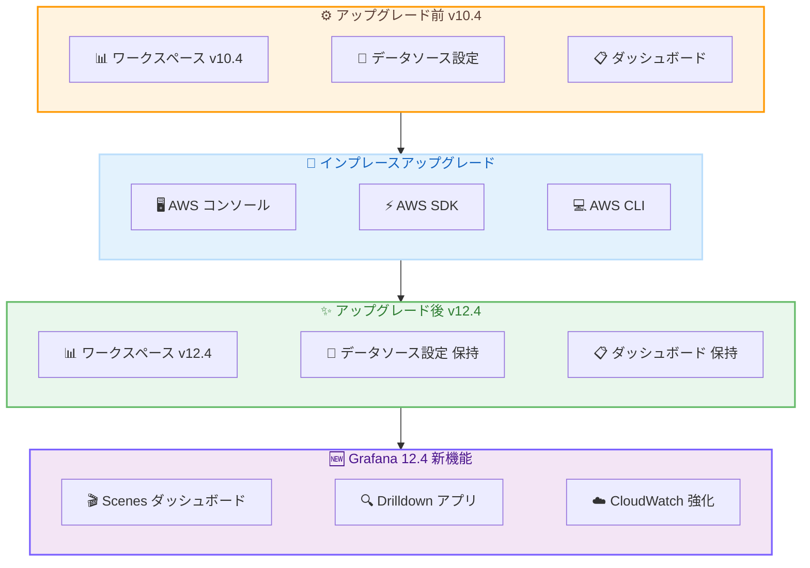

# Amazon Managed Grafana - Grafana バージョン 12.4 へのインプレースアップグレード

**リリース日**: 2026 年 5 月 15 日
**サービス**: Amazon Managed Grafana
**機能**: Grafana バージョン 10.4 から 12.4 へのインプレースアップグレード

📊 [このアップデートのインフォグラフィックを見る](https://takech9203.github.io/aws-news-summary/20260515-amazon-managed-grafana-v12-update.html)

## 概要

Amazon Managed Grafana が、既存のワークスペースを Grafana バージョン 10.4 から 12.4 へインプレースアップグレードする機能をサポートした。AWS コンソール、AWS SDK、または AWS CLI を通じて、ワークスペースを再作成することなくバージョンアップが可能になる。

2026 年 4 月にバージョン 12.4 での新規ワークスペース作成がサポートされたが、今回のアップデートにより既存環境のアップグレードパスが提供された。これにより、既存のダッシュボード、データソース設定、ユーザー権限をそのまま維持しながら、Scenes ベースのダッシュボード、Queryless Drilldown アプリ、CloudWatch プラグインの強化など、Grafana 12.4 の新機能を活用できるようになる。

**アップデート前の課題**

- バージョン 10.4 で稼働中のワークスペースを 12.4 にアップグレードする公式パスが存在しなかった
- 最新機能を利用するには新規ワークスペースを作成し、ダッシュボードや設定を手動で移行する必要があった
- 移行作業に伴うダウンタイムや設定漏れのリスクがあった
- 既存のアラートルールやデータソース接続の再設定が必要だった

**アップデート後の改善**

- インプレースアップグレードにより、既存のワークスペースをそのまま 12.4 に更新可能になった
- ダッシュボード、データソース、ユーザー権限などの設定がすべて保持される
- AWS コンソール、SDK、CLI のいずれからもアップグレードを実行可能
- 新規ワークスペース作成と移行作業が不要になり、運用負荷が大幅に軽減された

## アーキテクチャ図



既存のワークスペースをインプレースでアップグレードすることで、設定を保持したまま Grafana 12.4 の新機能を利用可能になる。

## サービスアップデートの詳細

### 主要機能

1. **Scenes ベースのダッシュボード**
   - 新しいレンダリングエンジンにより、ダッシュボードの描画が高速化
   - より効率的なデータ処理とレスポンシブなインタラクション
   - 大規模なダッシュボードでもスムーズなパフォーマンスを実現

2. **Queryless Drilldown アプリ**
   - クエリ言語の知識なしにポイント&クリックでデータ探索が可能
   - Prometheus メトリクス、Loki ログ、Tempo トレース、Pyroscope プロファイルに対応
   - 運用チームのトラブルシューティング効率を大幅に向上

3. **CloudWatch プラグインの強化**
   - PPL (Piped Processing Language) および SQL クエリをサポートし、ログ分析を簡素化
   - クロスアカウント Metrics Insights で複数アカウントのメトリクスを統合的に可視化
   - ログ異常検出機能によりプロアクティブな問題検出が可能

4. **再構築されたテーブルビジュアライゼーション**
   - CSS セルスタイリングによる柔軟な表示カスタマイズ
   - インタラクティブな Actions ボタンでワークフローを効率化
   - パフォーマンスの向上によりスムーズなスクロールと操作を実現

5. **トレンドライントランスフォーメーション**
   - データの傾向を自動的に可視化するトランスフォーメーション機能
   - 時系列データの分析がより直感的に

6. **ナビゲーションブックマーク**
   - よく使うダッシュボードやビューへのクイックアクセス
   - チーム間でのナビゲーション共有が容易に

### 技術仕様

#### アップグレードパス

| 項目 | 詳細 |
|------|------|
| アップグレード元バージョン | Grafana 10.4 |
| アップグレード先バージョン | Grafana 12.4 |
| アップグレード方式 | インプレース (ワークスペース再作成不要) |
| 実行方法 | AWS コンソール / AWS SDK / AWS CLI |
| 設定の保持 | ダッシュボード、データソース、ユーザー権限すべて保持 |

#### 対応データソース

| データソース | Drilldown 対応 |
|-------------|---------------|
| Prometheus | メトリクス探索 |
| CloudWatch | PPL/SQL クエリ、クロスアカウント対応 |
| Loki | ログ探索 |
| Tempo | トレース探索 |
| Pyroscope | プロファイル探索 |

### API 変更履歴

| 日付 | サービス | 変更内容 |
|------|----------|----------|
| 2026/05/14 | [grafana](https://awsapichanges.com/archive/changes/bd1fb2-grafana.html) | 6 updated api methods - デュアルスタック (IPv4/IPv6) 接続のサポート追加 |

API の変更として、`CreateWorkspace` および `UpdateWorkspace` に `ipAddressType` パラメータが追加され、IPv4 のみまたはデュアルスタック (IPv4/IPv6) のアクセスを選択可能になった。

### 変更された API メソッド

```
AssociateLicense      - レスポンスに ipAddressType フィールド追加
CreateWorkspace       - リクエスト/レスポンスに ipAddressType フィールド追加
DeleteWorkspace       - レスポンスに ipAddressType フィールド追加
DescribeWorkspace     - レスポンスに ipAddressType フィールド追加
DisassociateLicense   - レスポンスに ipAddressType フィールド追加
UpdateWorkspace       - リクエスト/レスポンスに ipAddressType フィールド追加
```

## 設定方法

### 前提条件

1. Amazon Managed Grafana ワークスペースが Grafana バージョン 10.4 で稼働していること
2. ワークスペースの管理者権限を持つ IAM ロールまたはユーザー
3. アップグレード前のダッシュボードおよび設定のバックアップ (推奨)

### 手順

#### ステップ 1: 現在のバージョンを確認

```bash
aws grafana describe-workspace \
  --workspace-id <your-workspace-id> \
  --query 'workspace.grafanaVersion'
```

現在のワークスペースの Grafana バージョンが 10.4 であることを確認する。

#### ステップ 2: インプレースアップグレードの実行

```bash
aws grafana update-workspace-configuration \
  --workspace-id <your-workspace-id> \
  --grafana-version "12.4"
```

ワークスペースのバージョンを 12.4 に更新する。アップグレード中はワークスペースのステータスが `VERSION_UPDATING` に変わる。

#### ステップ 3: アップグレード完了の確認

```bash
aws grafana describe-workspace \
  --workspace-id <your-workspace-id> \
  --query 'workspace.{Status:status,Version:grafanaVersion}'
```

ステータスが `ACTIVE` に戻り、バージョンが `12.4` になっていることを確認する。

## メリット

### ビジネス面

- **運用コストの削減**: ワークスペースの再作成と移行作業が不要になり、エンジニアリング工数を節約
- **ダウンタイムの最小化**: インプレースアップグレードにより、サービス停止時間を最小限に抑制
- **即時の機能活用**: アップグレード完了後すぐに Grafana 12.4 の新機能を既存環境で利用可能

### 技術面

- **設定の完全保持**: ダッシュボード、データソース、アラート、ユーザー権限がすべて維持される
- **CloudWatch 分析の強化**: PPL/SQL クエリとクロスアカウント Metrics Insights で可視性が向上
- **パフォーマンス向上**: Scenes エンジンによりダッシュボードのレンダリング速度が改善
- **Queryless 探索**: Drilldown アプリにより、クエリ言語を知らないチームメンバーもデータ探索が可能

## デメリット・制約事項

### 制限事項

- アップグレード元はバージョン 10.4 のみ (それ以前のバージョンからの直接アップグレードは不可)
- アップグレード中はワークスペースへのアクセスが一時的に制限される可能性がある
- バージョン 12.4 へのアップグレード後にダウングレードする公式手段は提供されていない

### 考慮すべき点

- カスタムプラグインやサードパーティプラグインの互換性を事前に確認する必要がある
- Grafana 11.x 系の破壊的変更が含まれるため、ダッシュボードの動作確認が推奨される
- 既存のアラートルール構文がバージョン間で変更されている可能性があるため、アップグレード後にアラートのテストを実施すべき

## ユースケース

### ユースケース 1: マルチアカウント環境のモニタリング統合

**シナリオ**: 複数の AWS アカウントでワークロードを運用しており、各アカウントの CloudWatch メトリクスを一元的に監視したい組織。

**実装例**:
```
1. 既存の v10.4 ワークスペースを v12.4 にインプレースアップグレード
2. CloudWatch データソースでクロスアカウント Metrics Insights を有効化
3. 統合ダッシュボードで全アカウントのメトリクスを可視化
```

**効果**: 複数アカウントのメトリクスを単一のダッシュボードで俯瞰でき、異常検出もクロスアカウントで機能する。

### ユースケース 2: 非エンジニアチームへのオブザーバビリティ拡大

**シナリオ**: SRE チームだけでなく、プロダクトマネージャーやビジネスアナリストもシステムの状態を確認したいが、PromQL や CloudWatch クエリの知識がない。

**実装例**:
```
1. ワークスペースを v12.4 にアップグレード
2. Queryless Drilldown アプリを有効化
3. Prometheus メトリクスと Loki ログへのポイント&クリック探索を設定
4. ナビゲーションブックマークで主要ビューへのショートカットを作成
```

**効果**: クエリ言語を知らないチームメンバーでも直感的にメトリクスやログを探索でき、セルフサービスのオブザーバビリティが実現する。

### ユースケース 3: CloudWatch Logs の高度な分析

**シナリオ**: 大量のアプリケーションログから特定のパターンを分析したいが、既存の CloudWatch Logs Insights クエリでは表現力が不足している。

**実装例**:
```sql
-- PPL クエリ例: エラーログのパターン分析
source = '/aws/lambda/my-function'
| where @message like '%ERROR%'
| stats count() by bin(5m)
| sort -count()
```

**効果**: PPL/SQL の強力なクエリ言語により複雑なログ分析が可能になり、さらにログ異常検出で問題を自動的にサーフェスできる。

## 料金

Amazon Managed Grafana の料金体系はアップグレードによって変更されない。既存の料金モデルが適用される。

### 料金例

| 項目 | 月額料金 (概算) |
|------|-----------------|
| アクティブエディター/管理者 1 ユーザー | $9.00 |
| アクティブビューワー 1 ユーザー | $5.00 |
| アップグレード作業自体 | 追加料金なし |

インプレースアップグレードに追加費用は発生しない。

## 利用可能リージョン

Amazon Managed Grafana が一般提供 (GA) されているすべての AWS リージョンで利用可能。主要なリージョンとして以下が含まれる。

- 米国東部 (バージニア北部、オハイオ)
- 米国西部 (オレゴン)
- 欧州 (アイルランド、フランクフルト、ロンドン、ストックホルム)
- アジアパシフィック (東京、シンガポール、シドニー、ソウル、ムンバイ)

## 関連サービス・機能

- **Amazon CloudWatch**: Grafana 12.4 で PPL/SQL クエリ、クロスアカウント Metrics Insights、ログ異常検出が利用可能
- **Amazon Managed Service for Prometheus**: Drilldown アプリで Prometheus メトリクスのクエリレス探索が可能
- **AWS X-Ray / Tempo**: トレースの Drilldown 探索に対応
- **AWS Organizations**: クロスアカウント Metrics Insights で組織内の複数アカウントを統合監視

## 参考リンク

- 📊 [インフォグラフィック](https://takech9203.github.io/aws-news-summary/20260515-amazon-managed-grafana-v12-update.html)
- [公式発表 (What's New)](https://aws.amazon.com/about-aws/whats-new/2026/05/amazon-managed-grafana-v12-update/)
- [Grafana バージョン間の差異](https://docs.aws.amazon.com/grafana/latest/userguide/version-differences.html#version-diff-v12)
- [ワークスペースバージョンの更新手順](https://docs.aws.amazon.com/grafana/latest/userguide/AMG-workspace-version-update.html)
- [Amazon Managed Grafana 製品ページ](https://aws.amazon.com/grafana/)
- [料金ページ](https://aws.amazon.com/grafana/pricing/)

## まとめ

Amazon Managed Grafana のインプレースアップグレードサポートにより、既存のバージョン 10.4 ワークスペースを再作成なしで 12.4 に移行できるようになった。Scenes ベースのダッシュボード、Queryless Drilldown アプリ、CloudWatch の PPL/SQL 対応など多数の新機能を既存環境で即座に活用できるため、現在 10.4 を使用している組織はアップグレードの計画を推奨する。事前にカスタムプラグインの互換性確認とダッシュボードのバックアップを実施した上でアップグレードを実行すべきである。
