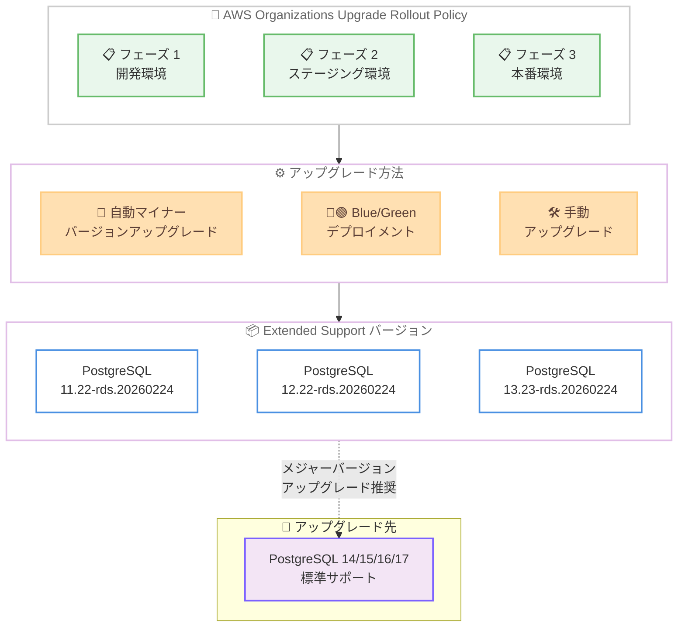

# Amazon RDS for PostgreSQL - Extended Support マイナーバージョン 11.22/12.22/13.23 リリース

**リリース日**: 2026年5月15日
**サービス**: Amazon RDS for PostgreSQL
**機能**: Extended Support マイナーバージョン 11.22-rds.20260224, 12.22-rds.20260224, 13.23-rds.20260224

📊 [このアップデートのインフォグラフィックを見る](https://takech9203.github.io/aws-news-summary/20260515-amazon-rds-postgresql-extended-support.html)

## 概要

Amazon RDS for PostgreSQL が Extended Support の新しいマイナーバージョンとして、11.22-rds.20260224、12.22-rds.20260224、13.23-rds.20260224 をリリースした。これらのバージョンには、既知のセキュリティ脆弱性とバグの修正が含まれており、以前のバージョンからのアップグレードが推奨される。

Amazon RDS Extended Support は、PostgreSQL メジャーバージョンの標準サポート終了後、最大 3 年間の追加サポートを提供するプログラムである。この期間中、AWS は重大なセキュリティ問題やバグに対するパッチを引き続き提供する。PostgreSQL 11、12、13 はいずれも標準サポートが終了しているメジャーバージョンであり、Extended Support によってのみセキュリティパッチを受け取ることができる。

今回のリリースでは、自動マイナーバージョンアップグレード、AWS Organizations Upgrade Rollout Policy、および物理レプリケーションを使用した Blue/Green デプロイメントがサポートされており、運用負荷を最小限に抑えながら安全にアップグレードを実施できる。

**アップデート前の課題**

- PostgreSQL 11/12/13 の以前の Extended Support バージョンには既知のセキュリティ脆弱性が存在していた
- バグ修正が適用されていない状態で運用を続けるリスクがあった
- 大規模環境でのアップグレード調整が手動で必要だった

**アップデート後の改善**

- 既知のセキュリティ脆弱性が修正され、安全な運用環境を維持できる
- 自動マイナーバージョンアップグレードにより手動介入なしでパッチ適用が可能
- Organizations Upgrade Rollout Policy で数千のインスタンスを段階的にアップグレード可能
- Blue/Green デプロイメントでダウンタイムを最小化したアップグレードが実現

## アーキテクチャ図



この図は、Extended Support バージョンへのアップグレードワークフローを示している。Organizations Upgrade Rollout Policy による段階的展開、3 つのアップグレード方法、そして最終的にメジャーバージョンアップグレードへの移行パスを表現している。

## サービスアップデートの詳細

### 主要機能

1. **セキュリティ脆弱性の修正**
   - PostgreSQL コミュニティで報告された既知のセキュリティ脆弱性に対するパッチを含む
   - 重大度の高い CVE に対応した修正が含まれる
   - 以前のマイナーバージョンからのアップグレードが推奨される

2. **自動マイナーバージョンアップグレード**
   - メンテナンスウィンドウ中に自動的に新バージョンへアップグレード
   - DB インスタンスの「Auto Minor Version Upgrade」設定を有効にすることで利用可能
   - 手動介入なしでセキュリティパッチを適用

3. **AWS Organizations Upgrade Rollout Policy**
   - 組織全体で数千のデータベースインスタンスを段階的にアップグレード
   - 開発環境を先行してアップグレードし、問題がないことを確認後に本番環境へ展開
   - マルチアカウント環境での運用を大幅に簡素化

4. **Blue/Green デプロイメント (物理レプリケーション)**
   - 物理レプリケーションを使用した Blue/Green デプロイメントによるダウンタイムの最小化
   - Green 環境で新バージョンをテスト後、スイッチオーバーで本番切り替え
   - ロールバックも容易に実行可能

## 技術仕様

### 対象バージョン

| メジャーバージョン | 新マイナーバージョン | ビルド日 |
|------|----------|----------|
| PostgreSQL 11 | 11.22-rds.20260224 | 2026年2月24日 |
| PostgreSQL 12 | 12.22-rds.20260224 | 2026年2月24日 |
| PostgreSQL 13 | 13.23-rds.20260224 | 2026年2月24日 |

### Extended Support の期間

| メジャーバージョン | 標準サポート終了 | Extended Support 提供期間 |
|------|----------|----------|
| PostgreSQL 11 | 2024年2月29日 | 最大 2027年2月まで |
| PostgreSQL 12 | 2025年2月28日 | 最大 2028年2月まで |
| PostgreSQL 13 | 2026年2月28日 | 最大 2029年2月まで |

### API 変更履歴

今回のアップデートに関連する直近 7 日間の API 変更は確認されなかった。

## 設定方法

### 前提条件

1. Amazon RDS for PostgreSQL の DB インスタンスが PostgreSQL 11、12、または 13 で稼働していること
2. Extended Support が有効化されていること (標準サポート終了後は自動的に Extended Support に登録)
3. 適切な IAM 権限が設定されていること

### 手順

#### ステップ 1: 自動マイナーバージョンアップグレードの有効化

```bash
aws rds modify-db-instance \
  --db-instance-identifier my-postgres-instance \
  --auto-minor-version-upgrade \
  --apply-immediately
```

このコマンドにより、DB インスタンスの自動マイナーバージョンアップグレードが有効になる。次回のメンテナンスウィンドウで新バージョンに自動アップグレードされる。

#### ステップ 2: Blue/Green デプロイメントによるアップグレード

```bash
# Blue/Green デプロイメントの作成
aws rds create-blue-green-deployment \
  --blue-green-deployment-name my-pg-upgrade \
  --source arn:aws:rds:ap-northeast-1:123456789012:db:my-postgres-instance \
  --target-engine-version 13.23

# Green 環境でテスト後にスイッチオーバー
aws rds switchover-blue-green-deployment \
  --blue-green-deployment-identifier my-pg-upgrade
```

Blue/Green デプロイメントを使用することで、本番トラフィックに影響を与えずに新バージョンをテストし、最小ダウンタイムでスイッチオーバーを実行できる。

#### ステップ 3: 手動アップグレードの実行

```bash
aws rds modify-db-instance \
  --db-instance-identifier my-postgres-instance \
  --engine-version 13.23 \
  --apply-immediately
```

即座にアップグレードを適用する場合のコマンド。メンテナンスウィンドウまで待たずにアップグレードを開始する。

## メリット

### ビジネス面

- **運用継続性の確保**: メジャーバージョンアップグレードの準備期間中も、セキュリティパッチを受け取り続けることで安全な運用を継続できる
- **コンプライアンス対応**: セキュリティ脆弱性への迅速な対応により、PCI DSS や SOC 2 などのコンプライアンス要件を満たすことができる
- **計画的な移行**: 最大 3 年間の猶予期間により、ビジネスへの影響を最小限にしたメジャーバージョンアップグレード計画を策定できる

### 技術面

- **段階的ロールアウト**: Organizations Upgrade Rollout Policy により、大規模環境でも安全かつ効率的にアップグレードを展開できる
- **ダウンタイム最小化**: Blue/Green デプロイメントの物理レプリケーション対応により、数秒レベルのダウンタイムでアップグレードが可能
- **自動化対応**: 自動マイナーバージョンアップグレードにより、運用チームの手動作業を削減できる

## デメリット・制約事項

### 制限事項

- Extended Support は追加料金が発生する (vCPU 時間単位の課金)
- Extended Support の料金は年数が経過するにつれて増加する (年 1-2 と年 3 で料金が異なる)
- Extended Support は最大 3 年間のみであり、最終的にはメジャーバージョンアップグレードが必須

### 考慮すべき点

- Extended Support はセキュリティとバグ修正のみを提供し、新機能は含まれない
- PostgreSQL 11 は Extended Support 期間の終了が近づいているため、早期のメジャーバージョンアップグレードを強く推奨
- Blue/Green デプロイメントには一時的に 2 倍のリソースが必要となるため、コストへの影響を考慮する必要がある

## ユースケース

### ユースケース 1: 大規模エンタープライズ環境での段階的アップグレード

**シナリオ**: 数百のアカウントに数千の PostgreSQL 13 インスタンスが稼働しており、一斉アップグレードのリスクを最小化したい

**実装例**:
```bash
# Organizations Upgrade Rollout Policy の設定例
aws rds put-resource-policy \
  --resource-arn arn:aws:rds:*:*:db:* \
  --policy '{
    "Version": "2012-10-17",
    "Statement": [{
      "Effect": "Allow",
      "Action": "rds:UpgradeMinorVersion",
      "Resource": "*",
      "Condition": {
        "StringEquals": {
          "aws:ResourceTag/Environment": "development"
        }
      }
    }]
  }'
```

**効果**: 開発環境で 1 週間検証後にステージング、その後本番環境へと段階的にアップグレードを展開し、問題発生時の影響範囲を限定できる

### ユースケース 2: ミッションクリティカルなデータベースのゼロダウンタイムアップグレード

**シナリオ**: 24/365 で稼働するオンラインサービスの PostgreSQL 12 インスタンスを、サービス停止なしでアップグレードしたい

**実装例**:
```bash
# Blue/Green デプロイメントで物理レプリケーションを使用
aws rds create-blue-green-deployment \
  --blue-green-deployment-name prod-pg12-upgrade \
  --source arn:aws:rds:ap-northeast-1:123456789012:db:prod-db \
  --target-engine-version 12.22

# Green 環境が同期完了後にスイッチオーバー
aws rds switchover-blue-green-deployment \
  --blue-green-deployment-identifier prod-pg12-upgrade \
  --switchover-timeout 300
```

**効果**: 物理レプリケーションにより Green 環境がリアルタイムで同期され、スイッチオーバー時のダウンタイムを数秒に抑えられる

### ユースケース 3: コンプライアンス要件を満たすための即時パッチ適用

**シナリオ**: セキュリティ監査で PostgreSQL の既知の脆弱性が指摘され、早急にパッチを適用する必要がある

**実装例**:
```bash
# 即時アップグレードの実行
aws rds modify-db-instance \
  --db-instance-identifier audit-target-db \
  --engine-version 11.22 \
  --apply-immediately

# アップグレード状況の確認
aws rds describe-db-instances \
  --db-instance-identifier audit-target-db \
  --query 'DBInstances[0].{Status:DBInstanceStatus,Version:EngineVersion}'
```

**効果**: メンテナンスウィンドウを待たずにセキュリティパッチを即時適用し、監査要件を迅速に満たすことができる

## 料金

Amazon RDS Extended Support は、標準の RDS インスタンス料金に加えて追加料金が発生する。料金は vCPU あたりの時間単位で課金される。

### 料金体系

| 期間 | 料金水準 |
|--------|------------------|
| 年 1-2 (標準サポート終了後 1-2 年目) | 基本 Extended Support 料金 |
| 年 3 (標準サポート終了後 3 年目) | 年 1-2 より高い料金 |

Extended Support の具体的な料金はリージョン、PostgreSQL バージョン、標準サポート終了からの経過年数によって異なる。最新の料金は [Amazon RDS for PostgreSQL Pricing](https://aws.amazon.com/rds/postgresql/pricing/) を参照。

## 利用可能リージョン

Amazon RDS for PostgreSQL Extended Support は、Amazon RDS for PostgreSQL が利用可能なすべての AWS リージョンで提供される。詳細は [Amazon RDS for PostgreSQL Pricing](https://aws.amazon.com/rds/postgresql/pricing/) ページを参照。

## 関連サービス・機能

- **Amazon RDS Blue/Green Deployments**: ダウンタイムを最小化したデータベースの変更・アップグレードに使用
- **AWS Organizations**: マルチアカウント環境での一元管理と Upgrade Rollout Policy の適用に使用
- **Amazon Aurora PostgreSQL**: PostgreSQL 互換でより高い可用性とパフォーマンスが必要な場合の移行先候補
- **AWS Database Migration Service (DMS)**: メジャーバージョンアップグレード時のデータ移行に活用可能

## 参考リンク

- 📊 [インフォグラフィック](https://takech9203.github.io/aws-news-summary/20260515-amazon-rds-postgresql-extended-support.html)
- [公式発表 (What's New)](https://aws.amazon.com/about-aws/whats-new/2026/05/amazon-rds-postgresql-extended-support/)
- [Amazon RDS Extended Support ユーザーガイド](https://docs.aws.amazon.com/AmazonRDS/latest/UserGuide/extended-support.html)
- [Amazon RDS for PostgreSQL リリースノート](https://docs.aws.amazon.com/AmazonRDS/latest/PostgreSQLReleaseNotes/postgresql-versions.html)
- [Amazon RDS for PostgreSQL 料金ページ](https://aws.amazon.com/rds/postgresql/pricing/)

## まとめ

Amazon RDS for PostgreSQL Extended Support の新マイナーバージョンリリースにより、PostgreSQL 11/12/13 を利用するユーザーは重要なセキュリティ修正を受け取ることができる。Organizations Upgrade Rollout Policy や Blue/Green デプロイメントを活用した安全なアップグレード手段が提供されている一方で、Extended Support には追加コストが発生するため、可能な限り早期に PostgreSQL 14 以降のメジャーバージョンへの移行を計画することが推奨される。
