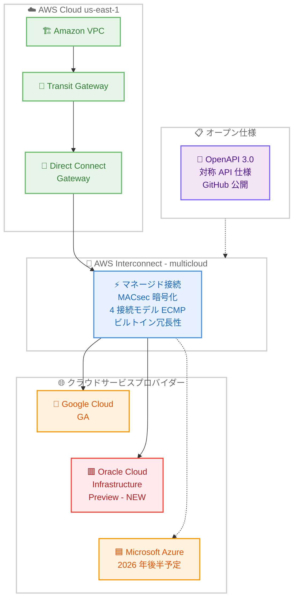
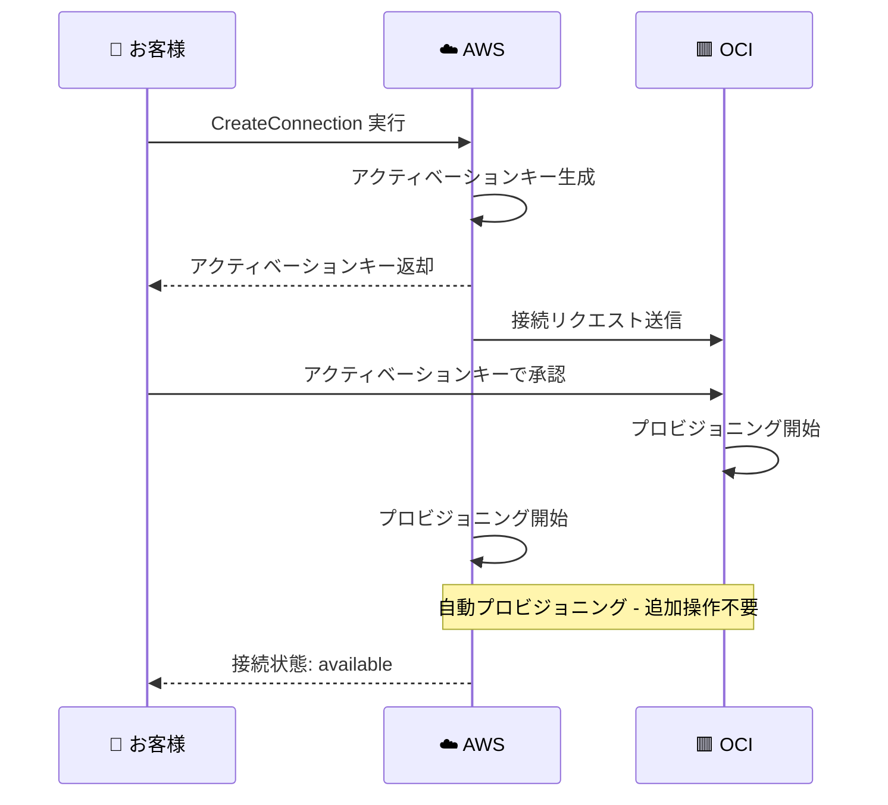

# AWS Interconnect - Oracle Cloud Infrastructure (OCI) とのマルチクラウド接続がパブリックプレビュー開始

**リリース日**: 2026 年 5 月 15 日
**サービス**: AWS Interconnect
**機能**: AWS Interconnect - multicloud with OCI (Oracle Cloud Infrastructure とのマルチクラウド接続)

[このアップデートのインフォグラフィックを見る](https://takech9203.github.io/aws-news-summary/20260515-aws-announces-AWS-interconnect-multicloud-oci-preview.html)

## 概要

AWS は AWS Interconnect - multicloud の Oracle Cloud Infrastructure (OCI) 対応をパブリックプレビューとして発表しました。これにより、AWS と OCI 間でシンプルかつ高速なプライベート接続を迅速にプロビジョニングできるようになります。OCI は Google Cloud (GA 済み) に続く 2 番目のクラウドプロバイダーパートナーとなり、Microsoft Azure も 2026 年後半に対応予定です。

AWS Interconnect は、クラウド間の接続方法を根本的に変革する業界初の専用マルチクラウド接続プロダクトです。GitHub 上で公開されたオープン仕様 (OpenAPI 3.0 ベースの対称 API) に基づいており、各クラウドプロバイダーが同じ API インターフェースを実装することで、一貫した接続体験を提供します。OCI がこのオープン仕様を採用したことで、AWS のお客様は AWS マネジメントコンソール、CLI、または API を使用して OCI へのプライベート接続を作成できます。

本プレビューは us-east-1 (バージニア北部) リージョンで利用可能です。AWS Interconnect は、専用帯域幅、ビルトイン冗長性 (4 接続モデルと ECMP ロードバランシング)、MACsec 暗号化を標準で提供し、エンタープライズグレードのマルチクラウド接続を実現します。

**アップデート前の課題**

- AWS と OCI 間の接続には「DIY」アプローチが必要で、サードパーティのネットワークプロバイダーや複雑なルーティング設定を手動で管理する必要があった
- クラウド間の専用プライベート接続を確立するために、物理的な Cross-Connect の注文、BGP ピアリングの設定、冗長構成の設計が必要だった
- マルチクラウド環境でのネットワーク管理が複雑化し、可視性の確保やスケーリングが困難だった
- AWS と OCI を組み合わせたハイブリッドアーキテクチャの構築に数週間から数カ月のリードタイムが発生していた

**アップデート後の改善**

- AWS コンソールから数分で OCI へのプライベート接続をプロビジョニング可能になった
- 物理ルーターの設定、Cross-Connect の注文、BGP ピアリングの管理が一切不要になった
- ビルトイン冗長性と MACsec 暗号化が標準で提供され、個別のセキュリティ・可用性設計が不要になった
- 帯域幅を AWS コンソールから動的に変更でき、ワークロードの需要に応じたスケーリングが容易になった

## アーキテクチャ図



AWS VPC から Transit Gateway、Direct Connect Gateway を経由し、AWS Interconnect - multicloud を通じて各クラウドプロバイダーに接続するアーキテクチャを示しています。OCI が新たにプレビュー対応した接続先として追加され (赤枠)、Google Cloud は GA 済み (実線)、Azure は 2026 年後半対応予定 (点線) です。

## サービスアップデートの詳細

### 主要機能

1. **OCI へのマネージドプライベート接続**
   - AWS と OCI 間に専用帯域幅を備えたプライベート接続を数分でプロビジョニング
   - パブリックインターネットを経由しないセキュアな通信
   - AWS マネジメントコンソール、CLI、API から操作可能

2. **オープン仕様に基づく統合**
   - GitHub 上で公開された OpenAPI 3.0 ベースの対称 API 仕様を使用
   - OCI がオープン仕様を採用したことで、AWS と同じ API インターフェースで接続を調整
   - クラウドプロバイダー間のピアツーピア連携を実現し、中央集権的なブローカーは不要

3. **ビルトイン最大冗長性**
   - 4 接続モデルと Equal-Cost Multi-Path (ECMP) ロードバランシングにより、計画メンテナンス中も少なくとも 1 つのリンクが稼働を維持
   - 2 つ以上の物理的に独立した施設に分散配置されたネットワーク機器を使用
   - デバイス、Cross-Connect、施設レベルでの単一障害点を排除

4. **MACsec 暗号化によるセキュリティ**
   - AWS ルーターとプロバイダールーター間のすべての物理接続で IEEE 802.1AE MAC Security (MACsec) 暗号化を使用
   - 暗号化セッションがアクティブな場合にのみトラフィックを転送
   - デフォルトで有効であり追加設定不要

5. **エラスティックな帯域幅スケーリング**
   - AWS コンソールから接続を再プロビジョニングすることなく帯域幅を動的に増減
   - ピークワークロード時のスケールアップとコスト管理のためのスケールダウンが容易
   - サポートへの問い合わせ不要

## 技術仕様

### 接続仕様

| 項目 | 詳細 |
|------|------|
| サービス名 | AWS Interconnect - multicloud |
| 新規対応 CSP | Oracle Cloud Infrastructure (OCI) |
| ステータス | パブリックプレビュー |
| 利用可能リージョン | us-east-1 (バージニア北部) |
| 接続方式 | L3 マネージドプライベート接続 |
| AWS 側アタッチポイント | Direct Connect Gateway |
| 暗号化 | MACsec (IEEE 802.1AE) - デフォルト有効 |
| 冗長性モデル | 4 接続モデル + ECMP ロードバランシング |
| プロビジョニング時間 | 数分 |
| 操作方法 | AWS マネジメントコンソール、CLI、API |
| オープン仕様 | OpenAPI 3.0 対称 API (GitHub 公開) |

### マルチ CSP 対応状況

| クラウドプロバイダー | ステータス | 対応リージョン |
|---------------------|-----------|---------------|
| Google Cloud | GA | us-east-1、us-west-1、us-west-2、eu-west-2、eu-central-1 |
| Oracle Cloud Infrastructure | プレビュー | us-east-1 |
| Microsoft Azure | 2026 年後半対応予定 | 未発表 |

### API 変更履歴

| 日付 | サービス | 変更内容 |
|------|----------|----------|
| 2026/04/13 | [Interconnect](https://awsapichanges.com/archive/changes/9b76a6-interconnect.html) | 13 new api methods - 初回リリース。マネージドプライベート接続サービスの全 API を追加 |

OCI プレビューに関連する新規 API 変更は確認されていません。既存の 13 API メソッド (CreateConnection、ListEnvironments 等) がそのまま OCI 接続にも適用されます。

### アクティベーションキーフロー



## 設定方法

### 前提条件

1. AWS アカウントが有効であること
2. Direct Connect Gateway が作成済みであること (または作成すること)
3. Oracle Cloud Infrastructure アカウントおよびテナンシ情報を取得済みであること
4. us-east-1 リージョンにリソースが配置されていること (プレビュー期間中)
5. 適切な IAM 権限 (interconnect:* アクション) が設定されていること

### 手順

#### ステップ 1: Direct Connect Gateway の準備

```bash
# Direct Connect Gateway の作成 (未作成の場合)
aws directconnect create-direct-connect-gateway \
  --direct-connect-gateway-name "multicloud-oci-dxgw" \
  --amazon-side-asn 64512
```

AWS Interconnect の AWS 側アタッチポイントとなる Direct Connect Gateway を作成します。既存の Direct Connect Gateway を使用することも可能です。Virtual Private Gateway、Transit Gateway、または Cloud WAN からこの Gateway に接続します。

#### ステップ 2: OCI 環境の確認

```bash
# OCI への接続環境を一覧表示
aws interconnect list-environments \
  --provider '{"cloudServiceProvider": "OCI"}' \
  --region us-east-1
```

OCI が提供する利用可能な環境の一覧を確認します。プレビュー期間中は us-east-1 のみ対応しています。各環境で利用可能な帯域幅オプションや接続状態も確認できます。

#### ステップ 3: OCI への接続を作成

```bash
# OCI への接続を作成
aws interconnect create-connection \
  --description "AWS to OCI - Production Workload" \
  --bandwidth "1Gbps" \
  --attach-point '{"directConnectGateway": "dxgw-xxxxxxxx"}' \
  --environment-id "env-oci-us-east1" \
  --remote-account '{"identifier": "ocid1.tenancy.oc1..example"}' \
  --tags '{"Environment": "Production", "CSP": "OCI"}' \
  --region us-east-1
```

指定した環境と帯域幅で OCI への接続を作成します。作成後、アクティベーションキーが生成され、OCI 側での承認に使用します。

#### ステップ 4: OCI 側での接続承認

```bash
# アクティベーションキーを取得
aws interconnect get-connection \
  --identifier "conn-xxxxxxxx" \
  --region us-east-1
```

AWS が生成したアクティベーションキーを取得し、OCI コンソールまたは OCI API で接続を承認します。アクティベーションページ URL は GetEnvironment API の `activationPageUrl` フィールドから取得できます。

#### ステップ 5: 接続状態の確認

```bash
# 接続状態を確認
aws interconnect get-connection \
  --identifier "conn-xxxxxxxx" \
  --region us-east-1
```

接続が `available` 状態になっていることを確認します。ビルトイン冗長性 (4 接続モデル) は自動的に構成されます。CloudWatch の帯域幅利用率メトリクスおよび Network Synthetic Monitor による遅延・パケットロス監視も利用可能です。

## メリット

### ビジネス面

- **Oracle ワークロードとの統合加速**: Oracle Database を OCI で稼働させながら、AWS のサービス (AI/ML、分析、ストレージ) と組み合わせたマルチクラウドアーキテクチャを迅速に構築可能
- **調達・構築期間の大幅短縮**: 従来数週間から数カ月かかっていたクラウド間接続の確立が数分で完了。プロジェクトのリードタイムを大幅に短縮
- **運用負荷の軽減**: 物理ネットワーク機器の管理、VLAN 設定、BGP セッション管理が完全にマネージドとなり、ネットワーク運用チームの負荷を低減

### 技術面

- **エンタープライズグレードのセキュリティ**: MACsec 暗号化がデフォルトで有効であり、追加設定なしでデータインモーションの保護を実現
- **最大冗長性の標準提供**: 4 接続モデルと ECMP により、デバイス障害・施設障害時もサービス継続。単一障害点なしのアーキテクチャ
- **統合監視**: CloudWatch Network Synthetic Monitor による遅延・パケットロス監視と、帯域幅利用率メトリクスが追加コストなしで利用可能

## デメリット・制約事項

### 制限事項

- プレビュー段階であり、本番ワークロードでの使用には注意が必要。SLA の適用有無を確認すること
- 利用可能リージョンは us-east-1 (バージニア北部) のみに限定されている
- OCI 側の対応リージョンもプレビュー段階では限定される可能性がある
- プレビュー期間中の料金体系が GA 時に変更される可能性がある

### 考慮すべき点

- GA 済みの Google Cloud 接続とは異なり、OCI 接続はプレビューであるため機能や可用性に制限がある可能性がある
- 既存の OCI FastConnect や AWS Direct Connect を使用したクロスクラウド接続からの移行は、プレビュー期間中ではなく GA 後に計画することを推奨
- OCI 側のテナンシ設定やネットワークポリシーとの整合性を事前に確認する必要がある
- 東京リージョンへの対応時期は未発表のため、日本のお客様はリージョン拡大の発表を注視すること

## ユースケース

### ユースケース 1: Oracle Database on OCI と AWS 分析基盤の統合

**シナリオ**: 企業が Oracle Database を OCI 上の Exadata で稼働させており、蓄積されたデータを AWS の Amazon Redshift や Amazon SageMaker で分析・ML モデル学習に活用したい。大量のデータを安全かつ低レイテンシーで転送する必要がある。

**実装例**:
```bash
# OCI Exadata 環境への接続を作成
aws interconnect create-connection \
  --description "OCI Exadata to AWS Analytics" \
  --bandwidth "10Gbps" \
  --attach-point '{"directConnectGateway": "dxgw-analytics"}' \
  --environment-id "env-oci-us-east1" \
  --remote-account '{"identifier": "ocid1.tenancy.oc1..analytics-tenant"}' \
  --tags '{"UseCase": "DataAnalytics", "Source": "OCI-Exadata"}' \
  --region us-east-1
```

**効果**: プライベート接続による安全なデータ転送で、Oracle Database のデータを AWS の分析サービスにリアルタイムに近い速度で連携。専用帯域幅により大規模なデータ移行バッチも安定して実行可能。

### ユースケース 2: マルチクラウド DR 構成

**シナリオ**: ミッションクリティカルなアプリケーションを AWS で稼働させつつ、クラウドプロバイダー障害に備えて OCI をディザスタリカバリ先として使用したい。特に Oracle Database を使用するワークロードでは OCI の Autonomous Database が DR 先として最適。

**実装例**:
```bash
# DR レプリケーション用接続
aws interconnect create-connection \
  --description "DR Replication AWS to OCI" \
  --bandwidth "5Gbps" \
  --attach-point '{"directConnectGateway": "dxgw-dr"}' \
  --environment-id "env-oci-us-east1" \
  --remote-account '{"identifier": "ocid1.tenancy.oc1..dr-tenant"}' \
  --tags '{"Purpose": "DR", "RPO": "15min", "RTO": "4hours"}' \
  --region us-east-1
```

**効果**: ビルトイン冗長性を備えた専用接続により DR レプリケーションの信頼性を確保。AWS 側の障害時に OCI へのフェイルオーバーを迅速に実行でき、ビジネス継続性を向上。

### ユースケース 3: 段階的な Oracle ワークロードのクラウド移行

**シナリオ**: オンプレミスの Oracle ワークロードをクラウドに移行する過程で、Oracle Database は OCI に、アプリケーション層は AWS に配置するハイブリッド構成を採用したい。移行期間中も安定したパフォーマンスを維持する必要がある。

**実装例**:
```bash
# 移行期間中のハイブリッド接続
aws interconnect create-connection \
  --description "Migration - App on AWS, DB on OCI" \
  --bandwidth "5Gbps" \
  --attach-point '{"directConnectGateway": "dxgw-migration"}' \
  --environment-id "env-oci-us-east1" \
  --remote-account '{"identifier": "ocid1.tenancy.oc1..migration"}' \
  --tags '{"Phase": "Migration", "Target": "HybridCloud"}' \
  --region us-east-1

# 移行完了後に帯域幅を調整
aws interconnect update-connection \
  --identifier "conn-xxxxxxxx" \
  --bandwidth "2Gbps"
```

**効果**: アプリケーション層と DB 層を最適なクラウドに配置しながら、低レイテンシーのプライベート接続で連携。移行完了後は帯域幅を動的に調整してコストを最適化可能。

## 料金

プレビュー段階のため、OCI 接続に関する具体的な料金は発表されていません。AWS Interconnect - multicloud の一般的な料金構造は以下のとおりです。

### 料金構造

| 項目 | 説明 |
|------|------|
| 帯域幅ベースの料金 | 選択した帯域幅に応じた月額料金 |
| 地理的範囲ベースの料金 | ローカル / リージョナル / グローバルなど接続範囲に応じた課金 |
| 無料枠 | リージョンごとに 500Mbps x 1 本が無料 (2026 年 5 月から提供中) |

プレビュー期間中の料金体系や GA 時の料金については、AWS の公式ドキュメントまたは AWS 営業担当にお問い合わせください。

## 利用可能リージョン

- **OCI 接続 (プレビュー)**: us-east-1 (バージニア北部) のみ
- **Google Cloud 接続 (GA)**: us-east-1、us-west-1、us-west-2、eu-west-2、eu-central-1

今後のリージョン拡大については、AWS の公式ドキュメントを参照してください。

## 関連サービス・機能

- **AWS Interconnect - multicloud (Google Cloud GA)**: 2026 年 4 月 14 日に GA。Google Cloud への接続は 5 リージョンで利用可能
- **AWS Interconnect - last mile**: Lumen をパートナーとしたブランチオフィス・データセンターから AWS へのラストマイル接続サービス
- **AWS Direct Connect Gateway**: Interconnect の AWS 側アタッチポイント。既存の Direct Connect インフラとの統合が可能
- **AWS Transit Gateway / Cloud WAN**: 複数 VPC の集約やグローバルネットワークの構築に使用。Cloud WAN では任意のリージョンから任意の Interconnect にグローバルにアクセス可能
- **OCI FastConnect**: OCI 側の専用接続サービス。AWS Interconnect 導入前は FastConnect と Direct Connect を組み合わせた手動構成が必要だった

## 参考リンク

- [インフォグラフィック](https://takech9203.github.io/aws-news-summary/20260515-aws-announces-AWS-interconnect-multicloud-oci-preview.html)
- [公式発表 (What's New)](https://aws.amazon.com/about-aws/whats-new/2026/05/aws-announces-AWS-interconnect-multicloud-oci-preview/)
- [AWS Interconnect ドキュメント](https://docs.aws.amazon.com/interconnect/latest/userguide/what-is-interconnect.html)
- [AWS Interconnect オープン仕様 (GitHub)](https://github.com/aws/Interconnect)
- [AWS Interconnect API Changes](https://awsapichanges.com/archive/changes/9b76a6-interconnect.html)
- [AWS Interconnect - multicloud GA レポート](./2026-04-14-aws-announces-ga-AWS-interconnect-multicloud.md)

## まとめ

AWS Interconnect - multicloud の OCI 対応パブリックプレビューにより、AWS と Oracle Cloud Infrastructure 間のプライベート接続がマネージドサービスとして利用可能になりました。Oracle Database を OCI で運用しながら AWS の幅広いサービスと組み合わせるマルチクラウドアーキテクチャを検討している企業にとって、接続の複雑さを大幅に解消する重要なアップデートです。現時点では us-east-1 のプレビューですが、GA に向けてリージョン拡大が見込まれるため、プレビュー期間中に接続性の検証や移行計画の策定を進めることを推奨します。
