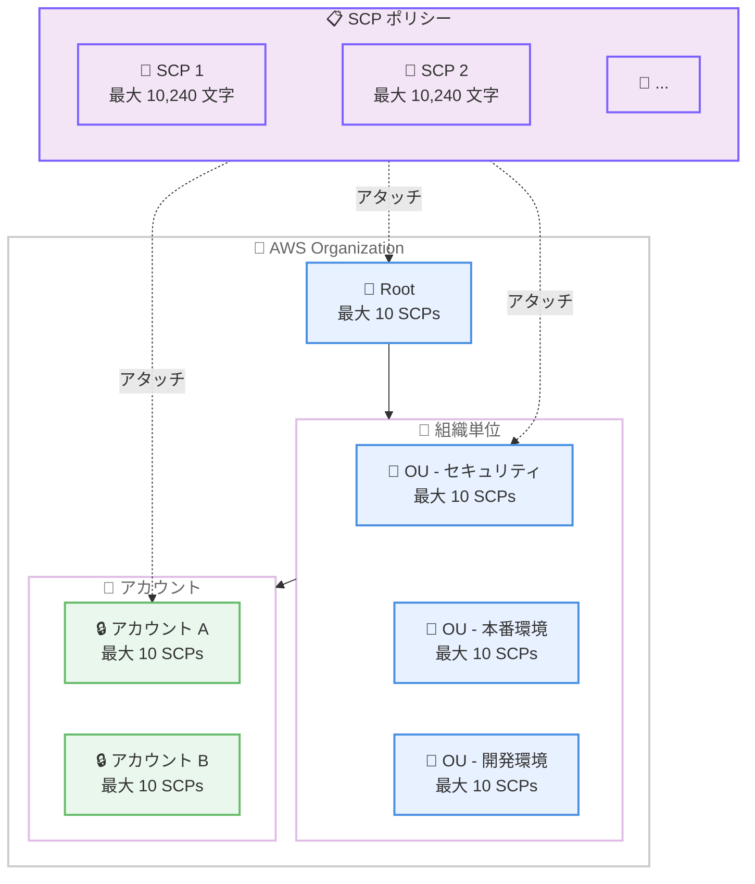

# AWS Organizations - サービスコントロールポリシー (SCP) クォータの引き上げ

**リリース日**: 2026年5月15日
**サービス**: AWS Organizations
**機能**: SCP クォータの引き上げ (ノードあたりの最大数およびポリシーサイズ)

📊 [このアップデートのインフォグラフィックを見る](https://takech9203.github.io/aws-news-summary/20260515-aws-organizations-increased-scp-quotas.html)

## 概要

AWS Organizations において、サービスコントロールポリシー (SCP) のクォータが大幅に引き上げられた。具体的には、ノード (ルート、OU、アカウント) あたりのアタッチ可能な SCP 数が 5 から 10 に倍増し、SCP のポリシーサイズ上限も 5,120 文字から 10,240 文字に倍増した。

この変更により、組織全体のセキュリティガバナンスをより細かい粒度で管理できるようになる。これまでは SCP の数やサイズの制約により、複雑なマルチアカウント環境でポリシーを統合したり、条件付きのきめ細かなアクセス制御を諦めざるを得ないケースがあったが、今回の引き上げによりこれらの課題が解消される。

この変更はすべての AWS Organizations ユーザーに自動的に適用され、追加の設定やオプトイン操作は不要である。

**アップデート前の課題**

- ノードあたり最大 5 つの SCP しかアタッチできず、複数のセキュリティ要件を個別のポリシーに分離する運用が困難だった
- SCP サイズが 5,120 文字に制限されており、複雑な条件 (Condition) や多数の Action を含むポリシーを記述できなかった
- クォータ制限を回避するためにポリシーの統合や簡略化を強いられ、可読性やメンテナンス性が低下していた

**アップデート後の改善**

- ノードあたり最大 10 の SCP をアタッチ可能になり、責任分離に基づいたポリシー設計が容易になった
- SCP サイズが 10,240 文字に拡大し、より詳細な条件やリソースパターンを含むポリシーを記述可能になった
- 既存の組織に自動適用されるため、移行作業や追加コストなしで即座に恩恵を受けられる

## アーキテクチャ図



AWS Organizations の階層構造における SCP のアタッチモデル。各ノード (ルート、OU、アカウント) に最大 10 の SCP をアタッチでき、各 SCP は最大 10,240 文字まで記述可能。

## サービスアップデートの詳細

### 主要機能

1. **ノードあたりの SCP アタッチ数の倍増**
   - ルート、OU、アカウントの各ノードにアタッチ可能な SCP の最大数が 5 から 10 に増加
   - セキュリティチーム、コンプライアンスチーム、ネットワークチームなど、各チームが個別の SCP を管理する運用が可能に
   - ポリシーの責任分離が容易になり、変更管理の複雑さが軽減

2. **SCP ポリシーサイズの倍増**
   - 1 つの SCP に記述可能な最大文字数が 5,120 から 10,240 に増加
   - 複数の条件キー (Condition) を組み合わせた高度なアクセス制御ルールを 1 つのポリシー内に記述可能
   - リソースパターンや Action の列挙が多い場合でも、ポリシーを分割する必要がなくなった

3. **自動適用**
   - すべての既存組織に自動的に適用
   - オプトインや設定変更は不要
   - すべての商用リージョン、GovCloud、中国リージョンで利用可能

## 技術仕様

### クォータ比較

| 項目 | 変更前 | 変更後 | 増加率 |
|------|--------|--------|--------|
| ノードあたりの最大 SCP 数 | 5 | 10 | 2 倍 |
| SCP の最大サイズ | 5,120 文字 | 10,240 文字 | 2 倍 |
| 組織あたりの最大 SCP 数 | 変更なし | 変更なし | - |

### SCP の評価ロジック

SCP は継承ベースで評価される。ルートにアタッチされた SCP はすべての OU とアカウントに継承され、各レベルでアタッチされた SCP が追加で評価される。今回のクォータ引き上げにより、各レベルでより多くのポリシーを配置できるが、評価の仕組み自体に変更はない。

### API 変更履歴

今回のアップデートに関連する API の変更は確認されなかった。既存の Organizations API (AttachPolicy、CreatePolicy、UpdatePolicy など) はそのまま利用可能で、新しいクォータ値は自動的に反映される。

### SCP ポリシー構文例

```json
{
  "Version": "2012-10-17",
  "Statement": [
    {
      "Sid": "DenyUnencryptedS3Uploads",
      "Effect": "Deny",
      "Action": "s3:PutObject",
      "Resource": "*",
      "Condition": {
        "StringNotEquals": {
          "s3:x-amz-server-side-encryption": "aws:kms"
        }
      }
    },
    {
      "Sid": "DenyNonApprovedRegions",
      "Effect": "Deny",
      "NotAction": [
        "iam:*",
        "organizations:*",
        "route53:*",
        "support:*",
        "sts:*"
      ],
      "Resource": "*",
      "Condition": {
        "StringNotEquals": {
          "aws:RequestedRegion": [
            "ap-northeast-1",
            "us-east-1",
            "eu-west-1"
          ]
        }
      }
    }
  ]
}
```

## 設定方法

### 前提条件

1. AWS Organizations が有効化されていること
2. Organizations の管理アカウントへのアクセス権限があること
3. SCP 機能が有効化されていること (Organizations のポリシータイプで「サービスコントロールポリシー」が有効)

### 手順

#### ステップ 1: 現在の SCP 状況の確認

```bash
# 特定の OU にアタッチされている SCP を一覧表示
aws organizations list-policies-for-target \
  --target-id ou-xxxx-xxxxxxxx \
  --filter SERVICE_CONTROL_POLICY
```

対象の OU やアカウントに現在アタッチされている SCP を確認する。新しいクォータにより最大 10 までアタッチ可能。

#### ステップ 2: 新しい SCP の作成

```bash
# 新しい SCP を作成
aws organizations create-policy \
  --name "DenyUnencryptedStorage" \
  --description "Deny unencrypted storage operations" \
  --type SERVICE_CONTROL_POLICY \
  --content file://scp-deny-unencrypted.json
```

最大 10,240 文字までのポリシードキュメントを含む SCP を作成する。

#### ステップ 3: SCP のアタッチ

```bash
# SCP を OU またはアカウントにアタッチ
aws organizations attach-policy \
  --policy-id p-xxxxxxxxxx \
  --target-id ou-xxxx-xxxxxxxx
```

作成した SCP を対象のノードにアタッチする。1 ノードあたり最大 10 の SCP をアタッチ可能。

## メリット

### ビジネス面

- **ガバナンスの強化**: より細かい粒度でセキュリティポリシーを適用でき、コンプライアンス要件への対応力が向上
- **運用効率の改善**: ポリシーの統合作業が不要になり、チーム間での責任分離が明確に
- **スケーラビリティ**: 組織の成長に伴うセキュリティ要件の増加に対応しやすくなる

### 技術面

- **ポリシー設計の柔軟性**: 機能別にポリシーを分離でき、変更時の影響範囲を限定可能
- **可読性の向上**: ポリシーサイズの拡大により、コメントや詳細な条件を含めた分かりやすいポリシーを記述可能
- **Infrastructure as Code との親和性**: Terraform や CloudFormation でのポリシー管理が容易に (1 ポリシー = 1 目的の設計が実現しやすい)

## デメリット・制約事項

### 制限事項

- 組織あたりの SCP 総数の上限は変更されていない (デフォルト 2,048)
- SCP は許可を付与するものではなく、許可の境界を設定するものという基本原則は変わらない
- SCP は管理アカウントには適用されない (この制約は従来通り)

### 考慮すべき点

- SCP 数の増加に伴い、ポリシー評価の複雑さが増す可能性がある。どの SCP がどのアクションを制限しているか把握するための運用設計が重要
- 多数の SCP をアタッチする場合、IAM Access Analyzer や Organizations のポリシーシミュレーターを活用した検証が推奨される
- SCP の継承チェーンが深くなるほど、意図しないアクセス拒否のトラブルシューティングが複雑になる

## ユースケース

### ユースケース 1: チーム別ポリシー管理

**シナリオ**: 大規模組織で、セキュリティチーム、ネットワークチーム、データ保護チームがそれぞれ独自の SCP を管理する必要がある場合。

**実装例**:
```
OU: Production
├── SCP 1: セキュリティチーム - リージョン制限
├── SCP 2: セキュリティチーム - 暗号化要件
├── SCP 3: ネットワークチーム - VPC 制約
├── SCP 4: ネットワークチーム - Direct Connect 保護
├── SCP 5: データ保護チーム - S3 制限
├── SCP 6: データ保護チーム - RDS 制限
├── SCP 7: コンプライアンス - 監査ログ保護
├── SCP 8: コンプライアンス - タグ付け要件
├── SCP 9: コスト管理 - 高額インスタンス制限
└── SCP 10: 緊急対応 - インシデント時の追加制限
```

**効果**: 各チームが独立してポリシーを管理・更新でき、変更時の承認プロセスが明確になる

### ユースケース 2: コンプライアンスフレームワーク別の分離

**シナリオ**: PCI DSS、HIPAA、SOC 2 など複数のコンプライアンスフレームワークに対応する必要がある環境。

**実装例**:
```json
{
  "Version": "2012-10-17",
  "Statement": [
    {
      "Sid": "PCIDSSRequirement3",
      "Effect": "Deny",
      "Action": [
        "s3:PutBucketPublicAccessBlock",
        "s3:DeleteBucketPolicy"
      ],
      "Resource": "arn:aws:s3:::pci-*",
      "Condition": {
        "StringNotLike": {
          "aws:PrincipalArn": "arn:aws:iam::*:role/SecurityAdmin"
        }
      }
    }
  ]
}
```

**効果**: フレームワークごとに SCP を分離することで、監査時の対応が容易になり、各フレームワークの要件変更時の影響範囲を限定できる

### ユースケース 3: 段階的セキュリティ強化

**シナリオ**: 新しいセキュリティポリシーを段階的に導入する際、既存ポリシーを変更せず新しい SCP として追加する。

**実装例**:
```bash
# Phase 1: 監視のみ (CloudTrail ログで違反を確認)
# Phase 2: 新しい SCP を追加して制限を適用
aws organizations attach-policy \
  --policy-id p-new-restriction \
  --target-id ou-production

# ロールバックが必要な場合は SCP をデタッチするだけ
aws organizations detach-policy \
  --policy-id p-new-restriction \
  --target-id ou-production
```

**効果**: 既存のポリシーに影響を与えずに新しい制限を追加でき、問題発生時のロールバックが容易

## 料金

AWS Organizations および SCP の利用に追加料金は発生しない。今回のクォータ引き上げも無料で自動的に適用される。

| 項目 | 料金 |
|------|------|
| AWS Organizations | 無料 |
| SCP の作成・管理 | 無料 |
| クォータ引き上げ | 無料 (自動適用) |

## 利用可能リージョン

以下のすべてのリージョンで利用可能。

- すべての商用 AWS リージョン
- AWS GovCloud (US) リージョン
- 中国リージョン (北京、寧夏)

追加のオプトインやリクエストは不要で、すべての組織に自動適用される。

## 関連サービス・機能

- **AWS IAM Access Analyzer**: SCP によるアクセス制御の検証と未使用アクセスの特定に活用
- **AWS CloudTrail**: SCP によって拒否されたアクション (AccessDenied) のログを記録・分析
- **AWS Control Tower**: Organizations と SCP を活用したマルチアカウントガバナンスの自動化
- **Resource Control Policies (RCP)**: SCP と補完的に機能するリソースベースのポリシー制御
- **AWS Config**: 組織全体の設定コンプライアンスの継続的な評価

## 参考リンク

- 📊 [インフォグラフィック](https://takech9203.github.io/aws-news-summary/20260515-aws-organizations-increased-scp-quotas.html)
- [公式発表 (What's New)](https://aws.amazon.com/about-aws/whats-new/2026/05/aws-organizations-increased-scp-quotas/)
- [AWS Organizations ユーザーガイド - クォータ](https://docs.aws.amazon.com/organizations/latest/userguide/orgs_reference_limits.html)
- [AWS Organizations ユーザーガイド - SCP](https://docs.aws.amazon.com/organizations/latest/userguide/orgs_manage_policies_scps.html)
- [AWS Organizations 料金ページ](https://aws.amazon.com/organizations/pricing/)

## まとめ

今回の SCP クォータ引き上げは、大規模なマルチアカウント環境を運用する組織にとって実用的な改善である。特に、複数のチームやコンプライアンスフレームワークに対応するためにポリシーの分離が求められる環境では、運用の柔軟性が大きく向上する。自動適用のため即座に利用開始でき、既存の運用フローを変更する必要はない。既存の SCP 設計を見直し、より管理しやすい粒度にポリシーを分割することを推奨する。
