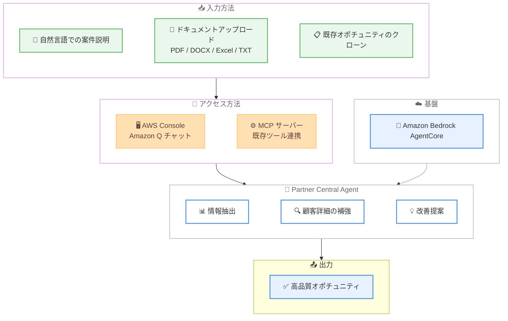

# AWS Partner Central - エージェントによるオポチュニティ作成の高速化

**リリース日**: 2026年5月15日
**サービス**: AWS Partner Central
**機能**: Partner Central agents - 自然言語によるオポチュニティ作成

📊 [このアップデートのインフォグラフィックを見る](https://takech9203.github.io/aws-news-summary/20260515-aws-partner-central-agents-oppo.html)

## 概要

AWS は、AWS Partner Central agents に自然言語会話によるオポチュニティ作成の高速化機能を追加したことを発表した。AWS Partner Central agents は 2026 年 3 月 16 日にリリースされた Amazon Bedrock AgentCore 上に構築された AI パワード機能であり、パートナーがパイプラインインサイトの表示、ネクストステップの推奨による案件推進、ファンディング機会の特定を支援する。

今回のアップデートにより、パートナーはマルチステップフォームへの入力ではなく、短い会話を通じてオポチュニティを作成できるようになった。パートナーセールスチームはデータ入力に費やす時間を削減し、販売活動により多くの時間を充てることが可能になる。

パートナーは自然言語での案件説明、ミーティングノート・提案書・通話記録 (PDF、DOCX、Excel、TXT) のアップロード、または既存オポチュニティのクローンにより、オポチュニティを作成できる。エージェントが情報を抽出し、顧客詳細を補強し、不足コンテキストの追加・フィールド値の修正・ビジネス課題ステートメントの強化などの改善を提案する。

**アップデート前の課題**

- パートナーセールスチームがオポチュニティ作成のためにマルチステップフォームを手動で入力する必要があった
- データ入力に多くの時間を費やし、実際の販売活動に充てる時間が限られていた
- フォーム入力時に情報の不足やフィールド値の誤りが発生しやすく、パイプラインの品質が低下していた
- 既存ツールと Partner Central の間でコンテキストスイッチが必要だった

**アップデート後の改善**

- 自然言語会話によりオポチュニティを短時間で作成可能になった
- ドキュメントアップロードによる情報の自動抽出が可能になった
- エージェントが改善提案を行い、より高品質なオポチュニティを提出できるようになった
- Model Context Protocol (MCP) を通じて既存ツールからプログラマティックにオポチュニティを作成可能になった
- Amazon Q チャットを通じた AWS コンソール内でのアクセスが可能になった

## アーキテクチャ図



パートナーが 3 つの入力方法のいずれかでオポチュニティ情報を提供し、エージェントが情報抽出・補強・改善提案を行った上で高品質なオポチュニティを作成するフローを示している。

## サービスアップデートの詳細

### 主要機能

1. **自然言語によるオポチュニティ作成**
   - 短い会話を通じてオポチュニティを作成可能
   - マルチステップフォームへの入力が不要
   - 案件の説明を自然言語で入力するだけで必要フィールドが自動的に生成される

2. **ドキュメントからの情報自動抽出**
   - ミーティングノート、提案書、通話記録をアップロード可能
   - サポートされるファイル形式: PDF、DOCX、Excel、TXT
   - アップロードされたドキュメントからエージェントが関連情報を自動抽出

3. **既存オポチュニティのクローン**
   - 類似の既存オポチュニティをベースに新規作成可能
   - 反復的な入力作業の削減

4. **インテリジェントな情報補強と改善提案**
   - 顧客詳細の自動補強
   - 不足コンテキストの追加提案
   - フィールド値の修正提案
   - ビジネス課題ステートメントの強化提案

5. **マルチチャネルアクセス**
   - AWS コンソール内の Amazon Q チャットから利用可能
   - Model Context Protocol (MCP) を通じたプログラマティックアクセス
   - 既存の CRM ツールやセールスツールからの直接利用

## 技術仕様

### 基盤技術

| 項目 | 詳細 |
|------|------|
| AI 基盤 | Amazon Bedrock AgentCore |
| アクセス方法 | Amazon Q チャット、MCP サーバー |
| サポートファイル形式 | PDF、DOCX、Excel、TXT |
| 統合プロトコル | Model Context Protocol (MCP) |

### API 変更履歴

| 日付 | サービス | 変更内容 |
|------|----------|----------|
| 2026/05/15 | [Partner Central Selling API](https://awsapichanges.com/archive/changes/994b6d-partnercentral-selling.html) | 5 updated methods - ExpectedContractDuration フィールドの追加による TCV 取得の有効化 |

### API 変更の詳細

今回の API 変更では、以下の 5 つのメソッドに `ExpectedContractDuration` フィールドが追加された。

| メソッド名 | 変更内容 |
|-----------|----------|
| `CreateOpportunity` | Project に ExpectedContractDuration 追加 |
| `GetOpportunity` | レスポンスに ExpectedContractDuration 追加 |
| `GetResourceSnapshot` | OpportunitySummary に ExpectedContractDuration 追加 |
| `ListOpportunities` | OpportunitySummaries に ExpectedContractDuration 追加 |
| `UpdateOpportunity` | Project に ExpectedContractDuration 追加 |

`ExpectedContractDuration` は契約期間の見込みを表し、`Term` (月単位) と `Value` (数値) で構成される。これにより、オポチュニティの品質向上と下流の収益アトリビューション改善が実現される。

## 設定方法

### 前提条件

1. AWS パートナーとして登録済みであること
2. AWS Partner Central の新しいエクスペリエンスに移行済みであること
3. AWS コンソールへのアクセス権限があること

### 手順

#### ステップ 1: AWS コンソールからの利用

AWS コンソールにログインし、Partner Central のオポチュニティセクションにアクセスする。Amazon Q チャットインターフェースからエージェントに自然言語で案件を説明する。

#### ステップ 2: MCP サーバー経由での利用

既存の CRM やセールスツールから MCP サーバーを通じてプログラマティックにオポチュニティを作成する。MCP サーバーのセットアップガイドに従い、ツール連携を構成する。

```bash
# MCP サーバーのドキュメント参照
# https://docs.aws.amazon.com/partner-central/latest/APIReference/partner-central-mcp-server.html
```

上記のドキュメントに MCP サーバーの接続方法と設定手順が記載されている。

#### ステップ 3: ドキュメントアップロードによる作成

エージェントとの会話中にミーティングノートや提案書をアップロードし、情報を自動抽出させる。エージェントからの改善提案を確認し、必要に応じて修正してからオポチュニティを提出する。

## メリット

### ビジネス面

- **セールスサイクルの短縮**: データ入力作業の削減により、パートナーセールスチームが販売活動に集中できる
- **パイプライン品質の向上**: エージェントの改善提案により、高品質なオポチュニティが提出され、パイプラインの品質が向上する
- **ファンディング機会の最大化**: 適格なファンディング機会の自動識別により、収益機会を逃さない

### 技術面

- **MCP 統合**: Model Context Protocol により、既存ツールからのシームレスな連携が実現
- **マルチフォーマット対応**: PDF、DOCX、Excel、TXT の複数形式からの情報自動抽出
- **Amazon Bedrock AgentCore 基盤**: エンタープライズグレードの AI 基盤上で動作し、スケーラビリティと信頼性を確保

## デメリット・制約事項

### 制限事項

- サポートされるファイル形式が PDF、DOCX、Excel、TXT に限定される
- エージェントの改善提案は推奨であり、最終的にはパートナーが内容を確認して承認する必要がある
- MCP サーバー連携にはセットアップ作業が必要

### 考慮すべき点

- エージェントが抽出した情報の正確性を確認するプロセスが推奨される
- 新しい AWS Partner Central エクスペリエンスへの移行が前提条件となる
- 自然言語入力の品質がオポチュニティの品質に影響する可能性がある

## ユースケース

### ユースケース 1: ミーティング後の迅速なオポチュニティ登録

**シナリオ**: パートナーセールス担当者が顧客ミーティング終了後、会議のトランスクリプトをアップロードして即座にオポチュニティを作成する。

**効果**: 従来はミーティング後に手動でフォームを入力するのに 30 分以上かかっていた作業が、ドキュメントアップロードと短い会話で数分に短縮される。

### ユースケース 2: CRM からのプログラマティックなオポチュニティ連携

**シナリオ**: パートナーの CRM システムから MCP サーバーを通じて AWS Partner Central にオポチュニティを自動作成する。セールスチームはコンテキストスイッチなしに既存ツール内で作業を完結できる。

**効果**: ツール間の切り替えが不要になり、データの一貫性が保たれる。セールスチームの生産性が向上し、オポチュニティの登録漏れが減少する。

### ユースケース 3: 大量オポチュニティの一括品質改善

**シナリオ**: パートナーマネージャーがパイプライン内の既存オポチュニティについて、エージェントに品質改善の提案を求める。ビジネス課題ステートメントの強化や不足フィールドの補完により、パイプライン全体の品質を向上させる。

**効果**: パイプラインの品質が体系的に改善され、AWS との Co-Sell 案件の承認率が向上する。

## 料金

AWS Partner Central agents の利用に関する追加料金は、公式発表では明示されていない。AWS Partner Central の機能として提供されるため、パートナー登録が前提条件となる。最新の料金情報については AWS の公式ドキュメントを確認することを推奨する。

## 利用可能リージョン

すべての商用 AWS リージョンで利用可能。

## 関連サービス・機能

- **Amazon Bedrock AgentCore**: Partner Central agents の AI 基盤として使用されるエージェントフレームワーク
- **Amazon Q**: AWS コンソール内のチャットインターフェースとして、エージェントへのアクセスポイントを提供
- **Model Context Protocol (MCP)**: 外部ツールとの統合プロトコルとして、既存セールスツールからのプログラマティックアクセスを実現
- **Partner Central Selling API**: オポチュニティの CRUD 操作を提供する API (今回 ExpectedContractDuration フィールドが追加)

## 参考リンク

- 📊 [インフォグラフィック](https://takech9203.github.io/aws-news-summary/20260515-aws-partner-central-agents-oppo.html)
- [公式発表 (What's New)](https://aws.amazon.com/about-aws/whats-new/2026/05/aws-partner-central-agents-oppo)
- [AWS Blog - Introducing AWS Partner Central Agents](https://aws.amazon.com/blogs/apn/introducing-aws-partner-central-agents/)
- [エージェントガイド](https://docs.aws.amazon.com/partner-central/latest/sales-guide/partner-cosell-agent.html)
- [MCP サーバーガイド](https://docs.aws.amazon.com/partner-central/latest/APIReference/partner-central-mcp-server.html)
- [AWS Partner Central](https://aws.amazon.com/partners/partner-central/)
- [API 変更履歴](https://awsapichanges.com/archive/changes/994b6d-partnercentral-selling.html)

## まとめ

AWS Partner Central agents のオポチュニティ作成高速化は、パートナーセールスチームのデータ入力作業を大幅に削減し、販売活動への集中を可能にする重要なアップデートである。自然言語会話、ドキュメントアップロード、MCP 連携の 3 つのアクセス方法により、パートナーの既存ワークフローに自然に組み込むことができる。パートナーは今すぐ AWS コンソールの Partner Central からこの機能を試用し、セールスプロセスの効率化を検討することを推奨する。
