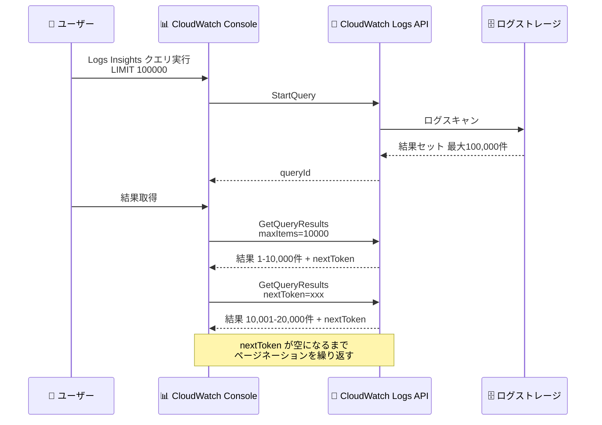

# Amazon CloudWatch Logs - クエリ結果上限の引き上げ

**リリース日**: 2026年5月15日
**サービス**: Amazon CloudWatch Logs
**機能**: Logs Insights クエリ結果上限の 100,000 件への拡大

📊 [このアップデートのインフォグラフィックを見る](https://takech9203.github.io/aws-news-summary/20260515-cloudwatch-logs-query-results.html)

## 概要

Amazon CloudWatch Logs Insights のクエリ結果取得上限が、従来の 10,000 件から 100,000 件へと 10 倍に拡大された。ユーザーはクエリ内で `LIMIT` コマンドを使用して取得件数を指定できる。

これまでは 10,000 件の制限があったため、大量のログデータを分析する際にクエリを小さな時間範囲に分割して複数回実行する必要があった。今回のアップデートにより、1 回のクエリでより大きな結果セットを取得でき、パターン分析、可視化、エクスポートなどの既存機能を 100,000 件のフルセットに対して適用できるようになった。

さらに、`GetQueryResults` API にページネーション機能が追加され、1 回の API 呼び出しで最大 10,000 件の結果とともに次のページを取得するためのトークンが返されるようになった。これにより、プログラムから大量のクエリ結果を効率的に処理できる。

**アップデート前の課題**

- クエリ結果の取得上限が 10,000 件に制限されていた
- 10,000 件を超える結果が必要な場合、クエリを小さな時間範囲に分割して複数回実行する必要があった
- 分割したクエリ結果を手動で統合する運用負荷が発生していた
- `GetQueryResults` API にページネーション機能がなく、大量データのプログラム的な取得が困難だった

**アップデート後の改善**

- クエリ結果を最大 100,000 件まで 1 回のクエリで取得可能になった
- パターン分析、可視化、エクスポート機能を 100,000 件のフルセットに適用できるようになった
- `GetQueryResults` API がページネーションをサポートし、`nextToken` と `maxItems` パラメータで効率的なデータ取得が可能になった
- クエリ分割の運用負荷が大幅に削減された

## アーキテクチャ図



CloudWatch Logs Insights のクエリ実行フローとページネーションによる結果取得の流れを示す。1 回のクエリで最大 100,000 件の結果を取得し、`GetQueryResults` API のページネーションで 10,000 件ずつ取得する。

## サービスアップデートの詳細

### 主要機能

1. **クエリ結果上限の 10 倍拡大**
   - 従来の 10,000 件から 100,000 件に上限を拡大
   - `LIMIT` コマンドでクエリ内から取得件数を指定可能
   - 既存のクエリ構文との完全な互換性を維持

2. **GetQueryResults API のページネーションサポート**
   - 1 回の API 呼び出しで最大 10,000 件を返却
   - `nextToken` パラメータで次のページを取得
   - `maxItems` パラメータで 1 ページあたりの件数を制御
   - プログラムからの大量データ取得が容易に

3. **既存機能との統合**
   - パターン検出機能が 100,000 件のフルセットに対応
   - 可視化機能が拡大された結果セットで利用可能
   - エクスポート機能が全件に対して動作

## 技術仕様

### クエリ結果上限

| 項目 | 変更前 | 変更後 |
|------|--------|--------|
| クエリ結果上限 | 10,000 件 | 100,000 件 |
| API 1 回あたりの結果数 | 全件一括 | 最大 10,000 件/ページ |
| ページネーション | 非対応 | `nextToken` / `maxItems` 対応 |

### API 変更履歴

| 日付 | サービス | 変更内容 |
|------|----------|----------|
| 2026/04/24 | [Amazon CloudWatch Logs](https://awsapichanges.com/archive/changes/435c9a-logs.html) | 1 updated api method - GetQueryResults API に nextToken と maxItems パラメータを追加 |

### クエリ構文

```
fields @timestamp, @message
| filter @message like /ERROR/
| sort @timestamp desc
| limit 100000
```

### GetQueryResults API パラメータ

```json
{
  "queryId": "string",
  "nextToken": "string",
  "maxItems": 10000
}
```

レスポンスには `nextToken` が含まれ、次のページが存在する場合に値が設定される。

## 設定方法

### 前提条件

1. CloudWatch Logs へのアクセス権限を持つ IAM ユーザーまたはロール
2. `logs:GetQueryResults`、`logs:StartQuery` の IAM アクション許可
3. 対象のロググループへの読み取り権限

### 手順

#### ステップ 1: CloudWatch コンソールでのクエリ実行

CloudWatch コンソールの Logs Insights 画面でクエリを入力する。

```
fields @timestamp, @message, @logStream
| filter @message like /ERROR/
| sort @timestamp desc
| limit 50000
```

`LIMIT` コマンドに 10,000 を超える値を指定することで、拡大された上限を活用できる。

#### ステップ 2: AWS CLI でのクエリ実行

```bash
# クエリの開始
aws logs start-query \
  --log-group-name "/aws/lambda/my-function" \
  --start-time $(date -d '24 hours ago' +%s) \
  --end-time $(date +%s) \
  --query-string 'fields @timestamp, @message | limit 100000'
```

`start-query` コマンドでクエリを開始し、返される `queryId` を使用して結果を取得する。

#### ステップ 3: ページネーションを使用した結果取得

```bash
# 最初のページを取得
aws logs get-query-results \
  --query-id "your-query-id" \
  --max-items 10000

# nextToken を使用して次のページを取得
aws logs get-query-results \
  --query-id "your-query-id" \
  --next-token "returned-token" \
  --max-items 10000
```

`nextToken` が空になるまでページネーションを繰り返すことで、全結果を取得できる。

## メリット

### ビジネス面

- **運用効率の向上**: クエリ分割の手間が不要になり、ログ分析にかかる時間を大幅に短縮
- **インシデント対応の迅速化**: 障害時に大量のログを 1 回のクエリで分析でき、原因特定までの時間を短縮
- **データ分析精度の向上**: より多くのデータポイントを一括で分析できるため、パターン検出や傾向分析の精度が向上

### 技術面

- **API ページネーション**: 大量データの効率的なプログラム的取得が可能になり、自動化パイプラインに統合しやすくなった
- **既存ワークフローとの互換性**: 既存のクエリ構文がそのまま使用でき、`LIMIT` 値を変更するだけで新機能を活用可能
- **スケーラビリティ**: 10 倍のデータ量に対してパターン分析や可視化が実行でき、大規模環境での分析が容易に

## デメリット・制約事項

### 制限事項

- クエリ結果の上限は 100,000 件であり、これを超える結果が必要な場合は引き続きクエリ分割が必要
- ページネーション 1 回あたりの最大取得件数は 10,000 件
- クエリのタイムアウト制限 (既存の制限) は変更されていない

### 考慮すべき点

- 大量の結果を取得するクエリはスキャンするデータ量が増加するため、コストへの影響を考慮する必要がある
- ページネーションを使用する場合、全ページの取得完了までにかかる時間を考慮したアプリケーション設計が必要
- 既存のスクリプトで固定の `LIMIT 10000` を使用している場合、必要に応じて値を更新する

## ユースケース

### ユースケース 1: 大規模障害時のログ分析

**シナリオ**: 本番環境で大規模障害が発生し、数万件のエラーログを一括分析して根本原因を特定する必要がある。

**実装例**:
```
fields @timestamp, @message, @logStream
| filter @message like /Exception|Error|FATAL/
| sort @timestamp asc
| limit 100000
```

**効果**: 従来は時間範囲を分割して複数クエリを実行する必要があったが、1 回のクエリで全エラーログを取得でき、インシデント対応時間を短縮できる。

### ユースケース 2: セキュリティ監査のためのアクセスログ分析

**シナリオ**: セキュリティチームが特定期間の不審なアクセスパターンを全件確認する監査作業を行う。

**実装例**:
```
fields @timestamp, sourceIPAddress, userIdentity.arn, eventName
| filter eventName in ["ConsoleLogin", "AssumeRole", "GetSecretValue"]
| sort @timestamp desc
| limit 100000
```

**効果**: 監査対象の全アクセスログを漏れなく取得し、パターン分析機能で不審なアクセスを自動検出できる。

### ユースケース 3: 自動レポート生成パイプライン

**シナリオ**: 日次でログデータを集計し、レポートを自動生成するパイプラインで大量のログを処理する。

**実装例**:
```python
import boto3

client = boto3.client('logs')

# クエリ開始
response = client.start_query(
    logGroupName='/aws/application/my-app',
    startTime=start_epoch,
    endTime=end_epoch,
    queryString='fields @timestamp, @message | limit 100000'
)

# ページネーションで全結果を取得
query_id = response['queryId']
all_results = []
next_token = None

while True:
    params = {'queryId': query_id}
    if next_token:
        params['nextToken'] = next_token
        params['maxItems'] = 10000
    
    result = client.get_query_results(**params)
    all_results.extend(result['results'])
    
    next_token = result.get('nextToken')
    if not next_token:
        break
```

**効果**: ページネーションを活用して大量データを効率的に取得し、自動化パイプラインで完全なデータセットに基づくレポートを生成できる。

## 料金

CloudWatch Logs Insights のクエリ料金はスキャンされたデータ量に基づいて課金される。今回のアップデートによる追加料金は発生しない。

| 項目 | 料金 |
|------|------|
| クエリ (スキャンデータ) | $0.0076/GB (東京リージョン) |

結果件数の増加に伴いスキャンするデータ量が増える可能性があるため、コスト管理には `LIMIT` の適切な設定とクエリの時間範囲指定が重要である。

## 利用可能リージョン

すべての商用 AWS リージョンで利用可能。

## 関連サービス・機能

- **CloudWatch Logs Insights**: 今回のアップデートの対象であるインタラクティブなログ分析サービス
- **CloudWatch Contributor Insights**: トップコントリビューターの分析に活用し、Logs Insights と組み合わせて詳細調査が可能
- **Amazon OpenSearch Service**: 100,000 件を超える大規模なログ分析が必要な場合の代替ソリューション
- **AWS Lambda**: ページネーション API を使用したログ処理の自動化に活用

## 参考リンク

- 📊 [インフォグラフィック](https://takech9203.github.io/aws-news-summary/20260515-cloudwatch-logs-query-results.html)
- [公式発表 (What's New)](https://aws.amazon.com/about-aws/whats-new/2026/05/cloudwatch-logs-query-results/)
- [CloudWatch Logs LIMIT クエリ構文ドキュメント](https://docs.aws.amazon.com/AmazonCloudWatch/latest/logs/CWL_QuerySyntax-Limit.html)
- [CloudWatch Logs 料金](https://aws.amazon.com/cloudwatch/pricing/)

## まとめ

Amazon CloudWatch Logs Insights のクエリ結果上限が 10 倍の 100,000 件に拡大され、`GetQueryResults` API にページネーション機能が追加された。これにより、大規模なログ分析が 1 回のクエリで完結するようになり、インシデント対応やセキュリティ監査の効率が大幅に向上する。既存のクエリ構文との互換性が維持されているため、`LIMIT` 値を変更するだけで即座に新機能を活用できる。
