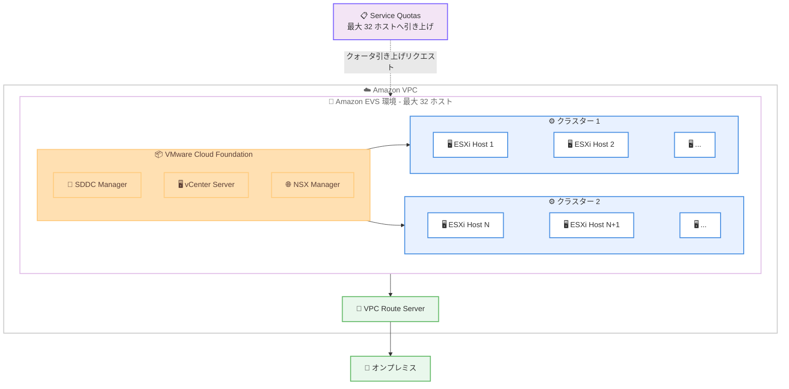

# Amazon EVS - 環境あたり最大 32 ホストのサポート

**リリース日**: 2026年05月18日
**サービス**: Amazon Elastic VMware Service (Amazon EVS)
**機能**: 環境あたり最大 32 ESXi ホストのサポート

📊 [このアップデートのインフォグラフィックを見る](https://takech9203.github.io/aws-news-summary/20260518-amazon-evs-32-hosts.html)

## 概要

Amazon Elastic VMware Service (Amazon EVS) が、1 環境あたりの ESXi ホスト数の上限を従来の 16 ホストから 32 ホストへと倍増させるアップデートを発表しました。これにより、VMware Cloud Foundation (VCF) 環境のスケーラビリティが大幅に向上し、複数環境を管理する運用オーバーヘッドの削減が期待されます。

Amazon EVS では、VCF ドメインおよびクラスターの構成に柔軟性があり、すべてのホストを 1 つの大きなクラスターにまとめることも、複数の小さなクラスターに分散することも、それらを組み合わせることも可能です。今回のリリースでは、サービスクォータの引き上げリクエストを送信することで、最大 32 ホストまでスケールアップできるようになりました。

**アップデート前の課題**

- 1 環境あたり最大 16 ホストの制限により、大規模なワークロードでは複数の環境を作成・管理する必要があった
- 複数環境の管理に伴う運用オーバーヘッド (ネットワーク構成、パッチ管理、監視設定の重複) が発生していた
- 16 ホストの上限では、リソース集約型のワークロードに対して十分なコンピュートキャパシティを単一環境内で確保できなかった

**アップデート後の改善**

- サービスクォータの引き上げにより、1 環境あたり最大 32 ホストまでスケールアップが可能になった
- 複数環境の管理が不要になり、運用オーバーヘッドが削減された
- 単一環境内でより大規模なクラスター構成を実現し、ワークロードの集約効率が向上した

## アーキテクチャ図



この図は、Amazon EVS 環境内で最大 32 ホストを複数のクラスターに柔軟に配置できる構成を示しています。サービスクォータの引き上げリクエストにより上限が拡張されます。

## サービスアップデートの詳細

### 主要機能

1. **ホスト上限の倍増**
   - 1 環境あたりの ESXi ホスト上限が 16 から 32 に倍増
   - サービスクォータの引き上げリクエストにより利用可能
   - 既存環境にも適用可能

2. **柔軟なクラスター構成**
   - 32 ホストすべてを 1 つの大きなクラスターに配置可能
   - 複数の小さなクラスターに分散配置可能
   - ワークロード要件に応じた任意の組み合わせが可能

3. **運用オーバーヘッドの削減**
   - 複数環境の管理が不要になるケースが増加
   - 単一環境内でより多くのワークロードを集約可能
   - 環境間のネットワーク構成やポリシー管理の簡素化

## 技術仕様

### ホストおよび環境の制限

| 項目 | アップデート前 | アップデート後 |
|------|--------------|--------------|
| 環境あたりの最大ホスト数 | 16 | 32 |
| クラスターあたりの最小ホスト数 | 2 | 2 (変更なし) |
| インスタンスタイプ | i4i.metal | i4i.metal (変更なし) |
| クォータ引き上げ | 不要 | サービスクォータ引き上げリクエストが必要 |

### インスタンス仕様 - i4i.metal

| 項目 | 詳細 |
|------|------|
| vCPU | 128 |
| メモリ | 1,024 GiB |
| ローカルストレージ | NVMe SSD |
| ネットワーク帯域幅 | 75 Gbps |

### API 変更履歴

今回のアップデートに関連する API の変更は確認されませんでした。サービスクォータの変更はコントロールプレーン側の設定であり、API インターフェースの変更は不要です。

## 設定方法

### 前提条件

1. Amazon EVS 環境が作成済みであること
2. AWS アカウントに適切な IAM 権限があること
3. サービスクォータの引き上げリクエストが承認されていること

### 手順

#### ステップ 1: サービスクォータの引き上げリクエスト

```bash
aws service-quotas request-service-quota-increase \
  --service-code evs \
  --quota-code <hosts-per-environment-quota-code> \
  --desired-value 32
```

AWS Service Quotas コンソールまたは CLI を使用して、Amazon EVS の「Hosts per environment」クォータの引き上げをリクエストします。

#### ステップ 2: クォータ承認の確認

```bash
aws service-quotas get-requested-service-quota-change \
  --request-id <request-id>
```

リクエストが承認されたことを確認します。承認には時間がかかる場合があります。

#### ステップ 3: ホストの追加

```bash
aws evs create-environment-host \
  --environment-id <environment-id> \
  --instance-type i4i.metal \
  --host-count <additional-host-count>
```

クォータが引き上げられた後、Amazon EVS コンソールまたは CLI を使用して既存環境にホストを追加します。

#### ステップ 4: クラスター構成の調整

vSphere Client から、追加したホストを既存クラスターに追加するか、新しいクラスターを作成して配置します。

## メリット

### ビジネス面

- **運用コストの削減**: 複数環境の管理が不要になることで、管理工数とそれに伴うコストが削減される
- **スケーラビリティの向上**: 単一環境内でより大規模なワークロードに対応でき、ビジネス成長に伴うスケーリングが容易になる
- **環境統合による効率化**: 16 ホスト超のワークロードを 1 環境に集約することで、ライセンス管理やポリシー適用が簡素化される

### 技術面

- **リソース集約効率の向上**: DRS (Distributed Resource Scheduler) がより多くのホストにまたがってリソースを最適配置できる
- **vMotion の範囲拡大**: 32 ホスト環境内でのライブマイグレーションの選択肢が増加し、メンテナンス時の柔軟性が向上
- **HA 構成の強化**: vSphere HA がより多くのホストをフェイルオーバー先として活用でき、可用性が向上

## デメリット・制約事項

### 制限事項

- 32 ホストへのスケールアップにはサービスクォータの引き上げリクエストが必要であり、自動的に有効化されない
- クォータ引き上げの承認には時間がかかる場合がある
- インスタンスタイプは i4i.metal に限定される

### 考慮すべき点

- 32 ホスト環境のコストは相当額になるため (月額約 28 万ドル以上、オンデマンド)、適切なキャパシティプランニングが必要
- 大規模クラスターではネットワーク帯域幅やストレージ I/O のボトルネックを考慮する必要がある
- 環境の障害影響範囲が拡大するため、適切な HA/DR 設計が重要

## ユースケース

### ユースケース 1: 大規模データベースクラスターの統合

**シナリオ**: オンプレミスで 24 台の ESXi ホスト上に分散していた大規模な Oracle RAC や SQL Server Always On 環境を、AWS 上の単一 EVS 環境に移行する

**実装例**:
- 32 ホスト環境を作成し、24 ホストをデータベースクラスター用に配置
- 残り 8 ホストをアプリケーションサーバー用に別クラスターとして構成
- DRS アフィニティルールでデータベース VM を適切なホストに配置

**効果**: オンプレミスと同等のパフォーマンスを単一 EVS 環境で実現し、複数環境間のネットワーク複雑性を排除

### ユースケース 2: 開発/テスト/本番の統合環境

**シナリオ**: 開発、テスト、本番の各環境を 1 つの EVS 環境内の異なるクラスターに配置し、環境管理を簡素化する

**実装例**:
- クラスター 1 (4 ホスト): 開発環境
- クラスター 2 (4 ホスト): テスト/ステージング環境
- クラスター 3 (16 ホスト): 本番環境
- NSX によるマイクロセグメンテーションで環境間を論理的に分離

**効果**: 単一の vCenter/NSX 管理プレーンで全環境を一元管理し、運用効率を大幅に向上

### ユースケース 3: VDI 基盤のスケールアウト

**シナリオ**: VMware Horizon による仮想デスクトップインフラストラクチャ (VDI) を大規模に展開し、多数のユーザーに対応する

**実装例**:
- 32 ホストを VDI 専用クラスターとして構成
- i4i.metal の 128 vCPU/1,024 GiB メモリを活用し、1 ホストあたり数十のデスクトップ VM を稼働
- DRS で負荷分散を自動化

**効果**: 単一環境で数百から 1,000 以上の仮想デスクトップを提供し、管理の一元化とスケーラビリティを両立

## 料金

Amazon EVS の料金は、使用する EC2 ベアメタルインスタンスの数に基づいて課金されます。32 ホスト環境の場合、料金は以下の要素で構成されます。

### 主要コスト要素

| コスト要素 | 東京リージョン料金 |
|-----------|------------------|
| EC2 i4i.metal (オンデマンド) | インスタンスあたり時間単価 |
| EVS コントロールプレーン | $1.01/インスタンス時間 |
| VPC Route Server エンドポイント | $0.2025/エンドポイント時間 (EVS 割引価格) |

### 料金例 (730 時間/月、東京リージョン)

| 構成 | 月額料金 (概算) |
|------|----------------|
| 16 ホスト (3 年 ISP) | 約 $71,000 |
| 32 ホスト (3 年 ISP) | 約 $142,000 |
| 32 ホスト (オンデマンド) | 約 $280,000 |

詳細な料金情報については、[Amazon EVS pricing page](https://aws.amazon.com/evs/pricing/) を参照してください。

## 利用可能リージョン

Amazon EVS が提供されている全リージョンで利用可能です。現在 Amazon EVS が利用可能な主なリージョンは以下の通りです。

- 米国東部 (バージニア北部、オハイオ)
- 欧州 (アイルランド、パリ)
- アジアパシフィック (東京)

## 関連サービス・機能

- **VMware Cloud Foundation (VCF)**: Amazon EVS 上で稼働する統合ソフトウェアスタック
- **AWS Service Quotas**: ホスト数上限の引き上げリクエストに使用
- **Amazon EC2 i4i.metal**: EVS のコンピュート基盤となるベアメタルインスタンス
- **VPC Route Server**: EVS 環境とオンプレミスネットワーク間のルーティングに使用
- **Amazon FSx for NetApp ONTAP**: EVS 環境向けの追加ストレージオプション

## 参考リンク

- 📊 [インフォグラフィック](https://takech9203.github.io/aws-news-summary/20260518-amazon-evs-32-hosts.html)
- [公式発表 (What's New)](https://aws.amazon.com/about-aws/whats-new/2026/05/amazon-evs-32-hosts)
- [Amazon EVS 製品ページ](https://aws.amazon.com/evs/)
- [Amazon EVS ユーザーガイド](https://docs.aws.amazon.com/evs/latest/userguide/what-is-evs.html)
- [Amazon EVS 料金ページ](https://aws.amazon.com/evs/pricing/)

## まとめ

Amazon EVS の環境あたりホスト数上限が 16 から 32 へ倍増したことで、より大規模な VMware ワークロードを単一環境内で集約・運用できるようになりました。サービスクォータの引き上げリクエストを通じて利用可能になるため、既存ユーザーは即座にスケールアップの計画を開始できます。大規模な VMware 環境の AWS 移行を検討している組織や、既に複数の EVS 環境を管理している組織にとって、環境統合による運用効率の改善が見込まれる重要なアップデートです。
