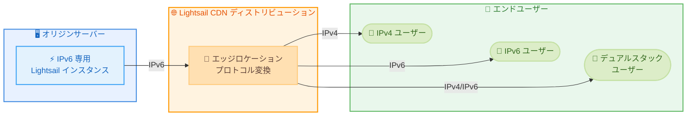

# Amazon Lightsail - CDN ディストリビューションが IPv6 専用インスタンスをオリジンとしてサポート

**リリース日**: 2026 年 5 月 18 日
**サービス**: Amazon Lightsail
**機能**: CDN ディストリビューションの IPv6 専用インスタンスオリジンサポート

📊 [このアップデートのインフォグラフィックを見る](https://takech9203.github.io/aws-news-summary/20260518-amazon-lightsail-cdn-ipv6.html)

## 概要

Amazon Lightsail の CDN ディストリビューションが、IPv6 専用インスタンスをオリジンとしてサポートするようになった。これにより、コスト効率の高い IPv6 専用インスタンス上で Web サイトやアプリケーションを運用しながら、IPv6 接続をサポートしていないネットワーク上のエンドユーザーを含むすべてのユーザーにコンテンツを配信できるようになる。

CDN ディストリビューションがプロトコル変換を処理するため、IPv6 専用インスタンスで動作するアプリケーションは、エンドユーザーが IPv6 接続を持っているかどうかに関係なく、すべてのエンドユーザーからアクセス可能になる。

**アップデート前の課題**

- Lightsail CDN ディストリビューションのオリジンとして IPv4 またはデュアルスタックインスタンスのみがサポートされていた
- IPv6 専用インスタンスを使用する場合、CDN 経由でのコンテンツ配信ができなかった
- IPv6 専用インスタンスのコストメリットを活かしつつグローバル配信することが困難だった

**アップデート後の改善**

- IPv6 専用インスタンスを CDN ディストリビューションのオリジンとして直接指定可能になった
- CDN がプロトコル変換を行い、IPv4 のみのエンドユーザーにも自動的にコンテンツを配信
- コスト効率の高い IPv6 専用インスタンスを使用しながら、全ユーザーへのリーチを維持可能になった

## アーキテクチャ図



IPv6 専用インスタンスから CDN エッジロケーションへは IPv6 で接続し、CDN がエンドユーザーのネットワーク環境に応じて IPv4 または IPv6 でコンテンツを配信する。

## サービスアップデートの詳細

### 主要機能

1. **IPv6 専用インスタンスのオリジンサポート**
   - CDN ディストリビューション作成時にオリジンの IP アドレスタイプとして `ipv6` を指定可能
   - 既存のディストリビューションのオリジン設定を IPv6 専用に変更可能
   - CDN がオリジンへの接続に IPv6 を使用し、エンドユーザーへは IPv4/IPv6 両方で配信

2. **プロトコル変換機能**
   - CDN エッジロケーションが IPv6 からのコンテンツを IPv4 ネットワーク上のユーザーにも配信
   - エンドユーザーの IPv6 対応状況に関係なくアクセス可能
   - 追加設定不要で自動的にプロトコル変換を実施

3. **既存オリジンタイプとの互換性**
   - インスタンス、コンテナ、バケット、ロードバランサーをオリジンとしてサポート
   - 各オリジンタイプで IPv4、IPv6、デュアルスタックの IP アドレスタイプを選択可能

## 技術仕様

### IP アドレスタイプ設定

| IP アドレスタイプ | 説明 | CDN からオリジンへの接続 |
|------|------|------|
| `ipv4` | IPv4 専用 | IPv4 で接続 |
| `ipv6` | IPv6 専用 | IPv6 で接続 |
| `dualstack` | デュアルスタック | IPv4 または IPv6 で接続 |

### API 変更履歴

| 日付 | サービス | 変更内容 |
|------|----------|----------|
| 2026/05/13 | [lightsail](https://awsapichanges.com/archive/changes/74501c-lightsail.html) | 3 updated api methods - Origin および InputOrigin 構造体に ipAddressType フィールドと OriginIpAddressTypeEnum を追加 |

### 更新された API メソッド

| メソッド | 変更内容 |
|----------|----------|
| `CreateDistribution` | `origin.ipAddressType` パラメータ追加 |
| `UpdateDistribution` | `origin.ipAddressType` パラメータ追加 |
| `GetDistributions` | レスポンスの `origin.ipAddressType` フィールド追加 |

### オリジン設定の構造

```json
{
  "origin": {
    "name": "my-ipv6-instance",
    "regionName": "ap-northeast-1",
    "protocolPolicy": "https-only",
    "responseTimeout": 60,
    "ipAddressType": "ipv6"
  }
}
```

## 設定方法

### 前提条件

1. Amazon Lightsail アカウントが有効であること
2. IPv6 専用の Lightsail インスタンスが作成済みであること
3. インスタンス上で Web サーバーが稼働していること

### 手順

#### ステップ 1: IPv6 専用インスタンスの確認

```bash
aws lightsail get-instance --instance-name my-ipv6-instance \
  --query 'instance.ipAddressType'
```

インスタンスの IP アドレスタイプが `ipv6` であることを確認する。

#### ステップ 2: CDN ディストリビューションの作成

```bash
aws lightsail create-distribution \
  --distribution-name my-cdn-distribution \
  --origin '{
    "name": "my-ipv6-instance",
    "regionName": "ap-northeast-1",
    "protocolPolicy": "https-only",
    "ipAddressType": "ipv6"
  }' \
  --default-cache-behavior '{"behavior": "cache"}' \
  --bundle-id small_1_0
```

IPv6 専用インスタンスをオリジンとして CDN ディストリビューションを作成する。`origin.ipAddressType` に `ipv6` を指定することで、CDN が IPv6 でオリジンに接続する。

#### ステップ 3: 既存ディストリビューションのオリジン更新

```bash
aws lightsail update-distribution \
  --distribution-name my-existing-distribution \
  --origin '{
    "name": "my-ipv6-instance",
    "regionName": "ap-northeast-1",
    "protocolPolicy": "https-only",
    "ipAddressType": "ipv6"
  }'
```

既存のディストリビューションのオリジンを IPv6 専用インスタンスに変更する場合は `update-distribution` コマンドを使用する。

## メリット

### ビジネス面

- **コスト削減**: IPv6 専用インスタンスは IPv4 アドレスの料金が不要なため、運用コストを削減できる
- **グローバルリーチの維持**: IPv6 専用環境でも IPv4 ユーザーへのコンテンツ配信が可能なため、顧客基盤を失わない
- **将来性のある設計**: IPv6 への移行を進めながら、現在の IPv4 ユーザーとの互換性を維持できる

### 技術面

- **シンプルな構成**: プロトコル変換のための追加インフラやプロキシが不要
- **低レイテンシー配信**: CDN エッジロケーションを活用した高速コンテンツ配信
- **設定の柔軟性**: API レベルで `ipv4`、`ipv6`、`dualstack` を選択可能

## デメリット・制約事項

### 制限事項

- Lightsail CDN ディストリビューションは 16 リージョンで利用可能だが、すべての AWS リージョンで利用できるわけではない
- Lightsail のディストリビューションバンドルによるデータ転送量の上限がある
- IPv6 専用インスタンスをオリジンにする場合、オリジンサーバーの DNS 解決が IPv6 (AAAA レコード) に依存する

### 考慮すべき点

- 既存の IPv4 インスタンスから IPv6 専用インスタンスへの移行時にはダウンタイムの計画が必要
- IPv6 専用インスタンスでは IPv4 でのみ利用可能な外部サービスへのアクセスに制約がある場合がある

## ユースケース

### ユースケース 1: コスト最適化された静的サイトホスティング

**シナリオ**: スタートアップが IPv4 パブリック IP のコストを削減しつつ、グローバルにアクセス可能な Web サイトを運用したい。

**実装例**:
```bash
# IPv6 専用インスタンスを作成
aws lightsail create-instances \
  --instance-names web-server \
  --availability-zone ap-northeast-1a \
  --blueprint-id nginx \
  --bundle-id nano_3_0 \
  --ip-address-type ipv6

# CDN ディストリビューションを作成
aws lightsail create-distribution \
  --distribution-name website-cdn \
  --origin '{"name": "web-server", "regionName": "ap-northeast-1", "protocolPolicy": "https-only", "ipAddressType": "ipv6"}' \
  --default-cache-behavior '{"behavior": "cache"}' \
  --bundle-id small_1_0
```

**効果**: IPv4 パブリック IP の月額料金を節約しつつ、すべてのエンドユーザーに低レイテンシーでコンテンツを配信できる。

### ユースケース 2: IPv6 移行戦略の段階的実施

**シナリオ**: 企業が段階的に IPv6 への移行を進めており、新しいワークロードを IPv6 専用で構築しながら、既存の IPv4 ユーザーへのサービスを継続したい。

**実装例**:
```bash
# 新しいアプリケーションを IPv6 専用インスタンスにデプロイ
aws lightsail create-instances \
  --instance-names app-v2 \
  --availability-zone eu-west-1a \
  --blueprint-id node \
  --bundle-id small_3_0 \
  --ip-address-type ipv6

# CDN で IPv4/IPv6 両方のエンドユーザーに配信
aws lightsail create-distribution \
  --distribution-name app-v2-cdn \
  --origin '{"name": "app-v2", "regionName": "eu-west-1", "protocolPolicy": "https-only", "ipAddressType": "ipv6"}' \
  --default-cache-behavior '{"behavior": "cache"}' \
  --bundle-id medium_1_0
```

**効果**: IPv6 ファーストの設計で新規ワークロードを構築しながら、CDN のプロトコル変換により IPv4 ユーザーへの到達性を確保できる。

### ユースケース 3: 開発・テスト環境のコスト削減

**シナリオ**: 開発チームが複数のテスト環境を運用しており、各環境のパブリック IP コストを最小化しながら、チーム全員がアクセスできるようにしたい。

**実装例**:
```bash
# テスト環境用の IPv6 専用インスタンスを作成
aws lightsail create-instances \
  --instance-names staging-server \
  --availability-zone us-east-1a \
  --blueprint-id lamp_9 \
  --bundle-id micro_3_0 \
  --ip-address-type ipv6

# CDN 経由でチームメンバーがアクセス可能に
aws lightsail create-distribution \
  --distribution-name staging-cdn \
  --origin '{"name": "staging-server", "regionName": "us-east-1", "protocolPolicy": "http-only", "ipAddressType": "ipv6"}' \
  --default-cache-behavior '{"behavior": "dont-cache"}' \
  --bundle-id small_1_0
```

**効果**: IPv4 アドレスのコストを削減しながら、IPv6 未対応のネットワークからでもテスト環境にアクセス可能になる。

## 料金

Lightsail CDN ディストリビューションの料金は、ディストリビューションバンドルに含まれるデータ転送量に基づく。IPv6 専用インスタンスをオリジンとして使用する場合の追加料金は発生しない。

### 料金例

| バンドル | 月額データ転送量 | 月額料金 |
|----------|------------------|----------|
| small_1_0 | 50 GB | $2.50 |
| medium_1_0 | 200 GB | $5.00 |
| large_1_0 | 600 GB | $10.00 |
| xlarge_1_0 | 1 TB | $25.00 |

※ IPv6 専用インスタンス自体は IPv4 パブリック IP の料金が不要なため、IPv4 インスタンスと比較してコスト削減が可能。最新の料金は公式料金ページを参照。

## 利用可能リージョン

Amazon Lightsail は以下の 16 AWS リージョンで利用可能。

| リージョン | コード |
|------------|--------|
| US East (N. Virginia) | us-east-1 |
| US East (Ohio) | us-east-2 |
| US West (Oregon) | us-west-2 |
| US West (N. California) | us-west-1 |
| Europe (Frankfurt) | eu-central-1 |
| Europe (London) | eu-west-2 |
| Europe (Ireland) | eu-west-1 |
| Europe (Paris) | eu-west-3 |
| Europe (Stockholm) | eu-north-1 |
| Canada (Central) | ca-central-1 |
| Asia Pacific (Tokyo) | ap-northeast-1 |
| Asia Pacific (Seoul) | ap-northeast-2 |
| Asia Pacific (Mumbai) | ap-south-1 |
| Asia Pacific (Singapore) | ap-southeast-1 |
| Asia Pacific (Sydney) | ap-southeast-2 |
| Asia Pacific (Malaysia) | ap-southeast-5 |

## 関連サービス・機能

- **Amazon CloudFront**: Lightsail CDN の基盤技術。より高度な CDN 設定が必要な場合は CloudFront を直接使用可能
- **Lightsail インスタンス**: CDN のオリジンとなるコンピューティングリソース。IPv4、IPv6、デュアルスタックの IP タイプを選択可能
- **Lightsail ロードバランサー**: 複数のインスタンスにトラフィックを分散するオリジンタイプの一つ
- **Lightsail コンテナ**: コンテナベースのアプリケーションをオリジンとして使用可能

## 参考リンク

- 📊 [インフォグラフィック](https://takech9203.github.io/aws-news-summary/20260518-amazon-lightsail-cdn-ipv6.html)
- [公式発表 (What's New)](https://aws.amazon.com/about-aws/whats-new/2026/05/amazon-lightsail-cdn-ipv6/)
- [Amazon Lightsail ドキュメント](https://docs.aws.amazon.com/lightsail/)
- [Amazon Lightsail 料金ページ](https://aws.amazon.com/lightsail/pricing/)
- [Lightsail コンソール](https://lightsail.aws.amazon.com/)
- [API Changes - Lightsail](https://awsapichanges.com/archive/changes/74501c-lightsail.html)

## まとめ

Amazon Lightsail CDN ディストリビューションが IPv6 専用インスタンスをオリジンとしてサポートしたことにより、コスト効率の高い IPv6 専用インスタンスを活用しながらグローバルなコンテンツ配信が可能になった。CDN が自動的にプロトコル変換を行うため、IPv4 のみのネットワーク上のエンドユーザーにも問題なくコンテンツを配信できる。IPv6 移行を検討している組織や、パブリック IPv4 アドレスのコスト削減を目指すユーザーにとって、追加コストなしで即座に利用可能な機能強化である。
