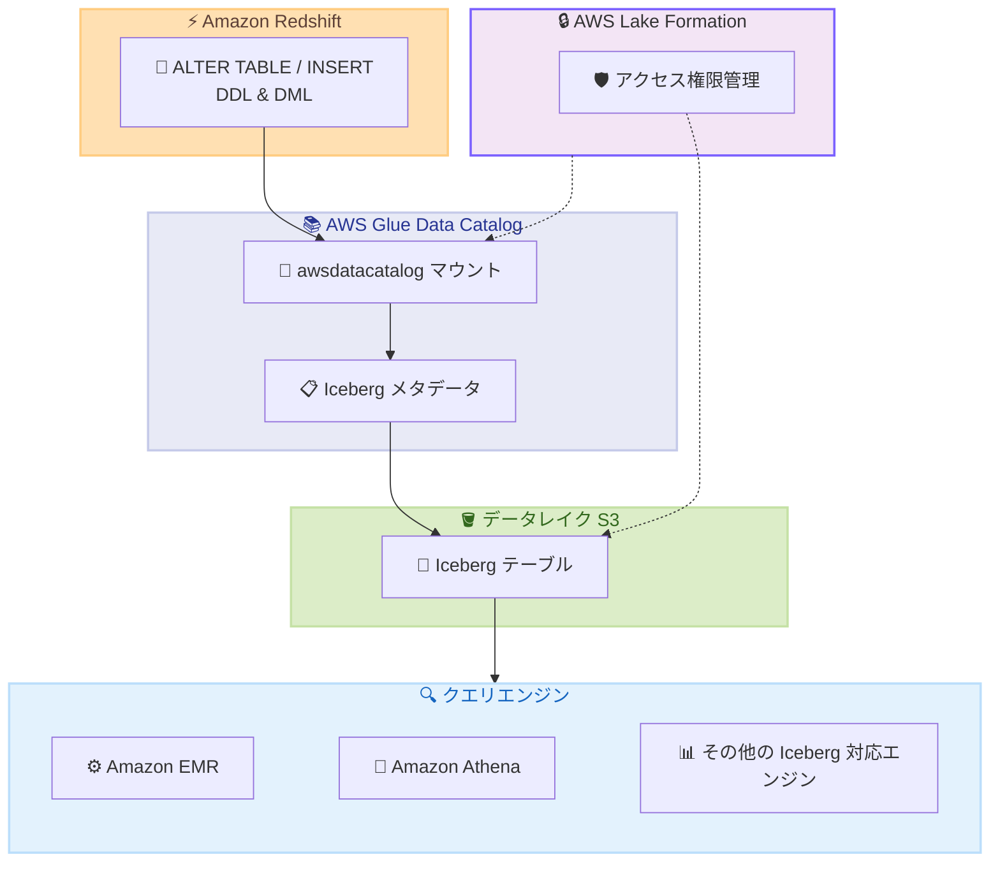

# Amazon Redshift - Iceberg テーブルへの ALTER TABLE サポートと AWS Glue Data Catalog マウント経由の書き込み

**リリース日**: 2026年5月18日
**サービス**: Amazon Redshift
**機能**: Apache Iceberg テーブルの ALTER TABLE DDL サポートおよび awsdatacatalog マウント経由の書き込みアクセス

📊 [このアップデートのインフォグラフィックを見る](https://takech9203.github.io/aws-news-summary/20260518-amazon-redshift-alter-table-iceberg.html)

## 概要

Amazon Redshift が Apache Iceberg テーブルに対する ALTER TABLE DDL ステートメントのサポートと、AWS Glue Data Catalog (awsdatacatalog) マウントを介した直接書き込み機能を追加した。これにより、外部スキーマを作成することなく、Redshift の変換結果をデータレイクに直接書き込み、他のエンジンからクエリ可能な状態にできる。

本アップデートは、データレイクアーキテクチャにおいて Redshift を中核の ETL/ELT エンジンとして活用するユーザーに特に有用である。AWS Lake Formation と連携した Iceberg テーブルのフェデレーテッドアクセス管理にも対応している。

**アップデート前の課題**

- Iceberg テーブルの構造変更 (カラム追加・削除、パーティション変更など) を行うには、テーブルとデータを削除して再作成する必要があった
- データパイプラインに複雑性とレイテンシが追加され、運用負荷が高かった
- Redshift から Iceberg テーブルへ書き込むには外部スキーマの作成が必要だった
- パーティション戦略の変更がデータ量の増加に伴って困難だった

**アップデート後の改善**

- ALTER TABLE で Iceberg テーブルのスキーマ、パーティション、プロパティをインプレースで変更可能になった
- awsdatacatalog マウント経由で外部スキーマなしに Iceberg テーブルへ直接書き込みが可能になった
- テーブル再作成なしにパーティション戦略を動的に適応できるようになった
- Redshift で変更したテーブルは Amazon EMR や Amazon Athena など他の Iceberg 対応エンジンとの互換性を維持

## アーキテクチャ図



Redshift から awsdatacatalog マウントを通じて Iceberg テーブルへ直接書き込み、ALTER TABLE でスキーマ変更を行う。変更後のテーブルは他の Iceberg 対応エンジンからもクエリ可能。

## サービスアップデートの詳細

### 主要機能

1. **awsdatacatalog マウント経由の書き込みアクセス**
   - 自動マウントされた awsdatacatalog を通じて Iceberg テーブルへ直接書き込みが可能
   - 外部スキーマの作成が不要
   - Redshift の変換結果をデータレイクに直接ランディング
   - AWS Lake Formation と連携したフェデレーテッドテーブルに特に有用

2. **ALTER TABLE DDL サポート**
   - Iceberg テーブルのスキーマ、パーティション、テーブルプロパティの変更が可能
   - テーブルとデータの再作成が不要
   - クロスエンジン互換性を維持したままテーブル構造を変更

3. **Lake Formation 権限統合**
   - Iceberg テーブルへの書き込み操作に Lake Formation の権限が適用される
   - 一貫したアクセス制御を維持しながらデータレイクへの書き込みが可能

## 技術仕様

### サポートされる ALTER TABLE 操作

| 操作 | 説明 |
|------|------|
| ADD COLUMN | Iceberg テーブルに新しいカラムを追加 |
| DROP COLUMN | 既存のカラムを削除 |
| ALTER COLUMN | カラムの定義を変更 |
| RENAME COLUMN | カラム名を変更 |
| SET TABLE PROPERTIES | デフォルトの圧縮タイプなどのプロパティを上書き |
| ADD PARTITION FIELD | 新しいパーティションフィールドを追加 |
| DROP PARTITION FIELD | 既存のパーティションフィールドを削除 |
| REPLACE PARTITION FIELD | パーティションフィールドを置換 |

### API 変更履歴

| 日付 | サービス | 変更内容 |
|------|----------|----------|
| 確認中 | Redshift | 今回のアップデートに伴う API 変更は awsapichanges.com で未検出 |

### Lake Formation 権限設定

```json
{
  "Principal": {
    "DataLakePrincipalIdentifier": "arn:aws:iam::123456789012:role/RedshiftRole"
  },
  "Resource": {
    "Table": {
      "DatabaseName": "my_database",
      "Name": "my_iceberg_table",
      "CatalogId": "123456789012"
    }
  },
  "Permissions": [
    "SELECT",
    "INSERT",
    "ALTER",
    "DROP"
  ]
}
```

## 設定方法

### 前提条件

1. Amazon Redshift クラスターまたは Redshift Serverless ワークグループが稼働していること
2. AWS Glue Data Catalog に Iceberg テーブルが登録されていること
3. Redshift クラスターの IAM ロールに Glue Data Catalog および S3 へのアクセス権限が付与されていること
4. Lake Formation を使用する場合、適切な権限が設定されていること

### 手順

#### ステップ 1: awsdatacatalog マウント経由で Iceberg テーブルを参照

```sql
-- awsdatacatalog マウントを使用してテーブルを参照
SELECT * FROM awsdatacatalog.my_database.my_iceberg_table LIMIT 10;
```

自動マウントされた awsdatacatalog を使用して、外部スキーマを作成せずに Glue Data Catalog 内の Iceberg テーブルを直接参照する。

#### ステップ 2: Iceberg テーブルへの書き込み

```sql
-- Redshift の変換結果を Iceberg テーブルに書き込み
INSERT INTO awsdatacatalog.my_database.my_iceberg_table
SELECT
    customer_id,
    order_date,
    total_amount,
    CURRENT_TIMESTAMP AS processed_at
FROM staging_orders
WHERE order_date >= DATEADD(day, -1, CURRENT_DATE);
```

Redshift のクエリ結果を直接 Iceberg テーブルに書き込む。外部スキーマの作成は不要。

#### ステップ 3: ALTER TABLE でスキーマ変更

```sql
-- カラムの追加
ALTER TABLE awsdatacatalog.my_database.my_iceberg_table
ADD COLUMN region VARCHAR(50);

-- カラム名の変更
ALTER TABLE awsdatacatalog.my_database.my_iceberg_table
RENAME COLUMN total_amount TO order_total;

-- 圧縮タイプの変更
ALTER TABLE awsdatacatalog.my_database.my_iceberg_table
SET TABLE PROPERTIES ('write.parquet.compression-codec' = 'zstd');

-- パーティションフィールドの追加
ALTER TABLE awsdatacatalog.my_database.my_iceberg_table
ADD PARTITION FIELD month(order_date);
```

Iceberg テーブルのスキーマやパーティション構成をインプレースで変更する。テーブルの再作成は不要。

## メリット

### ビジネス面

- **データパイプラインの簡素化**: テーブル再作成のワークフローが不要になり、運用コストを削減
- **ダウンタイムの排除**: スキーマ変更時にテーブルとデータを削除する必要がなくなり、データの可用性が向上
- **マルチエンジン活用の促進**: Redshift で加工したデータを他のチームが EMR や Athena から即座に利用可能

### 技術面

- **外部スキーマ不要**: awsdatacatalog マウントにより設定手順が大幅に簡素化
- **クロスエンジン互換性**: Redshift で変更した Iceberg テーブルは他のエンジンとの互換性を維持
- **動的パーティション管理**: データ量の増加に応じてパーティション戦略を柔軟に変更可能
- **一貫したアクセス制御**: Lake Formation による統一的な権限管理

## デメリット・制約事項

### 制限事項

- Iceberg テーブルフォーマット固有の制約 (例: カラム型の変更に制限がある場合がある) に従う必要がある
- awsdatacatalog マウントは Glue Data Catalog に登録されたテーブルのみ対象
- Lake Formation 権限を使用する場合、事前に適切な権限設定が必要

### 考慮すべき点

- 既存のパイプラインで外部スキーマを使用している場合、移行計画の検討が必要
- パーティション変更後のデータ再編成 (コンパクション) が必要になる場合がある
- 他の Iceberg 対応エンジンとの互換性を確認するためのテストを推奨

## ユースケース

### ユースケース 1: データレイクへの ETL パイプライン簡素化

**シナリオ**: データエンジニアリングチームが Redshift で変換処理を行い、結果を Iceberg テーブルに書き戻してデータサイエンスチームが EMR で分析する。

**実装例**:
```sql
-- Redshift で集計・変換してデータレイクに直接書き込み
INSERT INTO awsdatacatalog.analytics_db.daily_metrics
SELECT
    date_trunc('day', event_time) AS metric_date,
    product_category,
    COUNT(*) AS event_count,
    SUM(revenue) AS total_revenue
FROM raw_events
WHERE event_time >= DATEADD(day, -1, CURRENT_DATE)
GROUP BY 1, 2;
```

**効果**: 外部スキーマ作成や別途 ETL ツールでの書き込みが不要になり、パイプラインのステップ数と管理コストを削減。

### ユースケース 2: スキーマエボリューションへの対応

**シナリオ**: ビジネス要件の変化により、既存の Iceberg テーブルにカラムを追加し、パーティション戦略を月次から日次に変更する必要がある。

**実装例**:
```sql
-- 新しいビジネス要件に合わせてカラムを追加
ALTER TABLE awsdatacatalog.sales_db.transactions
ADD COLUMN loyalty_tier VARCHAR(20);

-- データ量増加に伴いパーティション粒度を変更
ALTER TABLE awsdatacatalog.sales_db.transactions
REPLACE PARTITION FIELD month(transaction_date)
WITH day(transaction_date);
```

**効果**: テーブルとデータの削除・再作成が不要になり、スキーマ変更のリードタイムを数時間から数秒に短縮。

### ユースケース 3: Lake Formation による統合ガバナンス

**シナリオ**: 複数の部門が Redshift、EMR、Athena を使い分けてデータレイクの Iceberg テーブルにアクセスする環境で、Lake Formation で一元的にアクセス制御を行う。

**実装例**:
```sql
-- Lake Formation 権限で保護された Iceberg テーブルに書き込み
INSERT INTO awsdatacatalog.governed_db.customer_360
SELECT
    customer_id,
    segment,
    lifetime_value,
    last_activity_date
FROM redshift_staging.customer_analysis;
```

**効果**: Lake Formation の権限モデルにより、Redshift からの書き込みも他のエンジンからのアクセスも統一的に管理でき、ガバナンスが向上。

## 料金

本機能自体に追加料金は発生しない。通常の Amazon Redshift の利用料金が適用される。

| 項目 | 料金体系 |
|------|----------|
| Redshift クエリ実行 | 既存の Redshift クラスターまたは Serverless の料金 |
| S3 ストレージ | Iceberg テーブルのデータ保存に対する S3 料金 |
| Glue Data Catalog | カタログ内のオブジェクト保存およびアクセスリクエスト料金 |
| Lake Formation | 追加料金なし (基盤サービスの料金のみ) |

## 利用可能リージョン

Amazon Redshift が利用可能なすべての AWS リージョンで使用可能。

## 関連サービス・機能

- **AWS Glue Data Catalog**: Iceberg テーブルのメタデータ管理およびカタログサービスとして機能
- **AWS Lake Formation**: Iceberg テーブルへの書き込み操作に対するきめ細かなアクセス制御を提供
- **Amazon EMR**: Redshift で変更した Iceberg テーブルを Spark ベースの処理で利用可能
- **Amazon Athena**: Redshift で変更した Iceberg テーブルをサーバーレスクエリで参照可能
- **Amazon S3**: Iceberg テーブルの実データの保存先

## 参考リンク

- 📊 [インフォグラフィック](https://takech9203.github.io/aws-news-summary/20260518-amazon-redshift-alter-table-iceberg.html)
- [公式発表 (What's New)](https://aws.amazon.com/about-aws/whats-new/2026/05/amazon-redshift-alter-table-iceberg/)
- [Referencing Iceberg tables in Amazon Redshift - ドキュメント](https://docs.aws.amazon.com/redshift/latest/dg/c-getting-started-using-spectrum-iceberg.html)
- [Altering table definitions - ドキュメント](https://docs.aws.amazon.com/redshift/latest/dg/r_ALTER_TABLE.html)
- [Amazon Redshift 料金ページ](https://aws.amazon.com/redshift/pricing/)

## まとめ

Amazon Redshift の Iceberg テーブルに対する ALTER TABLE サポートと awsdatacatalog マウント経由の書き込み機能は、データレイクアーキテクチャにおける Redshift の役割を大幅に強化するアップデートである。テーブルの再作成なしにスキーマ変更が可能になり、データパイプラインの運用負荷を軽減する。Redshift をデータウェアハウスとデータレイクのハブとして活用しているユーザーは、外部スキーマの削除や既存ワークフローの簡素化を検討することを推奨する。
