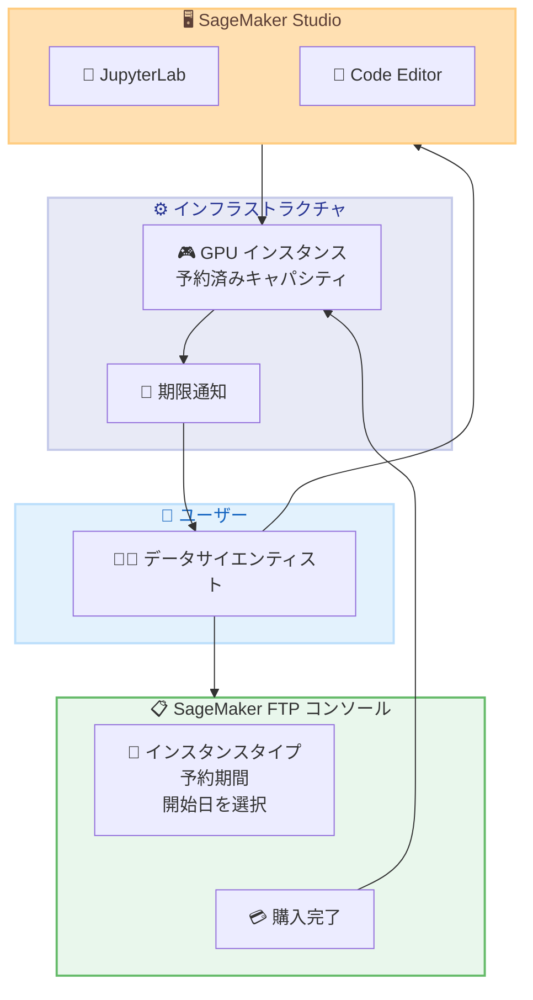

# Amazon SageMaker Studio - Flexible Training Plans による GPU キャパシティ予約サポート

**リリース日**: 2026 年 5 月 18 日
**サービス**: Amazon SageMaker Studio
**機能**: Flexible Training Plans (FTP) を通じた GPU キャパシティ予約

📊 [このアップデートのインフォグラフィックを見る](https://takech9203.github.io/aws-news-summary/20260518-amazon-sagemaker-training-plan-support-for-studio.html)

## 概要

Amazon SageMaker Studio の IDE (JupyterLab および Code Editor) が、SageMaker Flexible Training Plans (FTP) を通じた GPU キャパシティ予約に対応した。これにより、需要の高い高性能 GPU コンピューティングリソースへの予測可能なアクセスが実現し、予算内で ML ワークフローを実行できるようになる。

FTP を活用することで、オンデマンドインスタンスと比較して最大 65% のコスト削減が可能になる。完全なセルフサービスのプロキュアメント体験が提供され、インフラストラクチャ管理は不要である。

**アップデート前の課題**

- SageMaker Studio IDE で GPU インスタンスを使用する際、オンデマンド料金での利用が必須で、コストが高額になりやすかった
- 高性能 GPU インスタンス (p5、p4d 等) は需要が高く、必要なタイミングで確保できない場合があった
- トレーニングジョブ向けの Flexible Training Plans は存在していたが、インタラクティブな IDE ワークロードには適用できなかった

**アップデート後の改善**

- SageMaker Studio IDE で Flexible Training Plans を通じた GPU キャパシティ予約が可能になった
- オンデマンドインスタンスと比較して最大 65% のコスト削減を実現
- セルフサービスでインスタンスタイプ、予約期間、開始日を選択して購入可能
- 予約期限が近づくと IDE がプロアクティブに通知し、作業の保存を促す

## アーキテクチャ図



FTP コンソールでキャパシティを購入し、SageMaker Studio IDE から予約済みインスタンスを選択して利用するフローを示している。

## サービスアップデートの詳細

### 主要機能

1. **セルフサービスプロキュアメント**
   - SageMaker FTP コンソールから直接キャパシティ予約を購入可能
   - インスタンスタイプ、予約期間、開始日をユーザーが選択
   - AWS サポートへの問い合わせや手動プロセスが不要

2. **Studio IDE との統合**
   - 購入したプランが Studio UI のインスタンスドロップダウンに自動表示
   - JupyterLab および Code Editor の両方で利用可能
   - インフラストラクチャ管理は SageMaker が自動処理

3. **プロアクティブな期限通知**
   - 予約期間の終了が近づくと IDE 内で通知を表示
   - ユーザーは作業を保存する時間を確保可能
   - 予期しないリソース解放を防止

## 技術仕様

### 対応リソース

| 項目 | 詳細 |
|------|------|
| 対応 IDE | JupyterLab、Code Editor |
| インスタンスタイプ | GPU インスタンス (p3、p4d、p4de、p5、p5en、p6-b200、g4dn、g5、g6、g6e 等) |
| コスト削減率 | オンデマンド比最大 65% |
| プロビジョニング | 自動 (インフラ管理不要) |
| 予約開始 | ユーザー指定の開始日 |

### API 変更履歴

| 日付 | サービス | 変更内容 |
|------|----------|----------|
| 2026/05/13 | [Amazon SageMaker Service](https://awsapichanges.com/archive/changes/74501c-api.sagemaker.html) | 27 updated api methods - Flexible Training Plans on Studio apps のサポート追加 |

### 主な API 変更内容

`ResourceSpec` に `TrainingPlanArn` パラメータが追加された API メソッド。

```json
{
  "ResourceSpec": {
    "SageMakerImageArn": "string",
    "SageMakerImageVersionArn": "string",
    "InstanceType": "ml.p5.48xlarge",
    "TrainingPlanArn": "string"
  }
}
```

影響を受ける主な API メソッド。

- `CreateApp` - Studio アプリ作成時に TrainingPlanArn を指定可能
- `CreateDomain` - ドメイン作成時のデフォルトリソース設定に TrainingPlanArn を追加
- `CreateSpace` - スペース作成時の設定に対応
- `UpdateDomain` - 既存ドメインの設定更新に対応
- `UpdateSpace` - 既存スペースの設定更新に対応
- `UpdateUserProfile` - ユーザープロファイルの設定更新に対応

## 設定方法

### 前提条件

1. SageMaker Studio ドメインが作成済みであること
2. 適切な IAM 権限を持つユーザーであること
3. FTP の購入権限が付与されていること

### 手順

#### ステップ 1: Flexible Training Plan の購入

SageMaker コンソールの FTP セクションに移動し、以下を設定する。

- インスタンスタイプ (例: ml.p5.48xlarge)
- 予約期間
- 開始日

注文内容を確認し、購入を完了する。

#### ステップ 2: プランのアクティベーション待機

購入後、プランが「Active」ステータスになるまで待機する。指定した開始日に自動的にアクティブになる。

#### ステップ 3: Studio アプリでの利用

```bash
# AWS CLI でプランの確認
aws sagemaker list-training-plans --status Active
```

SageMaker Studio UI から新しいアプリを作成する際、Instance ドロップダウンから購入済みプランを選択する。SageMaker がインスタンスを自動的にプロビジョニングする。

## メリット

### ビジネス面

- **大幅なコスト削減**: オンデマンドインスタンスと比較して最大 65% のコスト削減が可能
- **予算の予測可能性**: 事前にキャパシティを確保するため、コストの見通しが立てやすい
- **セルフサービス運用**: AWS サポートへの問い合わせ不要で、ユーザーが自律的に調達可能

### 技術面

- **キャパシティの確実な確保**: 需要の高い GPU インスタンスへの確実なアクセスを保証
- **インフラ管理不要**: SageMaker が自動でプロビジョニングと管理を実施
- **IDE 統合**: 既存の JupyterLab/Code Editor ワークフローにシームレスに統合
- **プロアクティブ通知**: 予約期限の事前通知により、作業中断リスクを低減

## デメリット・制約事項

### 制限事項

- 予約期間中のキャンセルや変更に関するポリシーは公式ドキュメントで確認が必要
- 予約開始後のインスタンスタイプ変更は不可 (購入時に確定)
- 予約期間終了後はリソースが解放され、作業中のデータは事前に保存する必要がある

### 考慮すべき点

- 利用率が低い場合、オンデマンドよりもコスト高になる可能性がある
- 長期予約のコミットメントが必要なため、ワークロードの見積もりが重要
- 予約したキャパシティは他のワークロード (トレーニングジョブ等) との共有は不可の場合がある

## ユースケース

### ユースケース 1: 大規模モデルのインタラクティブ開発

**シナリオ**: AI/ML チームが大規模言語モデルの微調整を JupyterLab 上でインタラクティブに実施するため、数週間にわたり GPU リソースが必要。

**実装例**:
```
インスタンスタイプ: ml.p5.48xlarge
予約期間: 4 週間
開始日: プロジェクト開始日に合わせて設定
```

**効果**: 高性能 GPU のキャパシティを確実に確保しつつ、最大 65% のコスト削減を実現。プロジェクトスケジュールに影響を与えるリソース不足のリスクを排除。

### ユースケース 2: 定期的な ML ワークフローの実行

**シナリオ**: データサイエンスチームが毎月のモデル再トレーニングとハイパーパラメータチューニングを Code Editor で実施。

**実装例**:
```
インスタンスタイプ: ml.g5.24xlarge
予約期間: 月次で繰り返し購入
開始日: 月初に設定
```

**効果**: 予測可能なコストで定期的な ML ワークフローを安定的に実行。チームの作業スケジュールに合わせたリソース確保が可能。

### ユースケース 3: 複数メンバーでの GPU リソース共有

**シナリオ**: 小規模な ML チームが限られた予算内で GPU リソースを確保し、チームメンバー間でスケジュールを調整して利用。

**実装例**:
```
インスタンスタイプ: ml.g6.12xlarge
予約期間: 8 週間
開始日: 四半期のプロジェクト開始に合わせて設定
```

**効果**: オンデマンドで散発的に利用するよりも大幅にコストを削減。チーム全体の GPU 利用計画を可視化し、リソースの有効活用を実現。

## 料金

SageMaker Flexible Training Plans の料金は、選択するインスタンスタイプと予約期間によって異なる。オンデマンドインスタンスと比較して最大 65% の削減が可能とされている。

### 料金例

| インスタンスタイプ | 料金モデル | 削減効果 |
|--------|------------------|----------|
| GPU インスタンス (FTP) | 事前予約制、期間に応じた割引 | オンデマンド比最大 65% 削減 |
| GPU インスタンス (オンデマンド) | 従量課金 | 基準価格 |

具体的な料金は、SageMaker の料金ページおよび FTP コンソールで確認可能。

## 利用可能リージョン

SageMaker Flexible Training Plans が利用可能なリージョンで本機能を使用可能。具体的な対応リージョンは SageMaker の料金ページまたはドキュメントを参照のこと。

## 関連サービス・機能

- **Amazon SageMaker Training Jobs**: FTP は元々トレーニングジョブ向けに提供されていた機能で、今回 Studio IDE にも拡張された
- **Amazon SageMaker Studio Spaces**: Studio アプリのリソース管理単位で、FTP の予約リソースはスペース経由で利用される
- **AWS Savings Plans**: EC2 や SageMaker の Compute Savings Plans も長期コミットによるコスト削減手段として併用可能

## 参考リンク

- 📊 [インフォグラフィック](https://takech9203.github.io/aws-news-summary/20260518-amazon-sagemaker-training-plan-support-for-studio.html)
- [公式発表 (What's New)](https://aws.amazon.com/about-aws/whats-new/2026/05/amazon-sagemaker-training-plan-support-for-studio/)
- [Using Training Plans with Studio IDEs](https://docs.aws.amazon.com/sagemaker/latest/dg/training-plan-utilization-for-studio-apps.html)
- [Reserve Capacity with Training Plans](https://docs.aws.amazon.com/sagemaker/latest/dg/reserve-capacity-with-training-plans.html)
- [SageMaker Studio Spaces ドキュメント](https://docs.aws.amazon.com/sagemaker/latest/dg/studio-updated-spaces.html)

## まとめ

SageMaker Studio IDE での Flexible Training Plans サポートにより、データサイエンティストや ML エンジニアは高性能 GPU リソースへの確実なアクセスを、最大 65% のコスト削減とともに実現できるようになった。セルフサービスのプロキュアメント体験とプロアクティブな期限通知により、運用負荷を最小限に抑えながら ML ワークフローの安定した実行が可能になる。GPU リソースを定期的に利用するチームは、コスト最適化のために FTP の導入を検討することを推奨する。
