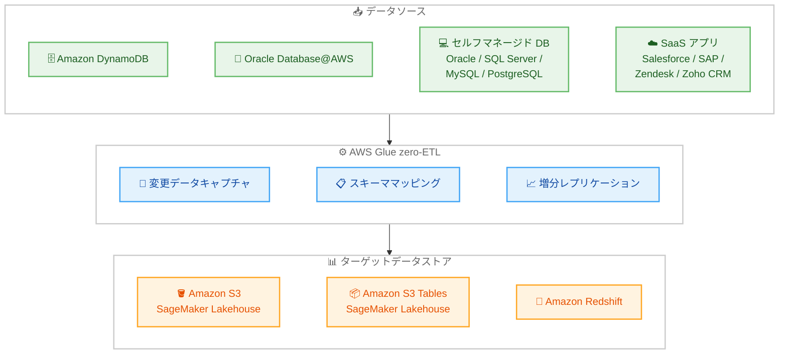

# AWS Glue - zero-ETL インテグレーション アジアパシフィック (ムンバイ) リージョン対応

**リリース日**: 2026 年 5 月 18 日
**サービス**: AWS Glue
**機能**: zero-ETL インテグレーション

📊 [このアップデートのインフォグラフィックを見る](https://takech9203.github.io/aws-news-summary/20260518-aws-glue-zero-etl-mumbai-region.html)

## 概要

AWS Glue の zero-ETL インテグレーションがアジアパシフィック (ムンバイ) リージョン (ap-south-1) で利用可能になった。これにより、インドおよび南アジア地域の顧客は、データパイプラインの簡素化、データ移動レイテンシーの削減、分析および機械学習ワークロードのインサイト取得までの時間短縮が実現できる。

zero-ETL インテグレーションは、一般的なデータ取り込みおよびレプリケーションのユースケースに対して、ETL パイプラインを構築する必要性を最小限に抑えるフルマネージドのインテグレーションセットである。スキーママッピング、変更データキャプチャ (CDC)、増分データレプリケーションを自動的に処理し、ニアリアルタイムでターゲットデータストアにデータを複製する。

**アップデート前の課題**

- ムンバイリージョンの顧客は zero-ETL インテグレーションを利用するために、別リージョンにデータを転送する必要があった
- クロスリージョンのデータ転送によるレイテンシーの増加とコストの発生
- データレジデンシー要件を満たしながら zero-ETL を活用することが困難だった

**アップデート後の改善**

- ムンバイリージョン内で完結する zero-ETL データパイプラインの構築が可能になった
- データ転送のレイテンシーが大幅に削減され、ニアリアルタイムのレプリケーションが実現
- インドのデータレジデンシー要件を遵守しながら zero-ETL の恩恵を受けられるようになった

## アーキテクチャ図



zero-ETL インテグレーションは、複数のデータソースからスキーママッピングと CDC を自動的に処理し、ターゲットの分析データストアにニアリアルタイムでデータを複製する。

## サービスアップデートの詳細

### 主要機能

1. **フルマネージド データインテグレーション**
   - ETL パイプラインのコード記述・保守が不要
   - スキーママッピング、CDC、増分レプリケーションを自動化
   - データエンジニアリングチームはインフラ管理ではなくデータ活用に集中可能

2. **多様なデータソース対応**
   - AWS サービス: Amazon DynamoDB、Oracle Database@AWS
   - セルフマネージド DB: Oracle、SQL Server、MySQL、PostgreSQL
   - SaaS アプリケーション: Salesforce、SAP、Zendesk、Zoho CRM、Facebook Ads、Instagram Ads、ServiceNow

3. **複数のターゲットデータストア**
   - Amazon S3 (SageMaker Lakehouse 経由)
   - Amazon S3 Tables (SageMaker Lakehouse 経由)
   - Amazon Redshift Managed Storage (SageMaker Lakehouse 経由)
   - Amazon Redshift Data Warehouse

4. **ニアリアルタイム レプリケーション**
   - 変更データキャプチャによる増分データ同期
   - ソースデータの変更を自動的に検出・反映
   - 分析ワークロードで常に最新のデータを利用可能

## 技術仕様

### 対応データソースとターゲット

| カテゴリ | サービス / アプリケーション |
|----------|---------------------------|
| AWS サービス | Amazon DynamoDB、Oracle Database@AWS |
| セルフマネージド DB | Oracle、SQL Server、MySQL、PostgreSQL |
| SaaS アプリ | Salesforce、SAP OData、Zendesk、Zoho CRM、Facebook Ads、Instagram Ads、ServiceNow |
| ターゲット | Amazon S3、Amazon S3 Tables、Amazon Redshift Managed Storage、Amazon Redshift |

### API 変更履歴

| 日付 | サービス | 変更内容 |
|------|----------|----------|
| 2026/05/14 | [AWS Glue](https://awsapichanges.com/archive/changes/bd1fb2-glue.html) | 1 updated api method - GetCatalogs に HasDatabases パラメータ追加 |

### レプリケーション機能

| 項目 | 詳細 |
|------|------|
| レプリケーション方式 | 変更データキャプチャ (CDC) + 増分レプリケーション |
| スキーマ処理 | 自動スキーママッピング |
| データ鮮度 | ニアリアルタイム |
| テーブル形式 | Apache Iceberg (S3 ターゲットの場合) |

## 設定方法

### 前提条件

1. AWS アカウントがアジアパシフィック (ムンバイ) リージョンで有効であること
2. ソースデータストアへのアクセス権限が設定されていること
3. ターゲットデータストア (Amazon Redshift クラスターまたは SageMaker Lakehouse) が構築済みであること
4. 必要な IAM ロールとポリシーが作成されていること

### 手順

#### ステップ 1: zero-ETL インテグレーションの作成

AWS Glue コンソールにアクセスし、ムンバイリージョン (ap-south-1) を選択して、zero-ETL インテグレーションを作成する。

```bash
aws glue create-integration \
  --integration-name "my-zero-etl-integration" \
  --source-arn "arn:aws:dynamodb:ap-south-1:123456789012:table/MyTable" \
  --target-arn "arn:aws:redshift:ap-south-1:123456789012:namespace:my-namespace" \
  --region ap-south-1
```

このコマンドは DynamoDB テーブルから Amazon Redshift への zero-ETL インテグレーションを作成する。

#### ステップ 2: インテグレーションの設定確認

作成したインテグレーションのステータスと設定を確認する。

```bash
aws glue describe-integration \
  --integration-name "my-zero-etl-integration" \
  --region ap-south-1
```

インテグレーションが ACTIVE 状態になっていることを確認する。

#### ステップ 3: データレプリケーションの監視

CloudWatch メトリクスでレプリケーションの状態を監視する。

```bash
aws cloudwatch get-metric-statistics \
  --namespace "AWS/Glue/ZeroETL" \
  --metric-name "RecordsReplicated" \
  --dimensions Name=IntegrationName,Value=my-zero-etl-integration \
  --start-time 2026-05-18T00:00:00Z \
  --end-time 2026-05-18T23:59:59Z \
  --period 3600 \
  --statistics Sum \
  --region ap-south-1
```

レプリケーション済みレコード数を確認し、データ同期が正常に動作していることを検証する。

## メリット

### ビジネス面

- **データレジデンシー要件の遵守**: インドの規制要件に対応し、データをムンバイリージョン内に保持できる
- **市場投入までの時間短縮**: ETL パイプラインの構築・保守が不要になり、分析基盤の構築が迅速化
- **運用コスト削減**: データエンジニアリングチームがパイプライン管理から解放され、価値創出に集中可能

### 技術面

- **レイテンシー削減**: ムンバイリージョン内で完結するため、クロスリージョン転送が不要
- **自動化されたスキーマ管理**: ソースのスキーマ変更を自動的にターゲットに反映
- **ニアリアルタイム同期**: CDC による増分レプリケーションで常に最新データを分析可能

## デメリット・制約事項

### 制限事項

- zero-ETL はすべてのデータ変換シナリオに対応するわけではなく、複雑なビジネスロジックを含む変換には従来の ETL パイプラインが必要
- ソースデータストアの種類によってサポートされるターゲットが異なる場合がある
- インテグレーションごとの取り込みリクエスト最小データ量は 1 MB

### 考慮すべき点

- ソースデータベースの負荷増加の可能性 (CDC によるログ読み取り)
- ターゲットデータストアのコンピュートリソース (Amazon Redshift Serverless) の費用が発生する
- セルフマネージドデータベースの場合、ネットワーク接続の設定が追加で必要

## ユースケース

### ユースケース 1: インドの E コマース企業のリアルタイム分析

**シナリオ**: インドの E コマース企業が DynamoDB に保存された注文データを、Amazon Redshift でリアルタイムに分析し、在庫管理と需要予測を行いたい。

**実装例**:
```bash
aws glue create-integration \
  --integration-name "orders-analytics" \
  --source-arn "arn:aws:dynamodb:ap-south-1:123456789012:table/Orders" \
  --target-arn "arn:aws:redshift:ap-south-1:123456789012:namespace:analytics-ns" \
  --region ap-south-1
```

**効果**: ETL パイプラインの構築なしに、注文データがニアリアルタイムで Redshift に複製され、最新の在庫状況と需要傾向を即座に分析可能になる。

### ユースケース 2: SaaS データの統合分析

**シナリオ**: インドの金融サービス企業が Salesforce の顧客データと社内データベースを統合し、SageMaker Lakehouse で顧客 360 度ビューを構築したい。

**実装例**:
```bash
# Salesforce から SageMaker Lakehouse への zero-ETL
aws glue create-integration \
  --integration-name "salesforce-to-lakehouse" \
  --source-arn "arn:aws:glue:ap-south-1:123456789012:connection/salesforce-conn" \
  --target-arn "arn:aws:s3:::my-lakehouse-bucket" \
  --region ap-south-1
```

**効果**: Salesforce の顧客データが自動的に Lakehouse に複製され、社内データと結合した包括的な顧客分析が可能になる。データレジデンシー要件も満たせる。

### ユースケース 3: レガシーデータベースのモダナイゼーション

**シナリオ**: オンプレミスの Oracle データベースから段階的にクラウドへ移行中の企業が、既存システムを稼働させながら分析ワークロードをクラウドに移行したい。

**実装例**:
```bash
# セルフマネージド Oracle から Redshift への zero-ETL
aws glue create-integration \
  --integration-name "oracle-migration-analytics" \
  --source-arn "arn:aws:glue:ap-south-1:123456789012:connection/oracle-onprem" \
  --target-arn "arn:aws:redshift:ap-south-1:123456789012:namespace:migration-ns" \
  --region ap-south-1
```

**効果**: オンプレミスの Oracle データベースを稼働させたまま、分析ワークロードを Amazon Redshift に移行。既存アプリケーションへの影響なしに、クラウドベースの分析環境を構築できる。

## 料金

zero-ETL インテグレーション自体に追加料金は発生しない。使用するソースおよびターゲットリソースに対して課金される。

### 料金体系

| コンポーネント | 課金モデル |
|--------------|-----------|
| ソースからのデータ取得 | 受信データ量に基づく課金 (最小 1 MB/リクエスト) |
| ターゲット処理 (Redshift) | Amazon Redshift 標準料金 |
| ターゲット処理 (S3 / Lakehouse) | AWS Glue DPU 時間 (秒単位課金、最小 1 分) |
| DynamoDB ソース | ポイントインタイムリカバリからのエクスポート料金 |

### 料金例

| 使用量 | 月額料金 (概算) |
|--------|----------------|
| 100 GB/月のデータ取り込み (Redshift ターゲット) | Redshift Serverless の RPU 使用量に依存 |
| 50 GB/月のデータ取り込み (S3 ターゲット) | AWS Glue DPU 時間に依存 (約 $0.44/DPU 時間) |

## 利用可能リージョン

今回のアップデートにより、アジアパシフィック (ムンバイ) リージョン (ap-south-1) が追加された。zero-ETL インテグレーションが利用可能なリージョンの最新情報については、[AWS Glue ドキュメント](https://docs.aws.amazon.com/glue/latest/dg/zero-etl-using.html)を参照のこと。

## 関連サービス・機能

- **Amazon Redshift**: zero-ETL のターゲットデータウェアハウスとして、大規模な分析クエリを実行
- **Amazon SageMaker Lakehouse**: S3 データレイクと Redshift を統合し、単一コピーのデータでの分析と AI/ML を実現
- **Amazon DynamoDB**: zero-ETL のソースとして、NoSQL データのリアルタイム分析を可能にする
- **AWS Database Migration Service (DMS)**: セルフマネージドデータベースからの zero-ETL ソース接続に使用

## 参考リンク

- 📊 [インフォグラフィック](https://takech9203.github.io/aws-news-summary/20260518-aws-glue-zero-etl-mumbai-region.html)
- [公式発表 (What's New)](https://aws.amazon.com/about-aws/whats-new/2026/05/aws-glue-zero-etl-mumbai-region)
- [AWS Blog - Improve DynamoDB analytics with AWS Glue zero-ETL schema and partition controls](https://aws.amazon.com/blogs/big-data/improve-dynamodb-analytics-with-aws-glue-zero-etl-schema-and-partition-controls/)
- [ドキュメント - zero-ETL integrations](https://docs.aws.amazon.com/glue/latest/dg/zero-etl-using.html)
- [料金ページ](https://aws.amazon.com/glue/pricing/)

## まとめ

AWS Glue zero-ETL インテグレーションのアジアパシフィック (ムンバイ) リージョン対応により、インドおよび南アジアの顧客はデータレジデンシー要件を満たしながら、フルマネージドのデータレプリケーション機能を活用できるようになった。ETL パイプラインの構築・保守を不要にし、ニアリアルタイムでソースデータをターゲット分析ストアに複製できるため、データ活用までの時間短縮とエンジニアリングコスト削減が期待できる。ムンバイリージョンを主要リージョンとして利用している組織は、既存の分析ワークロードに zero-ETL を導入することを検討すべきである。
