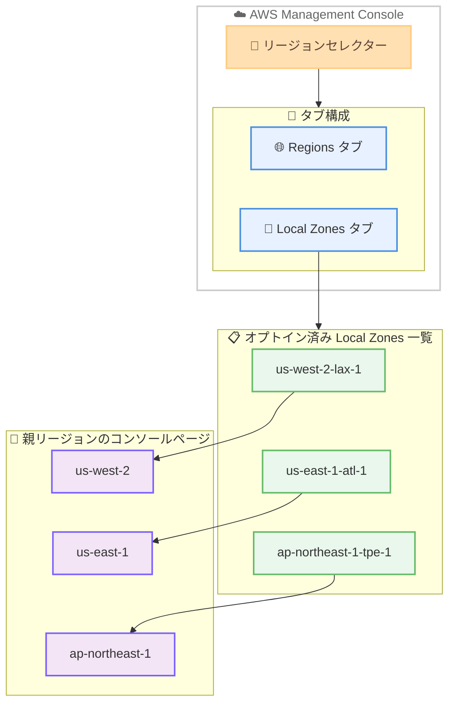

# AWS Management Console - Local Zones リージョンセレクター統合

**リリース日**: 2026 年 5 月 18 日
**サービス**: AWS Management Console
**機能**: AWS Local Zones のリージョンセレクター表示

📊 [このアップデートのインフォグラフィックを見る](https://takech9203.github.io/aws-news-summary/20260518-aws-local-zones-region-selector.html)

## 概要

AWS Management Console のリージョンセレクターに AWS Local Zones が追加された。これにより、コンソールのトップナビゲーションから AWS リージョンと Local Zones を統一的に操作できるようになった。

従来、Local Zones のリソースを管理するには、まず親リージョンに移動してから Local Zones 関連の設定にアクセスする必要があった。今回のアップデートにより、リージョンセレクター内の「Local Zones」タブからオプトイン済みの全 Local Zones を一覧表示し、直接親リージョンのコンソールページに遷移できるようになった。

この機能は、パブリック AWS リージョンのすべての AWS Local Zones で利用可能である。

**アップデート前の課題**

- Local Zones のリソースを管理するには、まず親リージョンを把握してからそのリージョンに手動で切り替える必要があった
- 複数の Local Zones を異なる親リージョンにまたがって利用している場合、ナビゲーションが煩雑だった
- オプトイン済みの Local Zones を一覧で確認するには、EC2 Global View コンソールや CLI を別途使用する必要があった

**アップデート後の改善**

- リージョンセレクターの「Local Zones」タブからオプトイン済み全 Local Zones を一元的に確認可能になった
- Local Zones をクリックするだけで親リージョンのコンソールページに直接遷移できるようになった
- AWS グローバルインフラストラクチャ全体を統一的なナビゲーション体験で操作できるようになった

## アーキテクチャ図



リージョンセレクターから Local Zones タブを選択すると、オプトイン済みの Local Zones が一覧表示され、クリックすると対応する親リージョンのコンソールページに遷移する。

## サービスアップデートの詳細

### 主要機能

1. **Local Zones タブの追加**
   - リージョンセレクターのドロップダウン内に新しい「Local Zones」タブが追加された
   - AWS リージョンのタブと並列に表示される
   - トップナビゲーションバーから直接アクセス可能

2. **オプトイン済み Local Zones の一覧表示**
   - アカウントでオプトインしている全 Local Zones を一箇所に集約表示
   - 複数の親リージョンにまたがる Local Zones も統一的に確認可能
   - 未オプトインの Local Zones は表示されない

3. **親リージョンへの直接ナビゲーション**
   - Local Zones をクリックすると、その親リージョンのコンソールページに直接遷移
   - リソースの表示と管理が即座に可能
   - 親リージョンを手動で調べる手間が不要

## 技術仕様

### コンソール UI 変更内容

| 項目 | 詳細 |
|------|------|
| 変更箇所 | リージョンセレクター (トップナビゲーション) |
| 新規タブ | Local Zones タブ |
| 表示対象 | オプトイン済みの Local Zones のみ |
| 遷移先 | 親リージョンのコンソールページ |
| 対象範囲 | パブリック AWS リージョンの全 Local Zones |

### Local Zones と親リージョンの関係

| Local Zone の例 | 親リージョン |
|------|------|
| us-west-2-lax-1 | US West (Oregon) |
| us-east-1-atl-1 | US East (N. Virginia) |
| ap-northeast-1-tpe-1 | Asia Pacific (Tokyo) |
| ap-southeast-1-bkk-1 | Asia Pacific (Singapore) |
| eu-north-1-cph-1 | Europe (Stockholm) |

## 設定方法

### 前提条件

1. AWS アカウントを持っていること
2. AWS Management Console にアクセスできること
3. 使用したい Local Zones がオプトイン済みであること

### 手順

#### ステップ 1: Local Zones のオプトイン

Local Zones タブに表示させるには、事前に Local Zones をオプトインする必要がある。

```bash
# 利用可能な Local Zones を確認
aws ec2 describe-availability-zones \
  --region us-west-2 \
  --filters Name=zone-type,Values=local-zone \
  --all-availability-zones

# Local Zone のオプトイン
aws ec2 modify-availability-zone-group \
  --region us-west-2 \
  --group-name us-west-2-lax-1 \
  --opt-in-status opted-in
```

利用したい Local Zone のゾーングループ名を指定してオプトインを実行する。コンソールの場合は EC2 Global View から「Regions and Zones」で設定可能。

#### ステップ 2: リージョンセレクターから Local Zones にアクセス

1. AWS Management Console にサインインする
2. トップナビゲーションバーのリージョンセレクター (右上) をクリックする
3. 「Local Zones」タブを選択する
4. オプトイン済みの Local Zones 一覧から目的の Local Zone をクリックする

親リージョンのコンソールページに自動的に遷移し、Local Zone 内のリソースを管理できる。

#### ステップ 3: リソースの管理

```bash
# Local Zone にサブネットを作成する例
aws ec2 create-subnet \
  --region us-west-2 \
  --availability-zone us-west-2-lax-1a \
  --vpc-id vpc-081ec835f303f720e \
  --cidr-block 10.0.1.0/24
```

親リージョンのコンソールページに遷移後、通常のリージョン内リソースと同様に Local Zone のリソースを管理できる。

## メリット

### ビジネス面

- **運用効率の向上**: 複数の Local Zones を利用する環境での日常的なナビゲーションが大幅に簡素化される
- **オンボーディングの改善**: 新規ユーザーが Local Zones の存在と親リージョンの関係を直感的に理解できる
- **マルチロケーション管理の簡素化**: 異なる親リージョンにまたがる Local Zones を一元的に管理でき、運用コストが削減される

### 技術面

- **統一的なナビゲーション**: AWS リージョンと Local Zones を同じ UI パターンでアクセスできる
- **コンテキストスイッチの削減**: 別画面に遷移して親リージョンを調べる必要がなくなった
- **オプトイン状況の可視化**: 現在有効化されている Local Zones をリアルタイムで確認できる

## デメリット・制約事項

### 制限事項

- オプトイン済みの Local Zones のみ表示される (未オプトインの Local Zones は一覧に表示されない)
- Local Zone をクリックすると親リージョンのコンソールページに遷移するため、Local Zone 固有のフィルタリングは別途手動で行う必要がある
- リージョンセレクターから直接 Local Zone 内のリソースだけを表示することはできない

### 考慮すべき点

- 多数の Local Zones をオプトインしている場合、タブ内の一覧が長くなる可能性がある
- この機能は UI の改善であり、API や CLI のワークフローには影響しない
- Local Zones のオプトイン自体はこれまでどおり EC2 Global View コンソールまたは CLI で行う

## ユースケース

### ユースケース 1: マルチロケーションのメディア配信管理

**シナリオ**: メディア企業が北米の複数都市 (ロサンゼルス、ニューヨーク、シカゴ) の Local Zones でコンテンツ配信インフラを運用しており、それぞれ異なる親リージョンに属する Local Zones のリソースを日常的に確認する必要がある。

**実装例**:
```
1. リージョンセレクター > Local Zones タブを開く
2. us-west-2-lax-1 (ロサンゼルス) をクリック → us-west-2 のコンソールで EC2 インスタンスを確認
3. リージョンセレクター > Local Zones タブに戻る
4. us-east-1-chi-1 (シカゴ) をクリック → us-east-1 のコンソールで EC2 インスタンスを確認
```

**効果**: 各都市のリソース確認にかかる時間が短縮され、親リージョンを記憶する必要がなくなる。

### ユースケース 2: ゲーミングプラットフォームの低レイテンシーインフラ監視

**シナリオ**: オンラインゲーム会社がプレイヤーに低レイテンシー体験を提供するため、アジア太平洋地域の複数の Local Zones にゲームサーバーをデプロイしている。運用チームが各 Local Zone のサーバー状態を定期的に確認する。

**実装例**:
```
1. リージョンセレクター > Local Zones タブを開く
2. ap-southeast-1-bkk-1 (バンコク) を選択 → シンガポールリージョンのコンソールへ
3. EC2 ダッシュボードで Local Zone 内のインスタンスヘルスを確認
4. 問題があればオートスケーリング設定を調整
```

**効果**: 複数の Local Zones にまたがるインフラの監視ワークフローが効率化される。

### ユースケース 3: エッジコンピューティング環境のセットアップ

**シナリオ**: 新しいプロジェクトで複数の Local Zones を利用開始する際に、オプトイン済みの Local Zones 一覧を確認しながら段階的にリソースをデプロイする。

**実装例**:
```
1. EC2 Global View で必要な Local Zones をオプトイン
2. リージョンセレクター > Local Zones タブでオプトイン状況を確認
3. 各 Local Zone をクリックして親リージョンに遷移
4. VPC サブネットの作成、EC2 インスタンスのデプロイを実施
```

**効果**: Local Zones の展開状況を一目で把握でき、デプロイ作業のプランニングが容易になる。

## 料金

今回のアップデートは AWS Management Console の UI 改善であり、追加料金は発生しない。

Local Zones 自体の利用料金については、デプロイするリソース (EC2 インスタンス、EBS ボリュームなど) に対して通常のリージョン料金とは異なる Local Zones 固有の料金が適用される。詳細は各サービスの料金ページを参照。

## 利用可能リージョン

パブリック AWS リージョンのすべての AWS Local Zones で利用可能。現在 30 以上の都市圏で Local Zones が提供されている。

主な利用可能エリア:
- **北米**: ロサンゼルス、ボストン、シカゴ、アトランタ、ダラス、デンバー、ヒューストン、マイアミ、ニューヨーク、フィラデルフィア、フェニックスなど
- **アジア太平洋**: オークランド、バンコク、台北、デリーなど
- **南米**: ブエノスアイレスなど
- **ヨーロッパ**: コペンハーゲン、ハンブルク、ヘルシンキ、ワルシャワなど

## 関連サービス・機能

- **AWS Local Zones**: エンドユーザーに近い場所にコンピューティング、ストレージなどのサービスを配置するインフラストラクチャ
- **EC2 Global View**: リージョンと Local Zones のオプトイン管理を行うコンソール機能
- **AWS Outposts**: オンプレミス環境に AWS インフラストラクチャを拡張するサービス (Local Zones と補完的)
- **Amazon CloudFront**: グローバルなコンテンツ配信ネットワーク (Local Zones による低レイテンシーと組み合わせて利用)

## 参考リンク

- 📊 [インフォグラフィック](https://takech9203.github.io/aws-news-summary/20260518-aws-local-zones-region-selector.html)
- [公式発表 (What's New)](https://aws.amazon.com/about-aws/whats-new/2026/05/aws-local-zones-region-selector/)
- [AWS Local Zones Getting Started ガイド](https://docs.aws.amazon.com/local-zones/latest/ug/getting-started.html)
- [AWS Local Zones ロケーション一覧](https://aws.amazon.com/about-aws/global-infrastructure/localzones/locations/)
- [AWS Management Console](https://console.aws.amazon.com/)

## まとめ

AWS Management Console のリージョンセレクターに Local Zones タブが追加されたことで、複数の Local Zones にまたがるリソース管理のナビゲーションが大幅に簡素化された。特に複数都市の Local Zones を利用している環境では、親リージョンを意識することなく迅速にリソースにアクセスできるようになる。Local Zones を利用中のユーザーは、オプトイン済みの Zone が自動的にリージョンセレクターに表示されるため、追加の設定は不要で即座にこの新しいナビゲーション体験を利用できる。
