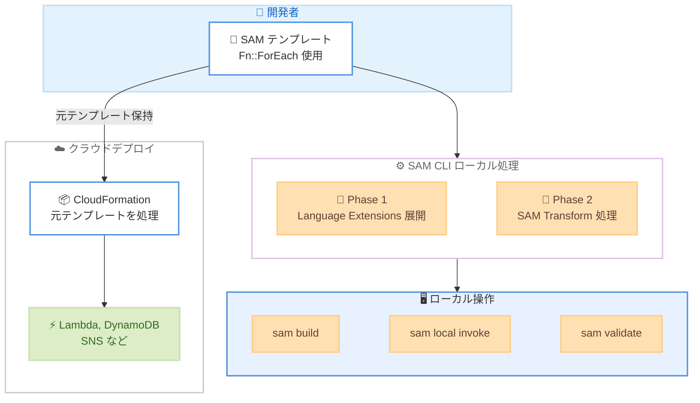

# AWS SAM CLI - CloudFormation Language Extensions サポート

**リリース日**: 2026年5月18日
**サービス**: AWS Serverless Application Model (SAM)
**機能**: CloudFormation Language Extensions ローカル処理サポート

📊 [このアップデートのインフォグラフィックを見る](https://takech9203.github.io/aws-news-summary/20260518-aws-sam-cli-cloudformation.html)

## 概要

AWS SAM CLI が AWS CloudFormation Language Extensions をサポートし、`Fn::ForEach` などのループ構文を含むテンプレートをローカルでビルド、テスト、デプロイできるようになった。これにより、Infrastructure as Code (IaC) テンプレートの重複を削減しながら、SAM CLI のローカル開発ワークフローをフル活用できる。

従来、開発者は Lambda 関数、DynamoDB テーブル、SNS トピックなど、類似するリソースを複数定義する場合、テンプレート内で同じ定義を繰り返し記述する必要があった。CloudFormation Language Extensions の `Fn::ForEach` を使えば重複を排除できるが、SAM CLI がこの構文を処理できなかったため、ローカル開発と DRY なテンプレートの両立ができなかった。今回のアップデートにより、SAM CLI はローカル操作時にメモリ内で Language Extensions を展開しつつ、デプロイ時には元のテンプレートを CloudFormation にそのまま渡す仕組みを実現した。

**アップデート前の課題**

- SAM CLI で `Fn::ForEach` を含むテンプレートを処理できず、ローカルテストが不可能だった
- DRY 原則に従ったテンプレートを書くか、SAM CLI のローカル開発機能を使うか二者択一を迫られていた
- 類似リソースの定義を手動でコピー&ペーストする必要があり、テンプレートの肥大化とメンテナンスコストが増大していた

**アップデート後の改善**

- `Fn::ForEach` を使用したテンプレートで `sam build`、`sam local invoke`、`sam sync` などすべての SAM CLI コマンドが動作するようになった
- リソースを 1 回定義するだけで、ローカルでの反復テストとクラウドデプロイの両方が可能になった
- テンプレートの構文エラーや依存関係の問題をクラウドデプロイ前にローカルで検出できるようになった

## アーキテクチャ図



SAM CLI は 2 フェーズでテンプレートを処理する。Phase 1 で Language Extensions を展開し、Phase 2 で SAM Transform を適用する。元のテンプレートはデプロイ用にそのまま保持される。

## サービスアップデートの詳細

### 主要機能

1. **Fn::ForEach ループ展開**
   - 単一のリソース定義から複数のリソースを生成
   - 最大 5 レベルのネストをサポート
   - Resources、Outputs、Conditions セクションで使用可能
   - 展開されたリソースを名前で直接呼び出し可能 (例: `sam local invoke AlphaFunction`)

2. **2 フェーズ処理アーキテクチャ**
   - Phase 1: Language Extensions をメモリ内で展開し、標準 CloudFormation に変換
   - Phase 2: 展開済みテンプレートを SAM Translator で通常処理
   - デプロイ時は元のテンプレートを CloudFormation がサーバーサイドで処理

3. **動的アーティファクトプロパティ**
   - ループ変数を含むパッケージ可能プロパティ (例: `CodeUri: ./services/${Name}`) を自動処理
   - `SAM*` プレフィックスの Mappings セクションを自動生成し、S3 URI とマッピング
   - `sam package` 時に `Fn::FindInMap` に書き換えて正しいアーティファクトを参照

## 技術仕様

### サポートされる組み込み関数

| 関数 | 説明 |
|------|------|
| `Fn::ForEach` | ループ展開 |
| `Fn::Length` | リスト要素数の取得 |
| `Fn::ToJsonString` | 値の JSON 文字列変換 |
| `Fn::FindInMap` | マッピング参照 (DefaultValue 対応) |
| `Fn::If` | 条件値選択 |
| `Fn::Sub` | 文字列置換 |
| `Fn::Join` | 文字列結合 |
| `Fn::Split` | 文字列分割 |
| `Fn::Select` | リスト要素選択 |
| `Fn::Base64` | Base64 エンコーディング |
| `Fn::Equals`、`Fn::And`、`Fn::Or`、`Fn::Not` | 条件評価 |
| `Ref` | パラメータおよび疑似パラメータ参照 |

### 対応する SAM CLI コマンド

| コマンド | 用途 |
|----------|------|
| `sam build` | テンプレートのビルドとアーティファクト生成 |
| `sam local invoke` | ローカルでの Lambda 関数呼び出し |
| `sam local start-api` | ローカル API Gateway 起動 |
| `sam validate` | テンプレートバリデーション |
| `sam sync` | クラウドとの同期デプロイ |
| `sam package` | パッケージングと S3 アップロード |
| `sam deploy` | CloudFormation デプロイ |

### API 変更履歴

今回のアップデートは SAM CLI のクライアントサイド機能追加であり、AWS API の変更は確認されていない。

## 設定方法

### 前提条件

1. SAM CLI を最新バージョンにアップデートしていること
2. AWS CLI が設定済みであること
3. Docker がインストールされていること (ローカル実行用)

### 手順

#### ステップ 1: SAM CLI のアップデート

```bash
# Homebrew (macOS/Linux)
brew upgrade aws-sam-cli

# pip
pip install --upgrade aws-sam-cli

# バージョン確認
sam --version
```

SAM CLI を最新バージョンに更新する。Language Extensions サポートが含まれるバージョンであることを確認する。

#### ステップ 2: テンプレートに Transform を追加

```yaml
Transform:
  - AWS::LanguageExtensions
  - AWS::Serverless-2016-10-31
```

テンプレートの `Transform` セクションに `AWS::LanguageExtensions` を追加する。SAM Transform (`AWS::Serverless-2016-10-31`) と併記する。

#### ステップ 3: Fn::ForEach でリソースを定義

```yaml
Parameters:
  ServiceNames:
    Type: CommaDelimitedList
    Default: "Users,Orders,Products"

Resources:
  Fn::ForEach::Services:
    - Name
    - !Ref ServiceNames
    - ${Name}Function:
        Type: AWS::Serverless::Function
        Properties:
          Handler: index.handler
          Runtime: python3.12
          CodeUri: ./services/${Name}
```

`Fn::ForEach` を使用してリソースをループ定義する。上記の例では 3 つの Lambda 関数が 1 つの定義から生成される。

#### ステップ 4: ローカルでビルド・テスト

```bash
# ビルド
sam build

# 特定の関数をローカル実行
sam local invoke UsersFunction

# API をローカル起動
sam local start-api

# バリデーション
sam validate
```

展開されたリソースは個別に名前で呼び出せる。`UsersFunction`、`OrdersFunction`、`ProductsFunction` がそれぞれ独立してテスト可能。

## メリット

### ビジネス面

- **開発速度の向上**: リソース定義の重複を排除し、テンプレートの作成・変更にかかる時間を短縮
- **デプロイ前のエラー検出**: ローカルでの検証によりクラウドデプロイの失敗を事前に回避し、開発サイクルを短縮
- **運用コスト削減**: テンプレートのメンテナンスが容易になり、チーム全体の生産性が向上

### 技術面

- **DRY 原則の実現**: 同一パターンのリソースを 1 回定義するだけで複数生成でき、テンプレートが簡潔になる
- **完全なローカル開発ワークフロー**: Language Extensions を使用しても SAM CLI の全機能が利用可能
- **テンプレート整合性の維持**: ローカル展開とクラウドデプロイで同一テンプレートを使用し、環境差異が発生しない

## デメリット・制約事項

### 制限事項

- コレクションはビルド/パッケージ時に解決可能である必要がある (`Fn::GetAtt`、`Fn::ImportValue`、SSM/Secrets Manager 動的参照は使用不可)
- 動的アーティファクトマッピングはパッケージ時に固定される (パラメータ変更時は再パッケージが必要)
- `Fn::ForEach` のネストは最大 5 レベルまで
- `SAM*` プレフィックスの Mapping 名は予約済みのため、ユーザー定義の Mappings では使用不可
- `DeletionPolicy` と `UpdateReplacePolicy` は `Ref` のみサポートし、他の組み込み関数は使用不可

### 考慮すべき点

- パラメータベースのコレクションで動的アーティファクトを使用する場合、`--parameter-overrides` の値を変更したら必ず再パッケージが必要
- `Fn::GetAtt`、`Fn::ImportValue`、`Fn::GetAZs` はローカル展開時に解決されず、CloudFormation のデプロイ時に解決される
- 既存テンプレートへの移行時は、生成されるリソース論理 ID の変更に注意が必要

## ユースケース

### ユースケース 1: マイクロサービスの一括定義

**シナリオ**: 複数のマイクロサービス (Users、Orders、Products) を同一パターンの Lambda 関数として定義し、ローカルで個別にテストしたい。

**実装例**:
```yaml
Transform:
  - AWS::LanguageExtensions
  - AWS::Serverless-2016-10-31

Parameters:
  ServiceNames:
    Type: CommaDelimitedList
    Default: "Users,Orders,Products"

Resources:
  Fn::ForEach::Services:
    - Name
    - !Ref ServiceNames
    - ${Name}Function:
        Type: AWS::Serverless::Function
        Properties:
          Handler: index.handler
          Runtime: python3.12
          CodeUri: ./services/${Name}
          Events:
            Api:
              Type: Api
              Properties:
                Path: /${Name}
                Method: get
```

**効果**: 3 つのサービスを 1 つの定義で管理し、`sam local invoke UsersFunction` で個別テストが可能。サービス追加時はパラメータリストに名前を追加するだけ。

### ユースケース 2: DynamoDB テーブルとストリームプロセッサの同時定義

**シナリオ**: 複数のドメインエンティティごとに DynamoDB テーブルとそのストリームを処理する Lambda 関数をセットで定義したい。

**実装例**:
```yaml
Resources:
  Fn::ForEach::Tables:
    - TableName
    - [Users, Orders, Products]
    - ${TableName}Table:
        Type: AWS::DynamoDB::Table
        Properties:
          TableName: !Sub "${AWS::StackName}-${TableName}"
          AttributeDefinitions:
            - AttributeName: id
              AttributeType: S
          KeySchema:
            - AttributeName: id
              KeyType: HASH
          BillingMode: PAY_PER_REQUEST
          StreamSpecification:
            StreamViewType: NEW_AND_OLD_IMAGES

      ${TableName}StreamProcessor:
        Type: AWS::Serverless::Function
        Properties:
          Handler: index.handler
          Runtime: python3.12
          CodeUri: ./stream-processors/${TableName}/
          Events:
            DDBStream:
              Type: DynamoDB
              Properties:
                Stream: !GetAtt
                  - !Sub "${TableName}Table"
                  - StreamArn
```

**効果**: テーブルとストリームプロセッサのペアを 1 回の定義で 3 セット生成。テンプレートの行数を大幅に削減しつつ、各プロセッサをローカルでテスト可能。

### ユースケース 3: マルチ環境のネスト定義

**シナリオ**: 開発、ステージング、本番の各環境に対して複数のサービスを定義し、環境変数で環境を識別したい。

**実装例**:
```yaml
Resources:
  Fn::ForEach::Envs:
    - Env
    - [Dev, Staging, Prod]
    - Fn::ForEach::Services:
        - Svc
        - [Users, Orders]
        - ${Env}${Svc}Function:
            Type: AWS::Serverless::Function
            Properties:
              Handler: index.handler
              Runtime: python3.12
              CodeUri: ./services/${Svc}
              Environment:
                Variables:
                  STAGE: ${Env}
```

**効果**: 2 レベルのネストにより 6 つの関数 (2 サービス x 3 環境) を生成。環境ごとの差異を環境変数で管理しつつ、ローカルで特定の組み合わせ (`sam local invoke DevUsersFunction`) をテスト可能。

## 料金

SAM CLI は無料のオープンソースツールであり、今回の CloudFormation Language Extensions サポートに追加料金は発生しない。課金されるのはデプロイ先の AWS リソース (Lambda、DynamoDB、API Gateway など) の利用料のみ。

## 利用可能リージョン

SAM CLI はクライアントサイドツールであり、すべての AWS リージョンで使用可能。CloudFormation Language Extensions Transform がサポートされているリージョンであれば、デプロイ先として利用できる。

## 関連サービス・機能

- **AWS CloudFormation**: Language Extensions Transform の提供元。`Fn::ForEach` などの構文はサーバーサイドで処理される
- **AWS Lambda**: SAM CLI でローカル実行・テストされる主要なサーバーレスコンピュートサービス
- **Amazon DynamoDB**: `Fn::ForEach` で複数テーブルを一括定義するユースケースで頻繁に使用される
- **AWS CloudFormation Rain**: CloudFormation テンプレートのデプロイツール。Language Extensions を直接処理する別のアプローチ

## 参考リンク

- 📊 [インフォグラフィック](https://takech9203.github.io/aws-news-summary/20260518-aws-sam-cli-cloudformation.html)
- [公式発表 (What's New)](https://aws.amazon.com/about-aws/whats-new/2026/05/aws-sam-cli-cloudformation/)
- [SAM CLI Language Extensions ドキュメント](https://docs.aws.amazon.com/serverless-application-model/latest/developerguide/sam-specification-language-extensions.html)
- [CloudFormation Language Extensions リファレンス](https://docs.aws.amazon.com/AWSCloudFormation/latest/TemplateReference/transform-aws-languageextensions.html)
- [SAM CLI 開発者ガイド](https://docs.aws.amazon.com/serverless-application-model/latest/developerguide/using-sam-cli.html)

## まとめ

AWS SAM CLI の CloudFormation Language Extensions サポートは、サーバーレス開発者が長年直面していた「テンプレートの DRY 化」と「ローカル開発ワークフロー」の二者択一問題を解決する重要なアップデートである。`Fn::ForEach` を中心としたループ構文により、数百行のテンプレートを数十行に圧縮しながら、`sam local invoke` や `sam build` といった SAM CLI の全コマンドをそのまま活用できる。既存の SAM プロジェクトでは SAM CLI のアップデートと `AWS::LanguageExtensions` Transform の追加だけで即座に利用開始できるため、テンプレートの肥大化に悩む開発チームは早期の導入を検討すべきである。
