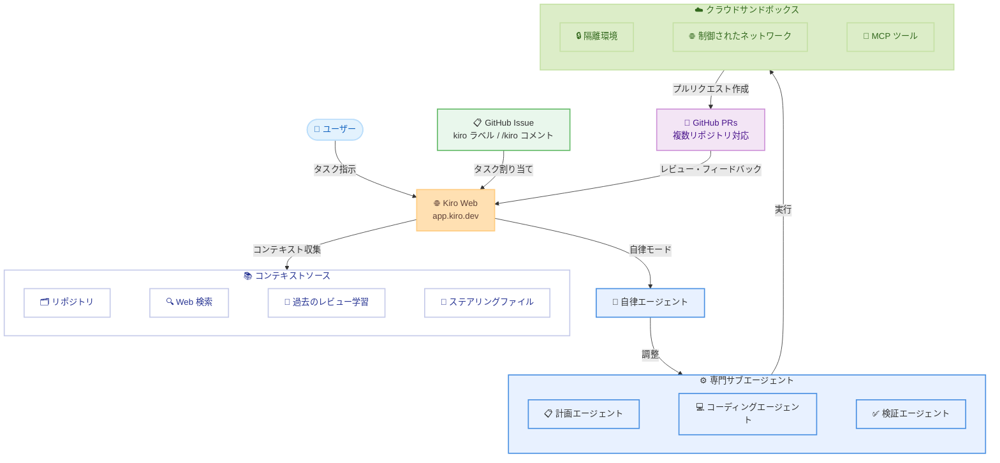

# Kiro - Kiro Web

**リリース日**: 2026年5月18日
**サービス**: Kiro
**機能**: Kiro Web

📊 [このアップデートのインフォグラフィックを見る](https://takech9203.github.io/aws-news-summary/20260518-kiro-introducing-kiro-web.html)

## 概要

Kiro Web は、ブラウザから直接自律的なソフトウェア開発を行える新しいインターフェースである。すべての有料サブスクライバー (Pro、Pro+、Power) 向けにプレビューとして提供が開始された。ユーザーは [app.kiro.dev](https://app.kiro.dev) にアクセスし、構築したい内容を伝えるだけで、Kiro がコードを記述し、複数リポジトリにまたがる変更を調整し、プルリクエストを作成する。

re:Invent で発表された自律的ソフトウェア開発のビジョンに基づき、顧客フィードバックを反映して開発された機能である。自律性を別製品としてではなく、Kiro のコア体験に統合するというアプローチを採用しており、Kiro Web を皮切りに、今後数週間で Kiro IDE および Kiro CLI にも自律ワークフローが追加される予定である。

**アップデート前の課題**

- IDE を開かないと AI 支援のコーディングを開始できなかった
- PR レビュー中のバグ修正や Slack での依頼など、IDE 外で発生するタスクへの対応が遅延していた
- 複数リポジトリにまたがる変更を手動で調整する必要があった
- GitHub Issue からの作業割り当てに手動介入が必要だった

**アップデート後の改善**

- ブラウザからどこでも自律的なソフトウェア開発を開始可能になった
- 複数リポジトリにまたがる変更を 1 つのセッションで自動的に調整できるようになった
- GitHub Issue へのラベル追加やコメントで直接 Kiro にタスクを割り当て可能になった
- ステアリングファイルによりチームのコーディング規約を一貫して適用できるようになった

## アーキテクチャ図



ユーザーがブラウザから Kiro Web にタスクを指示すると、自律エージェントが専門サブエージェントを調整し、隔離されたクラウドサンドボックス内でコードを生成・検証し、最終的に GitHub プルリクエストとして成果物を提供するフローを示している。

## サービスアップデートの詳細

### 主要機能

1. **チャットベースのインタラクション**
   - セッションを開始し、リポジトリを選択し、必要な作業を記述する
   - Kiro がリポジトリ、Web 検索、過去のコードレビューからのコンテキストを活用して応答
   - 実装アプローチについてチャットで議論し、コードベースについて質問可能
   - 満足した時点でプルリクエストの作成を指示

2. **自律モード**
   - Autonomous をトグルで有効化
   - Kiro が事前に明確化のための質問を行い、計画を構築
   - 専門サブエージェント (計画、コーディング、検証) を調整して作業を実行
   - ステータス更新ではなく、完成したプルリクエストを提供

3. **マルチリポジトリサポート**
   - 1 つのセッションで複数のリポジトリにまたがる作業が可能
   - 共有ライブラリの更新と依存サービスのマイグレーションを同時実行
   - バックエンドの API エンドポイント追加とフロントエンドクライアントの更新を一括対応
   - 複数リポジトリにまたがる調整された PR を作成

4. **GitHub インテグレーション**
   - Issue に `kiro` ラベルを追加、またはコメントで `/kiro` をメンションしてタスクを割り当て
   - PR にコメントでフィードバックを残すと Kiro が対応して更新をプッシュ
   - `/kiro all` で全レビューコメントに一括対応
   - `/kiro fix` で特定のスレッドに焦点を当てて対応

5. **ステアリングファイル**
   - チームのコーディング規約、アーキテクチャパターン、技術選好、テスト標準を定義
   - Kiro のエージェント設定から直接アップロードまたは GitHub リポジトリからインポート
   - リポジトリの `.kiro/steering/` フォルダからも自動的に読み取り
   - Kiro IDE、Kiro CLI、Kiro Web 間で共通動作

6. **クラウドサンドボックス**
   - 各タスクが独自の隔離されたサンドボックスで実行
   - セッション用にフレッシュな環境が作成され、終了時に破棄
   - ネットワークアクセス、MCP ツール設定、ベースイメージ設定を制御可能
   - セッション間およびローカル環境からの完全な分離

7. **AWS Identity Center サポート**
   - 管理者が組織に対して Kiro Web のアクセスを有効化/制限可能
   - 他の Kiro クライアントに影響を与えずに制御可能

## 技術仕様

### 対応プラン

| プラン | Kiro Web アクセス |
|--------|------------------|
| Pro | 利用可能 |
| Pro+ | 利用可能 |
| Power | 利用可能 |
| Free | 利用不可 |

### サンドボックス仕様

| 項目 | 詳細 |
|------|------|
| 環境 | セッションごとに独立した隔離環境 |
| ライフサイクル | セッション開始時に作成、終了時に破棄 |
| ネットワーク | 管理者が制御可能なネットワークアクセス |
| ツール | MCP ツール設定のカスタマイズ対応 |
| ベースイメージ | 設定ページからカスタマイズ可能 |

### ステアリングファイル設定

| 項目 | 詳細 |
|------|------|
| 配置場所 | `.kiro/steering/` フォルダまたはエージェント設定 |
| 適用範囲 | Kiro IDE、Kiro CLI、Kiro Web で共通 |
| 定義内容 | コーディング規約、アーキテクチャパターン、技術選好、テスト標準 |
| 学習機能 | セッションや PR でのフィードバックから学習 |

### GitHub インテグレーション

| コマンド | 動作 |
|----------|------|
| `kiro` ラベル追加 | Issue のタスクを Kiro に割り当て |
| `/kiro` コメント | コメントで Kiro にタスクを割り当て |
| `/kiro all` | 全レビューコメントに一括対応 |
| `/kiro fix` | 特定スレッドのフィードバックに対応 |

## 設定方法

### 前提条件

1. Kiro の有料サブスクリプション (Pro、Pro+ または Power プラン)
2. GitHub アカウント
3. (オプション) AWS Identity Center を使用する組織の場合、管理者による Kiro Web の有効化

### 手順

#### ステップ 1: Kiro Web にサインイン

[app.kiro.dev](https://app.kiro.dev) にアクセスし、アカウントでサインインする。

#### ステップ 2: GitHub アカウントの接続

Settings ページで GitHub アカウントを接続する。これにより Kiro がリポジトリにアクセスし、プルリクエストを作成できるようになる。

#### ステップ 3: リポジトリの選択とセッション開始

作業対象のリポジトリを選択し、セッションを開始する。複数リポジトリの選択も可能。

#### ステップ 4: ステアリングファイルの設定 (オプション)

チームのコーディング規約を適用するため、以下のいずれかの方法でステアリングファイルを設定する。

```
# リポジトリ内にステアリングファイルを配置
.kiro/steering/coding-conventions.md
.kiro/steering/architecture-patterns.md
.kiro/steering/testing-standards.md
```

または Kiro のエージェント設定ページから直接アップロード、GitHub リポジトリからインポートする。

#### ステップ 5: 自律モードの有効化 (オプション)

エンドツーエンドでタスクを任せる場合は、Autonomous トグルを有効にする。Kiro が明確化の質問を行い、計画を立て、専門サブエージェントを調整して作業を完了する。

## メリット

### ビジネス面

- **開発速度の向上**: ブラウザからすぐにタスクを開始でき、IDE の起動やローカル環境のセットアップを待つ必要がない
- **マルチリポジトリの効率化**: 複数リポジトリにまたがる変更を 1 つのセッションで自動調整し、手動コーディネーションのオーバーヘッドを削減
- **チーム標準の一貫性**: ステアリングファイルによりコーディング規約やアーキテクチャパターンが自動的に適用され、品質の均一化を実現

### 技術面

- **セキュアな実行環境**: 各タスクが隔離されたサンドボックスで実行され、セッション間の干渉やローカル環境への影響を排除
- **コンテキストインテリジェンス**: リポジトリ、Web 検索、過去のコードレビューからの学習を組み合わせた包括的なコンテキスト活用
- **GitHub ネイティブワークフロー**: Issue ラベルや PR コメントによる自然なインテグレーションで既存のワークフローを変更せずに導入可能

## デメリット・制約事項

### 制限事項

- 現時点ではプレビュー段階であり、本番利用には慎重な検討が必要
- 有料プラン (Pro 以上) のみ利用可能で、Free プランでは利用不可
- GitHub のみ対応しており、GitLab や Bitbucket などの他の Git プロバイダーは現時点で未対応
- クレジットベースの課金制であり、利用量に応じたコスト管理が必要

### 考慮すべき点

- 自律モードで生成されたコードは必ずプルリクエストとして提出されるため、レビュープロセスの確保は維持される
- ステアリングファイルの品質がアウトプットの品質に直接影響するため、適切な定義が重要
- AWS Identity Center を使用する組織では管理者による事前の有効化が必要
- サンドボックスのネットワークアクセス設定は組織のセキュリティポリシーに合わせた適切な構成が必要

## ユースケース

### ユースケース 1: マイクロサービス間の API 変更

**シナリオ**: バックエンドサービスに新しい API エンドポイントを追加し、それを呼び出すフロントエンドクライアントコードも同時に更新する必要がある。

**実装例**:
```
セッション開始 → backend-api と frontend-app リポジトリを選択
指示: "POST /api/v2/notifications エンドポイントを追加し、
フロントエンドの通知サービスクライアントを更新してください"
→ Kiro が両リポジトリに調整された PR を作成
```

**効果**: 手動で複数リポジトリの変更を調整する時間を削減し、API 契約の整合性を自動的に維持する。

### ユースケース 2: GitHub Issue からのバグ修正自動化

**シナリオ**: チームメンバーが GitHub Issue でバグを報告し、開発者はミーティング中で対応できない。

**実装例**:
```
GitHub Issue に kiro ラベルを追加
Issue 内容: "ユーザー登録時にメールバリデーションが
RFC 5322 に準拠していない #1234"
→ Kiro が Issue を取得、修正コードを作成、テストを追加し PR を作成
→ レビューコメントに /kiro fix で対応
```

**効果**: 開発者が他の作業に集中している間もバグ修正が進行し、リードタイムを短縮する。

### ユースケース 3: 共有ライブラリのアップグレードとマイグレーション

**シナリオ**: 社内共有ライブラリのメジャーバージョンアップデートに伴い、依存する複数のサービスをマイグレーションする必要がある。

**実装例**:
```
セッション開始 → shared-lib, service-a, service-b, service-c を選択
Autonomous モード有効化
指示: "shared-lib を v3 にアップデートし、
全依存サービスの import パスと API 呼び出しを
新しいインターフェースに合わせて更新してください"
→ Kiro が計画を作成し、各リポジトリに調整された PR を作成
```

**効果**: 複数サービスにまたがるマイグレーション作業を自動化し、手動更新時の見落としや不整合を防止する。

## 料金

Kiro Web はクレジットベースの課金制を採用している。利用するサブスクリプションプラン (Pro、Pro+、Power) に応じてクレジットが付与される。

**プロモーション**: 2026年5月29日まで Kiro Web クレジットが 50% オフで利用可能。

| 項目 | 詳細 |
|------|------|
| 対象プラン | Pro、Pro+、Power |
| 課金方式 | クレジットベース |
| プロモーション | 2026年5月29日まで 50% オフ |

詳細な料金体系については [Kiro Pricing ページ](https://kiro.dev/pricing) を参照。

## 利用可能リージョン

グローバル (Kiro Web はグローバルサービスとして提供)

## 関連サービス・機能

- **Kiro IDE**: デスクトップ向け AI 搭載 IDE。今後自律ワークフローが追加予定
- **Kiro CLI**: コマンドライン向け Kiro インターフェース。今後自律ワークフローが追加予定
- **Kiro Specs**: 要件と設計をイテレーションし、自律エージェントに実装を引き渡す機能。Kiro Web に近日追加予定
- **AWS Identity Center**: 組織レベルでの Kiro Web アクセス管理に使用
- **GitHub**: リポジトリ連携、Issue 割り当て、PR 作成の基盤プラットフォーム

## 参考リンク

- 📊 [インフォグラフィック](https://takech9203.github.io/aws-news-summary/20260518-kiro-introducing-kiro-web.html)
- [公式ブログ記事 - Introducing Kiro Web](https://kiro.dev/blog/introducing-kiro-web/)
- [Kiro Web アプリケーション](https://app.kiro.dev)
- [Kiro 公式サイト](https://kiro.dev)
- [Kiro 料金ページ](https://kiro.dev/pricing)
- [Kiro ドキュメント](https://kiro.dev/docs)

## まとめ

Kiro Web は、ブラウザベースの自律的ソフトウェア開発を実現する画期的な機能である。IDE を開かずとも複数リポジトリにまたがるコード変更を指示し、プルリクエストとして成果物を受け取れるため、開発ワークフローの柔軟性が大幅に向上する。5月29日までクレジット 50% オフのプロモーションが実施されているため、有料プランのユーザーは [app.kiro.dev](https://app.kiro.dev) で実際のタスクを試し、チームの開発プロセスへの適用を検討することを推奨する。
