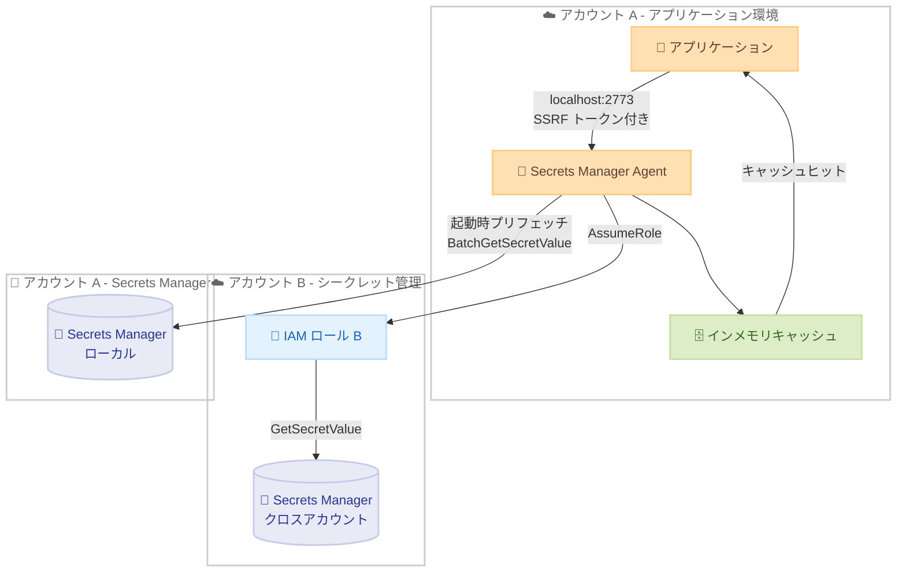

# AWS Secrets Manager Agent - プリフェッチと IAM ロール引き受け機能

**リリース日**: 2026 年 5 月 18 日
**サービス**: AWS Secrets Manager
**機能**: Secrets Manager Agent のプリフェッチおよび IAM ロール引き受け

[このアップデートのインフォグラフィックを見る](https://takech9203.github.io/aws-news-summary/20260518-secrets-manager-agent-prefetch-and-role-assumption.html)

## 概要

AWS Secrets Manager Agent に 2 つの新機能が追加された。起動時のシークレットプリフェッチ機能と、シークレット取得時の IAM ロール引き受け機能である。プリフェッチ機能により、Agent 起動時にシークレットのリストまたはタグ値を指定してバッチ取得・キャッシュが可能となり、アプリケーションの起動レイテンシーが削減される。IAM ロール引き受け機能により、プリフェッチ設定や HTTP リクエストでロール ARN を指定し、クロスアカウントのシークレット取得が実現される。

これらの機能は、ロールベースのシークレットアクセスによるセキュリティ強化と、カスタムプリロードロジックの排除による運用オーバーヘッドの削減を同時に実現する。

**アップデート前の課題**

- アプリケーション起動時にシークレットを取得するには、個別に `GetSecretValue` API を順次呼び出す必要があり、起動レイテンシーが大きかった
- クロスアカウントのシークレット取得には、独自のロール引き受けロジックの実装が必要だった
- シークレットごとに異なる IAM ロールを使い分ける仕組みを自前で構築する必要があった
- 起動時のプリロードロジックをアプリケーションコード内にカスタム実装する運用負荷があった

**アップデート後の改善**

- `BatchGetSecretValue` API を使用した一括取得により、起動時のレイテンシーとコストが最適化された
- TOML 設定ファイルにプリフェッチ対象を宣言的に記述するだけで、起動時の自動取得が実現された
- `roleArn` パラメータの指定により、シークレットごとに異なるアカウントのロールを引き受け可能になった
- カスタムプリロードロジックが不要になり、運用オーバーヘッドが大幅に削減された

## アーキテクチャ図



アプリケーション起動時に Secrets Manager Agent がプリフェッチでシークレットをバッチ取得し、キャッシュに格納する。クロスアカウントのシークレットは IAM ロールを引き受けて取得する。

## サービスアップデートの詳細

### 主要機能

1. **プリフェッチ機能**
   - Agent 起動時に指定されたシークレットをバックグラウンドで自動取得
   - `BatchGetSecretValue` API を使用した効率的なバッチ取得
   - 明示的なシークレット ID/ARN 指定またはタグベースの自動検出に対応
   - Agent はプリフェッチ完了を待たずに即座にリクエスト受付を開始
   - `cache_buffer_ratio` によるキャッシュ使用率の制御が可能

2. **IAM ロール引き受け機能**
   - プリフェッチ設定または HTTP リクエストで `roleArn` を指定可能
   - AWS STS `AssumeRole` によるクロスアカウントシークレット取得
   - シークレットごとに異なるロールの指定が可能
   - ロールごとに独立したキャッシュクライアントを維持
   - 最大 20 ロールの同時引き受けに対応

3. **フリート起動時のジッター制御**
   - `max_jitter_seconds` パラメータにより、複数 Agent の同時起動時の API 呼び出し集中を防止
   - 0 から 10 秒の範囲でランダム遅延を設定可能
   - 大規模フリートでの Secrets Manager API スロットリング回避に有効

## 技術仕様

### 設定パラメータ

| パラメータ | 説明 | 範囲 | デフォルト |
|------|------|------|------|
| `cache_buffer_ratio` | プリフェッチ時のキャッシュ使用率上限 | 0.1 - 1.0 | 0.8 |
| `max_jitter_seconds` | プリフェッチ開始前のランダム遅延 | 0 - 10 秒 | 0 |
| `max_roles` | 同時引き受け可能なロール数 | 1 - 20 | 20 |
| `cache_size` | キャッシュ最大エントリ数 | 1 - 1000 | 1000 |
| `ttl_seconds` | キャッシュ TTL | 0 - 3600 秒 | 300 |

### 必要な IAM 権限

| 操作 | 必要な権限 |
|------|------|
| 基本的なシークレット取得 | `secretsmanager:GetSecretValue`, `secretsmanager:DescribeSecret` |
| プリフェッチ | `secretsmanager:BatchGetSecretValue` |
| タグベース検出 | `secretsmanager:ListSecrets` |
| クロスアカウントアクセス | `sts:AssumeRole` |

### API 変更履歴

| 日付 | サービス | 変更内容 |
|------|----------|----------|
| 2026/05/18 | Secrets Manager Agent | プリフェッチ設定セクションおよび roleArn パラメータの追加 |

### エラーレスポンス

| ステータスコード | 説明 |
|------|------|
| 400 | `roleArn` フォーマット不正、または最大ロール数到達 |
| 403 | STS `AssumeRole` 呼び出し失敗 |

## 設定方法

### 前提条件

1. Secrets Manager Agent のビルド済みバイナリ (Rust で構築)
2. 対象シークレットへのアクセス権限を持つ IAM ロール/クレデンシャル
3. クロスアカウント利用の場合、ターゲットロールの信頼ポリシー設定

### 手順

#### ステップ 1: プリフェッチ設定ファイルの作成

```toml
# config.toml
log_level = "INFO"
http_port = 2773
ttl_seconds = 300
cache_size = 1000
max_roles = 20

[prefetch]
cache_buffer_ratio = 0.6
max_jitter_seconds = 5
secrets = [
    { secret_id = "arn:aws:secretsmanager:ap-northeast-1:123456789012:secret:AppSecret-AbCdEf" },
    { secret_id = "DatabasePassword" },
    { secret_id = "cross-account-secret", role_arn = "arn:aws:iam::987654321098:role/SecretAccessRole" },
]
filter_tags = [
    { key = "Environment" },
    { key = "Team", role_arn = "arn:aws:iam::987654321098:role/SecretAccessRole" },
]
```

プリフェッチ対象を明示的なシークレット ID とタグベースの検出の両方で指定する。`role_arn` フィールドでクロスアカウントアクセスを設定する。

#### ステップ 2: IAM ポリシーの設定

```json
{
    "Version": "2012-10-17",
    "Statement": [
        {
            "Effect": "Allow",
            "Action": [
                "secretsmanager:GetSecretValue",
                "secretsmanager:DescribeSecret",
                "secretsmanager:BatchGetSecretValue",
                "secretsmanager:ListSecrets"
            ],
            "Resource": "*"
        },
        {
            "Effect": "Allow",
            "Action": "sts:AssumeRole",
            "Resource": "arn:aws:iam::987654321098:role/SecretAccessRole"
        }
    ]
}
```

Agent が使用する IAM ロール/ユーザーに、プリフェッチおよびクロスアカウントアクセスに必要な権限を付与する。

#### ステップ 3: ターゲットロールの信頼ポリシー設定

```json
{
    "Version": "2012-10-17",
    "Statement": [
        {
            "Effect": "Allow",
            "Principal": {
                "AWS": "arn:aws:iam::123456789012:role/SecretsManagerAgentRole"
            },
            "Action": "sts:AssumeRole"
        }
    ]
}
```

クロスアカウント先のロールに、Agent のアイデンティティからの `AssumeRole` を許可する信頼ポリシーを設定する。

#### ステップ 4: Agent の起動

```bash
./aws_secretsmanager_agent --config config.toml
```

設定ファイルを指定して Agent を起動する。起動と同時にプリフェッチがバックグラウンドで開始され、Agent は即座にリクエスト受付を開始する。

#### ステップ 5: アプリケーションからのシークレット取得

```bash
# ローカルシークレットの取得
curl -H "X-Aws-Parameters-Secrets-Token: $(</var/run/awssmatoken)" \
    'http://localhost:2773/secretsmanager/get?secretId=AppSecret'

# クロスアカウントシークレットの取得
curl -H "X-Aws-Parameters-Secrets-Token: $(</var/run/awssmatoken)" \
    'http://localhost:2773/secretsmanager/get?secretId=MySecret&roleArn=arn:aws:iam::987654321098:role/SecretAccessRole'
```

アプリケーションからは localhost 経由で SSRF トークン付きのリクエストを送信する。プリフェッチ済みのシークレットはキャッシュから即座に返却される。

## メリット

### ビジネス面

- **起動時間の短縮**: 20 個のシークレットを必要とするマイクロサービスの場合、個別呼び出しからバッチ取得に切り替えることで起動レイテンシーを大幅に削減
- **コスト最適化**: `BatchGetSecretValue` API の使用により、個別の `GetSecretValue` 呼び出しと比較して API コール数を削減
- **運用効率の向上**: カスタムプリロードロジックの開発・保守が不要になり、開発チームの運用負荷を軽減

### 技術面

- **セキュリティ強化**: ロールベースのシークレットアクセスにより最小権限の原則を実現
- **マルチアカウント対応の簡素化**: シークレットごとに異なるロールを指定でき、複雑なクロスアカウント構成を宣言的に管理
- **フリートスケーリング対応**: ジッター設定により大規模フリートの同時起動時の API スロットリングを回避
- **非ブロッキング設計**: プリフェッチはバックグラウンドタスクとして実行され、Agent の起動を妨げない

## デメリット・制約事項

### 制限事項

- 同時引き受け可能なロール数は最大 20。上限到達後は Agent の再起動まで新規ロールのリクエストが拒否される
- プリフェッチはキャッシュ無効化をサポートしない。シークレットのローテーションがキャッシュ TTL 内に発生した場合、古い値が返される可能性がある
- `cache_buffer_ratio` の上限に達した場合、残りのシークレットはプリフェッチされない (オンデマンド取得は引き続き可能)
- Agent はシークレットの読み取りのみ対応。書き込み・更新はできない

### 考慮すべき点

- プリフェッチ設定の変更には Agent の再起動が必要
- ロールキャッシュはエビクションされないため、動的にロールが追加されるワークロードでは `max_roles` の設計が重要
- SSRF トークンにアクセスできるすべてのプロセスがキャッシュされたシークレットを取得できるため、ホストのセキュリティ境界の設計が重要

## ユースケース

### ユースケース 1: マイクロサービスの高速起動

**シナリオ**: Kubernetes 上で稼働するマイクロサービスが起動時に 20 個のデータベース接続情報やAPI キーを必要としている。従来は順次取得で起動に数秒かかっていた。

**実装例**:
```toml
[prefetch]
cache_buffer_ratio = 0.8
secrets = [
    { secret_id = "db-primary-credentials" },
    { secret_id = "db-replica-credentials" },
    { secret_id = "redis-auth-token" },
    { secret_id = "api-key-payment-service" },
    { secret_id = "api-key-notification-service" },
]
filter_tags = [
    { key = "service", value = "order-service" },
]
```

**効果**: `BatchGetSecretValue` による一括取得で起動レイテンシーを大幅に削減。ECS タスクや Kubernetes Pod のヘルスチェック通過までの時間が短縮される。

### ユースケース 2: マルチアカウント SaaS アーキテクチャ

**シナリオ**: SaaS プロバイダーが顧客ごとに別 AWS アカウントでシークレットを管理しており、中央のアプリケーションアカウントから各顧客アカウントのシークレットにアクセスする必要がある。

**実装例**:
```toml
[prefetch]
secrets = [
    { secret_id = "tenant-a-db-creds", role_arn = "arn:aws:iam::111111111111:role/SecretReader" },
    { secret_id = "tenant-b-db-creds", role_arn = "arn:aws:iam::222222222222:role/SecretReader" },
    { secret_id = "tenant-c-db-creds", role_arn = "arn:aws:iam::333333333333:role/SecretReader" },
]
```

**効果**: テナントごとのカスタムロール引き受けロジックが不要になり、設定ファイルのみでマルチテナントのシークレットアクセスを管理。IAM ロールの分離によりテナント間のセキュリティ境界を維持。

### ユースケース 3: 環境タグベースの自動シークレット検出

**シナリオ**: 開発環境・ステージング環境・本番環境で同じアプリケーションをデプロイしており、環境ごとのシークレットをタグで管理している。

**実装例**:
```toml
[prefetch]
cache_buffer_ratio = 0.6
max_jitter_seconds = 3
filter_tags = [
    { key = "Environment" },
    { key = "Application" },
]
```

**効果**: 新しいシークレットを追加する際、適切なタグを付与するだけで自動的にプリフェッチ対象に含まれる。デプロイパイプラインの変更が不要になり、シークレット管理のスケーラビリティが向上。

## 料金

Secrets Manager Agent 自体は無料のオープンソースコンポーネントである。料金は Secrets Manager の API 呼び出しとシークレット保管に対して発生する。

### 料金例

| 項目 | 料金 |
|--------|------|
| シークレット保管 | $0.40/シークレット/月 |
| API コール (GetSecretValue, BatchGetSecretValue) | $0.05/10,000 件 |
| API コール (ListSecrets) | $0.05/10,000 件 |

プリフェッチにより `BatchGetSecretValue` を使用することで、個別の `GetSecretValue` 呼び出しと比較して API コール数が削減され、特に起動頻度の高いワークロードでコスト効率が向上する。

## 利用可能リージョン

AWS Secrets Manager が提供されている全リージョンで利用可能。これには以下が含まれる。

- 米国東部 (バージニア北部、オハイオ)
- 米国西部 (オレゴン、北カリフォルニア)
- アジアパシフィック (東京、大阪、ソウル、シンガポール、シドニー、ムンバイ、ジャカルタ、香港)
- 欧州 (フランクフルト、アイルランド、ロンドン、パリ、ストックホルム、ミラノ、スペイン、チューリッヒ)
- その他の商用リージョン

## 関連サービス・機能

- **AWS Secrets Manager**: シークレットの保管・ローテーション・管理を行うマネージドサービス
- **AWS STS (Security Token Service)**: IAM ロールの引き受けに使用される一時的な認証情報を発行
- **AWS IAM**: ロールベースのアクセス制御と信頼ポリシーによるクロスアカウントアクセスの管理
- **Amazon ECS / EKS**: コンテナワークロードでの Secrets Manager Agent サイドカーパターンの実行基盤
- **AWS Lambda**: Lambda Extension としての Secrets Manager Agent の実行環境

## 参考リンク

- [インフォグラフィック](https://takech9203.github.io/aws-news-summary/20260518-secrets-manager-agent-prefetch-and-role-assumption.html)
- [公式発表 (What's New)](https://aws.amazon.com/about-aws/whats-new/2026/05/secrets-manager-agent-prefetch-and-role-assumption/)
- [AWS Secrets Manager Agent ドキュメント](https://docs.aws.amazon.com/secretsmanager/latest/userguide/secrets-manager-agent.html)
- [GitHub リポジトリ](https://github.com/aws/aws-secretsmanager-agent)
- [Secrets Manager 料金ページ](https://aws.amazon.com/secrets-manager/pricing/)

## まとめ

AWS Secrets Manager Agent のプリフェッチと IAM ロール引き受け機能は、シークレット管理のパフォーマンスとセキュリティを同時に向上させるアップデートである。特に多数のシークレットを起動時に必要とするマイクロサービスアーキテクチャや、マルチアカウント構成での運用において大きな効果がある。既に Secrets Manager Agent を使用している場合は、設定ファイルにプリフェッチセクションを追加するだけで即座に恩恵を受けられるため、早期の導入検討を推奨する。
