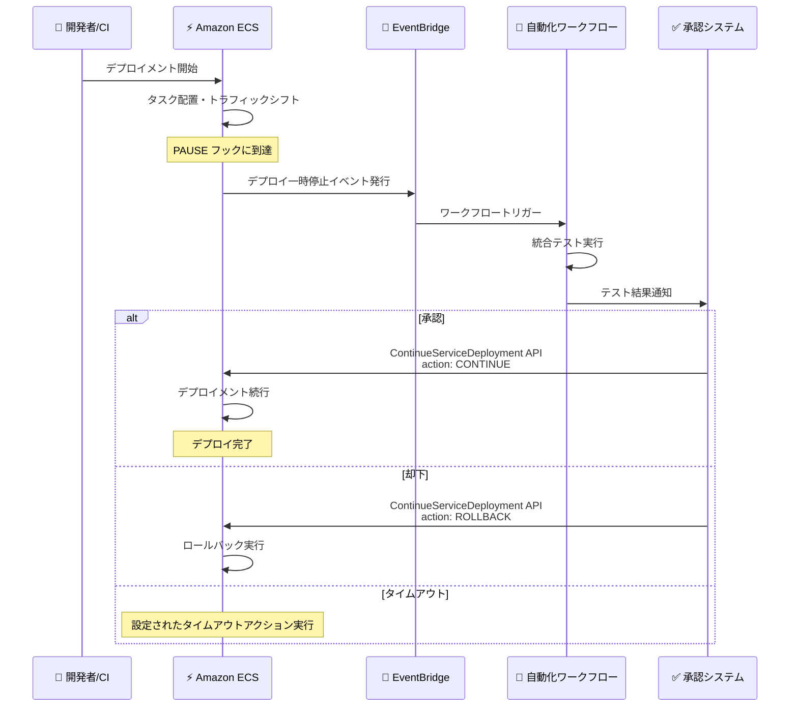

# Amazon ECS - サービスデプロイメントの一時停止・再開コントロール

**リリース日**: 2026 年 5 月 19 日
**サービス**: Amazon Elastic Container Service (Amazon ECS)
**機能**: PAUSE デプロイメントライフサイクルフックと ContinueServiceDeployment API

📊 [このアップデートのインフォグラフィックを見る](https://takech9203.github.io/aws-news-summary/20260519-amazon-ecs-pause-continue-deployments.html)

## 概要

Amazon ECS がサービスデプロイメントの進行中に一時停止 (Pause) と再開 (Continue) を制御する新機能をリリースした。デプロイメントの重要なステージにおいて、手動承認ワークフロー、運用チェック、統合テスト、カスタムオートメーションなどの判断ポイントを導入できるようになる。

この機能では、デプロイメント設定の一部として新しい PAUSE デプロイメントライフサイクルフックを構成する。デプロイメントが設定されたポーズポイントに到達すると、Amazon ECS はデプロイメントの進行を一時停止し、Amazon EventBridge イベントを発行する。このイベントをトリガーとして自動化ワークフロー、承認システム、外部検証プロセスを実行し、新しい ContinueServiceDeployment API でデプロイを続行またはロールバックできる。

**アップデート前の課題**

- デプロイメント中に手動承認ポイントを設けるには、外部の CI/CD ツール (AWS CodePipeline など) に依存する必要があった
- ECS ネイティブのデプロイ戦略を使いながら、デプロイの途中で検証や確認を挟む仕組みがなかった
- カナリアデプロイやブルー/グリーンデプロイの進行中に、手動での品質確認を行うタイミングを制御できなかった

**アップデート後の改善**

- ECS ネイティブのデプロイ戦略に PAUSE フックを組み込み、デプロイ進行中に一時停止ポイントを設定可能に
- EventBridge 連携により、一時停止イベントから自動化ワークフローや承認システムをトリガー可能に
- 最大 14 日間のタイムアウト設定と、タイムアウト時の自動続行/ロールバックアクションを構成可能に
- マネージドなトラフィックシフト、ベイクタイム、高速ロールバック、CloudWatch アラーム、デプロイサーキットブレーカーとの併用が可能

## アーキテクチャ図



Amazon ECS デプロイメントが PAUSE フックに到達した際のイベントフローを示す。EventBridge 経由で外部システムと連携し、ContinueServiceDeployment API で制御する。

## サービスアップデートの詳細

### 主要機能

1. **PAUSE デプロイメントライフサイクルフック**
   - デプロイメント設定に新しい PAUSE フックを構成可能
   - デプロイの進行中に指定ポイントで自動的に一時停止
   - Rolling、Blue/Green、Linear、Canary すべてのデプロイ戦略で利用可能

2. **ContinueServiceDeployment API**
   - 一時停止中のデプロイメントを続行またはロールバック
   - ECS コンソール、AWS CLI、AWS SDK から呼び出し可能
   - プログラマティックな判断と手動操作の両方に対応

3. **EventBridge イベント連携**
   - デプロイメントが一時停止状態に移行した際にイベントを発行
   - 自動化ワークフロー、承認システム、外部検証プロセスのトリガーとして活用
   - Lambda、Step Functions、SNS など任意のターゲットに接続可能

4. **タイムアウト制御**
   - 最大 14 日間のタイムアウト期間を設定可能
   - タイムアウト時のアクション (自動続行/自動ロールバック) を構成可能
   - 承認が得られない場合のデッドロック防止

## 技術仕様

### デプロイ戦略との組み合わせ

| デプロイ戦略 | PAUSE フック対応 | 説明 |
|------|------|------|
| Rolling | 対応 | ローリングアップデート中の指定ポイントで一時停止 |
| Blue/Green | 対応 | トラフィック切り替え前後のチェックポイント |
| Linear | 対応 | 段階的トラフィックシフトの各ステップで一時停止可能 |
| Canary | 対応 | カナリアトラフィック投入後の検証ポイント |

### PAUSE フック設定パラメータ

| 項目 | 詳細 |
|------|------|
| タイムアウト期間 | 最大 14 日間 |
| タイムアウトアクション | CONTINUE または ROLLBACK |
| 対応 API | ContinueServiceDeployment |
| イベント連携 | Amazon EventBridge |

### API 変更履歴

| 日付 | サービス | 変更内容 |
|------|----------|----------|
| 2026/05/19 | ecs | ContinueServiceDeployment API 追加、PAUSE ライフサイクルフック設定パラメータ追加 |

### IAM ポリシー例

```json
{
  "Version": "2012-10-17",
  "Statement": [
    {
      "Effect": "Allow",
      "Action": [
        "ecs:ContinueServiceDeployment",
        "ecs:DescribeServices",
        "ecs:UpdateService"
      ],
      "Resource": "arn:aws:ecs:*:*:service/*"
    }
  ]
}
```

## 設定方法

### 前提条件

1. Amazon ECS クラスターが作成済みであること
2. ECS サービスがデプロイメント設定を使用していること
3. ContinueServiceDeployment API を呼び出すための IAM 権限が付与されていること
4. EventBridge ルールを設定する場合は、適切な IAM ロールが必要

### 手順

#### ステップ 1: PAUSE フック付きデプロイメント設定の作成

```bash
aws ecs update-service \
  --cluster my-cluster \
  --service my-service \
  --deployment-configuration '{
    "deploymentLifecycleHooks": [
      {
        "hookType": "PAUSE",
        "timeoutDuration": "PT1H",
        "timeoutAction": "ROLLBACK"
      }
    ]
  }'
```

ECS サービスのデプロイメント設定に PAUSE フックを追加する。タイムアウトを 1 時間に設定し、タイムアウト時にはロールバックを実行する。

#### ステップ 2: EventBridge ルールの設定

```bash
aws events put-rule \
  --name "ecs-deployment-pause-rule" \
  --event-pattern '{
    "source": ["aws.ecs"],
    "detail-type": ["ECS Deployment State Change"],
    "detail": {
      "deploymentStatus": ["PAUSE"]
    }
  }'
```

ECS デプロイメントが一時停止状態に遷移した際にトリガーされる EventBridge ルールを作成する。

#### ステップ 3: デプロイメントの続行またはロールバック

```bash
# デプロイメントを続行
aws ecs continue-service-deployment \
  --cluster my-cluster \
  --service my-service \
  --deployment-id "ecs-svc/1234567890" \
  --action CONTINUE

# デプロイメントをロールバック
aws ecs continue-service-deployment \
  --cluster my-cluster \
  --service my-service \
  --deployment-id "ecs-svc/1234567890" \
  --action ROLLBACK
```

一時停止中のデプロイメントに対して、ContinueServiceDeployment API を使用して続行またはロールバックを指示する。

## メリット

### ビジネス面

- **リスク低減**: 本番デプロイ前に手動承認ゲートを設けることで、問題のあるリリースを防止
- **コンプライアンス対応**: 規制要件に基づく承認プロセスをデプロイフローに組み込み可能
- **運用の可視性向上**: デプロイの各段階を明示的に制御・追跡でき、監査証跡を残せる

### 技術面

- **ネイティブ統合**: 外部 CI/CD ツールに依存せず、ECS 標準のデプロイ戦略と一体化
- **柔軟な自動化**: EventBridge 連携により、Lambda、Step Functions、SNS など任意のサービスと接続
- **安全なデフォルト**: タイムアウトアクションにより、承認待ちのデッドロックを自動回避
- **既存機能との共存**: トラフィックシフト、ベイクタイム、CloudWatch アラーム、サーキットブレーカーと併用可能

## デメリット・制約事項

### 制限事項

- タイムアウト期間は最大 14 日間まで
- PAUSE フックの数や配置ポイントに制限がある可能性
- ContinueServiceDeployment API は ECS コンソール、CLI、SDK のみ対応 (CloudFormation でのデプロイ続行操作は不可)

### 考慮すべき点

- タイムアウト設定が短すぎると、承認プロセスが間に合わず意図しないロールバックが発生する可能性
- 複数の PAUSE ポイントを設定する場合、全体のデプロイ時間が大幅に延長される
- EventBridge ルールやターゲットの設定が適切でない場合、一時停止通知が届かずタイムアウトまで待機してしまう

## ユースケース

### ユースケース 1: 本番環境への手動承認デプロイ

**シナリオ**: 金融機関のサービスで、本番環境へのデプロイには変更管理委員会の承認が必要。カナリアデプロイでトラフィックの 10% に新バージョンを投入した後、承認を得てから全トラフィックを切り替えたい。

**実装例**:
```json
{
  "deploymentStrategy": "CANARY",
  "canaryConfig": {
    "initialTrafficPercentage": 10
  },
  "deploymentLifecycleHooks": [
    {
      "hookType": "PAUSE",
      "timeoutDuration": "P7D",
      "timeoutAction": "ROLLBACK"
    }
  ]
}
```

**効果**: カナリアトラフィック投入後に自動的に一時停止し、7 日間の承認猶予を確保。承認が得られなければ自動ロールバック。

### ユースケース 2: 統合テスト自動化パイプライン

**シナリオ**: マイクロサービスアーキテクチャで、新バージョンのデプロイ後に E2E テストスイートを実行し、結果に基づいて自動的にデプロイを続行またはロールバックしたい。

**実装例**:
```python
# Lambda 関数: EventBridge からトリガーされる
import boto3

def handler(event, context):
    ecs_client = boto3.client('ecs')
    deployment_id = event['detail']['deploymentId']
    cluster = event['detail']['clusterArn']
    service = event['detail']['serviceArn']

    # 統合テスト実行
    test_result = run_integration_tests()

    # テスト結果に基づいてデプロイを制御
    action = 'CONTINUE' if test_result.passed else 'ROLLBACK'
    ecs_client.continue_service_deployment(
        cluster=cluster,
        service=service,
        deploymentId=deployment_id,
        action=action
    )
```

**効果**: デプロイの品質ゲートを自動化し、テスト失敗時は即座にロールバック。人手介入なしでデプロイの安全性を確保。

### ユースケース 3: ブルー/グリーンデプロイでの運用確認

**シナリオ**: 大規模な e コマースプラットフォームで、ブルー/グリーンデプロイ時にグリーン環境のメトリクスを一定期間監視してから、本番トラフィックを切り替えたい。

**実装例**:
```bash
# Step Functions ステートマシンで実装
# 1. PAUSE イベント受信
# 2. CloudWatch メトリクス監視 (30分間)
# 3. エラー率やレイテンシのしきい値チェック
# 4. ContinueServiceDeployment API 呼び出し

aws ecs continue-service-deployment \
  --cluster production-cluster \
  --service ecommerce-api \
  --deployment-id "$DEPLOYMENT_ID" \
  --action CONTINUE
```

**効果**: ベイクタイムに加えてカスタム検証ロジックを挿入可能。ビジネスメトリクスも含めた総合的な判断でデプロイを制御。

## 料金

PAUSE デプロイメントライフサイクルフックおよび ContinueServiceDeployment API の使用に追加料金はない。標準の Amazon ECS 料金が適用される。

ただし、以下の関連サービスの利用には個別の料金が発生する。

| 項目 | 料金 |
|------|------|
| Amazon ECS (Fargate/EC2) | 通常の ECS 料金 |
| Amazon EventBridge | イベント配信に対する標準料金 |
| AWS Lambda (自動化に使用する場合) | 実行回数・時間に基づく標準料金 |

## 利用可能リージョン

すべての AWS 商用リージョンおよび AWS GovCloud (US) リージョンで利用可能。

## 関連サービス・機能

- **Amazon EventBridge**: デプロイ一時停止イベントの配信と自動化ワークフローのトリガー
- **AWS Step Functions**: 複雑な承認ワークフローやテストパイプラインのオーケストレーション
- **Amazon CloudWatch**: デプロイ中のメトリクス監視とアラーム連携
- **AWS CodePipeline**: CI/CD パイプラインとの統合による承認ゲートの実装
- **ECS デプロイサーキットブレーカー**: 自動ロールバック機能との併用

## 参考リンク

- 📊 [インフォグラフィック](https://takech9203.github.io/aws-news-summary/20260519-amazon-ecs-pause-continue-deployments.html)
- [公式発表 (What's New)](https://aws.amazon.com/about-aws/whats-new/2026/05/amazon-ecs-pause-continue-deployments/)
- [Amazon ECS デプロイメントドキュメント](https://docs.aws.amazon.com/AmazonECS/latest/developerguide/deployment-type-ecs.html)
- [Amazon ECS 料金ページ](https://aws.amazon.com/ecs/pricing/)

## まとめ

Amazon ECS の PAUSE デプロイメントライフサイクルフックにより、ネイティブのデプロイ戦略を維持しながら、デプロイの進行中に手動承認や自動テストなどの品質ゲートを挿入できるようになった。EventBridge との連携により柔軟な自動化が可能であり、最大 14 日間のタイムアウトとフォールバックアクションで安全性も確保されている。本番環境のデプロイ品質管理を強化したいチームにとって、外部ツールへの依存を減らしながら堅牢なデプロイパイプラインを構築できる重要なアップデートである。
