# Amazon Inspector - アジアパシフィック (台北) リージョン対応

**リリース日**: 2026年5月19日
**サービス**: Amazon Inspector
**機能**: AWS アジアパシフィック (台北) リージョンでの利用開始

📊 [このアップデートのインフォグラフィックを見る](https://takech9203.github.io/aws-news-summary/20260519-amazon-inspector-taipei.html)

## 概要

AWS は Amazon Inspector をアジアパシフィック (台北) リージョンで利用可能にしたことを発表した。Amazon Inspector は、AWS ワークロードを継続的にスキャンし、ソフトウェアの脆弱性や意図しないネットワーク露出を自動的に検出する脆弱性管理サービスである。

今回のリージョン拡大により、台湾を拠点とする企業や台北リージョンでワークロードを運用する組織が、データの地理的制約を維持しながら Amazon Inspector のセキュリティスキャン機能を活用できるようになった。Amazon EC2 インスタンス、AWS Lambda 関数、Amazon ECR にプッシュされたコンテナイメージに対する継続的な脆弱性評価が、台北リージョンで直接実行可能となる。

**アップデート前の課題**

- 台北リージョンでワークロードを運用する場合、Amazon Inspector による自動脆弱性スキャンが利用できなかった
- データレジデンシー要件がある台湾の組織は、脆弱性管理のために別リージョンにデータを送信するか、サードパーティツールを導入する必要があった
- 台北リージョンのワークロードに対して、AWS Organizations 全体での統一的なセキュリティ可視化が困難だった

**アップデート後の改善**

- 台北リージョンで Amazon Inspector を有効化し、ワークロードの自動検出と継続的スキャンが可能になった
- データが台北リージョン内に留まるため、台湾のデータレジデンシー要件を満たしながら脆弱性管理を実施できる
- AWS Organizations のデリゲート管理者を通じて、台北リージョンを含む全リージョンの統合的なセキュリティ管理が実現した

## アーキテクチャ図

```mermaid
flowchart TD
    subgraph TaipeiRegion["☁️ アジアパシフィック 台北 リージョン"]
        subgraph Workloads["⚙️ スキャン対象ワークロード"]
            direction LR
            EC2["🖥️ Amazon EC2<br/>インスタンス"]
            Lambda["⚡ AWS Lambda<br/>関数"]
            ECR["📦 Amazon ECR<br/>コンテナイメージ"]
            EC2 ~~~ Lambda ~~~ ECR
        end

        subgraph InspectorService["🔍 Amazon Inspector"]
            direction LR
            Discovery["🔎 自動検出"]
            Scan["🛡️ 継続的スキャン"]
            Findings["📋 セキュリティ検出結果"]
            Discovery ~~~ Scan ~~~ Findings
        end

        subgraph Integration["🔗 連携サービス"]
            direction LR
            SecurityHub["🏢 AWS Security Hub"]
            EventBridge["📡 Amazon EventBridge"]
            SecurityHub ~~~ EventBridge
        end
    end

    EC2 --> Discovery
    Lambda --> Discovery
    ECR --> Discovery
    Discovery --> Scan
    Scan --> Findings
    Findings --> SecurityHub
    Findings --> EventBridge

    classDef region fill:none,stroke:#CCCCCC,stroke-width:2px,color:#666666
    classDef workload fill:#FFE0B2,stroke:#FFCC80,stroke-width:2px,color:#5D4037
    classDef inspector fill:#E8EAF6,stroke:#C5CAE9,stroke-width:2px,color:#283593
    classDef integration fill:#DCEDC8,stroke:#C5E1A5,stroke-width:2px,color:#33691E

    class TaipeiRegion region
    class EC2,Lambda,ECR workload
    class Discovery,Scan,Findings inspector
    class SecurityHub,EventBridge integration
```



Amazon Inspector が台北リージョン内で EC2、Lambda、ECR の各ワークロードを自動検出し、継続的にスキャンして検出結果を Security Hub や EventBridge に連携する全体フローを示している。

## サービスアップデートの詳細

### 主要機能

1. **ワークロードの自動検出**
   - 新しく起動された EC2 インスタンスを自動的に検出してスキャン対象に追加
   - デプロイされた Lambda 関数を検出し、パッケージの脆弱性とコードの問題を分析
   - Amazon ECR にプッシュされたコンテナイメージを自動的に検出してスキャン

2. **継続的な脆弱性評価**
   - 新しい CVE が公開されると、既存のリソースを自動的に再スキャン
   - ソフトウェアのインストールやアップデートなど、リソースの変更時に再評価を実施
   - コンテキスト情報を活用した独自のリスクスコアにより、優先度の高い脆弱性を特定

3. **AWS Organizations 統合**
   - デリゲート管理者アカウントから組織全体の Inspector を一元管理
   - 台北リージョンを含む全リージョンの検出結果を集約
   - メンバーアカウントの自動有効化による運用負荷の軽減

## 技術仕様

### スキャン方式

| スキャン対象 | 方式 | 詳細 |
|------|------|------|
| EC2 インスタンス | エージェントベース | SSM Agent を使用してソフトウェアインベントリを収集 |
| EC2 インスタンス | エージェントレス | EBS スナップショット経由でスキャン |
| Lambda 関数 | 標準スキャン | パッケージの脆弱性を検出 |
| Lambda 関数 | コードスキャン | インジェクション欠陥、埋め込みシークレットを検出 |
| ECR コンテナイメージ | プッシュ時スキャン | イメージプッシュ時に初回スキャンを実行 |
| ECR コンテナイメージ | 継続スキャン | 新規 CVE 公開時に自動再スキャン |

### サポートされる評価タイプ

| 評価タイプ | 説明 |
|------|------|
| ソフトウェア脆弱性 | OS パッケージおよびプログラミング言語パッケージの既知の脆弱性 |
| ネットワーク到達可能性 | 意図しないネットワーク露出の検出 |
| CIS ベンチマーク | OS レベルの構成ベンチマーク評価 |
| コードスキャン | SAST による静的解析 |

## 設定方法

### 前提条件

1. AWS アカウントで台北リージョン (ap-east-2) が有効化されていること
2. EC2 エージェントベーススキャンを利用する場合、SSM Agent がインストールされていること
3. AWS Organizations で複数アカウント管理を行う場合、デリゲート管理者の設定が必要

### 手順

#### ステップ 1: Amazon Inspector の有効化

```bash
# AWS CLI で台北リージョンの Inspector を有効化
aws inspector2 enable \
  --resource-types EC2 ECR LAMBDA \
  --region ap-east-2
```

台北リージョンで Amazon Inspector を有効化し、EC2、ECR、Lambda の全リソースタイプに対するスキャンを開始する。

#### ステップ 2: Organizations 全体での有効化

```bash
# デリゲート管理者アカウントから全メンバーアカウントで有効化
aws inspector2 enable \
  --resource-types EC2 ECR LAMBDA \
  --account-ids "111111111111" "222222222222" \
  --region ap-east-2
```

AWS Organizations のデリゲート管理者アカウントから、メンバーアカウントの台北リージョンでも Inspector を有効化する。

#### ステップ 3: 検出結果の確認

```bash
# 台北リージョンの検出結果を一覧取得
aws inspector2 list-findings \
  --region ap-east-2 \
  --filter-criteria '{"findingStatus": [{"comparison": "EQUALS", "value": "ACTIVE"}]}'
```

有効化後、自動的にワークロードが検出されスキャンが開始される。アクティブな検出結果を確認して対応の優先度を判断する。

## メリット

### ビジネス面

- **データレジデンシー準拠**: 台湾の規制要件に準拠しながら、セキュリティスキャンデータを台北リージョン内に保持可能
- **コンプライアンス強化**: 台湾金融規制や個人情報保護法に対応するためのセキュリティ評価を現地リージョンで実施
- **運用コスト削減**: 15 日間の無料トライアルによりコストを事前に見積もり可能。サードパーティの脆弱性管理ツールを不要にする選択肢を提供

### 技術面

- **低レイテンシー**: 台北リージョンのリソースに対するスキャン結果の取得が高速化
- **統合管理**: 既存の Inspector 運用に台北リージョンを追加するだけで、組織全体のセキュリティカバレッジが拡大
- **自動化の一貫性**: 他のリージョンと同じ API、同じワークフローで台北リージョンのセキュリティ管理を自動化可能

## デメリット・制約事項

### 制限事項

- CIS ベンチマーク評価は 15 日間の無料トライアルに含まれない
- エージェントレススキャンでは一時的な EBS スナップショットが作成され、スナップショットのストレージコストが別途発生する
- コードリポジトリスキャンは GitHub と GitLab のみをサポート

### 考慮すべき点

- エージェントベーススキャンには SSM Agent の事前設定が必要であり、既存のインスタンスへの展開計画が必要
- 台北リージョンは比較的新しいリージョンのため、他のリージョンと比較してサービス間連携の可用性を事前に確認すること
- 大規模環境では Inspector のスキャン対象リソース数に応じてコストが増加するため、事前に無料トライアルで見積もりを実施することを推奨

## ユースケース

### ユースケース 1: 台湾拠点の金融機関によるコンプライアンス対応

**シナリオ**: 台湾の金融機関が、金融監督管理委員会の規制に準拠するために、自社の AWS ワークロードのセキュリティ脆弱性を台湾国内で管理する必要がある。

**実装例**:
```bash
# 台北リージョンで Inspector を有効化し、全 EC2 インスタンスをスキャン
aws inspector2 enable --resource-types EC2 --region ap-east-2

# Security Hub と連携して統合ダッシュボードで確認
aws securityhub enable-security-hub --region ap-east-2
```

**効果**: スキャンデータが台北リージョン内に保持されるため、データ越境の懸念なくコンプライアンス要件を満たしながら継続的な脆弱性管理を実現できる。

### ユースケース 2: マルチリージョンコンテナアプリケーションのセキュリティ統合

**シナリオ**: グローバルに展開する SaaS 企業が、台北リージョンにもコンテナベースのマイクロサービスをデプロイしており、ECR イメージの脆弱性を全リージョンで統一的に管理したい。

**実装例**:
```bash
# デリゲート管理者から台北リージョンの ECR スキャンを有効化
aws inspector2 enable --resource-types ECR --region ap-east-2

# ECR イメージの検出結果を確認
aws inspector2 list-findings \
  --region ap-east-2 \
  --filter-criteria '{"resourceType": [{"comparison": "EQUALS", "value": "AWS_ECR_CONTAINER_IMAGE"}]}'
```

**効果**: 台北リージョンを含む全リージョンの ECR イメージに対する脆弱性検出結果を、Organizations レベルで一元的に可視化し、セキュリティポスチャーの統一管理を実現する。

### ユースケース 3: サーバーレスアプリケーションの脆弱性管理

**シナリオ**: 台湾市場向けのモバイルアプリバックエンドを台北リージョンの Lambda で運用している企業が、依存パッケージの脆弱性とコード品質の両方を継続的にモニタリングしたい。

**実装例**:
```bash
# Lambda の標準スキャンとコードスキャンを両方有効化
aws inspector2 enable --resource-types LAMBDA --region ap-east-2

# Lambda コードスキャンの有効化
aws inspector2 update-configuration \
  --ecr-configuration '{"rescanDuration": "LIFETIME"}' \
  --region ap-east-2
```

**効果**: Lambda 関数のパッケージ脆弱性に加え、コード内のインジェクション欠陥や埋め込みシークレットも自動検出し、デプロイ前にセキュリティリスクを軽減できる。

## 料金

Amazon Inspector は従量課金制で、最低料金や前払いのコミットメントはない。新規アカウントには 15 日間の無料トライアルが提供される。

### 料金例

| スキャン対象 | 料金 |
|--------|------------------|
| EC2 エージェントベース | $1.258 / 平均インスタンス / 月 |
| EC2 エージェントレス | $1.75 / 平均インスタンス / 月 |
| ECR 初回スキャン | $0.09 / イメージ |
| ECR 再スキャン | $0.01 / 再スキャン / イメージ |
| Lambda 標準スキャン | $0.30 / 関数 / 月 |
| Lambda コードスキャン | $0.60 / 関数 / 月 |
| CIS ベンチマーク評価 | $0.03 / 評価 / インスタンス |

※ 上記は米国東部 (バージニア北部) リージョンの料金。台北リージョンの料金は公式料金ページを参照のこと。

## 利用可能リージョン

Amazon Inspector は今回の拡大により、アジアパシフィック (台北) リージョンを含む多数の AWS リージョンで利用可能となった。主なアジアパシフィックリージョンでの利用可否は以下の通り。

| リージョン | 利用可否 |
|------|------|
| アジアパシフィック (東京) | 利用可能 |
| アジアパシフィック (大阪) | 利用可能 |
| アジアパシフィック (ソウル) | 利用可能 |
| アジアパシフィック (シンガポール) | 利用可能 |
| アジアパシフィック (シドニー) | 利用可能 |
| アジアパシフィック (ムンバイ) | 利用可能 |
| アジアパシフィック (台北) | **今回追加** |

## 関連サービス・機能

- **AWS Security Hub**: Inspector の検出結果を集約し、他のセキュリティサービスの結果と統合的に管理するためのハブ
- **Amazon EventBridge**: Inspector の検出結果をトリガーとしてチケット作成や修復ワークフローを自動化
- **AWS Systems Manager**: EC2 インスタンスのエージェントベーススキャンに必要な SSM Agent の管理基盤
- **Amazon ECR**: コンテナイメージレジストリとして、Inspector によるイメージスキャンの連携元
- **AWS Organizations**: マルチアカウント環境での Inspector の一元的な有効化と管理を実現

## 参考リンク

- 📊 [インフォグラフィック](https://takech9203.github.io/aws-news-summary/20260519-amazon-inspector-taipei.html)
- [公式発表 (What's New)](https://aws.amazon.com/about-aws/whats-new/2026/05/amazon-inspector-taipei/)
- [Amazon Inspector 製品ページ](https://aws.amazon.com/inspector/)
- [Amazon Inspector の機能](https://aws.amazon.com/inspector/features/)
- [料金ページ](https://aws.amazon.com/inspector/pricing/)
- [Amazon Inspector ユーザーガイド](https://docs.aws.amazon.com/inspector/latest/user/)

## まとめ

Amazon Inspector のアジアパシフィック (台北) リージョン対応により、台湾でワークロードを運用する組織がデータレジデンシー要件を満たしながら自動脆弱性管理を実施できるようになった。既に他のリージョンで Inspector を利用している組織は、台北リージョンのリソースに対しても同じ管理体制を簡単に拡張可能である。15 日間の無料トライアルを活用して、まず自組織の台北リージョンにおけるセキュリティカバレッジの現状確認と、Inspector 導入後のコスト見積もりを行うことを推奨する。
