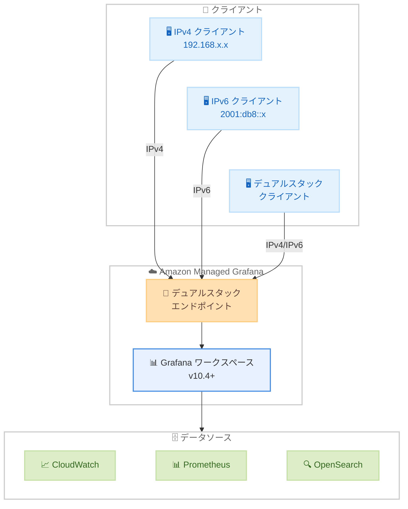

# Amazon Managed Grafana - デュアルスタック接続 (IPv6 および IPv4) サポート

**リリース日**: 2026 年 5 月 19 日
**サービス**: Amazon Managed Grafana
**機能**: デュアルスタック接続 (IPv6/IPv4)

📊 [このアップデートのインフォグラフィックを見る](https://takech9203.github.io/aws-news-summary/20260519-amazon-managed-grafana-ipv6.html)

## 概要

Amazon Managed Grafana がデュアルスタック接続をサポートし、ワークスペースが IPv4 と IPv6 の両方のプロトコルで通信できるようになった。これにより、IPv6 への移行を進める組織は IPv4 との互換性を維持しながら IPv6 経由で Grafana ワークスペースに接続できる。デュアルスタックモードは Grafana バージョン 10.4 以降を実行しているワークスペースで利用可能である。

インターネットの継続的な成長により利用可能な IPv4 アドレスが枯渇しつつある中、このアップデートはネットワークスタックの簡素化と将来への準備を同時に実現する重要な機能強化である。

**アップデート前の課題**

- Amazon Managed Grafana ワークスペースは IPv4 のみでの接続に限定されていた
- IPv6 環境からの接続には NAT64 等の変換メカニズムが必要だった
- VPC 内で重複するアドレス空間の管理が複雑化していた
- IPv6 移行を進める組織にとって Grafana ワークスペースが移行のボトルネックとなっていた

**アップデート後の改善**

- ワークスペースが IPv4 と IPv6 の両方で通信可能になった
- VPC 内の重複アドレス空間管理が不要になった
- IPv6 移行中の組織が IPv4 互換性を維持しながら段階的に移行できるようになった
- コンソール、API、CLI から簡単にデュアルスタック設定を有効化できるようになった

## アーキテクチャ図



IPv4 専用クライアント、IPv6 専用クライアント、デュアルスタッククライアントのいずれからでも、Amazon Managed Grafana のデュアルスタックエンドポイントを通じてワークスペースにアクセスできることを示している。

## サービスアップデートの詳細

### 主要機能

1. **デュアルスタックエンドポイント**
   - ワークスペースが IPv4 と IPv6 の両方のアドレスで到達可能になる
   - DNS は A レコード (IPv4) と AAAA レコード (IPv6) の両方を返す
   - クライアントは利用可能なプロトコルで自動的に接続

2. **ipAddressType パラメータ**
   - ワークスペース作成時または更新時に `IPv4` または `DualStack` を指定可能
   - 既存のワークスペースを IPv4 のみからデュアルスタックに変更可能
   - API、CLI、コンソールのすべてから設定変更が可能

3. **後方互換性**
   - 既存の IPv4 のみの接続は影響を受けない
   - デフォルトは引き続き IPv4 のため、明示的な設定変更が必要
   - IPv6 未対応の環境でも従来通り IPv4 で接続可能

## 技術仕様

### IP アドレスタイプ設定

| 項目 | 詳細 |
|------|------|
| パラメータ名 | `ipAddressType` |
| 設定値 | `IPv4` (デフォルト) / `DualStack` |
| 対象バージョン | Grafana 10.4 以降 |
| 設定タイミング | ワークスペース作成時または更新時 |
| 設定方法 | コンソール、API、CLI |

### API 変更履歴

| 日付 | サービス | 変更内容 |
|------|----------|----------|
| 2026/05/14 | [grafana](https://awsapichanges.com/archive/changes/bd1fb2-grafana.html) | 6 updated api methods - `ipAddressType` パラメータの追加 (CreateWorkspace, UpdateWorkspace のリクエスト/レスポンス、AssociateLicense, DeleteWorkspace, DescribeWorkspace, DisassociateLicense のレスポンス) |
| 2026/05/19 | [grafana](https://awsapichanges.com/archive/changes/7f1dfc-grafana.html) | 7 updated api methods - `degradedWorkspaceReason` フィールドと `DEGRADED` ステータスの追加 |

### 更新された API メソッド

| メソッド | リクエスト変更 | レスポンス変更 |
|----------|---------------|---------------|
| `CreateWorkspace` | `ipAddressType` パラメータ追加 | `ipAddressType` フィールド追加 |
| `UpdateWorkspace` | `ipAddressType` パラメータ追加 | `ipAddressType` フィールド追加 |
| `DescribeWorkspace` | - | `ipAddressType` フィールド追加 |
| `AssociateLicense` | - | `ipAddressType` フィールド追加 |
| `DeleteWorkspace` | - | `ipAddressType` フィールド追加 |
| `DisassociateLicense` | - | `ipAddressType` フィールド追加 |

## 設定方法

### 前提条件

1. Amazon Managed Grafana ワークスペースが Grafana バージョン 10.4 以降で稼働していること
2. AWS CLI v2 が最新バージョンにアップデートされていること
3. 適切な IAM 権限 (`grafana:UpdateWorkspace`) が付与されていること

### 手順

#### ステップ 1: 現在のワークスペース設定を確認

```bash
aws grafana describe-workspace \
  --workspace-id g-XXXXXXXXXX \
  --query 'workspace.{version:grafanaVersion,ipType:ipAddressType,status:status}'
```

ワークスペースの Grafana バージョンが 10.4 以降であることと、現在の IP アドレスタイプを確認する。

#### ステップ 2: デュアルスタックを有効化

```bash
aws grafana update-workspace \
  --workspace-id g-XXXXXXXXXX \
  --ip-address-type DualStack
```

ワークスペースの IP アドレスタイプをデュアルスタックに変更する。ワークスペースのステータスが `UPDATING` に変わり、完了すると `ACTIVE` に戻る。

#### ステップ 3: 設定変更の確認

```bash
aws grafana describe-workspace \
  --workspace-id g-XXXXXXXXXX \
  --query 'workspace.ipAddressType'
```

`DualStack` が返されることを確認する。

## メリット

### ビジネス面

- **将来への投資保護**: IPv4 アドレスの枯渇に備え、IPv6 対応を段階的に進められる
- **運用コスト削減**: NAT64/DNS64 等の変換メカニズムが不要になり、ネットワーク構成が簡素化される
- **コンプライアンス対応**: IPv6 対応を要件とする規制や標準への準拠が容易になる

### 技術面

- **ネットワーク簡素化**: VPC 内の重複アドレス空間管理が不要になる
- **段階的移行**: IPv4 互換性を維持しながら IPv6 への移行を進められる
- **エンドツーエンド接続**: IPv6 ネイティブ環境からの直接接続が可能になり、レイテンシーが改善される

## デメリット・制約事項

### 制限事項

- Grafana バージョン 10.4 未満のワークスペースではデュアルスタックを利用できない
- デュアルスタック有効化にはワークスペースの更新が必要であり、一時的にステータスが `UPDATING` になる
- VPC 設定を使用している場合、VPC のサブネットが IPv6 CIDR ブロックを持っている必要がある

### 考慮すべき点

- クライアント側のネットワーク環境が IPv6 に対応していることの確認が必要
- セキュリティグループやネットワーク ACL で IPv6 トラフィックを適切に許可する設定が必要
- DNS 解決で AAAA レコードが返されるため、IPv6 接続に問題がある環境ではハッピーアイボール問題に注意が必要

## ユースケース

### ユースケース 1: IPv6 移行中の大規模組織

**シナリオ**: 大規模な組織がインフラ全体を IPv6 に段階的に移行しており、監視基盤である Grafana ワークスペースも移行対象に含めたい。

**実装例**:
```bash
# 既存ワークスペースをデュアルスタックに更新
aws grafana update-workspace \
  --workspace-id g-XXXXXXXXXX \
  --ip-address-type DualStack
```

**効果**: IPv6 移行済みのチームは IPv6 で、未移行のチームは IPv4 で引き続きアクセスでき、組織全体の移行ペースに合わせた柔軟な運用が可能になる。

### ユースケース 2: IPv4 アドレス枯渇への対応

**シナリオ**: VPC 内で多数のサービスを運用しており、IPv4 プライベートアドレスが不足しつつある。新規サービスには IPv6 を使用したい。

**実装例**:
```bash
# 新規ワークスペースをデュアルスタックで作成
aws grafana create-workspace \
  --workspace-name "monitoring-v6" \
  --account-access-type CURRENT_ACCOUNT \
  --authentication-providers AWS_SSO \
  --permission-type SERVICE_MANAGED \
  --grafana-version "10.4" \
  --ip-address-type DualStack
```

**効果**: IPv6 サブネット上の新規サービスから NAT 変換なしで直接 Grafana にメトリクスデータを送信でき、ネットワーク構成が簡素化される。

### ユースケース 3: マルチリージョン監視環境の統合

**シナリオ**: 複数リージョンにまたがるインフラの監視を行っており、一部リージョンでは IPv6 優先の設計を採用している。

**実装例**:
```bash
# 各リージョンのワークスペースでデュアルスタックを有効化
for region in us-east-1 eu-west-1 ap-northeast-1; do
  aws grafana update-workspace \
    --workspace-id $(aws grafana list-workspaces \
      --region $region \
      --query 'workspaces[0].id' --output text) \
    --ip-address-type DualStack \
    --region $region
done
```

**効果**: すべてのリージョンで IPv4/IPv6 どちらの環境からもアクセス可能になり、統一的な監視体験を提供できる。

## 料金

デュアルスタック接続の有効化自体に追加料金は発生しない。Amazon Managed Grafana の通常料金が適用される。

### 料金例

| ライセンスタイプ | 月額料金 |
|------------------|----------|
| Editor/Administrator | $9 / アクティブユーザー |
| Viewer | $5 / アクティブユーザー |

- 90 日間の無料トライアルあり (アカウントあたり最大 5 ユーザー)
- 各ワークスペースには最低 1 つの Editor ライセンスが必要

## 利用可能リージョン

Amazon Managed Grafana が一般利用可能なすべてのリージョンでデュアルスタック接続を利用できる。

主要なリージョン。

- 米国東部 (バージニア北部) - us-east-1
- 米国東部 (オハイオ) - us-east-2
- 米国西部 (オレゴン) - us-west-2
- 欧州 (フランクフルト) - eu-central-1
- 欧州 (アイルランド) - eu-west-1
- 欧州 (ロンドン) - eu-west-2
- アジアパシフィック (東京) - ap-northeast-1
- アジアパシフィック (シンガポール) - ap-southeast-1
- アジアパシフィック (シドニー) - ap-southeast-2

## 関連サービス・機能

- **Amazon VPC**: デュアルスタック VPC と組み合わせることで、エンドツーエンドの IPv6 接続を実現
- **Amazon CloudWatch**: Grafana のデータソースとして IPv6 対応環境からメトリクスを収集
- **Amazon Managed Service for Prometheus**: IPv6 環境のワークロードからメトリクスを収集し Grafana で可視化
- **AWS IPv6 ホワイトペーパー**: IPv6 移行の計画と実装に関するベストプラクティスを提供

## 参考リンク

- 📊 [インフォグラフィック](https://takech9203.github.io/aws-news-summary/20260519-amazon-managed-grafana-ipv6.html)
- [公式発表 (What's New)](https://aws.amazon.com/about-aws/whats-new/2026/05/amazon-managed-grafana-ipv6/)
- [Amazon Managed Grafana ユーザーガイド](https://docs.aws.amazon.com/grafana/latest/userguide/)
- [料金ページ](https://aws.amazon.com/grafana/pricing/)
- [AWS IPv6 ホワイトペーパー](https://docs.aws.amazon.com/whitepapers/latest/ipv6-on-aws/ipv6-on-aws.html)

## まとめ

Amazon Managed Grafana のデュアルスタック接続サポートにより、IPv6 移行を進める組織は既存の IPv4 接続を維持しながら段階的に IPv6 を導入できるようになった。Grafana バージョン 10.4 以降のワークスペースで追加料金なく利用可能であり、コンソール、API、CLI から簡単に有効化できる。IPv4 アドレスの枯渇が進む中、早期にデュアルスタック設定を有効化し、将来の IPv6 完全移行に備えることを推奨する。
