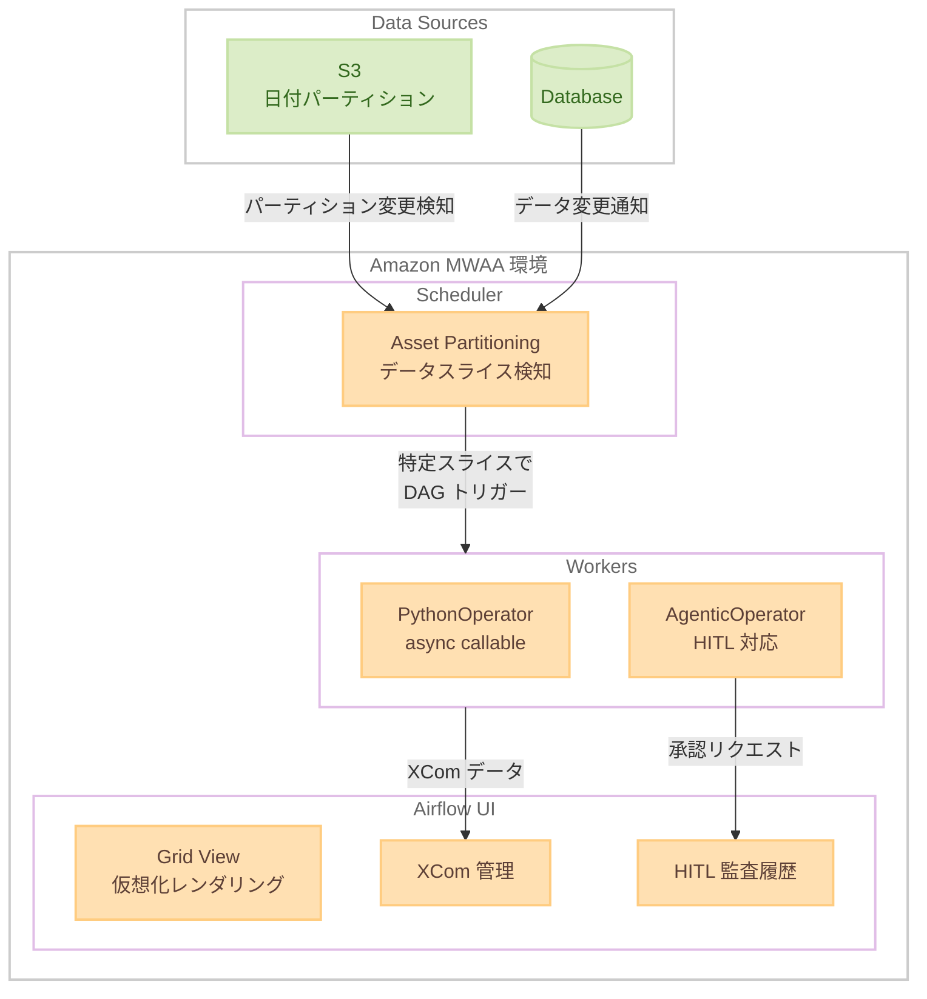

# Amazon MWAA - Apache Airflow 3.2 サポート

**リリース日**: 2026 年 5 月 19 日
**サービス**: Amazon Managed Workflows for Apache Airflow (MWAA)
**機能**: Apache Airflow 3.2 サポート

[このアップデートのインフォグラフィックを見る](https://takech9203.github.io/aws-news-summary/20260519-amazon-mwaa-now-supports-apache-airflow-3-2.html)

## 概要

Amazon Managed Workflows for Apache Airflow (MWAA) が Apache Airflow 3.2 をサポートした。Apache Airflow 3.2 はオープンソースのワークフローオーケストレーションフレームワークの最新メジャーリリースであり、データ認識スケジューリング機能と開発者の生産性向上が主な特徴である。Amazon MWAA はインフラストラクチャを管理することなく Apache Airflow をスケールで実行できるマネージドサービスであり、今回のリリースにより AWS 上でデータパイプラインを構築・運用するチームに新たな機能が提供される。

本アップデートでは、アセットパーティショニングによる下流 DAG のきめ細かいトリガー制御、Human-in-the-Loop (HITL) 機能の拡張、Grid View の仮想化による大規模 DAG のレンダリング高速化、Airflow UI からの完全な XCom 管理、PythonOperator での非同期呼び出し可能オブジェクトのサポートなど、多数の改善が含まれている。

**アップデート前の課題**

- アセット全体の変更でしか下流 DAG をトリガーできず、日付パーティションなど特定のデータスライスに基づく精密な制御ができなかった
- Human-in-the-Loop の承認履歴を一覧で確認する手段がなく、監査対応が困難だった
- 大規模 DAG の Grid View レンダリングが遅く、UI の操作性に課題があった
- XCom の管理に CLI やコードレベルの操作が必要で、UI から直接管理できなかった
- PythonOperator で非同期処理を実行する場合、別途ラッパーの実装が必要だった

**アップデート後の改善**

- アセットパーティショニングにより、日付パーティション付き S3 パスなど特定のデータスライスに基づいて下流 DAG をトリガー可能になった
- HITL の完全な監査履歴ビュー、AgenticOperator での HITL サポート、Deadline Alerts の同期コールバックが追加された
- Grid View の仮想化により大規模 DAG のレンダリングが高速化された
- Airflow UI から XCom を完全に管理できるようになった
- PythonOperator で async callable を直接サポートし、非同期処理の実装が簡素化された

## アーキテクチャ図



Amazon MWAA における Apache Airflow 3.2 のデータ認識スケジューリングフローを示す。S3 の日付パーティションやデータベースの変更を Asset Partitioning が検知し、特定のデータスライスに基づいて下流の DAG をトリガーする。

## サービスアップデートの詳細

### 主要機能

1. **Asset Partitioning (アセットパーティショニング)**
   - アセット全体ではなく、特定のデータスライスに基づいて下流 DAG をトリガー可能
   - 日付パーティション付き S3 パスなど、データの一部分の更新を検知して処理を開始
   - データエンジニアリングチームにパイプライン実行のより精密な制御を提供
   - 不要な再処理を回避し、コンピューティングリソースを最適化

2. **Human-in-the-Loop (HITL) 機能拡張**
   - 承認の完全な監査履歴ビューにより、コンプライアンスと追跡性が向上
   - AgenticOperator での HITL サポートにより、AI エージェント型ワークフローに人間の承認プロセスを組み込み可能
   - Deadline Alerts の同期コールバックサポートにより、期限切れ時の即時対応が可能

3. **Grid View 仮想化**
   - 大規模 DAG の UI レンダリングを高速化
   - 数百のタスクを持つ DAG でもスムーズなスクロールと表示を実現
   - 運用チームのモニタリング効率を向上

4. **XCom UI 管理**
   - Airflow UI から XCom データの閲覧、作成、削除が可能
   - タスク間のデータ受け渡しのデバッグが容易に
   - CLI やコードを使わずに運用上のトラブルシューティングが可能

5. **PythonOperator async callable サポート**
   - async/await パターンを PythonOperator で直接使用可能
   - 非同期 I/O 操作を含むタスクの実装が簡素化
   - 既存の非同期ライブラリとの統合が容易に

## 技術仕様

### 対応バージョン

| 項目 | 詳細 |
|------|------|
| サポートバージョン | Apache Airflow 3.2 |
| アップグレードパス | Airflow 2.11 以降からアップグレード可能 |
| 新規作成 | AWS Management Console から数クリックで環境作成 |
| 基盤リリース日 | Apache Airflow 3.2.0 (2026-04-07) |

### API 変更履歴

| 日付 | サービス | 変更内容 |
|------|----------|----------|
| 2026/05/06 | [AmazonMWAA](https://awsapichanges.com/archive/changes/7068f3-airflow.html) | 3 updated api methods - WebserverAccessMode に PUBLIC_AND_PRIVATE オプション追加 |

### API 変更の詳細

`WebserverAccessMode` に新しい値 `PUBLIC_AND_PRIVATE` が追加された。これにより、Airflow Web サーバーがパブリックとプライベートの両方のエンドポイントからアクセス可能になる。VPC 内のワーカーがインターネットアクセスなしで Task API にプライベートに到達でき、かつ Airflow UI へのパブリックアクセスも維持される。

対象メソッド:

- `CreateEnvironment`
- `GetEnvironment`
- `UpdateEnvironment`

```json
{
  "WebserverAccessMode": "PRIVATE_ONLY | PUBLIC_ONLY | PUBLIC_AND_PRIVATE"
}
```

## 設定方法

### 前提条件

1. AWS アカウントと適切な IAM 権限
2. VPC、サブネット、セキュリティグループの設定
3. S3 バケット (DAG ファイル格納用)
4. 既存環境からアップグレードする場合は Airflow 2.11 以降が必要

### 手順

#### ステップ 1: 新規環境の作成

```bash
aws mwaa create-environment \
  --name my-airflow-32-env \
  --airflow-version "3.2" \
  --source-bucket-arn arn:aws:s3:::my-airflow-dags \
  --dag-s3-path dags/ \
  --execution-role-arn arn:aws:iam::123456789012:role/MWAAExecutionRole \
  --network-configuration '{"SubnetIds":["subnet-xxx","subnet-yyy"],"SecurityGroupIds":["sg-zzz"]}' \
  --environment-class mw1.small
```

新しい Apache Airflow 3.2 環境を作成する。環境クラス、ネットワーク設定、DAG の S3 パスを指定する。

#### ステップ 2: 既存環境のアップグレード

```bash
aws mwaa update-environment \
  --name my-existing-env \
  --airflow-version "3.2"
```

既存の Airflow 2.11 以降の環境を 3.2 にアップグレードする。アップグレード中は環境が一時的に利用不可になる点に注意が必要である。

#### ステップ 3: Asset Partitioning を使用した DAG の定義

```python
from airflow.sdk import DAG, Asset, AssetPartition
from airflow.operators.python import PythonOperator
from datetime import datetime

# 日付パーティション付きアセットの定義
partitioned_asset = Asset(
    "s3://my-bucket/data/",
    partitions={"date": AssetPartition(format="%Y-%m-%d")}
)

with DAG(
    dag_id="downstream_processing",
    schedule=[partitioned_asset],
    start_date=datetime(2026, 1, 1),
):
    process_task = PythonOperator(
        task_id="process_partition",
        python_callable=process_data,
    )
```

Asset Partitioning を使用して、S3 の特定の日付パーティションが更新された場合にのみ下流の DAG をトリガーする設定例である。

## メリット

### ビジネス面

- **コスト最適化**: アセットパーティショニングにより不要な再処理を回避し、コンピューティングコストを削減
- **コンプライアンス強化**: HITL の監査履歴により承認プロセスの追跡と監査対応が容易に
- **運用効率向上**: UI 改善により運用チームのトラブルシューティング時間を短縮

### 技術面

- **精密なパイプライン制御**: データスライス単位でのスケジューリングによりデータ処理の粒度が向上
- **AI ワークフロー統合**: AgenticOperator の HITL サポートにより、AI エージェント型パイプラインに人間の監督を組み込み可能
- **開発生産性向上**: async callable サポートと XCom UI 管理により、開発・デバッグサイクルが短縮
- **スケーラビリティ改善**: Grid View 仮想化により数百タスク規模の DAG でも快適な操作が可能

## デメリット・制約事項

### 制限事項

- Airflow 2.10 以前のバージョンからは直接 3.2 へアップグレードできない (2.11 以降が必要)
- アップグレード時にカスタムプラグインや依存関係の互換性確認が必要
- Airflow 3.x 系での破壊的変更により、既存 DAG の修正が必要になる可能性がある

### 考慮すべき点

- メジャーバージョンアップのため、本番環境への適用前に十分なテストが必要
- Airflow 2.x 系から 3.x 系への移行ガイドを確認し、非互換な変更点を把握する必要がある
- Asset Partitioning は新しい概念のため、チームメンバーの学習コストが発生する
- HITL 機能を活用する場合、承認フローの設計と運用体制の整備が前提となる

## ユースケース

### ユースケース 1: 日次パーティションデータの増分処理

**シナリオ**: データレイクに日付パーティションで格納される大量のログデータを処理する ETL パイプラインにおいて、特定の日付のデータのみが更新された場合に、その日付分のみを再処理したい。

**実装例**:
```python
from airflow.sdk import DAG, Asset, AssetPartition
from airflow.providers.amazon.aws.operators.glue import GlueJobOperator

daily_logs = Asset(
    "s3://data-lake/logs/",
    partitions={"date": AssetPartition(format="%Y-%m-%d")}
)

with DAG(
    dag_id="incremental_log_processing",
    schedule=[daily_logs],
    start_date=datetime(2026, 1, 1),
):
    run_glue = GlueJobOperator(
        task_id="transform_logs",
        job_name="log-transformer",
    )
```

**効果**: 全データの再処理を回避し、処理時間とコストを大幅に削減。日次 ETL の実行時間を数時間から数分に短縮可能。

### ユースケース 2: AI エージェントワークフローの承認制御

**シナリオ**: 生成 AI を活用した自動レポート作成パイプラインで、AI が生成したコンテンツを公開前に人間がレビュー・承認するプロセスを組み込みたい。

**実装例**:
```python
from airflow.sdk import DAG
from airflow.operators.python import PythonOperator
from airflow.providers.standard.operators.agentic import AgenticOperator

with DAG(
    dag_id="ai_report_pipeline",
    start_date=datetime(2026, 1, 1),
    schedule="@daily",
):
    generate = AgenticOperator(
        task_id="generate_report",
        agent_config={
            "model": "bedrock/claude",
            "hitl_enabled": True,
        },
    )
    publish = PythonOperator(
        task_id="publish_report",
        python_callable=publish_to_cms,
    )
    generate >> publish
```

**効果**: AI 生成コンテンツの品質管理と人間の監督を自動化されたパイプライン内で実現。承認履歴が完全に記録され、監査対応も容易になる。

### ユースケース 3: 非同期 API 呼び出しを含むデータ収集パイプライン

**シナリオ**: 複数の外部 API からデータを並行して収集する処理で、async/await パターンを活用してスループットを向上させたい。

**実装例**:
```python
import aiohttp
from airflow.sdk import DAG
from airflow.operators.python import PythonOperator

async def fetch_multiple_apis():
    async with aiohttp.ClientSession() as session:
        urls = [
            "https://api.example.com/data1",
            "https://api.example.com/data2",
            "https://api.example.com/data3",
        ]
        tasks = [session.get(url) for url in urls]
        responses = await asyncio.gather(*tasks)
        return [await r.json() for r in responses]

with DAG(
    dag_id="async_data_collection",
    start_date=datetime(2026, 1, 1),
    schedule="@hourly",
):
    collect = PythonOperator(
        task_id="collect_data",
        python_callable=fetch_multiple_apis,
    )
```

**効果**: 非同期 I/O により複数 API への同時リクエストが可能になり、データ収集タスクのスループットが大幅に向上。ラッパーコード不要で async 関数を直接使用可能。

## 料金

Amazon MWAA の料金は環境インスタンス、ワーカー、スケジューラー、Web サーバー、メタデータベースストレージの使用量に基づく。Apache Airflow 3.2 の利用による追加料金は発生しない。

### 料金例 (米国東部 バージニア北部リージョン)

| コンポーネント | サイズ | 月額料金 (概算) |
|----------------|--------|-----------------|
| 環境インスタンス | Small | 約 $353/月 (730 時間 x $0.49) |
| 環境インスタンス | Large | 約 $723/月 (730 時間 x $0.99) |
| 追加ワーカー | Small | 約 $40/月 (730 時間 x $0.055) |
| 追加ワーカー | Large | 約 $161/月 (730 時間 x $0.22) |
| メタデータベースストレージ | - | $0.10/GB-月 |

環境には 1 ワーカー、2 スケジューラー、2 Web サーバーが含まれる。1 秒単位の課金が適用される。

## 利用可能リージョン

Amazon MWAA が現在サポートされているすべてのリージョンで利用可能。主要なリージョンは以下の通り。

- 米国東部 (バージニア北部、オハイオ)
- 米国西部 (オレゴン)
- アジアパシフィック (東京、シンガポール、シドニー、ムンバイ、ソウル)
- 欧州 (アイルランド、フランクフルト、ロンドン、ストックホルム)
- カナダ (中部)
- 南米 (サンパウロ)

詳細は [AWS リージョン別のサービス一覧](https://aws.amazon.com/about-aws/global-infrastructure/regional-product-services/) を参照。

## 関連サービス・機能

- **Amazon S3**: DAG ファイル、プラグイン、依存関係の格納先。Asset Partitioning のデータソースとしても使用
- **AWS Glue**: ETL ジョブの実行。MWAA から Glue ジョブをオーケストレーションするユースケースが多い
- **Amazon Bedrock**: AgenticOperator と組み合わせた AI エージェント型ワークフローの構築
- **Amazon CloudWatch**: MWAA 環境のメトリクスとログの監視
- **AWS Step Functions**: より複雑なワークフローオーケストレーションの代替・補完手段

## 参考リンク

- [このアップデートのインフォグラフィック](https://takech9203.github.io/aws-news-summary/20260519-amazon-mwaa-now-supports-apache-airflow-3-2.html)
- [公式発表 (What's New)](https://aws.amazon.com/about-aws/whats-new/2026/04/amazon-mwaa-now-supports-apache-airflow-3-2/)
- [Amazon MWAA ドキュメント](https://docs.aws.amazon.com/mwaa/latest/userguide/what-is-mwaa.html)
- [Amazon MWAA 料金](https://aws.amazon.com/managed-workflows-for-apache-airflow/pricing/)
- [Apache Airflow 3.2 リリースノート](https://airflow.apache.org/docs/apache-airflow/stable/release_notes.html#airflow-3-2-0-2026-04-07)
- [AWS API Changes - AmazonMWAA](https://awsapichanges.com/archive/changes/7068f3-airflow.html)

## まとめ

Amazon MWAA の Apache Airflow 3.2 サポートは、データパイプラインのスケジューリング精度と開発者体験を大幅に向上させるアップデートである。特に Asset Partitioning による増分処理の最適化と HITL 機能の拡張は、データエンジニアリングチームと AI ワークフローの運用に大きな価値をもたらす。既存の Airflow 2.11 以降の環境からは AWS Management Console から数クリックでアップグレード可能であるため、テスト環境での検証を経て早期の移行を検討することを推奨する。
