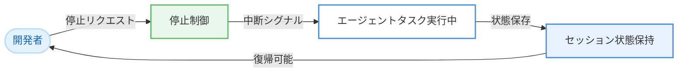

# Kiro - セッション安定性、停止制御、モバイルレイアウト修正

**リリース日**: 2026 年 5 月 19 日
**サービス**: Kiro (AWS AI-powered IDE)
**機能**: セッション安定性・停止制御・モバイルレイアウト修正

[このアップデートのインフォグラフィックを見る](https://takech9203.github.io/aws-news-summary/20260519-kiro-changelog-2026-05-19.html)

## 概要

Kiro の 2026 年 5 月 19 日のアップデートでは、エージェントのタスク実行中に停止制御が可能になったほか、ワークスペース起動時の進捗表示、小さい画面でのレイアウト改善、セッション安定性の向上が実施された。

今回のリリースは UX の安定性と操作性に焦点を当てた改善であり、特にエージェントの停止制御は、意図しないタスク実行を即座に中断できるようになる重要な機能追加である。

**アップデート前の課題**

- エージェントがタスクを実行中に、ユーザーが途中で停止する手段がなく、完了まで待つ必要があった
- ワークスペースの起動中に進捗状況が表示されず、ユーザーはロード完了まで状態を把握できなかった
- 小さい画面やモバイルデバイスでのレイアウトが最適化されておらず、表示崩れが発生していた
- セッションが不安定になるケースがあり、作業中に予期しない切断が発生する可能性があった

**アップデート後の改善**

- エージェントのタスク実行中にいつでも停止でき、不要な処理の即時中断が可能になった
- ワークスペース起動時に進捗インジケーターが表示され、現在の状態を把握できるようになった
- 小さい画面でのレイアウトが最適化され、モバイルやタブレットでも快適に利用できるようになった
- セッション安定性が向上し、長時間の作業セッションでも安定した接続が維持されるようになった

## アーキテクチャ図

停止制御のフローを示す。ユーザーが停止リクエストを発行すると、実行中のエージェントタスクに中断シグナルが送られ、現在の状態が保持される。

## サービスアップデートの詳細

### 主要機能

1. **停止制御 (Stop Control)**
   - エージェントがタスクを実行中でも、ユーザーが任意のタイミングで処理を停止可能
   - 長時間実行されるタスクや意図しない方向に進んでいるタスクを即座に中断できる
   - 停止後もセッション状態は維持され、作業の継続が可能

2. **ワークスペース起動時の進捗表示 (Progress Visibility)**
   - ワークスペースのスピンアップ中に進捗インジケーターを表示
   - 環境構築のどの段階にあるかをリアルタイムで確認可能
   - ユーザーの待ち時間における不安を軽減

3. **モバイルレイアウト修正 (Mobile Layout Fixes)**
   - 小さい画面でのレイアウトが改善され、表示崩れが解消
   - レスポンシブデザインの最適化により、タブレットやモバイルデバイスでの利用体験が向上

4. **セッション安定性の改善 (Session Stability)**
   - 複数のセッション安定性に関する問題が解決
   - 長時間の作業セッションでも安定した接続を維持
   - 予期しない切断やセッションロスのリスクが軽減

## 技術仕様

### 停止制御の仕様

| 項目 | 詳細 |
|------|------|
| 対象 | エージェントタスク実行中の全操作 |
| 動作 | ユーザーからの停止リクエストによりタスクを即時中断 |
| 状態管理 | 停止時点のセッション状態を保持 |
| 復帰 | 停止後に新しいタスクの開始が可能 |

### レイアウト改善の対象

| 項目 | 詳細 |
|------|------|
| 対象デバイス | 小さい画面、モバイル、タブレット |
| 改善内容 | レスポンシブレイアウトの最適化 |
| 影響範囲 | Kiro Web UI 全体 |

## 設定方法

### 前提条件

1. 有効な Kiro アカウントでサインインしていること

### 手順

今回のアップデートはすべて自動的に適用される。ユーザー側での設定変更は不要。

- **停止制御**: Kiro の UI 上に停止ボタンが表示される。エージェントがタスクを実行中にクリックすることで停止可能
- **進捗表示**: ワークスペース起動時に自動的に進捗インジケーターが表示される
- **レイアウト修正**: 自動適用。小さい画面でアクセスした際に最適化されたレイアウトで表示される
- **セッション安定性**: バックエンド側の改善のため、ユーザー側の操作は不要

## メリット

### ビジネス面

- **作業効率の向上**: 不要なタスクを即座に停止できるため、無駄な待ち時間が削減され、開発サイクルが高速化
- **モバイルワークの促進**: レイアウト改善により外出先やタブレットからのコードレビューや軽微な作業が可能に
- **安定性による信頼性向上**: セッション安定性の改善により、長時間のペアプログラミングセッションやコードレビューが中断なく継続可能

### 技術面

- **エージェント制御の強化**: 停止制御により、エージェントの動作に対するユーザーの主導権が確保され、予期しない変更のリスクが軽減
- **UX の改善**: 進捗表示によりシステムの応答性が体感的に向上し、ユーザーのフラストレーションが軽減
- **セッション管理の堅牢化**: 安定性向上により、ネットワーク変動やサーバー側のイベントに対する耐障害性が改善

## デメリット・制約事項

### 制限事項

- 停止制御の詳細な動作仕様 (停止時のロールバック動作やファイルの途中書き込み状態など) は公式ドキュメントで確認が必要
- モバイルレイアウト修正の対象範囲や、完全に対応するデバイスの詳細は明示されていない
- セッション安定性の改善は段階的なものであり、全ての接続問題が解消されたわけではない

### 考慮すべき点

- エージェントタスクの停止タイミングによっては、途中状態のファイルが残る可能性がある
- モバイルでの利用はレイアウト改善に留まり、タッチ操作の完全最適化ではない点に注意

## ユースケース

### ユースケース 1: 意図しないリファクタリングの中断

**シナリオ**: エージェントに「この関数を最適化して」と依頼したが、予想以上に広範囲のリファクタリングを開始してしまった場合

**効果**: 停止制御により即座にタスクを中断し、より具体的な指示でやり直すことが可能。意図しない大規模変更を未然に防止できる。

### ユースケース 2: 外出先でのコードレビュー

**シナリオ**: タブレットからプルリクエストのレビューコメントを確認し、簡単な修正をエージェントに依頼したい場合

**効果**: モバイルレイアウトの改善により、小さい画面でも快適にコード差分の確認やエージェントへの指示が可能。通勤時間や移動中の隙間時間を有効活用できる。

### ユースケース 3: 長時間のペアプログラミングセッション

**シナリオ**: 複数時間にわたるエージェントとの協調開発セッションで、以前はセッション切断により作業が中断されていた場合

**効果**: セッション安定性の改善により、長時間のセッションでも安定した接続が維持され、作業の継続性が確保される。

## 料金

今回のアップデートは既存の Kiro サブスクリプションに含まれており、追加料金は発生しない。

## 利用可能リージョン

Kiro はグローバルサービスとして提供されており、リージョンの制約なく利用可能。

## 関連サービス・機能

- **Kiro Agent**: AI エージェント機能。停止制御が追加されたことにより、ユーザーの主導権がさらに強化
- **Kiro Workspace**: クラウド開発環境。起動時の進捗表示が追加され、ユーザー体験が改善
- **Kiro Web**: ブラウザベースの Kiro インターフェース。モバイルレイアウト修正の主な対象

## 参考リンク

- [インフォグラフィック](https://takech9203.github.io/aws-news-summary/20260519-kiro-changelog-2026-05-19.html)
- [Kiro Changelog](https://kiro.dev/changelog/)
- [Kiro ドキュメント](https://kiro.dev/docs/)

## まとめ

Kiro の 2026 年 5 月 19 日アップデートは、エージェントの停止制御、ワークスペース起動時の進捗表示、モバイルレイアウト修正、セッション安定性の改善という 4 つの UX 改善を提供する。特に停止制御の追加は、AI エージェントとの協調作業においてユーザーの主導権を確保する重要な機能であり、安心してエージェントにタスクを委任できる環境を実現する。自動適用のアップデートのため、すべての Kiro ユーザーが即座に恩恵を受けることができる。
