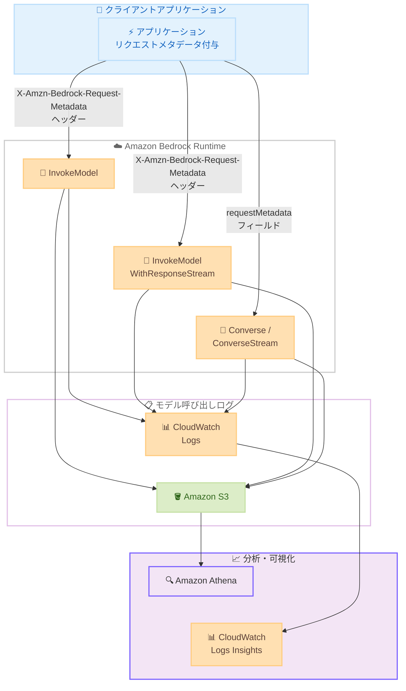

# Amazon Bedrock - リクエストレベルの使用量アトリビューション拡張

**リリース日**: 2026 年 5 月 20 日
**サービス**: Amazon Bedrock
**機能**: InvokeModel / InvokeModelWithResponseStream API でのリクエストメタデータサポート

📊 [このアップデートのインフォグラフィックを見る](https://takech9203.github.io/aws-news-summary/20260520-amazon-bedrock-request-level-usage-attribution.html)

## 概要

Amazon Bedrock が InvokeModel および InvokeModelWithResponseStream API でリクエストレベルの使用量アトリビューション (帰属) をサポートしました。これにより、個々のモデル推論呼び出しにチーム名、プロジェクト名、環境名などのメタデータタグを付与し、モデル呼び出しログで使用状況を分析できるようになります。

これまでリクエストレベルのメタデータは Converse および ConverseStream API でのみ利用可能でしたが、今回のアップデートにより bedrock-runtime エンドポイント全体で一貫したタグ付けが可能になりました。追加のリソースプロビジョニングは不要で、各リクエストに異なるタグセットを付与できます。

**アップデート前の課題**

- リクエストレベルのメタデータタグ付けは Converse / ConverseStream API でのみサポートされていた
- InvokeModel API を使用するワークロードでは、リクエスト単位での使用量追跡ができなかった
- bedrock-runtime エンドポイント全体で一貫したアトリビューション手法が存在しなかった

**アップデート後の改善**

- InvokeModel および InvokeModelWithResponseStream API でもリクエストメタデータが利用可能に
- bedrock-runtime エンドポイント全体で統一的なタグ付けが実現
- 追加リソースの作成・設定なしで、各リクエストにキーバリュー形式のメタデータを付与可能

## アーキテクチャ図



クライアントアプリケーションが各 API にリクエストメタデータを付与し、モデル呼び出しログを通じて CloudWatch Logs や Amazon S3 に記録された後、Athena や CloudWatch Logs Insights で分析する全体フローを示しています。

## サービスアップデートの詳細

### 主要機能

1. **InvokeModel API でのリクエストメタデータサポート**
   - `X-Amzn-Bedrock-Request-Metadata` HTTP ヘッダーでキーバリュー形式のメタデータを付与
   - チーム、環境、テストケースなど任意のディメンションでタグ付け可能
   - AWS Signature Version 4 の SignedHeaders にヘッダーを含める必要あり

2. **InvokeModelWithResponseStream API でのリクエストメタデータサポート**
   - ストリーミングレスポンスの API でも同様のメタデータヘッダーをサポート
   - InvokeModel と同一のヘッダー形式で一貫した利用体験を提供

3. **モデル呼び出しログとの統合**
   - リクエストメタデータはログの `requestMetadata` フィールドに記録
   - CloudWatch Logs Insights でフィルタリング・集計が可能
   - Amazon S3 に出力し Amazon Athena で SQL クエリによる分析が可能

## 技術仕様

### メタデータの制限事項

| 項目 | 詳細 |
|------|------|
| 最大エントリ数 | 1 リクエストあたり 16 エントリ |
| キーの最大文字数 | 256 文字 |
| 値の最大文字数 | 256 文字 |
| 使用可能文字 | 英数字および一部の句読点文字 |

### API 変更履歴

| 日付 | サービス | 変更内容 |
|------|----------|----------|
| 2026/05/20 | [Amazon Bedrock Runtime](https://awsapichanges.com/archive/changes/2d725f-bedrock-runtime.html) | 2 updated methods - InvokeModel と InvokeModelWithResponseStream に requestMetadata パラメータを追加 |

### メタデータ付与方法の比較

| API | メタデータ付与方法 |
|-----|-------------------|
| InvokeModel | `X-Amzn-Bedrock-Request-Metadata` HTTP ヘッダー |
| InvokeModelWithResponseStream | `X-Amzn-Bedrock-Request-Metadata` HTTP ヘッダー |
| Converse | リクエストボディの `requestMetadata` フィールド |
| ConverseStream | リクエストボディの `requestMetadata` フィールド |

## 設定方法

### 前提条件

1. Amazon Bedrock が利用可能な AWS 商用リージョンのアカウント
2. 対象リージョンでモデル呼び出しログが有効化されていること
3. 適切な IAM 権限 (Bedrock Runtime API の呼び出し権限)

### 手順

#### ステップ 1: モデル呼び出しログの有効化

```bash
aws bedrock put-model-invocation-logging-configuration \
  --logging-config '{
    "cloudWatchConfig": {
      "logGroupName": "/aws/bedrock/model-invocations",
      "roleArn": "arn:aws:iam::123456789012:role/BedrockLoggingRole",
      "largeDataDelivery": {
        "s3Config": {
          "bucketName": "my-bedrock-logs",
          "keyPrefix": "invocation-logs/"
        }
      }
    },
    "s3Config": {
      "bucketName": "my-bedrock-logs",
      "keyPrefix": "invocation-logs/"
    }
  }'
```

モデル呼び出しログを CloudWatch Logs と Amazon S3 の両方に配信する設定です。リクエストメタデータはログが有効な場合のみ記録されます。

#### ステップ 2: リクエストメタデータを付与した API 呼び出し

```python
import boto3
import json

client = boto3.client("bedrock-runtime", region_name="us-east-1")

response = client.invoke_model(
    modelId="anthropic.claude-3-haiku-20240307-v1:0",
    contentType="application/json",
    accept="application/json",
    body=json.dumps({
        "anthropic_version": "bedrock-2023-05-31",
        "max_tokens": 100,
        "messages": [{"role": "user", "content": "Hello"}]
    }),
    requestMetadata=json.dumps({
        "team": "ml-platform",
        "environment": "production",
        "project": "chatbot-v2"
    })
)
```

Python SDK (boto3) を使用して InvokeModel API にリクエストメタデータを付与する例です。SDK が自動的に SigV4 署名にヘッダーを含めます。

#### ステップ 3: CloudWatch Logs Insights でのクエリ

```
fields @timestamp, modelId, requestMetadata.team, requestMetadata.environment
| filter requestMetadata.team = "ml-platform"
| stats count() as invocations by requestMetadata.project
| sort invocations desc
```

CloudWatch Logs Insights を使用して、チームやプロジェクトごとのモデル呼び出し回数を集計するクエリ例です。

## メリット

### ビジネス面

- **コスト配分の精緻化**: チーム・プロジェクト単位で使用量を把握し、正確なチャージバックが可能
- **使用量の可視化**: 組織全体での AI 使用状況を定量的に把握し、経営レポートに活用可能
- **最適化の促進**: 使用パターンの分析により、不要な推論コストの削減機会を特定可能

### 技術面

- **統一的な API 体験**: bedrock-runtime エンドポイント全体で一貫したメタデータ付与が可能
- **ゼロプロビジョニング**: 追加のリソース作成や事前設定が不要で即座に利用開始可能
- **既存のログ基盤との統合**: CloudWatch Logs、S3、Athena など既存の AWS 分析サービスと連携

## デメリット・制約事項

### 制限事項

- 1 リクエストあたり最大 16 エントリまでのメタデータに制限
- キーおよび値はそれぞれ最大 256 文字
- モデル呼び出しログが有効でない場合、メタデータは記録されない (リクエスト自体は成功する)
- bedrock-mantle エンドポイントではリクエストメタデータは非対応

### 考慮すべき点

- リクエストメタデータは AWS Cost Explorer や CUR にコスト配分タグとして表示されない (ログベースでの分析が必要)
- コスト分析を行うには、呼び出しログのトークン数と料金表を突合する必要がある
- メタデータに PII や認証情報などの機密データを含めないよう注意が必要
- SigV4 署名時に `X-Amzn-Bedrock-Request-Metadata` ヘッダーを SignedHeaders に含める必要がある (SDK 利用時は自動処理)

## ユースケース

### ユースケース 1: マルチチーム環境でのコストチャージバック

**シナリオ**: 複数のチームが共有 AWS アカウントで Amazon Bedrock を利用しており、チームごとの使用コストを按分したい。

**実装例**:
```python
response = client.invoke_model(
    modelId="anthropic.claude-3-sonnet-20240229-v1:0",
    body=json.dumps(payload),
    requestMetadata=json.dumps({
        "team": "customer-support",
        "cost_center": "CC-4521",
        "environment": "production"
    })
)
```

**効果**: チームごとの推論回数・トークン消費量をログから集計し、月次のコストレポートに反映できる。

### ユースケース 2: A/B テストの効果測定

**シナリオ**: 異なるプロンプト戦略やモデルバージョンの A/B テストを実施し、各バリアントの使用量とコストを追跡したい。

**実装例**:
```python
response = client.invoke_model(
    modelId="anthropic.claude-3-haiku-20240307-v1:0",
    body=json.dumps(payload),
    requestMetadata=json.dumps({
        "experiment": "prompt-optimization-v3",
        "variant": "concise-system-prompt",
        "feature_flag": "enabled"
    })
)
```

**効果**: 各テストバリアントのトークン消費量やレスポンス特性を比較分析し、最適な設定を特定できる。

### ユースケース 3: マイクロサービスアーキテクチャでの呼び出し追跡

**シナリオ**: 複数のマイクロサービスから Amazon Bedrock を呼び出しており、サービスごとの使用量を把握してキャパシティプランニングに活用したい。

**実装例**:
```python
response = client.invoke_model_with_response_stream(
    modelId="anthropic.claude-3-sonnet-20240229-v1:0",
    body=json.dumps(payload),
    requestMetadata=json.dumps({
        "service": "recommendation-engine",
        "trace_id": "abc123-def456",
        "deployment_version": "v2.3.1"
    })
)
```

**効果**: サービスごとの呼び出し頻度やピーク時間帯を把握し、スロットリング対策やリザーブドキャパシティの計画に活用できる。

## 料金

リクエストメタデータの付与自体には追加料金は発生しません。通常の Amazon Bedrock 推論料金に加え、以下のログ関連コストが発生します。

### 料金例

| 項目 | 料金 |
|------|------|
| Amazon Bedrock 推論 | モデルごとの入出力トークン単価に準拠 |
| CloudWatch Logs 取り込み | $0.50/GB (us-east-1) |
| CloudWatch Logs 保存 | $0.03/GB/月 (us-east-1) |
| S3 ストレージ | $0.023/GB/月 (S3 Standard、us-east-1) |
| Amazon Athena クエリ | $5.00/TB スキャン |

## 利用可能リージョン

Amazon Bedrock が利用可能な全ての AWS 商用リージョンで利用できます。

## 関連サービス・機能

- **[Application Inference Profiles](https://docs.aws.amazon.com/bedrock/latest/userguide/cost-mgmt-application-inference-profiles.html)**: リソースレベルでのコスト配分タグ付け。Cost Explorer / CUR に直接反映
- **[IAM Principal Attribution](https://docs.aws.amazon.com/bedrock/latest/userguide/cost-mgmt-iam-principal-tracking.html)**: IAM ユーザー/ロール単位での使用量追跡
- **[Amazon Bedrock Model Invocation Logging](https://docs.aws.amazon.com/bedrock/latest/userguide/model-invocation-logging.html)**: リクエストメタデータが記録されるログ基盤
- **[Amazon CloudWatch Logs Insights](https://docs.aws.amazon.com/AmazonCloudWatch/latest/logs/AnalyzingLogData.html)**: ログデータのインタラクティブクエリ分析

## 参考リンク

- 📊 [インフォグラフィック](https://takech9203.github.io/aws-news-summary/20260520-amazon-bedrock-request-level-usage-attribution.html)
- [公式発表 (What's New)](https://aws.amazon.com/about-aws/whats-new/2026/05/amazon-bedrock-request-level-usage-attribution/)
- [ドキュメント - Per-request metadata tagging](https://docs.aws.amazon.com/bedrock/latest/userguide/cost-mgmt-request-metadata.html)
- [料金ページ](https://aws.amazon.com/bedrock/pricing/)
- [API 変更履歴](https://awsapichanges.com/archive/changes/2d725f-bedrock-runtime.html)

## まとめ

Amazon Bedrock の InvokeModel / InvokeModelWithResponseStream API でリクエストレベルのメタデータタグ付けが可能になり、bedrock-runtime エンドポイント全体で統一的な使用量アトリビューションが実現しました。マルチチーム環境でのコスト配分、A/B テストの追跡、マイクロサービスごとの使用量分析など、組織的な AI ガバナンスに不可欠な機能です。モデル呼び出しログを有効化し、リクエストにメタデータを付与することで、即座に利用を開始できます。
