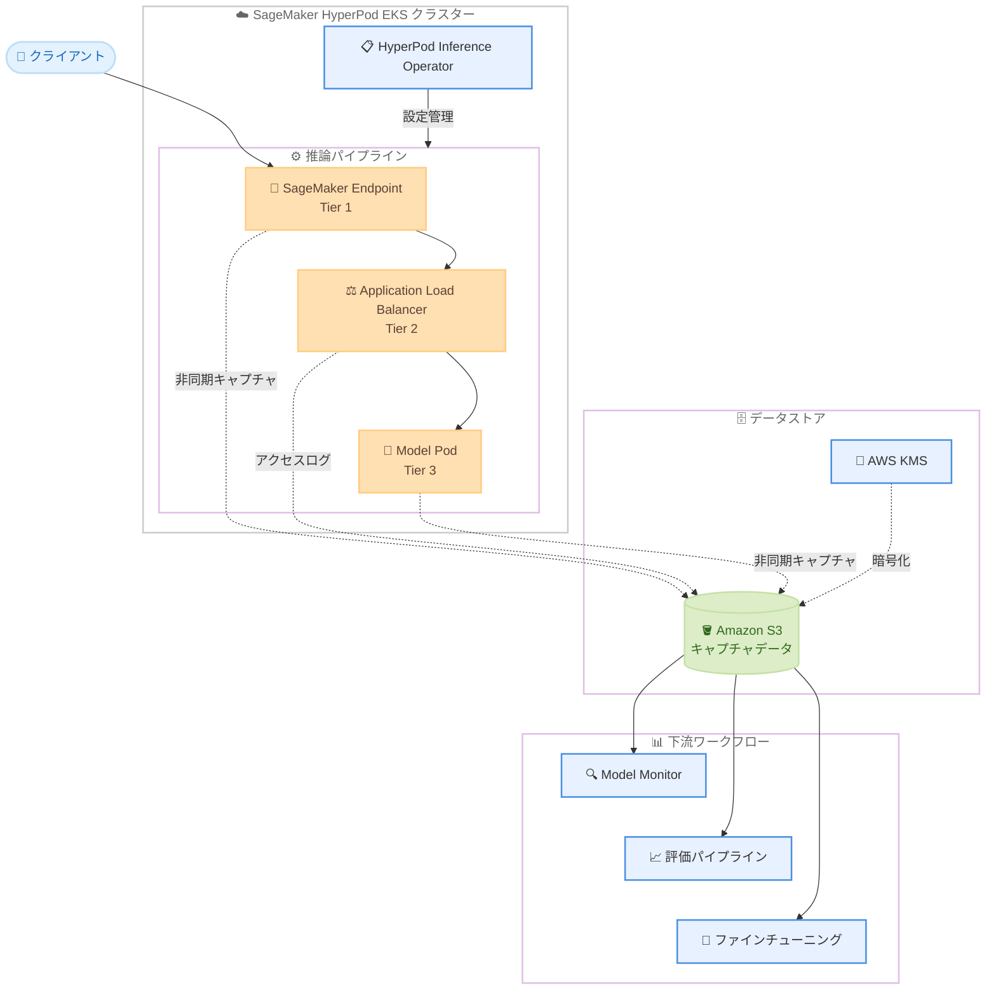

# Amazon SageMaker HyperPod - 推論ワークロード向けデータキャプチャ

**リリース日**: 2026 年 5 月 20 日
**サービス**: Amazon SageMaker HyperPod
**機能**: Data Capture for Inference Workloads

📊 [このアップデートのインフォグラフィックを見る](https://takech9203.github.io/aws-news-summary/20260520-amazon-sagemaker-hyperpod-data-capture.html)

## 概要

Amazon SageMaker HyperPod が推論ワークロード向けのデータキャプチャ機能をサポートしました。この新機能により、本番エンドポイントからの推論リクエストとレスポンスのペイロードを Amazon S3 に記録できるようになります。生成 AI モデルを HyperPod にデプロイしているユーザーが、モデルの入出力を可視化し、ドリフト検出、本番環境のトラブルシューティング、評価データセットの構築、モデルの継続的改善に活用できます。

データキャプチャは推論パイプラインの 3 つの異なるポイント (SageMaker エンドポイント、ロードバランサー、モデル Pod) で独立して有効化でき、非同期的に S3 バケットへデータを配信するため推論処理をブロックしません。設定可能なサンプリングレートと AWS KMS による暗号化もサポートされています。

この機能は EKS オーケストレータを使用する SageMaker HyperPod クラスターで利用可能であり、HyperPod Inference Operator を通じてモデルをデプロイする際に有効化できます。

**アップデート前の課題**

- 推論リクエストとレスポンスの内容を可視化するために、サービス外にカスタムログパイプラインを構築する必要があった
- 本番トラフィックからの評価データセット収集が困難だった
- モデルドリフトの検出や本番環境の問題のトラブルシューティングに必要なデータを取得する仕組みが標準で提供されていなかった
- コンプライアンス対応のための監査証跡を別途構築する必要があった

**アップデート後の改善**

- HyperPod の標準機能としてデータキャプチャが利用可能になり、カスタムパイプラインの構築が不要になった
- 3 つのキャプチャポイントから用途に応じた柔軟なデータ収集が可能になった
- SageMaker Model Monitor との統合により、自動データ品質モニタリングが実現した
- 本番トラフィックを活用した Speculative Decoding ドラフトモデルのトレーニングが可能になった
- 設定可能なサンプリングとバッファリングにより、ストレージコストの最適化が可能になった

## アーキテクチャ図



推論リクエストはクライアントから SageMaker Endpoint、ALB、Model Pod の順に流れ、各キャプチャポイントから非同期的に S3 へデータが配信されます。キャプチャされたデータは Model Monitor、評価パイプライン、ファインチューニングなどの下流ワークフローで活用できます。

## サービスアップデートの詳細

### 主要機能

1. **3 層データキャプチャアーキテクチャ**
   - Tier 1 (SageMaker Endpoint): 入出力ペイロードのキャプチャ、サンプリング、KMS 暗号化をサポート。SageMaker Model Monitor と互換性あり
   - Tier 2 (Application Load Balancer): アクセスログとしてリクエストパス、クライアント IP、レイテンシを記録
   - Tier 3 (Model Pod): 推論コンテナに最も近いレベルでのキャプチャ。バッファリング、ペイロードサイズ制限、サンプリングを細かく設定可能

2. **非同期データ配信**
   - 推論処理をブロックせずに S3 へデータを配信
   - デプロイメントごとにクラスター ARN、名前空間、CRD タイプ、デプロイメント名から算出されたハッシュに基づく一意の S3 パスを生成
   - 同一デプロイメントからのデータは常に同じ S3 プレフィックスに格納

3. **柔軟な設定オプション**
   - サンプリングレート (0-100%) の設定が可能
   - カスタマーマネージド AWS KMS キーによる暗号化
   - バッチサイズとフラッシュ間隔の設定 (Tier 3)
   - ペイロードサイズの上限設定 (Tier 3)

## 技術仕様

### データキャプチャ Tier 比較

| 項目 | Tier 1 - Endpoint | Tier 2 - ALB | Tier 3 - Model Pod |
|------|-------------------|--------------|---------------------|
| キャプチャ対象 | 入出力ペイロード | アクセスログ | 入出力ペイロード |
| サンプリング | 0-100% | 不可 | 0-100% |
| KMS 暗号化 | 対応 | 非対応 | 対応 |
| バッファリング | なし | なし | バッチサイズ + フラッシュ間隔 |
| ペイロード制限 | なし | なし | maxPayloadSizeKB で設定可能 |
| Model Monitor 互換 | あり | なし | なし |
| S3 パス | {s3Uri}/{hash}/sme/ | {s3Uri}/{hash}/alb/ | {s3Uri}/{hash}/pod/ |

### Tier 3 バッファ設定

| パラメータ | 範囲 | デフォルト | 説明 |
|-----------|------|-----------|------|
| batchSize | 1-1000 | 10 | フラッシュ前にバッチする推論リクエスト数 |
| flushIntervalSeconds | 10-300 | 60 | バッチサイズ未到達時の最大保持時間 (秒) |
| maxPayloadSizeKB | 制限なし | 全体キャプチャ | リクエストあたりの最大ペイロードサイズ |

### API 変更履歴

| 日付 | サービス | 変更内容 |
|------|----------|----------|
| 2026/05/19 | [Amazon SageMaker Service](https://awsapichanges.com/archive/changes/7f1dfc-api.sagemaker.html) | 4 updated api methods - Notebook Instances に ml.p5.4xlarge と ml.p5en.48xlarge インスタンスタイプを追加 |

### CRD 設定例

```yaml
dataCapture:
  s3Uri: s3://my-capture-bucket/captures/
  sagemakerEndpoint:
    enabled: true
    initialSamplingPercentage: 100
    kmsKeyId: arn:aws:kms:us-east-2:123456789012:key/my-key-id
    captureOptions:
      - captureMode: Input
      - captureMode: Output
    captureContentTypeHeader:
      jsonContentTypes:
        - application/json
  loadBalancer:
    enabled: true
  modelPod:
    enabled: true
    initialSamplingPercentage: 100
    kmsKeyId: arn:aws:kms:us-east-2:123456789012:key/my-key-id
    captureOptions:
      - captureMode: Input
      - captureMode: Output
    bufferConfig:
      batchSize: 100
      flushIntervalSeconds: 60
    payloadConfig:
      maxPayloadSizeKB: 1024
```

## 設定方法

### 前提条件

1. EKS オーケストレータを使用する SageMaker HyperPod クラスターが稼働していること
2. HyperPod Inference Operator アドオンがインストールされていること
3. S3 バケットへの書き込み権限を持つ IAM ロールが設定されていること
4. kubectl で EKS クラスターに接続できること

### 手順

#### ステップ 1: EKS クラスターへの接続

```bash
CLUSTER={{EKS_CLUSTER_NAME}}
REGION={{REGION}}
HP_ARN={{HYPERPOD_CLUSTER_ARN}}

aws eks update-kubeconfig --region $REGION --name $CLUSTER
```

EKS クラスターへの認証情報を設定し、kubectl で操作できるようにします。

#### ステップ 2: IAM 権限の設定

```json
{
    "Sid": "DataCaptureS3Access",
    "Effect": "Allow",
    "Action": "s3:PutObject",
    "Resource": "arn:aws:s3:::my-capture-bucket/captures/*",
    "Condition": {
        "StringEquals": {
            "aws:ResourceAccount": "${aws:PrincipalAccount}"
        }
    }
}
```

Inference Operator 実行ロールと S3 CSI ドライバーロールに S3 書き込み権限を付与します。KMS キーを使用する場合は `kms:Decrypt` と `kms:GenerateDataKey` の権限も追加が必要です。

#### ステップ 3: InferenceEndpointConfig CRD にデータキャプチャを追加

```yaml
apiVersion: inference.sagemaker.aws/v1alpha1
kind: InferenceEndpointConfig
metadata:
  name: my-model-endpoint
spec:
  # ... 既存のエンドポイント設定 ...
  dataCapture:
    s3Uri: s3://my-capture-bucket/captures/
    sagemakerEndpoint:
      enabled: true
      initialSamplingPercentage: 50
    modelPod:
      enabled: true
      initialSamplingPercentage: 100
      bufferConfig:
        batchSize: 50
        flushIntervalSeconds: 30
```

InferenceEndpointConfig または JumpStartModel CRD の `dataCapture` セクションを追加し、必要な Tier を有効化します。

#### ステップ 4: CRD の適用

```bash
kubectl apply -f inference-endpoint-config.yaml
```

設定ファイルを適用してデータキャプチャを有効化します。データは非同期的に指定の S3 バケットへ配信されます。

## メリット

### ビジネス面

- **コンプライアンス対応の簡素化**: 推論データの監査証跡を自動的に記録でき、規制要件への対応が容易になる
- **モデル品質の継続的改善**: 本番トラフィックからのデータを活用してファインチューニングや評価を実施でき、モデル品質を継続的に向上させられる
- **運用コストの削減**: カスタムログパイプラインの構築と運用が不要になり、インフラ管理の負担が軽減される

### 技術面

- **推論パフォーマンスへの影響なし**: 非同期配信によりデータキャプチャが推論レイテンシに影響を与えない
- **柔軟なキャプチャ戦略**: 3 つの Tier を組み合わせることで、ユースケースに最適なデータ収集が可能
- **Speculative Decoding 最適化**: 実際の本番トラフィックからドラフトモデルをトレーニングすることで、汎用ドラフトモデルよりも高いパフォーマンスを実現

## デメリット・制約事項

### 制限事項

- EKS オーケストレータを使用する HyperPod クラスターでのみ利用可能 (Slurm オーケストレータは非対応)
- Tier 2 (ALB) は KMS 暗号化をサポートしておらず、S3 デフォルト暗号化のみ
- S3 バケットはクラスターと同じアカウントに存在する必要がある
- s3Uri の最大長は 512 文字
- captureOptions の最大項目数は 32
- captureContentTypeHeader の最大項目数は各 10

### 考慮すべき点

- サンプリングレート 100% で大量のトラフィックをキャプチャする場合、S3 ストレージコストが増加する可能性がある
- ALB アクセスログには URL やクエリパラメータが含まれるため、機密データは POST リクエストボディに含めることが推奨される
- Tier 1 はエンドポイント登録が必要だが、Tier 3 は登録不要で動作する

## ユースケース

### ユースケース 1: Speculative Decoding ドラフトモデルのトレーニング

**シナリオ**: 生成 AI モデルの推論速度を改善するために、本番トラフィックの実データからドラフトモデルをトレーニングする。

**実装例**:
```yaml
dataCapture:
  s3Uri: s3://my-bucket/speculative-training-data/
  modelPod:
    enabled: true
    initialSamplingPercentage: 100
    captureOptions:
      - captureMode: Input
      - captureMode: Output
    bufferConfig:
      batchSize: 200
      flushIntervalSeconds: 120
```

**効果**: 汎用ドラフトモデルと比較して、実際のユーザーの入力パターンに最適化されたドラフトモデルにより、Speculative Decoding の承認率が向上し推論速度が改善される。

### ユースケース 2: モデルドリフト検出と品質モニタリング

**シナリオ**: 本番環境でデプロイされたモデルの入出力分布の変化を検出し、品質劣化を早期に発見する。

**実装例**:
```yaml
dataCapture:
  s3Uri: s3://my-bucket/monitoring-data/
  sagemakerEndpoint:
    enabled: true
    initialSamplingPercentage: 10
    captureOptions:
      - captureMode: Input
      - captureMode: Output
    captureContentTypeHeader:
      jsonContentTypes:
        - application/json
```

**効果**: SageMaker Model Monitor と連携することで、データドリフトやモデル品質の劣化を自動的に検出し、アラートを発生させることが可能になる。

### ユースケース 3: コンプライアンス監査証跡

**シナリオ**: 規制産業において、AI モデルの全推論リクエストと応答を記録し、監査要件を満たす。

**実装例**:
```yaml
dataCapture:
  s3Uri: s3://my-audit-bucket/audit-trail/
  sagemakerEndpoint:
    enabled: true
    initialSamplingPercentage: 100
    kmsKeyId: arn:aws:kms:us-east-2:123456789012:key/audit-key
    captureOptions:
      - captureMode: Input
      - captureMode: Output
  modelPod:
    enabled: true
    initialSamplingPercentage: 100
    kmsKeyId: arn:aws:kms:us-east-2:123456789012:key/audit-key
    captureOptions:
      - captureMode: Input
      - captureMode: Output
```

**効果**: KMS 暗号化された完全な監査証跡を自動的に維持でき、コンプライアンス報告やフォレンジック調査に必要なデータを確保できる。

## 料金

データキャプチャ機能自体には追加料金は発生しません。ただし、以下の関連サービスの利用料金が適用されます。

### 料金構成要素

| 項目 | 料金体系 |
|------|----------|
| Amazon S3 ストレージ | キャプチャデータの保存量に応じた標準 S3 料金 |
| Amazon S3 リクエスト | PUT リクエスト数に応じた料金 |
| AWS KMS | 暗号化キーの使用回数に応じた料金 |
| SageMaker HyperPod | 既存のクラスター利用料金 |

## 利用可能リージョン

Amazon SageMaker HyperPod がサポートされているすべての AWS リージョンで利用可能です。EKS オーケストレータを使用するクラスターが前提条件となります。

## 関連サービス・機能

- **Amazon SageMaker Model Monitor**: Tier 1 のキャプチャデータと連携し、データ品質の自動モニタリングを提供
- **Amazon S3**: キャプチャデータの保存先として使用。ライフサイクルポリシーでコスト最適化が可能
- **AWS KMS**: キャプチャデータの暗号化に使用。カスタマーマネージドキーによるデータ保護を実現
- **Amazon EKS**: HyperPod のオーケストレータとして使用。データキャプチャは EKS オーケストレータでのみ利用可能
- **HyperPod Inference Operator**: データキャプチャの設定と管理を担当する EKS アドオン

## 参考リンク

- 📊 [インフォグラフィック](https://takech9203.github.io/aws-news-summary/20260520-amazon-sagemaker-hyperpod-data-capture.html)
- [公式発表 (What's New)](https://aws.amazon.com/about-aws/whats-new/2026/05/amazon-sagemaker-hyperpod-data-capture)
- [ドキュメント - Data capture for inference on HyperPod](https://docs.aws.amazon.com/sagemaker/latest/dg/sagemaker-hyperpod-model-deployment-data-capture.html)
- [SageMaker Model Monitor - Capture data from real-time endpoint](https://docs.aws.amazon.com/sagemaker/latest/dg/model-monitor-data-capture.html)

## まとめ

Amazon SageMaker HyperPod の推論データキャプチャ機能は、生成 AI モデルの本番運用における可視性を大幅に向上させる重要なアップデートです。カスタムログパイプラインの構築が不要になり、3 つの Tier から柔軟にデータ収集ポイントを選択できます。HyperPod で推論ワークロードを運用しているユーザーは、まず低いサンプリングレートから開始し、モデル品質モニタリングや評価パイプラインの構築に活用することが推奨されます。
