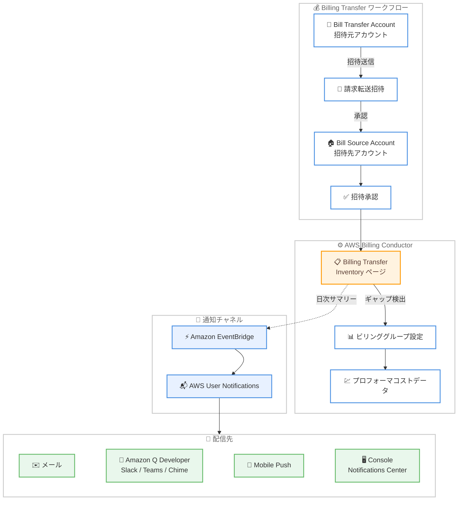

# AWS Billing Conductor - Billing Transfer Inventory による請求可視性の向上

**リリース日**: 2026 年 5 月 20 日
**サービス**: AWS Billing Conductor
**機能**: Billing Transfer Inventory

📊 [このアップデートのインフォグラフィックを見る](https://takech9203.github.io/aws-news-summary/20260520-aws-billing-conductor-billing-transfer.html)

## 概要

AWS Billing Conductor コンソールに新しい Billing Transfer Inventory ページが追加されました。この機能により、請求転送の招待を受け取り承認したものの、プロフォーマ請求データへのアクセスが未設定のアカウントを一覧で確認できるようになります。

請求転送 (Billing Transfer) を使用する組織では、招待の承認後にビリンググループを設定することでプロフォーマコストデータにアクセスできるようになります。しかし、この設定ステップが未完了のアカウントを特定することは従来困難でした。今回のアップデートにより、設定漏れを検出し、請求可視性のギャップを解消することが容易になります。

さらに、AWS User Notifications と Amazon EventBridge を通じた日次通知の設定が可能となり、ビリンググループが未設定の承認済み請求転送の概要をメール、Amazon Q Developer チャットアプリ (Slack、Microsoft Teams、Amazon Chime)、AWS Console Mobile Application プッシュ通知、Console Notifications Center で受信できます。

**アップデート前の課題**

- 請求転送の招待を承認したアカウントのうち、ビリンググループが未設定のものを特定する手段がなかった
- プロフォーマ請求データへのアクセスが欠落しているアカウントを手動で調査する必要があった
- 設定漏れに気づかないまま、請求データの可視性にギャップが生じるリスクがあった

**アップデート後の改善**

- Billing Transfer Inventory ページで設定が不完全なアカウントを即座に把握可能になった
- 日次通知により、設定漏れのあるアカウントを自動的に検知できるようになった
- 複数の通知チャネルを活用して、適切な担当者へ迅速にアラートを届けられるようになった

## アーキテクチャ図



請求転送の招待から承認、Billing Transfer Inventory でのギャップ検出、ビリンググループ設定、そして通知配信までの全体フローを示しています。

## サービスアップデートの詳細

### 主要機能

1. **Billing Transfer Inventory ページ**
   - 請求転送の招待を承認済みだがビリンググループが未設定のアカウントを一覧表示
   - プロフォーマ請求データへのアクセスが欠落しているアカウントの特定が可能
   - AWS Billing Conductor コンソール内で直接アクセス可能

2. **日次通知機能**
   - AWS User Notifications と Amazon EventBridge を通じた自動通知
   - ビリンググループが未設定の承認済み請求転送の日次サマリーを配信
   - 設定完了を促すプロアクティブなアラート機能

3. **マルチチャネル通知配信**
   - メール通知
   - Amazon Q Developer 経由のチャットアプリ通知 (Slack、Microsoft Teams、Amazon Chime)
   - AWS Console Mobile Application プッシュ通知
   - Console Notifications Center での表示

## 技術仕様

### 対応リージョンと前提条件

| 項目 | 詳細 |
|------|------|
| 利用可能リージョン | US East (N. Virginia) / us-east-1 |
| 前提条件 | 請求転送が有効であること |
| 必要な設定 | AWS Billing Conductor でビリンググループを作成 |
| 通知連携 | AWS User Notifications + Amazon EventBridge |

### 関連する概念

| 用語 | 説明 |
|------|------|
| Bill Transfer Account | 請求転送の招待を送信するアカウント。他の組織の請求を一元管理する |
| Bill Source Account | 請求転送の招待を受けるアカウント。自身の請求管理を委任する |
| ビリンググループ | AWS Billing Conductor でアカウントをグループ化し、プロフォーマコストを管理する単位 |
| プロフォーマコストデータ | Billing Conductor の設定に基づく二次的なコストデータ。請求ビューで利用可能 |

### API 変更履歴

直近 7 日間で Billing 関連サービスの API 変更は検出されませんでした。本アップデートはコンソール UI の機能追加と既存の通知サービスとの連携が中心であり、新規 API の追加は確認されていません。

### IAM ポリシー例

```json
{
  "Version": "2012-10-17",
  "Statement": [
    {
      "Effect": "Allow",
      "Action": [
        "billingconductor:ListBillingGroups",
        "billingconductor:ListAccountAssociations",
        "billingconductor:CreateBillingGroup"
      ],
      "Resource": "*"
    },
    {
      "Effect": "Allow",
      "Action": [
        "notifications:CreateNotificationRule",
        "notifications:ListNotificationRules"
      ],
      "Resource": "*"
    }
  ]
}
```

## 設定方法

### 前提条件

1. 請求転送 (Billing Transfer) が有効化されていること
2. Bill Transfer Account として他アカウントに招待を送信済みであること
3. 招待先アカウントが招待を承認済みであること

### 手順

#### ステップ 1: Billing Transfer Inventory の確認

AWS Billing Conductor コンソールにアクセスし、Billing Transfer Inventory ページを開きます。このページで、請求転送を承認済みだがビリンググループが未設定のアカウント一覧を確認します。

#### ステップ 2: ビリンググループの作成

```bash
aws billingconductor create-billing-group \
  --name "my-billing-transfer-group" \
  --account-grouping '{"LinkedAccountIds": ["123456789012"]}' \
  --computation-preference '{"PricingPlanArn": "arn:aws:billingconductor::123456789012:pricingplan/example-plan"}'
```

Billing Transfer Inventory で検出されたアカウントに対して、ビリンググループを作成します。これにより、該当アカウントがプロフォーマコストデータにアクセスできるようになります。

#### ステップ 3: 日次通知の設定

AWS User Notifications コンソールで通知ルールを作成し、Amazon EventBridge を通じて日次サマリーの配信先を設定します。メール、Slack、Microsoft Teams、Amazon Chime、モバイルプッシュ通知など、組織に適した配信チャネルを選択します。

## メリット

### ビジネス面

- **請求ガバナンスの強化**: 請求転送後の設定漏れを自動検出することで、請求データの可視性ギャップを防止できる
- **運用効率の向上**: 手動での設定状況確認が不要になり、管理者の作業負担を削減できる
- **コンプライアンス対応**: 全アカウントの請求データアクセス状況を一元的に把握でき、監査対応が容易になる

### 技術面

- **プロアクティブな検知**: 日次通知により設定漏れを早期に発見し、迅速に対処できる
- **マルチチャネル対応**: 既存のコミュニケーションツールと連携し、適切な担当者へアラートを届けられる
- **EventBridge 連携**: イベント駆動型のワークフローと組み合わせた自動化が可能

## デメリット・制約事項

### 制限事項

- US East (N. Virginia) リージョンでのみ利用可能
- 請求転送 (Billing Transfer) を使用している組織のみが対象
- 通知はビリンググループ未設定のアカウントの検出に限定されており、自動修復機能は含まれない

### 考慮すべき点

- ビリンググループの設定自体は手動で行う必要があり、Inventory ページは検出のみを提供する
- 大規模な組織では通知量が多くなる可能性があるため、適切なフィルタリングの設定が推奨される

## ユースケース

### ユースケース 1: マルチ組織の請求一元管理

**シナリオ**: ISV やチャネルパートナーが複数の顧客組織の請求を一元管理しており、新規顧客のオンボーディング時に請求転送の設定を段階的に進めている。

**実装例**:
```
1. Billing Transfer Inventory ページを日次で確認
2. 未設定アカウントに対してビリンググループを作成
3. AWS User Notifications で財務チームへ日次サマリーを配信
```

**効果**: 新規顧客のオンボーディング漏れを防止し、全顧客に対して一貫したプロフォーマコストデータの提供を保証できる。

### ユースケース 2: 大規模企業の子会社管理

**シナリオ**: グローバル企業が各子会社の AWS アカウントを請求転送で統合管理しているが、子会社の追加や変更が頻繁に発生する。

**実装例**:
```
1. EventBridge ルールで日次通知をトリガー
2. Slack チャネルへ自動通知を配信
3. クラウド管理チームが通知を受けて設定を完了
```

**効果**: 子会社の追加時に設定漏れが発生しても即座に検知でき、プロフォーマコストデータの可視性を常に維持できる。

### ユースケース 3: コンプライアンス監査の自動化

**シナリオ**: 内部監査チームが全アカウントの請求データアクセス状況を定期的に確認する必要がある。

**実装例**:
```
1. Billing Transfer Inventory を監査チェックリストに組み込む
2. 日次通知で監査チームに未設定アカウントを自動報告
3. 月次レポートとして未設定アカウント数の推移を追跡
```

**効果**: 手動での監査作業を自動化し、請求ガバナンスのコンプライアンス状況をリアルタイムで把握できる。

## 料金

AWS Billing Conductor は請求転送ユーザーに対して、転送請求用ビリンググループの利用は無料で提供されます。標準ビリンググループを追加で作成する場合のみ課金が発生します。

Billing Transfer Inventory ページ自体の利用に追加料金は発生しません。AWS User Notifications および Amazon EventBridge の利用については、各サービスの料金体系に従います。

### 料金例

| 項目 | 料金 |
|------|------|
| Billing Transfer 用ビリンググループ | 無料 |
| 標準ビリンググループ | アカウントあたり月額課金 |
| EventBridge カスタムイベント | $1.00 / 100 万イベント |
| AWS User Notifications | 追加料金なし |

## 利用可能リージョン

本機能は US East (N. Virginia) / us-east-1 リージョンでのみ利用可能です。AWS Billing Conductor 自体がグローバルサービスとして us-east-1 から管理されるため、この制限は Billing Conductor の既存のリージョン対応と一致しています。

## 関連サービス・機能

- **AWS Billing Conductor**: プロフォーマコストデータの作成と管理を行うメインサービス
- **Amazon EventBridge**: 日次通知のイベントルーティングに使用
- **AWS User Notifications**: マルチチャネル通知の設定と配信を管理
- **Amazon Q Developer**: Slack、Microsoft Teams、Amazon Chime でのチャット通知に対応
- **AWS Cost Explorer**: プロフォーマコストデータの分析と可視化に使用
- **AWS Organizations**: 請求転送の前提となるマルチアカウント管理サービス

## 参考リンク

- 📊 [インフォグラフィック](https://takech9203.github.io/aws-news-summary/20260520-aws-billing-conductor-billing-transfer.html)
- [公式発表 (What's New)](https://aws.amazon.com/about-aws/whats-new/2026/05/aws-billing-conductor-billing-transfer/)
- [AWS Billing Conductor ユーザーガイド](https://docs.aws.amazon.com/billingconductor/latest/userguide/what-is-billingconductor.html)
- [請求転送の設定ガイド](https://docs.aws.amazon.com/awsaccountbilling/latest/aboutv2/orgs_transfer_billing.html)
- [AWS Billing Conductor 料金ページ](https://aws.amazon.com/aws-cost-management/aws-billing-conductor/pricing/)

## まとめ

AWS Billing Conductor の Billing Transfer Inventory 機能は、請求転送を利用する組織にとって、設定漏れの検出と請求可視性のギャップ解消を大幅に簡素化するアップデートです。日次通知と複数の配信チャネルを活用することで、プロアクティブなガバナンス体制を構築できます。請求転送を利用中の組織は、Billing Conductor コンソールで Inventory ページを確認し、通知設定を有効化することを推奨します。
