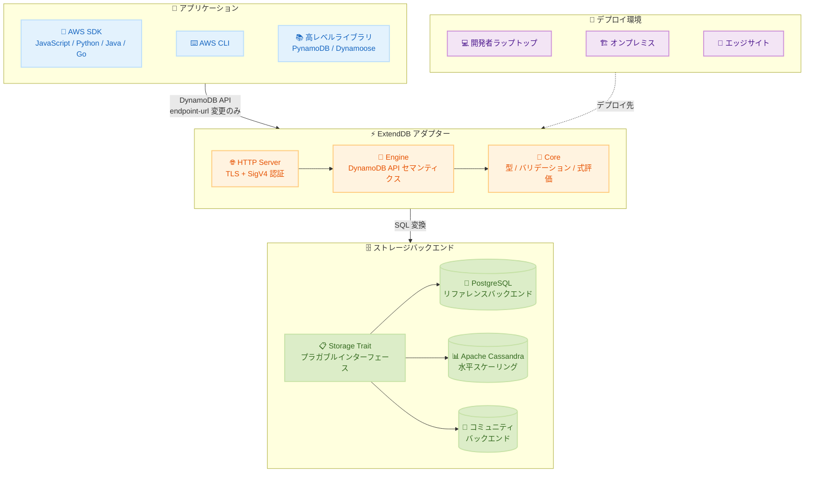

# Amazon DynamoDB - ExtendDB オープンソース互換アダプター

**リリース日**: 2026年5月20日
**サービス**: Amazon DynamoDB
**機能**: ExtendDB (DynamoDB 互換アダプター)

[このアップデートのインフォグラフィックを見る](https://takech9203.github.io/aws-news-summary/20260520-aws-extenddb-dynamodb.html)

## 概要

AWS は ExtendDB バージョン 0.1 を発表した。ExtendDB は、Amazon DynamoDB API をプラガブルなストレージバックエンドで実装するオープンソースプロジェクトである。Apache 2.0 ライセンスのもとで公開され、Rust で開発されている。

ExtendDB は、DynamoDB マネージドサービスが利用できない環境 (開発者のラップトップ、オンプレミスデータセンター、切断されたエッジサイト) で、アプリケーションコードを書き換えることなく DynamoDB プログラミングモデルを使用可能にする。アプリケーション開発者、プラットフォームチーム、エンタープライズアーキテクトが主な対象ユーザーである。

リファレンスストレージバックエンドとして PostgreSQL を採用しており、プラガブルアーキテクチャにより、コアアダプターを変更することなくコミュニティが新しいストレージバックエンドを追加できる。Apache Cassandra バックエンドも水平スケーリング向けに利用可能である。

**アップデート前の課題**

- DynamoDB を使用するアプリケーションのローカル開発やテストに高忠実度な環境がなかった
- オンプレミスや切断環境で DynamoDB ワークロードを実行するには、アプリケーションコードの書き換えが必要だった
- CI/CD パイプラインで DynamoDB に依存するテストの実行が困難だった
- DynamoDB Local は機能が限定的で、ストレージバックエンドの選択肢がなかった

**アップデート後の改善**

- エンドポイント URL の変更のみで DynamoDB と ExtendDB を切り替え可能になった
- PostgreSQL や Cassandra をバックエンドとして、オンプレミスで DynamoDB 互換ワークロードを運用可能になった
- すべての AWS SDK (JavaScript、Python、Java、Go 等) および PynamoDB、Dynamoose 等の高レベルライブラリと互換性がある
- コントロールプレーン API とデータプレーン API の両方をサポートし、Streams や TTL も実装済み

## アーキテクチャ図



ExtendDB はアダプターとして機能し、DynamoDB クライアントからの API リクエストを受信し、ストレージバックエンドの SQL に変換して処理する。アプリケーション側の変更はエンドポイント URL の指定のみで済む。

## サービスアップデートの詳細

### 主要機能

1. **DynamoDB API 完全互換**
   - コントロールプレーン API: CreateTable、DeleteTable、DescribeTable、ListTables、UpdateTable
   - データプレーン API: PutItem、GetItem、DeleteItem、UpdateItem (SET、REMOVE、ADD、DELETE + 条件式)
   - Query / Scan: キー条件、フィルター式、プロジェクション、ページネーション、セカンダリインデックス選択
   - バッチ / トランザクション: BatchGetItem、BatchWriteItem、TransactGetItems、TransactWriteItems
   - Streams: ListStreams、DescribeStream、GetShardIterator、GetRecords
   - TTL: UpdateTimeToLive、DescribeTimeToLive
   - Import / Export: ImportTable、ExportTableToPointInTime
   - タグ: TagResource、UntagResource、ListTagsOfResource

2. **プラガブルストレージアーキテクチャ**
   - Rust トレイトとしてストレージインターフェースを定義
   - PostgreSQL リファレンスバックエンド (完全テストスイート検証済み)
   - Apache Cassandra バックエンド (水平スケーリング対応)
   - コアアダプターを変更せずに新バックエンド追加可能

3. **セキュリティ機能**
   - TLS 必須 (初回実行時に自己署名証明書を自動生成)
   - SigV4 認証 (AWS IAM とは独立したローカル認証情報ストア)
   - IAM ポリシー互換の認可モデル
   - 管理コンソール (`https://127.0.0.1:8000/console/`)

4. **SDK 完全互換性**
   - すべての AWS SDK で動作 (JavaScript、Python、Java、Go 等)
   - 高レベルライブラリ対応: PynamoDB、Dynamoose、DynamoDB Toolbox、awswrangler
   - エラーコードパリティにより、同一のエラーハンドリングコードが動作

## 技術仕様

### Rust クレート構成

| クレート | 役割 |
|----------|------|
| `core` | 型定義、バリデーション、式評価 (純粋同期 Rust) |
| `engine` | DynamoDB API セマンティクスの実装 |
| `storage` | ストレージバックエンドが実装すべきトレイト定義 |
| `storage-postgres` | PostgreSQL バックエンド実装 |
| `server` | HTTP サーバー、管理 API、Web コンソール |

### パフォーマンス特性

| バックエンド | 特性 |
|-------------|------|
| PostgreSQL | 単一アイテム操作で 10ms 未満のレイテンシ (読み書き) |
| Apache Cassandra | 毎秒数千リクエストへの水平スケーリング |

### システム要件

| 項目 | 要件 |
|------|------|
| OS | Linux または macOS |
| Rust | 1.85 以上 |
| PostgreSQL | 14 以上 |
| 外部ランタイム依存 | なし (シングルバイナリ) |

### API 変更履歴

本リリースは新規オープンソースプロジェクトの公開であり、DynamoDB マネージドサービス自体の API 変更はない。

## 設定方法

### 前提条件

1. Linux または macOS 環境
2. Rust 1.85 以上がインストール済み
3. PostgreSQL 14 以上が稼働中

### 手順

#### ステップ 1: リポジトリのクローンとビルド

```bash
git clone https://github.com/ExtendDB/extenddb.git
cd extenddb
cargo build --release
```

Rust プロジェクトをクローンし、リリースビルドを実行する。シングルバイナリが `target/release/extenddb` に生成される。

#### ステップ 2: 初期化とサーバー起動

```bash
./target/release/extenddb init
./target/release/extenddb serve --config extenddb.toml
```

`init` コマンドはデータベースとスキーマの作成、管理者認証情報の生成、TLS 証明書のプロビジョニング、設定ファイル (`extenddb.toml`) の書き込みを行う。

#### ステップ 3: ユーザーとアクセスキーの作成

```bash
# ユーザー作成
./target/release/extenddb manage --user admin --password '<admin-password>' \
  create-user --account-id <account-id> --user-name myuser

# ポリシー設定
./target/release/extenddb manage --user admin --password '<admin-password>' \
  put-user-policy --account-id <account-id> --user-name myuser \
  --policy-name full-access \
  --policy-document '{"Version":"2012-10-17","Statement":[{"Effect":"Allow","Action":"dynamodb:*","Resource":"*"}]}'

# アクセスキー作成
./target/release/extenddb manage --user admin --password '<admin-password>' \
  create-access-key --account-id <account-id> --user-name myuser
```

IAM ポリシー互換の認可モデルでユーザーを作成し、DynamoDB 操作への権限を付与する。

#### ステップ 4: 環境変数の設定と利用

```bash
export AWS_ACCESS_KEY_ID="AKIA..."
export AWS_SECRET_ACCESS_KEY="extenddb..."
export AWS_CA_BUNDLE=~/.extenddb/tls/cert.pem

# AWS CLI での利用例
aws dynamodb create-table \
  --table-name Orders \
  --attribute-definitions AttributeName=PK,AttributeType=S AttributeName=SK,AttributeType=S \
  --key-schema AttributeName=PK,KeyType=HASH AttributeName=SK,KeyType=RANGE \
  --billing-mode PAY_PER_REQUEST \
  --endpoint-url https://127.0.0.1:8000 \
  --region us-east-1
```

`--endpoint-url` を ExtendDB のアドレスに向けるだけで、通常の AWS CLI コマンドがそのまま動作する。DynamoDB に切り替える場合は `--endpoint-url` を削除するだけでよい。

## メリット

### ビジネス面

- **コード再利用の最大化**: 既存の DynamoDB アプリケーションコードをオンプレミス環境でも再利用でき、開発投資を保護できる
- **開発速度の向上**: ローカル環境で高忠実度な DynamoDB 互換テストが可能になり、CI/CD パイプラインの信頼性が向上する
- **ハイブリッド戦略の実現**: クラウドとオンプレミスで同一のプログラミングモデルを使用でき、段階的なクラウド移行を支援する

### 技術面

- **エンドポイント URL 変更のみ**: アプリケーションコードの変更なしに DynamoDB と ExtendDB を切り替え可能
- **PostgreSQL エコシステムの活用**: pg_dump、レプリケーション、ポイントインタイムリカバリ等の既存運用ツールが使用可能
- **プラガブル設計**: ストレージバックエンドを要件に応じて選択でき、将来的な拡張が容易
- **完全なオフライン動作**: インターネット接続なしで動作し、切断環境やエッジサイトに適する

## デメリット・制約事項

### 制限事項

- グローバルテーブルとクロスリージョンレプリケーションは未実装
- オートスケーリング、バックアップ/リストア、DAX は利用不可
- バージョン 0.1 であり、本番ワークロードでの使用は推奨されていない
- パフォーマンス特性、スケーリング動作、運用特性は DynamoDB マネージドサービスとは異なる

### 考慮すべき点

- データベースの可用性、バックアップ、メンテナンスはユーザーの責任
- 認証情報は AWS IAM とは完全に独立したローカルストアで管理される
- PostgreSQL バックエンドの場合、DynamoDB のネイティブスケーリング特性は再現されない
- DynamoDB マネージドサービスの代替ではなく、補完的なツールとして位置づけられる

## ユースケース

### ユースケース 1: ローカル開発と CI テスト

**シナリオ**: DynamoDB を使用するマイクロサービスを開発しているチームが、ローカル環境と CI パイプラインで高忠実度なテストを実行したい。

**実装例**:
```python
import boto3

# ExtendDB をローカルで使用
dynamodb = boto3.resource(
    'dynamodb',
    endpoint_url='https://127.0.0.1:8000',
    region_name='us-east-1'
)

table = dynamodb.Table('Orders')
table.put_item(Item={'PK': 'ORDER#123', 'SK': 'META', 'status': 'pending'})
```

**効果**: DynamoDB の式評価、条件式、エラーコードパリティにより、本番環境と同等の動作検証が可能。テストの信頼性が向上し、本番デプロイ後の不具合を削減できる。

### ユースケース 2: オンプレミスデータセンターでの運用

**シナリオ**: 規制要件によりデータをオンプレミスに保持する必要があるが、DynamoDB のプログラミングモデルを活用したい金融機関や医療機関。

**実装例**:
```toml
# extenddb.toml
[storage]
backend = "postgres"

[storage.postgres]
host = "db-primary.internal.example.com"
port = 5432
database = "extenddb"
```

**効果**: PostgreSQL の既存運用ツール (レプリケーション、ポイントインタイムリカバリ) を活用しながら、DynamoDB 互換の NoSQL インターフェースでアプリケーションを構築できる。

### ユースケース 3: 切断環境でのエッジ運用

**シナリオ**: インターネット接続が間欠的または不可能なエッジサイト (工場、船舶、遠隔地) で DynamoDB 互換ワークロードを運用したい。

**実装例**:
```bash
# Docker でエッジサイトにデプロイ
docker run -d --name extenddb \
  -p 8000:8000 \
  -v /data/extenddb:/var/lib/extenddb \
  extenddb/extenddb:latest serve --config /etc/extenddb/extenddb.toml
```

**効果**: オフライン環境で DynamoDB 互換 API を提供し、接続回復時にデータをクラウドと同期する戦略を取ることが可能。アプリケーションコードの二重管理が不要になる。

## 料金

ExtendDB 自体はオープンソース (Apache 2.0 ライセンス) であり、無料で利用可能。

コストはバックエンドデータベースのインフラストラクチャに依存する。

| 構成 | コスト |
|------|--------|
| ローカル開発 (PostgreSQL ローカルインスタンス) | 無料 |
| オンプレミス (既存 PostgreSQL クラスタ) | 既存インフラコストのみ |
| クラウド上の PostgreSQL (Amazon RDS) | RDS インスタンス料金に準拠 |

## 利用可能リージョン

ExtendDB はオープンソースソフトウェアであり、AWS リージョンに依存しない。任意のインフラストラクチャ上でデプロイ可能。

- 開発者ラップトップ (ローカル)
- オンプレミスデータセンター
- 切断エッジサイト
- 任意のクラウド環境

## 関連サービス・機能

- **Amazon DynamoDB**: ExtendDB が互換性を提供する対象のフルマネージド NoSQL データベースサービス
- **Amazon RDS for PostgreSQL**: ExtendDB のリファレンスバックエンドとして使用可能なマネージド PostgreSQL
- **DynamoDB Local**: AWS が提供するローカル開発用ツール (ExtendDB はより高い忠実度と柔軟性を提供)
- **AWS Outposts**: オンプレミスで AWS サービスを実行する別のアプローチ

## 参考リンク

- [インフォグラフィック](https://takech9203.github.io/aws-news-summary/20260520-aws-extenddb-dynamodb.html)
- [公式発表 (What's New)](https://aws.amazon.com/about-aws/whats-new/2026/05/aws-extenddb-dynamodb/)
- [AWS Database Blog](https://aws.amazon.com/blogs/database/introducing-extenddb-an-open-source-dynamodb-compatible-adapter-with-pluggable-storage-backends/)
- [ExtendDB プロジェクトページ](https://extenddb.org)
- [GitHub リポジトリ](https://github.com/ExtendDB/extenddb)
- [Amazon DynamoDB ドキュメント](https://docs.aws.amazon.com/amazondynamodb/latest/developerguide/)

## まとめ

ExtendDB は、DynamoDB プログラミングモデルをクラウド外に拡張する重要なオープンソースプロジェクトである。ローカル開発の高忠実化、オンプレミス運用、エッジコンピューティングの 3 つの主要ユースケースにおいて、アプリケーションコードの書き換えなしに DynamoDB 互換ワークロードを実行可能にする。バージョン 0.1 の段階だが、DynamoDB を中心としたアーキテクチャを採用している組織は、ローカル開発と CI テストへの導入から検討することを推奨する。
