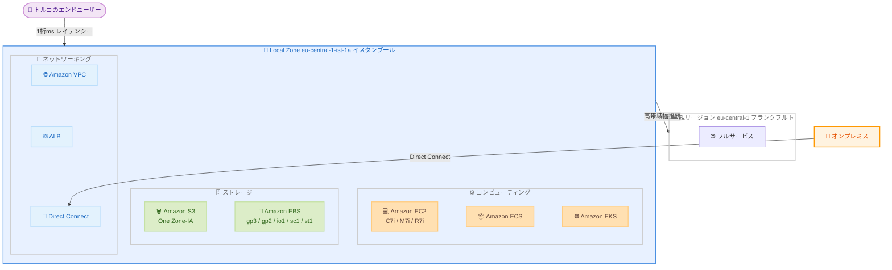

# AWS Local Zones - イスタンブール (トルコ) の一般提供開始

**リリース日**: 2026 年 5 月 20 日
**サービス**: AWS Local Zones
**機能**: イスタンブール (トルコ) の新しい AWS Local Zone の一般提供

📊 [このアップデートのインフォグラフィックを見る](https://takech9203.github.io/aws-news-summary/20260520-aws-local-zones-istanbul-turkiye.html)

## 概要

AWS はトルコのイスタンブールに新しい AWS Local Zone (eu-central-1-ist-1a) の一般提供を開始した。この Local Zone は、親リージョンである Europe (Frankfurt) / eu-central-1 のインフラストラクチャをイスタンブールの都市圏に拡張し、エンドユーザーに近い場所で AWS サービスを提供する。

このアップデートにより、トルコの組織はデータレジデンシー要件を満たしながら、コンピューティング、ストレージ、ネットワーキングなどのコアサービスをローカルで利用できるようになる。AWS Local Zones は現在、世界 30 以上の都市圏で利用可能であり、イスタンブールはその最新の追加拠点となる。

**アップデート前の課題**

- トルコのエンドユーザーに対して 1 桁ミリ秒のレイテンシーを達成することが困難だった
- トルコ国内でのデータレジデンシー要件を満たすために、AWS インフラストラクチャ外のソリューションが必要だった
- AI/ML 推論ワークロードをトルコのユーザーに近い場所で実行する手段が限られていた
- レガシーアプリケーションのクラウド移行において、レイテンシー要件が障壁となるケースがあった

**アップデート後の改善**

- イスタンブールのエンドユーザーに対して 1 桁ミリ秒のレイテンシーを実現可能になった
- トルコ国内でデータをローカルに保存・バックアップすることでデータレジデンシー要件を満たせるようになった
- AWS リージョンと同一の API、ツール、サービスを使用しながらローカルでワークロードを実行できるようになった
- EC2、S3、EBS、ECS、EKS、VPC、Direct Connect、ALB など主要サービスが利用可能になった

## アーキテクチャ図



イスタンブールの Local Zone は親リージョン eu-central-1 (フランクフルト) に高帯域幅で接続され、コンピューティング、ストレージ、ネットワーキングの主要サービスをローカルで提供する。

## サービスアップデートの詳細

### 主要機能

1. **コンピューティング (Amazon EC2)**
   - C7i インスタンス: コンピューティング最適化、第 4 世代 Intel Xeon Scalable プロセッサ搭載
   - M7i インスタンス: 汎用、バランスの取れたコンピューティング、メモリ、ネットワーキング
   - R7i インスタンス: メモリ最適化、大規模データセット処理に最適

2. **ストレージ (Amazon S3 / Amazon EBS)**
   - Amazon S3 One Zone-Infrequent Access: アクセス頻度の低いデータのローカル保存に最適
   - Amazon EBS Local Snapshots: ローカルでのスナップショット取得による高速バックアップ
   - EBS ボリュームタイプ: gp3、gp2、io1、sc1、st1 をサポート

3. **コンテナサービス**
   - Amazon ECS: コンテナ化されたアプリケーションのローカル実行
   - Amazon EKS: Kubernetes ワークロードのイスタンブールでの実行

4. **ネットワーキング**
   - Amazon VPC: Local Zone への VPC サブネット拡張
   - AWS Direct Connect: オンプレミスからの専用接続
   - Application Load Balancer: トラフィック分散とルーティング

## 技術仕様

### サポートされるインスタンスタイプ

| インスタンスファミリー | 用途 | プロセッサ |
|------|------|------|
| C7i | コンピューティング最適化 | 第 4 世代 Intel Xeon Scalable |
| M7i | 汎用 | 第 4 世代 Intel Xeon Scalable |
| R7i | メモリ最適化 | 第 4 世代 Intel Xeon Scalable |

### サポートされる EBS ボリュームタイプ

| ボリュームタイプ | 用途 | 特徴 |
|------|------|------|
| gp3 | 汎用 SSD | コスト効率の高い汎用ストレージ |
| gp2 | 汎用 SSD | バースト対応の汎用ストレージ |
| io1 | プロビジョンド IOPS SSD | 高パフォーマンスワークロード |
| sc1 | Cold HDD | アクセス頻度の低い大容量データ |
| st1 | スループット最適化 HDD | 頻繁にアクセスされるスループット集約型ワークロード |

### Local Zone 識別情報

| 項目 | 詳細 |
|------|------|
| ゾーン名 | eu-central-1-ist-1a |
| 親リージョン | eu-central-1 (フランクフルト) |
| 所在地 | イスタンブール、トルコ |
| ステータス | 一般提供 (GA) |

## 設定方法

### 前提条件

1. AWS アカウントを保有していること
2. eu-central-1 (フランクフルト) リージョンにアクセス可能であること
3. IAM ユーザーまたはロールに EC2 および関連サービスの権限があること

### 手順

#### ステップ 1: Local Zone の有効化 (コンソール)

Amazon EC2 コンソールの設定画面から「Zones」タブを開き、eu-central-1-ist-1a を有効化する。

#### ステップ 2: Local Zone の有効化 (API/CLI)

```bash
# AWS CLI を使用して Local Zone を有効化
aws ec2 modify-availability-zone-group \
  --group-name eu-central-1-ist-1a \
  --opt-in-status opted-in \
  --region eu-central-1
```

ModifyAvailabilityZoneGroup API を使用して、イスタンブール Local Zone のオプトインステータスを変更する。

#### ステップ 3: VPC サブネットの作成

```bash
# Local Zone にサブネットを作成
aws ec2 create-subnet \
  --vpc-id vpc-xxxxxxxx \
  --cidr-block 10.0.1.0/24 \
  --availability-zone eu-central-1-ist-1a \
  --region eu-central-1
```

既存の VPC 内にイスタンブール Local Zone のサブネットを作成する。

#### ステップ 4: EC2 インスタンスの起動

```bash
# Local Zone で EC2 インスタンスを起動
aws ec2 run-instances \
  --image-id ami-xxxxxxxx \
  --instance-type m7i.large \
  --subnet-id subnet-xxxxxxxx \
  --region eu-central-1
```

作成したサブネットを指定して、Local Zone 内に EC2 インスタンスを起動する。

## メリット

### ビジネス面

- **データレジデンシーの遵守**: トルコ国内の規制要件に対応し、データをローカルに保存・バックアップ可能
- **ユーザーエクスペリエンスの向上**: トルコのエンドユーザーに対して 1 桁ミリ秒のレイテンシーを実現
- **クラウド移行の加速**: レイテンシー要件が障壁となっていたレガシーアプリケーションの移行を促進

### 技術面

- **一貫した API 体験**: AWS リージョンと同一の API、ツール、サービスを利用可能
- **AI/ML 推論の最適化**: エンドユーザーに近い場所で推論ワークロードを実行し、応答時間を短縮
- **ハイブリッド接続**: AWS Direct Connect によるオンプレミスとの高帯域幅・低レイテンシー接続

## デメリット・制約事項

### 制限事項

- 利用可能なサービスは親リージョンと比較して限定的 (EC2、S3、EBS、ECS、EKS、VPC、Direct Connect、ALB のみ)
- EC2 インスタンスタイプは C7i、M7i、R7i に限定される (GPU インスタンスは未対応)
- S3 は One Zone-Infrequent Access ストレージクラスのみ対応
- RDS、Lambda、DynamoDB などのマネージドサービスは利用不可

### 考慮すべき点

- Local Zone の料金はリージョンと比較して高くなる場合がある
- 可用性設計において、単一の Local Zone に依存しない構成を検討する必要がある
- EBS Local Snapshots はローカルに保存されるため、DR 要件に応じて親リージョンへのバックアップも考慮すべき

## ユースケース

### ユースケース 1: リアルタイムゲーミングプラットフォーム

**シナリオ**: トルコのゲームプレイヤーに対して低レイテンシーのゲームサーバーを提供する必要がある。

**実装例**:
```bash
# C7i インスタンスでゲームサーバーを起動
aws ec2 run-instances \
  --image-id ami-xxxxxxxx \
  --instance-type c7i.2xlarge \
  --subnet-id subnet-istanbul \
  --region eu-central-1
```

**効果**: フランクフルトリージョンと比較して、イスタンブールのプレイヤーへのレイテンシーを大幅に短縮し、ゲーム体験を向上させる。

### ユースケース 2: データレジデンシー要件を伴う金融サービス

**シナリオ**: トルコの金融規制により、顧客データをトルコ国内に保存する必要がある。

**実装例**:
```bash
# S3 One Zone-IA バケットを作成してローカルデータ保存
aws s3api create-bucket \
  --bucket financial-data-istanbul \
  --create-bucket-configuration \
    LocationConstraint=eu-central-1-ist-1a

# EBS Local Snapshot でデータベースをバックアップ
aws ec2 create-snapshot \
  --volume-id vol-xxxxxxxx \
  --description "Local backup for compliance" \
  --region eu-central-1
```

**効果**: トルコの金融規制に準拠しながら、AWS のセキュリティ機能とマネージドサービスを活用したインフラストラクチャを構築できる。

### ユースケース 3: AI/ML 推論ワークロード

**シナリオ**: トルコのユーザー向けに自然言語処理モデルの推論をリアルタイムで提供する必要がある。

**実装例**:
```bash
# EKS クラスターを Local Zone に拡張
aws eks create-nodegroup \
  --cluster-name ml-inference-cluster \
  --nodegroup-name istanbul-inference \
  --subnets subnet-istanbul \
  --instance-types r7i.xlarge \
  --region eu-central-1
```

**効果**: メモリ最適化インスタンス (R7i) を使用して推論モデルをイスタンブールで実行し、エンドユーザーへの応答時間を最小化する。

## 料金

AWS Local Zones の料金はリージョンとは異なり、一般的にリージョン料金よりも高くなる。具体的な料金はインスタンスタイプ、ストレージ、データ転送量に応じて異なる。

### 料金の考慮事項

| 項目 | 備考 |
|------|------|
| EC2 インスタンス | Local Zone 固有の料金が適用される |
| データ転送 (Local Zone - 親リージョン間) | データ転送料金が発生 |
| Amazon S3 | One Zone-IA ストレージクラスの料金が適用される |
| Amazon EBS | ボリュームタイプに応じた料金が適用される |

詳細な料金情報は [AWS Local Zones 料金ページ](https://aws.amazon.com/about-aws/global-infrastructure/localzones/pricing/) を参照。

## 利用可能リージョン

親リージョン eu-central-1 (フランクフルト) の Local Zone として、eu-central-1-ist-1a で利用可能。AWS Local Zones は世界 30 以上の都市圏で展開されている。

## 関連サービス・機能

- **AWS Outposts**: オンプレミスで AWS インフラストラクチャを完全に運用する場合の選択肢
- **AWS Wavelength**: 5G ネットワークエッジでの超低レイテンシーアプリケーション向け
- **Amazon CloudFront**: コンテンツ配信による静的コンテンツの低レイテンシー配信
- **AWS Direct Connect**: Local Zone へのオンプレミスからの専用ネットワーク接続

## 参考リンク

- 📊 [インフォグラフィック](https://takech9203.github.io/aws-news-summary/20260520-aws-local-zones-istanbul-turkiye.html)
- [公式発表 (What's New)](https://aws.amazon.com/about-aws/whats-new/2026/05/aws-local-zones-istanbul-turkiye/)
- [AWS Local Zones 概要](https://aws.amazon.com/about-aws/global-infrastructure/localzones/)
- [AWS Local Zones 料金](https://aws.amazon.com/about-aws/global-infrastructure/localzones/pricing/)
- [ModifyAvailabilityZoneGroup API リファレンス](https://docs.aws.amazon.com/AWSEC2/latest/APIReference/API_ModifyAvailabilityZoneGroup.html)

## まとめ

AWS Local Zone のイスタンブール一般提供は、トルコにおけるデータレジデンシー要件への対応と低レイテンシーワークロードの実行を可能にする重要なインフラ拡張である。トルコ市場向けのアプリケーションを運用する組織は、eu-central-1-ist-1a を有効化してレイテンシー要件やコンプライアンス要件の改善を検討することを推奨する。
