# AWS Security Hub Extended - 21 のパートナーソリューションに拡大、9 カテゴリをカバー

**リリース日**: 2026 年 5 月 20 日
**サービス**: AWS Security Hub
**機能**: Security Hub Extended プラン パートナーソリューション拡充

📊 [このアップデートのインフォグラフィックを見る](https://takech9203.github.io/aws-news-summary/20260520-aws-security-hub-extended.html)

## 概要

AWS Security Hub Extended プランが 21 のキュレーション済みパートナーソリューションに拡大し、9 つのセキュリティカテゴリを完全にカバーするようになった。今回新たに SentinelOne (エンドポイント)、CyberArk (アイデンティティ)、Sublime (メール)、Varonis (データセキュリティ)、LayerX (ブラウザ)、Native Security (クラウド)、Zenity (AI セキュリティ) の 7 つのパートナーソリューションが追加された。

Security Hub Extended は、2026 年 2 月に 14 パートナーでローンチされ、今回の拡充により各カテゴリで複数の選択肢が提供されるようになった。すべてのソリューションは従量課金制で、単一の AWS 請求書に統合され、Enterprise Discount Program (EDP) が自動適用される。AWS Enterprise Support のお客様には統合されたレベル 1 サポートが提供され、長期契約は不要である。

本アップデートにより、エンタープライズのセキュリティチームは、確立されたリーダー企業と急成長中のイノベーター企業の中から、自社のセキュリティ要件に最適なソリューションを柔軟に選択できるようになった。

**アップデート前の課題**

- エンタープライズセキュリティソリューションの調達に長期の RFP プロセスや複数年契約が必要だった
- 各セキュリティカテゴリで選択肢が限定されており、特定ベンダーに依存する状況が生じていた
- 複数のセキュリティツールからの検出結果を統合するには、手動でのスキーマ変換や個別の請求管理が必要だった
- エンドポイント、AI セキュリティ、ブラウザセキュリティなどの領域で AWS Marketplace 外での別途契約が必要だった

**アップデート後の改善**

- 9 カテゴリ 21 ソリューションから自社要件に最適な組み合わせを選択可能になった
- ワンクリックで評価・デプロイが可能で、従来の調達プロセスが不要になった
- すべてのソリューションが OCSF スキーマで検出結果を出力し、Security Hub に自動集約されるようになった
- 単一の AWS 請求書と EDP 自動適用により、請求管理が大幅に簡素化された

## アーキテクチャ図

```mermaid
flowchart TD
    subgraph Extended["🛡️ Security Hub Extended プラン"]
        subgraph Hub["🔒 AWS Security Hub"]
            OCSF["📋 OCSF スキーマ<br/>統合検出結果"]
            Risk["📊 リスクスコアリング<br/>相関分析"]
            OCSF --> Risk
        end

        subgraph Categories["📦 9 セキュリティカテゴリ"]
            direction LR
            subgraph Cat1["🖥️ エンドポイント"]
                direction LR
                EP1["CrowdStrike"]
                EP2["SentinelOne"]
                EP1 ~~~ EP2
            end
            subgraph Cat2["🔑 アイデンティティ"]
                direction LR
                ID1["Okta"]
                ID2["CyberArk"]
                ID3["Britive"]
                ID1 ~~~ ID2 ~~~ ID3
            end
            subgraph Cat3["✉️ メール"]
                direction LR
                EM1["Proofpoint"]
                EM2["Sublime"]
                EM1 ~~~ EM2
            end
            subgraph Cat4["🌐 ネットワーク"]
                NW1["Zscaler"]
            end
            subgraph Cat5["💾 データ"]
                direction LR
                DS1["Cyera"]
                DS2["Varonis"]
                DS1 ~~~ DS2
            end
            subgraph Cat6["🌍 ブラウザ"]
                direction LR
                BR1["Island"]
                BR2["LayerX"]
                BR1 ~~~ BR2
            end
            subgraph Cat7["☁️ クラウド"]
                direction LR
                CL1["Upwind"]
                CL2["Native Security"]
                CL1 ~~~ CL2
            end
            subgraph Cat8["🤖 AI"]
                direction LR
                AI1["Noma"]
                AI2["Oligo"]
                AI3["Zenity"]
                AI1 ~~~ AI2 ~~~ AI3
            end
            subgraph Cat9["⚙️ SecOps"]
                direction LR
                SO1["Splunk"]
                SO2["7AI"]
                SO1 ~~~ SO2
            end
        end
    end

    subgraph AWS["☁️ AWS ネイティブセキュリティ"]
        GD["🔍 GuardDuty"]
        INS["🔎 Inspector"]
    end

    Cat1 --> OCSF
    Cat2 --> OCSF
    Cat3 --> OCSF
    Cat4 --> OCSF
    Cat5 --> OCSF
    Cat6 --> OCSF
    Cat7 --> OCSF
    Cat8 --> OCSF
    Cat9 --> OCSF
    GD --> OCSF
    INS --> OCSF
    Risk --> Response["⚡ 自動対応<br/>プレイブック"]

    classDef hub fill:#E8EAF6,stroke:#C5CAE9,stroke-width:2px,color:#283593
    classDef category fill:#E9F7EC,stroke:#66BB6A,stroke-width:1px,color:#333333
    classDef partner fill:#FFFFFF,stroke:#4A90E2,stroke-width:1px,color:#333333
    classDef aws fill:#FFE0B2,stroke:#FFCC80,stroke-width:2px,color:#5D4037
    classDef response fill:#FFF3E0,stroke:#FF9800,stroke-width:2px,color:#333333
    classDef extended fill:none,stroke:#CCCCCC,stroke-width:2px,color:#666666

    class OCSF,Risk hub
    class Cat1,Cat2,Cat3,Cat4,Cat5,Cat6,Cat7,Cat8,Cat9 category
    class EP1,EP2,ID1,ID2,ID3,EM1,EM2,NW1,DS1,DS2,BR1,BR2,CL1,CL2,AI1,AI2,AI3,SO1,SO2 partner
    class GD,INS aws
    class Response response
    class Extended extended
```



Security Hub Extended の全体アーキテクチャを示す。9 カテゴリのパートナーソリューションと AWS ネイティブセキュリティサービスが OCSF スキーマで Security Hub に検出結果を集約し、相関分析と自動対応を実現する。

## サービスアップデートの詳細

### 主要機能

1. **7 つの新規パートナーソリューション追加**
   - SentinelOne: Singularity Endpoint and Cloud Workload Protection (エンドポイント保護)
   - CyberArk: Workforce Identity / Privileged Access Management (特権アクセス管理)
   - Sublime: Email Security (メールセキュリティ、90 日間無料トライアル付き)
   - Varonis: Data Security Platform for AWS (データセキュリティ)
   - LayerX: Browser & AI Use Security Platform (ブラウザセキュリティ)
   - Native Security: Cloud Security Control Plane (クラウドセキュリティ)
   - Zenity: AI Observability, CTEM, Runtime Protection (AI セキュリティ)

2. **OCSF スキーマによる統合検出**
   - すべてのパートナーソリューションが Open Cybersecurity Schema Framework (OCSF) 形式で検出結果を出力
   - Security Hub で AWS ネイティブサービス (GuardDuty、Inspector 等) の検出結果と自動集約
   - リスクスコアリングと相関分析により、単一ソリューションでは検出不可能な攻撃パスを特定

3. **シンプルな調達・デプロイモデル**
   - Security Hub コンソールから直接検出・評価・デプロイが可能
   - ワンクリックで AWS Organization 全体に IAM ロールをプロビジョニング
   - センサーデプロイメントは GuardDuty Runtime Monitoring と同じメカニズムを使用
   - EC2、EKS、Fargate ワークロードに自動展開

### 新規パートナー詳細

| パートナー | カテゴリ | 主要機能 |
|-----------|---------|---------|
| SentinelOne | エンドポイント | エンドポイント保護、クラウドワークロード保護 |
| CyberArk | アイデンティティ | 特権アクセス管理、Workforce Identity |
| Sublime | メール | メールセキュリティ、フィッシング検出 |
| Varonis | データ | データセキュリティ、DSPM |
| LayerX | ブラウザ | ブラウザセキュリティ、AI 利用保護 |
| Native Security | クラウド | クラウドセキュリティコントロールプレーン |
| Zenity | AI | AI 可観測性、ランタイム保護、レッドチーミング |

## 技術仕様

### セキュリティカテゴリと対応ソリューション

| カテゴリ | ソリューション数 | 主要パートナー |
|---------|----------------|---------------|
| エンドポイント | 2 | CrowdStrike、SentinelOne |
| アイデンティティ | 5 | Okta、Britive、CyberArk、SailPoint、Opti |
| メール | 2 | Proofpoint、Sublime |
| ネットワーク | 1 | Zscaler |
| データ | 2 | Cyera、Varonis |
| ブラウザ | 2 | Island、LayerX |
| クラウド | 2 | Upwind、Native Security |
| AI | 3 | Noma、Oligo、Zenity |
| セキュリティオペレーション | 2 | Splunk、7AI |

### API 変更履歴

直近 7 日間で Security Hub に関連する API 変更は検出されなかった。

### 相関分析の仕組み

Security Hub Extended では、AWS コンテキスト (IAM トポロジ、VPC エクスポージャー、リソースクリティカリティ) を活用して攻撃パスを強化する。

**相関分析の例**:
- CrowdStrike からのエンドポイント検出 + GuardDuty からの資格情報窃取検出 + Cyera からのデータアクセスイベント = 単一ソリューションでは生成不可能な攻撃パスの可視化

## 設定方法

### 前提条件

1. AWS Security Hub が有効化されていること
2. AWS Organizations が設定されていること (マルチアカウント環境の場合)
3. AWS Enterprise Support プラン (統合レベル 1 サポートを利用する場合)

### 手順

#### ステップ 1: Security Hub Extended プランの有効化

AWS マネジメントコンソールにサインインし、Security Hub コンソールで Extended プランを選択する。

```bash
# AWS CLI で Security Hub の設定確認
aws securityhub describe-hub --region us-east-1
```

Security Hub の現在の設定状態とプラン情報を確認するコマンドである。

#### ステップ 2: パートナーソリューションの選択とデプロイ

Security Hub コンソール内の Extended プランセクションから、必要なカテゴリのパートナーソリューションを選択する。ワンクリックで評価を開始できる。

```bash
# Organization 全体のメンバーアカウント確認
aws organizations list-accounts --query 'Accounts[].{Id:Id,Name:Name,Status:Status}'
```

デプロイ対象となる Organization 内のアカウント一覧を確認するコマンドである。

#### ステップ 3: 検出結果の確認

```bash
# Security Hub の検出結果を確認
aws securityhub get-findings \
  --filters '{"ProductName":[{"Value":"SentinelOne","Comparison":"EQUALS"}]}' \
  --max-items 10
```

特定のパートナーソリューションからの検出結果をフィルタリングして確認するコマンドである。

## メリット

### ビジネス面

- **調達プロセスの簡素化**: RFP や複数年契約が不要で、ワンクリックで評価・デプロイが可能。従来数か月かかっていた調達が即日完了する
- **コスト管理の統合**: 単一の AWS 請求書に統合され、EDP が自動適用。個別ベンダーとの契約管理が不要になる
- **ベンダーロックインの軽減**: 各カテゴリで複数ソリューションから選択可能。長期契約なしで柔軟にソリューションを切り替えられる

### 技術面

- **統合データモデル**: OCSF スキーマによる標準化で、異なるベンダーの検出結果を統一的に分析可能
- **クロスドメイン相関分析**: エンドポイント + アイデンティティ + データの組み合わせで、単一ツールでは不可能な攻撃パスを検出
- **自動デプロイメント**: GuardDuty Runtime Monitoring と同じメカニズムで EC2、EKS、Fargate に自動展開。手動設定が最小限

## デメリット・制約事項

### 制限事項

- Extended プランは Security Hub の 30 日間無料トライアルに含まれない
- 一部ソリューションに最小利用量が設定されている (例: Cyera は 250 TB 以上、SailPoint は 2,500 ID 以上)
- ネットワークカテゴリは現時点で Zscaler のみで選択肢が限定的
- 自動対応プレイブックは現在開発中のため、即時利用できない可能性がある

### 考慮すべき点

- 従量課金制のため、大規模環境ではコストが急増する可能性がある。事前のコスト試算が推奨される
- 各パートナーソリューション固有の機能や制限は、個別に確認が必要
- 既存のセキュリティツール投資との重複を評価し、段階的な移行計画を策定すべき

## ユースケース

### ユースケース 1: フルスタックエンタープライズセキュリティの迅速な構築

**シナリオ**: 新規事業部門がクラウド環境を立ち上げる際に、エンドポイントからアイデンティティ、データセキュリティまでの包括的なセキュリティ体制を短期間で構築する必要がある。

**実装例**:
```bash
# Security Hub Extended で複数カテゴリのソリューションを有効化
# コンソールからワンクリックで以下を同時にデプロイ:
# - CrowdStrike (エンドポイント)
# - Okta (アイデンティティ)
# - Cyera (データセキュリティ)
# - Splunk (セキュリティオペレーション)

# デプロイ後の検出結果確認
aws securityhub get-findings \
  --filters '{"SeverityLabel":[{"Value":"CRITICAL","Comparison":"EQUALS"}]}' \
  --sort-criteria '{"Field":"CreatedAt","SortOrder":"desc"}'
```

**効果**: 従来数か月かかっていた複数ベンダーとの個別契約・統合作業が、数分で完了する。OCSF による自動集約で即座にクロスドメインの可視性を獲得できる。

### ユースケース 2: AI ワークロードのセキュリティ強化

**シナリオ**: 生成 AI アプリケーションを本番環境にデプロイする企業が、AI モデルの悪用、プロンプトインジェクション、データ漏洩のリスクに対応する必要がある。

**実装例**:
```bash
# Zenity を有効化して AI ワークロードを保護
# AI カテゴリから Zenity の Runtime Protection を選択

# AI 関連の検出結果をモニタリング
aws securityhub get-findings \
  --filters '{"ProductName":[{"Value":"Zenity","Comparison":"EQUALS"}],"Type":[{"Value":"Software and Configuration Checks","Comparison":"PREFIX"}]}'
```

**効果**: AI セキュリティ専用ソリューションにより、プロンプトインジェクションやモデル悪用をリアルタイムで検出。GuardDuty のランタイム検出と組み合わせて、AI 関連の脅威を包括的にカバーできる。

### ユースケース 3: データ漏洩防止のクロスドメイン検出

**シナリオ**: 内部不正やアカウント侵害によるデータ漏洩を、エンドポイント、アイデンティティ、データアクセスの相関分析で早期検出する。

**実装例**:
```bash
# CrowdStrike + CyberArk + Varonis の組み合わせで
# エンドポイント、特権アクセス、データアクセスを横断的に監視

# 相関分析結果の確認
aws securityhub get-insights \
  --insight-arns "arn:aws:securityhub:::insight/default/1"

# 高リスクの検出結果を取得
aws securityhub get-findings \
  --filters '{"Confidence":[{"Gte":80}],"SeverityLabel":[{"Value":"HIGH","Comparison":"EQUALS"}]}'
```

**効果**: 単一ベンダーでは検出困難な「エンドポイント侵害 → 特権昇格 → データ窃取」の攻撃チェーンを、OCSF 相関分析で早期に検出し、自動対応プレイブックでの迅速な封じ込めを実現する。

## 料金

すべてのパートナーソリューションは従量課金制で、単一の AWS 請求書に統合される。EDP が自動適用され、長期契約は不要である。

### 料金例 (主要カテゴリ)

| カテゴリ | ソリューション | 課金単位 | 料金 |
|---------|-------------|---------|------|
| エンドポイント | SentinelOne | ホスト/月 | $13.00 - $52.75 (ワークロード種別による) |
| アイデンティティ | CyberArk | ID/月 | $21 - $177 (タイプによる) |
| メール | Sublime | メールボックス/月 | $6.25 - $8.75 |
| データ | Varonis | TB/月 | $13 - $29 (ボリュームによる) |
| ブラウザ | LayerX | ユーザー/月 | $8.50 |
| クラウド | Native Security | リソース/月 | $3.75 |
| AI | Zenity | リソース/月 | $173 (可観測性) |
| SecOps | Splunk | GB/日 | $77 - $193 (ボリュームによる) |

## 利用可能リージョン

Security Hub が利用可能なすべての AWS 商用リージョンで利用可能。7 つの新規パートナーソリューションは本日より即時利用可能である。

## 関連サービス・機能

- **AWS Security Hub**: Extended プランの基盤となるサービス。検出結果の集約と相関分析を実行
- **Amazon GuardDuty**: AWS ネイティブの脅威検出サービス。Extended プランのパートナーソリューションと検出結果を相互に補完
- **Amazon Inspector**: 脆弱性管理サービス。OCSF 形式で Security Hub に統合
- **AWS Organizations**: マルチアカウント環境での一括デプロイと管理を実現
- **Enterprise Discount Program**: Extended プランの全ソリューションに自動適用される割引プログラム

## 参考リンク

- 📊 [インフォグラフィック](https://takech9203.github.io/aws-news-summary/20260520-aws-security-hub-extended.html)
- [公式発表 (What's New)](https://aws.amazon.com/about-aws/whats-new/2026/05/aws-security-hub-extended/)
- [AWS Blog - AWS Security Hub Extended: Why enterprise security products should sell themselves](https://aws.amazon.com/blogs/security/aws-security-hub-extended-why-enterprise-security-products-should-sell-themselves/)
- [Security Hub 料金ページ](https://aws.amazon.com/security-hub/pricing/)
- [Security Hub ドキュメント](https://docs.aws.amazon.com/securityhub/)

## まとめ

AWS Security Hub Extended プランが 21 パートナーソリューション・9 カテゴリに拡大し、エンタープライズセキュリティの調達・デプロイ・統合を根本的に簡素化した。従量課金制、単一請求、OCSF による自動統合により、従来の複雑な調達プロセスを排除し、即座にフルスタックのセキュリティ体制を構築できる。セキュリティチームは、まず Security Hub コンソールから Extended プランを確認し、自社の要件に合致するパートナーソリューションの評価を開始することを推奨する。
