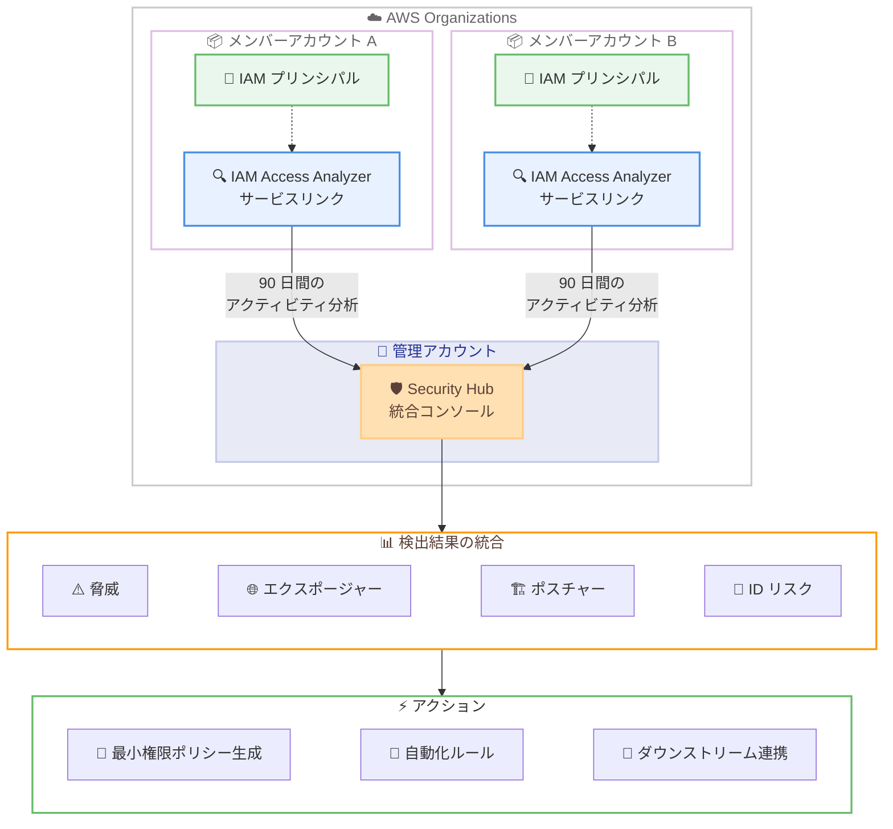

# AWS Security Hub - 未使用アクセスによる ID リスク検出

**リリース日**: 2026 年 5 月 20 日
**サービス**: AWS Security Hub
**機能**: 未使用アクセスからの ID リスク検出

## 概要

AWS Security Hub が、統合コンソール上で未使用の IAM 権限、ロール、クレデンシャルを検出する機能を新たにリリースした。これにより、セキュリティチームは脅威、エクスポージャー、ポスチャーの検出結果と同じ画面で ID リスクを一元管理できるようになる。

本機能は、IAM Access Analyzer のサービスリンクアナライザーを各メンバーアカウントに自動的に作成し、過去 90 日間のアクセスアクティビティに基づいて未使用のアクセス権限を評価する。追加設定は不要で、Security Hub Essentials に追加コストなしで含まれる。

**アップデート前の課題**

- 数百のアカウントにわたる ID リスクの管理には複数のツール間の切り替えが必要だった
- 未使用の権限と実際のリソースエクスポージャーを結びつける統合ビューが存在しなかった
- 最小権限ポリシーの策定に手動での分析が必要で、スケールしなかった

**アップデート後の改善**

- Security Hub の統合コンソールで脅威、エクスポージャー、ポスチャーと並べて ID リスクを確認可能
- IAM Access Analyzer がサービスリンクとして自動作成され、追加設定なしで動作
- 実際の使用パターンに基づく最小権限ポリシーのオンデマンド生成が可能

## アーキテクチャ図



Security Hub が各メンバーアカウントのサービスリンク IAM Access Analyzer を通じて未使用アクセスを検出し、統合コンソールに集約するフローを示している。

## サービスアップデートの詳細

### 主要機能

1. **未使用アクセスの自動検出**
   - IAM プリンシパルを過去 90 日間の実際のアクセスアクティビティに対して評価
   - 未使用の権限、ロール、クレデンシャルを検出
   - 組織全体のメンバーアカウントを横断的にスキャン

2. **サービスリンク IAM Access Analyzer の自動プロビジョニング**
   - Security Hub を組織で有効化するだけで、各メンバーアカウントに自動作成
   - 追加の設定やデプロイメントが不要
   - `ORGANIZATION_UNUSED_ACCESS` タイプのアナライザーとして動作

3. **ID リスクとエクスポージャーの相関分析**
   - 未使用アクセスの検出結果をリソースエクスポージャーのコンテキストと相関
   - 実際の組織リスクに基づく修復の優先順位付けを支援
   - 脅威、エクスポージャー、ポスチャーの検出結果と統合表示

4. **最小権限ポリシーのオンデマンド生成**
   - 実際の使用パターンに基づくポリシー推奨
   - IAM 権限の精緻化を支援
   - 攻撃対象面の削減に貢献

## 技術仕様

### 検出対象

| 項目 | 詳細 |
|------|------|
| 未使用の IAM 権限 | 90 日間使用されていないアクション権限 |
| 未使用の IAM ロール | 90 日間引き受けられていないロール |
| 未使用のクレデンシャル | 90 日間使用されていないアクセスキー等 |
| 分析対象期間 | 過去 90 日間のアクセスアクティビティ |

### API 変更履歴

| 日付 | サービス | 変更内容 |
|------|----------|----------|
| 2026/05/18 | [Access Analyzer](https://awsapichanges.com/archive/changes/faaa92-access-analyzer.html) | 2 new 2 updated api methods - サービスリンクアナライザーの作成・削除 API 追加 |

### 関連する Access Analyzer API 変更の詳細

今回の Security Hub 統合に伴い、IAM Access Analyzer に以下の API が追加された。

```python
# サービスリンクアナライザーの作成
client.create_service_linked_analyzer(
    type='ORGANIZATION_UNUSED_ACCESS',
    configuration={
        'unusedAccess': {
            'unusedAccessAge': 90,
            'analysisRule': {
                'exclusions': [
                    {
                        'accountIds': ['string'],
                        'resourceTags': [{'string': 'string'}]
                    }
                ]
            }
        }
    }
)

# サービスリンクアナライザーの削除
client.delete_service_linked_analyzer(
    analyzerName='string',
    clientToken='string'
)
```

`CreateServiceLinkedAnalyzer` API は Security Hub が内部的に使用し、各メンバーアカウントにアナライザーを自動作成する。`GetAnalyzer` と `ListAnalyzers` のレスポンスには新たに `managedBy` フィールドが追加され、アナライザーの管理元サービスを識別できる。

## 設定方法

### 前提条件

1. AWS Organizations が有効化されていること
2. Security Hub が組織レベルで有効化されていること
3. Security Hub Essentials プランが利用可能であること

### 手順

#### ステップ 1: Security Hub の組織レベル有効化

```bash
# Security Hub を組織の管理アカウントで有効化
aws securityhub enable-organization-admin-account \
    --admin-account-id 123456789012
```

委任管理者アカウントを指定して、Security Hub の組織管理を委任する。

#### ステップ 2: 自動有効化の確認

```bash
# メンバーアカウントの自動有効化設定を確認
aws securityhub describe-organization-configuration
```

組織の設定を確認し、新規メンバーアカウントが自動的に Security Hub に登録されることを確認する。サービスリンク IAM Access Analyzer は自動的に作成されるため、追加の設定は不要。

#### ステップ 3: 検出結果の確認

```bash
# 未使用アクセスに関連する検出結果を取得
aws securityhub get-findings \
    --filters '{"Type": [{"Value": "Software and Configuration Checks/AWS Security Best Practices/UnusedAccess", "Comparison": "PREFIX"}]}'
```

未使用アクセスに関連する検出結果をフィルタリングして取得する。

## メリット

### ビジネス面

- **運用効率の向上**: 複数ツール間の切り替えが不要になり、セキュリティチームの生産性が向上
- **リスクの可視化**: 組織全体の ID リスクを単一のダッシュボードで把握可能
- **追加コストなし**: Security Hub Essentials に含まれており、新たな費用が発生しない

### 技術面

- **ゼロ設定デプロイ**: サービスリンクアナライザーの自動作成により、手動設定が不要
- **最小権限の実現**: 実際の使用パターンに基づくポリシー推奨により、過剰権限を精緻に削減
- **統合ワークフロー**: 既存の自動化ルールやダウンストリーム連携と一貫したワークフローで運用可能

## デメリット・制約事項

### 制限事項

- 分析対象期間は 90 日間固定であり、カスタマイズできない可能性がある
- サービスリンクアナライザーは Security Hub が管理するため、個別のカスタマイズに制限がある
- 検出結果の生成までに初回は最大 90 日間のデータ蓄積が必要

### 考慮すべき点

- 大規模組織では検出結果の量が膨大になる可能性があり、適切なフィルタリングと優先順位付けが重要
- 既に IAM Access Analyzer を個別に設定している環境では、サービスリンクアナライザーとの重複に注意が必要
- CIEM (Cloud Infrastructure Entitlement Management) の基盤機能として位置付けられており、今後の機能拡張を見据えた設計が推奨される

## ユースケース

### ユースケース 1: 大規模組織の未使用権限クリーンアップ

**シナリオ**: 500 以上のアカウントを持つ企業が、組織全体で未使用の IAM ロールとアクセスキーを特定し、セキュリティリスクを低減したい。

**実装例**:
```bash
# 未使用アクセスの検出結果を重要度順に取得
aws securityhub get-findings \
    --filters '{
        "Type": [{"Value": "Software and Configuration Checks/AWS Security Best Practices/UnusedAccess", "Comparison": "PREFIX"}],
        "SeverityLabel": [{"Value": "HIGH", "Comparison": "EQUALS"}]
    }' \
    --sort-criteria '{"Field": "SeverityNormalized", "SortOrder": "desc"}'
```

**効果**: 手動での各アカウント調査が不要になり、重要度の高い未使用アクセスから優先的に対応できる。

### ユースケース 2: コンプライアンス監査対応

**シナリオ**: 金融機関が PCI DSS や SOC 2 の監査要件に対応するため、最小権限の原則が組織全体で遵守されていることを証明する必要がある。

**実装例**:
```bash
# 組織全体の未使用アクセス検出結果のサマリーを取得
aws securityhub get-insight-results \
    --insight-arn "arn:aws:securityhub:::insight/securityhub/default/unused-access-summary"
```

**効果**: 統合コンソールから監査証跡として未使用アクセスの検出状況と修復状況をレポートできる。

### ユースケース 3: 自動化による継続的な権限最適化

**シナリオ**: DevOps チームが、検出された未使用アクセスに対して自動的に通知を送信し、担当者にポリシーの見直しを促すワークフローを構築したい。

**実装例**:
```json
{
    "RuleName": "UnusedAccessAutoNotification",
    "Criteria": {
        "Type": [{"Value": "Software and Configuration Checks/AWS Security Best Practices/UnusedAccess", "Comparison": "PREFIX"}],
        "SeverityLabel": [{"Value": "MEDIUM", "Comparison": "EQUALS"}]
    },
    "Actions": [
        {
            "Type": "FINDING_FIELDS_UPDATE",
            "FindingFieldsUpdate": {
                "Note": {
                    "Text": "未使用アクセスが検出されました。最小権限ポリシーの確認をお願いします。",
                    "UpdatedBy": "SecurityHubAutomation"
                }
            }
        }
    ]
}
```

**効果**: Security Hub の自動化ルールにより、検出から通知までを自動化し、継続的な権限最適化サイクルを実現する。

## 料金

本機能は Security Hub Essentials に追加コストなしで含まれる。

### 料金例

| 項目 | 月額料金 |
|------|----------|
| Security Hub Essentials | 既存の Security Hub 料金体系に含まれる |
| サービスリンク IAM Access Analyzer | 追加料金なし |
| 未使用アクセス検出 | 追加料金なし |

## 利用可能リージョン

Security Hub が利用可能な全リージョンで本機能を利用できる。詳細は [AWS リージョン別サービス一覧](https://aws.amazon.com/about-aws/global-infrastructure/regional-product-services/) を参照。

## 関連サービス・機能

- **IAM Access Analyzer**: 未使用アクセス分析の基盤エンジンとして機能し、サービスリンクアナライザーが自動作成される
- **AWS Organizations**: 組織全体のメンバーアカウントを横断した分析を実現する基盤
- **Security Hub 自動化ルール**: 検出結果に対する自動アクションの定義とダウンストリーム連携を提供

## 参考リンク

- [公式発表 (What's New)](https://aws.amazon.com/about-aws/whats-new/2026/05/aws-security-hub-unused-access/)
- [AWS Security Hub ユーザーガイド](https://docs.aws.amazon.com/securityhub/latest/userguide/what-is-securityhub-v2.html)
- [AWS Security Hub 製品ページ](https://aws.amazon.com/security-hub/)
- [IAM Access Analyzer API 変更](https://awsapichanges.com/archive/changes/faaa92-access-analyzer.html)
- [AWS リージョン別サービス一覧](https://aws.amazon.com/about-aws/global-infrastructure/regional-product-services/)

## まとめ

AWS Security Hub の未使用アクセス検出機能は、組織全体の ID リスクを統合コンソールで一元管理できる重要なアップデートである。サービスリンク IAM Access Analyzer の自動プロビジョニングにより追加設定なしで利用を開始でき、Security Hub Essentials に追加コストなしで含まれるため、すべての Security Hub ユーザーが即座に恩恵を受けられる。セキュリティチームは、まず組織レベルで Security Hub を有効化し、検出結果のレビューと最小権限ポリシーの適用を開始することを推奨する。
