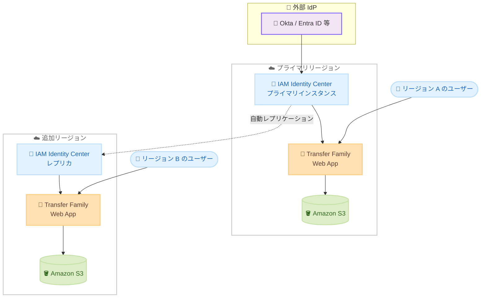

# AWS Transfer Family - Web アプリのマルチリージョンフェデレーション権限

**リリース日**: 2026 年 5 月 20 日
**サービス**: AWS Transfer Family
**機能**: Web アプリの IAM Identity Center マルチリージョンフェデレーション権限

📊 [このアップデートのインフォグラフィックを見る](https://takech9203.github.io/aws-news-summary/20260520-aws-transfer-family-federated-permissions-across-regions.html)

## 概要

AWS Transfer Family の Web アプリが、AWS IAM Identity Center を使用したフェデレーション権限を複数の AWS リージョンにまたがってサポートするようになった。これにより、IAM Identity Center のマルチリージョンレプリケーション機能を活用し、プライマリリージョン以外のリージョンでも Transfer Family Web アプリを作成・運用できるようになる。

このアップデートは、グローバルに分散したユーザーに対してファイル転送サービスを提供する組織にとって重要な改善である。ユーザーに近いリージョンで Web アプリを展開することで、レイテンシの削減と信頼性の向上が実現される。

**アップデート前の課題**

- Transfer Family Web アプリは IAM Identity Center インスタンスが有効化されているリージョンでのみ作成可能だった
- 別リージョンのユーザーはプライマリリージョンの Web アプリにアクセスする必要があり、レイテンシが発生していた
- マルチリージョン展開には個別の IAM Identity Center インスタンスとユーザー設定の二重管理が必要だった

**アップデート後の改善**

- IAM Identity Center のマルチリージョンレプリケーションにより、追加リージョンで Transfer Family Web アプリを作成可能になった
- ワークフォース ID が自動的にレプリケーションされ、ユーザー資格情報の再設定が不要になった
- 既存の認証情報でユーザーが即座にサインイン可能になり、管理者は同一の ID を使用してきめ細かな権限管理ができるようになった

## アーキテクチャ図



IAM Identity Center がプライマリリージョンから追加リージョンへワークフォース ID を自動的にレプリケーションし、各リージョンで Transfer Family Web アプリが独立して動作する構成を示す。

## サービスアップデートの詳細

### 主要機能

1. **マルチリージョン Web アプリ展開**
   - IAM Identity Center でマルチリージョンレプリケーションを有効化すると、追加リージョンで Transfer Family Web アプリを作成可能
   - プライマリリージョンと同じフェデレーション認証基盤を使用
   - リージョンごとに独立した Web アプリインスタンスが動作

2. **ワークフォース ID の自動レプリケーション**
   - IAM Identity Center が ID 設定を追加リージョンへ自動的にレプリケーション
   - ユーザー資格情報の手動再設定が不要
   - パーミッションセット、ユーザー・グループ割り当て、セッション情報がすべて同期

3. **既存認証情報による即時アクセス**
   - ユーザーは既存の認証情報で追加リージョンの Web アプリにそのままサインイン可能
   - 管理者は同一のワークフォース ID できめ細かな権限管理を継続
   - S3 Access Grants と連携した認可制御もリージョン間で一貫性を維持

## 技術仕様

### 前提条件

| 項目 | 要件 |
|------|------|
| IAM Identity Center インスタンス | 組織インスタンスが必須 (アカウントインスタンスは非対応) |
| ID ソース | 外部 IdP (Okta 等) が必須 (Active Directory / Identity Center ディレクトリは非対応) |
| KMS キー | マルチリージョン対応のカスタマーマネージド KMS キーが必須 |
| 対応リージョン | AWS アカウントでデフォルト有効な商用リージョン (オプトインリージョンは非対応) |
| 外部 IdP 要件 | 複数の ACS URL をサポートする IdP を推奨 (Okta, Entra ID, PingFederate 等) |

### API 変更履歴

本アップデートに関連する直近 7 日間の Transfer Family API 変更は確認されなかった。本機能は IAM Identity Center 側のマルチリージョンレプリケーション機能を前提としており、Transfer Family の既存 API (CreateWebApp 等) をそのまま利用する形で追加リージョンでの Web アプリ作成が可能になる。

### 関連する IAM Identity Center 設定

IAM Identity Center でマルチリージョンを有効化する際の概要構成。

```json
{
  "InstanceArn": "arn:aws:sso:::instance/ssoins-xxxxxxxxxxxxxxxxx",
  "PrimaryRegion": "us-east-1",
  "AdditionalRegions": ["ap-northeast-1", "eu-west-1"],
  "IdentitySource": "EXTERNAL_IDP",
  "EncryptionConfig": {
    "KmsKeyArn": "arn:aws:kms:us-east-1:123456789012:key/mrk-xxxxxxxx",
    "KeyType": "MULTI_REGION_CUSTOMER_MANAGED"
  }
}
```

## 設定方法

### 前提条件

1. IAM Identity Center の組織インスタンスが有効化されていること
2. 外部 IdP (Okta, Microsoft Entra ID 等) が ID ソースとして設定されていること
3. マルチリージョン対応のカスタマーマネージド KMS キーが作成されていること
4. Transfer Family Web アプリに必要な IAM ロールが設定されていること

### 手順

#### ステップ 1: IAM Identity Center でマルチリージョンレプリケーションを有効化

IAM Identity Center コンソールまたは API を使用して、追加リージョンへのレプリケーションを設定する。

```bash
# AWS CLI でマルチリージョンサポートの状態を確認
aws sso-admin list-instances --region us-east-1
```

IAM Identity Center コンソールで [Settings] > [Region] セクションから追加リージョンを選択し、レプリケーションを有効化する。

#### ステップ 2: 追加リージョンで Transfer Family Web アプリを作成

レプリケーションが完了したら、追加リージョンで Transfer Family Web アプリを作成する。

```bash
# 追加リージョンで Web アプリを作成
aws transfer create-web-app \
  --region ap-northeast-1 \
  --identity-provider-details '{
    "IdentityCenterConfig": {
      "InstanceArn": "arn:aws:sso:::instance/ssoins-xxxxxxxxxxxxxxxxx"
    }
  }'
```

IAM Identity Center がレプリケーション済みの ID 情報を使用して、Web アプリの認証基盤を提供する。

#### ステップ 3: S3 Access Grants の設定

Web アプリのユーザーがアクセスするデータの認可を S3 Access Grants で設定する。

```bash
# Access Grants インスタンスの作成 (追加リージョン)
aws s3control create-access-grants-instance \
  --region ap-northeast-1 \
  --account-id 123456789012 \
  --identity-center-arn "arn:aws:sso:::instance/ssoins-xxxxxxxxxxxxxxxxx"
```

S3 Access Grants により、IAM Identity Center のワークフォース ID に基づいたきめ細かなデータアクセス制御を設定する。

## メリット

### ビジネス面

- **レイテンシ削減**: ユーザーに近いリージョンで Web アプリを提供することで、ファイル転送のパフォーマンスが向上
- **可用性向上**: プライマリリージョンで障害が発生しても、追加リージョンの Web アプリで業務を継続可能
- **運用コスト削減**: ユーザー資格情報の二重管理が不要となり、管理負担が軽減

### 技術面

- **ID 管理の一元化**: 単一の IAM Identity Center インスタンスからマルチリージョンの ID を一元管理
- **自動同期**: ワークフォース ID のレプリケーションが自動化され、設定ドリフトのリスクを排除
- **既存アーキテクチャとの互換性**: 既存の Transfer Family Web アプリ設定や S3 Access Grants 設定をそのまま活用可能

## デメリット・制約事項

### 制限事項

- 組織インスタンスのみ対応 (アカウントインスタンスでは使用不可)
- 外部 IdP が必須 (Active Directory や Identity Center ディレクトリは非対応)
- マルチリージョン対応のカスタマーマネージド KMS キーが必要
- オプトインリージョンは現時点で非対応
- Web アプリが使用する S3 バケットは Web アプリと同一アカウントに存在する必要がある (クロスアカウントバケット非対応)

### 考慮すべき点

- 外部 IdP が複数の ACS URL をサポートしていない場合 (Google Workspace 等)、フル機能を活用できない可能性がある
- KMS キーをマルチリージョン対応に変更する必要があり、既存のシングルリージョン KMS キーからの移行作業が発生する場合がある
- レプリケーション対象リージョンにはクォータが設定されている

## ユースケース

### ユースケース 1: グローバル企業のファイル共有ポータル

**シナリオ**: 日米欧にオフィスを持つ企業が、各拠点のパートナーや顧客にファイル共有ポータルを提供する必要がある。

**実装例**:
```
プライマリリージョン: us-east-1 (IAM Identity Center)
追加リージョン: ap-northeast-1 (東京), eu-west-1 (アイルランド)
各リージョンに Transfer Family Web アプリをデプロイ
ユーザーは最寄りリージョンの Web アプリに自動ルーティング
```

**効果**: 各拠点のユーザーがローカルリージョンでファイル操作を行えるため、アップロード・ダウンロード速度が大幅に改善される。

### ユースケース 2: DR / BCP 対策としてのマルチリージョン展開

**シナリオ**: 金融機関が規制要件に基づき、障害発生時にもファイル転送業務を継続する必要がある。

**実装例**:
```
プライマリリージョン: ap-northeast-1 (東京)
DR リージョン: ap-southeast-1 (シンガポール)
Route 53 ヘルスチェックでフェイルオーバー構成
両リージョンで同一認証基盤による Web アプリを運用
```

**効果**: プライマリリージョンで障害が発生しても、ユーザーは既存の認証情報で DR リージョンの Web アプリにシームレスにアクセスでき、業務継続性が確保される。

### ユースケース 3: データレジデンシー要件への対応

**シナリオ**: 欧州の GDPR 要件により、欧州ユーザーのデータは EU リージョンに保管する必要があるが、ID 管理は米国本社で一元化したい。

**実装例**:
```
プライマリリージョン: us-east-1 (ID 管理の本拠地)
追加リージョン: eu-west-1 (欧州ユーザー向け)
eu-west-1 の S3 バケットに欧州データを格納
S3 Access Grants で欧州ユーザーのアクセス範囲を制限
```

**効果**: ID 管理を一元化しつつ、データは規制要件に準拠したリージョンに保管。ユーザーは単一の認証情報で適切なリージョンのデータにアクセスできる。

## 料金

Transfer Family Web アプリの料金は既存の料金体系に準ずる。マルチリージョン展開による追加料金は以下の通り。

### 料金例

| 項目 | 料金 |
|------|------|
| Transfer Family Web アプリ (リージョンあたり) | 既存の Transfer Family 料金に準拠 |
| IAM Identity Center | 無料 (AWS Organizations の機能として提供) |
| S3 ストレージ (リージョンあたり) | 各リージョンの S3 標準料金 |
| KMS マルチリージョンキー | $1/月/キー + API コール料金 |

## 利用可能リージョン

Transfer Family Web アプリは、Transfer Family がサポートするすべてのリージョンで利用可能 (Asia Pacific (New Zealand) および AWS European Sovereign Cloud を除く)。マルチリージョンフェデレーション権限は、AWS アカウントでデフォルト有効な商用リージョンで利用可能。

## 関連サービス・機能

- **AWS IAM Identity Center**: ワークフォース ID のフェデレーション認証とマルチリージョンレプリケーションを提供
- **Amazon S3 Access Grants**: Transfer Family Web アプリのユーザーに対するきめ細かなデータアクセス認可を制御
- **AWS Transfer Family**: マネージドファイル転送サービス。Web アプリはブラウザベースの S3 データ操作インターフェースを提供
- **AWS KMS**: マルチリージョン対応のカスタマーマネージドキーによる暗号化

## 参考リンク

- 📊 [インフォグラフィック](https://takech9203.github.io/aws-news-summary/20260520-aws-transfer-family-federated-permissions-across-regions.html)
- [公式発表 (What's New)](https://aws.amazon.com/about-aws/whats-new/2026/05/aws-transfer-family-federated-permissions-across-regions/)
- [Transfer Family Web アプリ ユーザーガイド](https://docs.aws.amazon.com/transfer/latest/userguide/web-app.html)
- [IAM Identity Center マルチリージョン ユーザーガイド](https://docs.aws.amazon.com/singlesignon/latest/userguide/multi-region-iam-identity-center.html)
- [Transfer Family 料金ページ](https://aws.amazon.com/aws-transfer-family/pricing/)

## まとめ

AWS Transfer Family Web アプリが IAM Identity Center のマルチリージョンレプリケーションに対応したことで、グローバルに分散したユーザーに対して低レイテンシかつ高可用性のファイル転送ポータルを提供できるようになった。既存の ID 管理基盤をそのまま活用できるため、追加の認証設定なしにマルチリージョン展開が可能である。グローバル展開を検討している組織は、IAM Identity Center のマルチリージョン要件 (外部 IdP、マルチリージョン KMS キー) を満たした上で、ユーザーに近いリージョンへの Web アプリ展開を推奨する。
