# Amazon DocumentDB - DocumentDB 8.0 でのサーバーレス提供開始

**リリース日**: 2026年5月20日
**サービス**: Amazon DocumentDB (with MongoDB compatibility)
**機能**: DocumentDB 8.0 Serverless

[このアップデートのインフォグラフィックを見る](https://takech9203.github.io/aws-news-summary/20260520-docdb8-serverless.html)

## 概要

Amazon DocumentDB (with MongoDB compatibility) のサーバーレスオプションが、DocumentDB 8.0 エンジンで利用可能になった。これまでサーバーレスは DocumentDB 5.0 でのみ提供されていたが、今回のアップデートにより DocumentDB 8.0 の高度な機能をサーバーレス環境で活用できるようになった。

DocumentDB 8.0 は、最大 7 倍のクエリレイテンシー改善、最大 5 倍の圧縮率向上、最大 30 倍高速なベクトルインデックス構築など、大幅なパフォーマンス改善を実現するエンジンバージョンである。これらの性能向上をサーバーレスの自動スケーリングと組み合わせることで、可変ワークロードに対して最適なコストパフォーマンスを実現できる。

対象ユーザーは、MongoDB 6.0/7.0/8.0 互換アプリケーションを運用しており、インフラ管理の負荷を軽減しつつ最新のデータベース機能を活用したい開発者やアーキテクトである。

**アップデート前の課題**

- サーバーレスオプションは DocumentDB 5.0 のみ対応しており、8.0 の高度なクエリ最適化やベクトル検索改善を利用できなかった
- DocumentDB 8.0 の機能を利用するにはプロビジョンドインスタンスを選択する必要があり、キャパシティ管理が必要だった
- 可変ワークロードで DocumentDB 8.0 の新機能を活用する場合、ピーク容量に合わせたプロビジョニングによるコスト増が避けられなかった

**アップデート後の改善**

- DocumentDB 8.0 の全機能をサーバーレス環境で利用可能になった
- ワークロードに応じた自動スケーリングにより、最大 90% のコスト削減が可能になった
- MongoDB 8.0 互換アプリケーションをインフラ管理不要で運用できるようになった

## アーキテクチャ図

```mermaid
flowchart TD
    subgraph App["⚡ アプリケーション層"]
        direction LR
        Client["👤 クライアント"]
        Driver["🔌 MongoDB ドライバー"]
        Client ~~~ Driver
    end

    subgraph DocDB8["☁️ DocumentDB 8.0 Serverless"]
        direction LR
        Endpoint["🔗 クラスターエンドポイント"]
        subgraph Compute["⚙️ コンピュート DCU 自動スケーリング"]
            direction LR
            Primary["📝 プライマリ"]
            Replica1["📖 リードレプリカ 1"]
            Replica2["📖 リードレプリカ 2"]
            Primary ~~~ Replica1 ~~~ Replica2
        end
        Endpoint --> Primary
        Endpoint --> Replica1
        Endpoint --> Replica2
    end

    subgraph Storage["🗄️ 分散ストレージ層"]
        direction LR
        AZ1[("💾 AZ-1")]
        AZ2[("💾 AZ-2")]
        AZ3[("💾 AZ-3")]
        AZ1 ~~~ AZ2 ~~~ AZ3
    end

    subgraph Features["🚀 DocumentDB 8.0 新機能"]
        direction LR
        QueryOpt["📊 新クエリプランナー<br/>最大 7x 高速化"]
        VectorIdx["🔍 並列ベクトルインデックス<br/>最大 30x 高速構築"]
        Compress["📦 辞書ベース圧縮<br/>最大 5x 圧縮率"]
        QueryOpt ~~~ VectorIdx ~~~ Compress
    end

    Driver --> Endpoint
    Primary --> AZ1
    Primary --> AZ2
    Primary --> AZ3

    classDef cloud fill:none,stroke:#CCCCCC,stroke-width:2px,color:#666666
    classDef compute fill:#FFE0B2,stroke:#FFCC80,stroke-width:2px,color:#5D4037
    classDef storage fill:#DCEDC8,stroke:#C5E1A5,stroke-width:2px,color:#33691E
    classDef feature fill:#E3F2FD,stroke:#BBDEFB,stroke-width:2px,color:#1565C0
    classDef user fill:#E8F1FF,stroke:#4A90E2,stroke-width:2px,color:#333333

    class App,DocDB8,Storage,Features cloud
    class Compute compute
    class AZ1,AZ2,AZ3 storage
    class QueryOpt,VectorIdx,Compress feature
    class Client,Driver user
```



DocumentDB 8.0 Serverless は、アプリケーションから MongoDB 互換ドライバー経由でアクセスし、DCU (DocumentDB Capacity Units) による自動スケーリングコンピュート層と 3 つの AZ にまたがる分散ストレージ層で構成される。

## サービスアップデートの詳細

### 主要機能

1. **新クエリプランナーによる最大 7 倍の集約パイプライン高速化**
   - 高度なパイプライン最適化により集約クエリのレイテンシーを大幅に削減
   - 複雑なクエリパターンでの性能向上が期待できる
   - サーバーレス環境でも同等のクエリ最適化が適用される

2. **並列ベクトルインデックス構築による最大 30 倍の高速化**
   - ベクトル検索インデックスの構築時間を大幅に短縮
   - Amazon Bedrock や Amazon SageMaker からのベクトルエンベディングの格納と検索を高速に実行
   - RAG (Retrieval-Augmented Generation) アプリケーションの構築が容易になる

3. **辞書ベース圧縮による最大 5 倍の圧縮率向上**
   - ストレージ使用量を大幅に削減
   - サーバーレスのストレージコスト (GB 単位課金) の最適化に直結
   - データ量の多いワークロードでの TCO 削減効果が高い

4. **MongoDB 6.0/7.0/8.0 互換性**
   - MongoDB 8.0 アプリケーションからの移行を直接サポート
   - コリエーション (照合順序) とビューのサポート追加
   - 6 つの新しい集約ステージと 3 つの新しい集約演算子

5. **テキストインデックス v2**
   - メールアドレス、URL、ファイルパスなどの構造化フォーマットをパース可能
   - テキスト検索の精度と柔軟性が向上

## 技術仕様

### サーバーレス構成

| 項目 | 詳細 |
|------|------|
| キャパシティ単位 | DCU (DocumentDB Capacity Units) |
| 1 DCU あたりのメモリ | 約 2 GiB + 対応する CPU/ネットワーク |
| 最小キャパシティ | 0.5 DCU |
| スケーリング粒度 | 0.5 DCU 刻み |
| 課金単位 | 秒単位 |
| リードレプリカ | 最大 15 |
| マルチ AZ | 対応 |

### DocumentDB 8.0 の性能改善

| 項目 | 改善率 |
|------|--------|
| 集約クエリレイテンシー | 最大 7 倍改善 |
| ベクトルインデックス構築 | 最大 30 倍高速化 |
| データ圧縮率 | 最大 5 倍改善 |

### API 変更履歴

今回のアップデートに関連する awsapichanges.com での API 変更は確認されなかった。サーバーレスクラスター作成時のエンジンバージョン指定パラメータとして `8.0` が選択可能になったと推定される。

## 設定方法

### 前提条件

1. AWS アカウントと適切な IAM 権限
2. VPC およびサブネットグループの設定
3. MongoDB 互換ドライバー (pymongo, mongosh など)

### 手順

#### ステップ 1: サーバーレスクラスターの作成

```bash
aws docdb create-db-cluster \
  --db-cluster-identifier my-docdb8-serverless \
  --engine docdb \
  --engine-version "8.0" \
  --serverless-v2-scaling-configuration MinCapacity=0.5,MaxCapacity=16 \
  --master-username admin \
  --master-user-password <password> \
  --vpc-security-group-ids sg-xxxxxxxx \
  --db-subnet-group-name my-subnet-group
```

DocumentDB 8.0 エンジンバージョンを指定してサーバーレスクラスターを作成する。MinCapacity と MaxCapacity で DCU の範囲を指定する。

#### ステップ 2: サーバーレスインスタンスの追加

```bash
aws docdb create-db-instance \
  --db-instance-identifier my-docdb8-instance-1 \
  --db-cluster-identifier my-docdb8-serverless \
  --db-instance-class db.serverless \
  --engine docdb
```

インスタンスクラスに `db.serverless` を指定してサーバーレスインスタンスを追加する。

#### ステップ 3: 接続確認

```bash
mongosh --host my-docdb8-serverless.cluster-xxxx.us-east-1.docdb.amazonaws.com:27017 \
  --tls \
  --tlsCAFile global-bundle.pem \
  --username admin \
  --password <password>
```

MongoDB Shell を使用してクラスターに接続する。TLS 接続が必須であるため、CA バンドルファイルを指定する。

## メリット

### ビジネス面

- **コスト最適化**: 可変ワークロードでピーク時のプロビジョニングと比較して最大 90% のコスト削減
- **運用負荷軽減**: キャパシティプランニングやスケーリング操作が不要になり、運用チームの負荷を削減
- **迅速な市場投入**: インフラ管理の考慮なしに DocumentDB 8.0 の最新機能をすぐに活用可能

### 技術面

- **自動スケーリング**: アプリケーション需要に応じて DCU が自動的に増減し、性能とコストのバランスを維持
- **高性能クエリ処理**: DocumentDB 8.0 の新クエリプランナーによる集約パイプラインの大幅な高速化
- **AI/ML ワークロード対応**: 並列ベクトルインデックス構築により、生成 AI アプリケーションのベクトル検索基盤として最適

## デメリット・制約事項

### 制限事項

- サーバーレスの最大 DCU に上限があり、極めて大規模なワークロードではプロビジョンドインスタンスが必要な場合がある
- コールドスタート時にレイテンシーが増加する可能性がある
- サーバーレスではインスタンスタイプの直接指定ができないため、特定のハードウェア要件がある場合は不向き

### 考慮すべき点

- 予測可能で安定した高負荷ワークロードでは、プロビジョンドインスタンスの方がコスト効率が高い場合がある
- DocumentDB 5.0 からの移行にはエンジンバージョンのアップグレードが必要

## ユースケース

### ユースケース 1: 生成 AI アプリケーションのベクトル検索基盤

**シナリオ**: チャットボットや RAG システムで、ユーザーの質問に応じて関連ドキュメントをベクトル検索で取得する。トラフィックは業務時間帯に集中し、夜間や週末は低負荷。

**実装例**:
```javascript
// ベクトル検索クエリ例
db.documents.aggregate([
  {
    $vectorSearch: {
      queryVector: embeddingVector,
      path: "embedding",
      numCandidates: 100,
      limit: 10,
      index: "vector_index"
    }
  }
]);
```

**効果**: 業務時間帯のみ DCU がスケールアップし、夜間はコストを抑制。DocumentDB 8.0 の並列ベクトルインデックス構築により、大量ドキュメント追加時のインデックス更新も高速。

### ユースケース 2: E コマースのカタログ管理システム

**シナリオ**: 商品カタログをドキュメントデータベースで管理し、セール期間中のトラフィック急増に対応する必要がある。通常時は低負荷だがセール時には数十倍のアクセスが発生。

**実装例**:
```javascript
// 商品検索の集約パイプライン例
db.products.aggregate([
  { $match: { category: "electronics", inStock: true } },
  { $lookup: { from: "reviews", localField: "_id", foreignField: "productId", as: "reviews" } },
  { $addFields: { avgRating: { $avg: "$reviews.rating" } } },
  { $sort: { avgRating: -1 } },
  { $limit: 20 }
]);
```

**効果**: セール時に自動スケールアウトし、通常時はコストを最小化。DocumentDB 8.0 の新クエリプランナーにより集約パイプラインが最大 7 倍高速化。

### ユースケース 3: IoT デバイスデータの時系列蓄積

**シナリオ**: 数万台の IoT デバイスからのテレメトリデータを蓄積。データ送信頻度がデバイスの稼働状況により大きく変動する。

**実装例**:
```javascript
// テレメトリデータの挿入と集約
db.telemetry.insertMany(deviceReadings);

// 時間帯別の集約分析
db.telemetry.aggregate([
  { $match: { timestamp: { $gte: startTime, $lt: endTime } } },
  { $group: { _id: { $hour: "$timestamp" }, avgTemp: { $avg: "$temperature" } } }
]);
```

**効果**: 辞書ベース圧縮により反復的な IoT データのストレージコストを最大 5 倍削減。可変データ流入量に対してサーバーレスが自動対応。

## 料金

DocumentDB 8.0 Serverless の料金はサーバーレスの標準料金体系に従う。

### 料金例

| 項目 | 料金 (米国東部バージニア北部) |
|------|------------------|
| DocumentDB Standard (サーバーレス) | $0.0822/DCU 時間 |
| DocumentDB I/O-Optimized (サーバーレス) | $0.0905/DCU 時間 |
| ストレージ (Standard) | $0.10/GB 月 |
| ストレージ (I/O-Optimized) | $0.30/GB 月 |
| I/O リクエスト (Standard) | $0.20/100 万リクエスト |
| I/O リクエスト (I/O-Optimized) | 無料 (含まれる) |

**コスト試算例**: 7 DCU を 30 分間使用した場合
- Standard: 約 $0.32
- I/O-Optimized: 約 $0.35

## 利用可能リージョン

DocumentDB 8.0 Serverless の利用可能リージョンは公式発表を参照。DocumentDB サーバーレスは米国東部 (バージニア北部)、米国西部 (オレゴン)、欧州 (アイルランド)、アジアパシフィック (東京) を含む主要リージョンで提供されている。

## 関連サービス・機能

- **Amazon Bedrock**: ベクトルエンベディングの生成元として連携し、DocumentDB 8.0 のベクトル検索と組み合わせて RAG アプリケーションを構築
- **Amazon OpenSearch Service**: DocumentDB とのゼロ ETL 統合により、全文検索やセマンティック検索を追加可能
- **AWS Database Migration Service**: MongoDB 6.0/7.0/8.0 から DocumentDB 8.0 Serverless への移行を支援

## 参考リンク

- [インフォグラフィック](https://takech9203.github.io/aws-news-summary/20260520-docdb8-serverless.html)
- [公式発表 (What's New)](https://aws.amazon.com/about-aws/whats-new/2026/05/docdb8-serverless/)
- [Amazon DocumentDB ドキュメント](https://docs.aws.amazon.com/documentdb/latest/developerguide/)
- [Amazon DocumentDB 料金](https://aws.amazon.com/documentdb/pricing/)
- [Amazon DocumentDB 機能一覧](https://aws.amazon.com/documentdb/features/)

## まとめ

Amazon DocumentDB 8.0 Serverless の提供開始により、最大 7 倍のクエリ高速化、最大 30 倍のベクトルインデックス構築高速化、最大 5 倍の圧縮率改善といった DocumentDB 8.0 の性能向上を、サーバーレスの自動スケーリングとコスト最適化の恩恵を受けながら利用できるようになった。特に生成 AI アプリケーションのベクトル検索基盤や、トラフィックが変動するワークロードにおいて、DocumentDB 8.0 Serverless への移行を検討することを推奨する。
