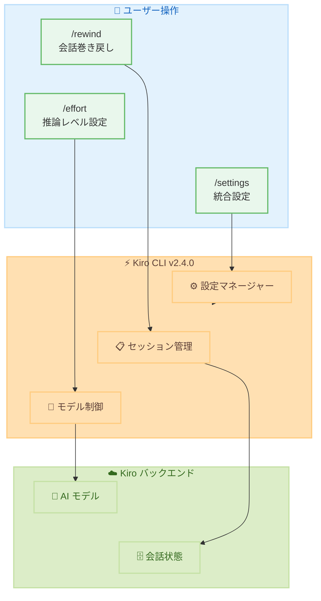

# Kiro - 会話の巻き戻し、推論エフォート制御、統合設定メニュー

**リリース日**: 2026年05月20日
**サービス**: Kiro (AI 搭載 IDE by AWS)
**バージョン**: 2.4.0

📊 [このアップデートのインフォグラフィックを見る](https://takech9203.github.io/aws-news-summary/20260520-kiro-changelog-2026-05-20.html)

## 概要

Kiro CLI バージョン 2.4.0 では、会話フローの制御とモデルの思考プロセスの調整に関する 3 つの主要機能が追加された。会話の任意の時点に巻き戻して別のアプローチを探索する「Rewind」機能、モデルごとの推論エフォートレベルを設定する「Effort Control」機能、テーマ・キーバインド・ターミナル設定を一元管理する「Unified Settings」メニューが導入されている。

加えて、ワークスペースの初期化速度が 88% 高速化 (652ms から 76ms) されており、ファイル監視のセットアップをバックグラウンドタスクに移動することで実現された。日常的な開発ワークフローの起動時間が大幅に短縮される。

本リリースは CLI ユーザーを対象としており、AI エージェントとの対話をより効率的かつ柔軟に行うための改善が中心となっている。

**アップデート前の課題**

- 会話中にエージェントが取った方向を変更したい場合、最初からやり直す必要があった
- モデルの推論量を制御する手段がなく、単純なタスクでも複雑なタスクと同じ思考コストがかかっていた
- テーマ、キーバインド、ターミナル設定がそれぞれ別のコマンドに分散しており、設定の一元管理ができなかった
- ワークスペース初期化に 652ms かかり、起動体験に遅延が感じられた

**アップデート後の改善**

- `/rewind` コマンドで会話の任意のターンに戻り、元のスレッドを保持したまま別の方向に分岐可能になった
- `/effort` コマンドで 5 段階 (low, medium, high, xhigh, max) の推論レベルを選択でき、タスクに応じたコストと速度の最適化が可能になった
- `/settings` コマンドでテーマ、キーバインド、ターミナル設定を一元管理できるようになった
- ワークスペース初期化が 76ms まで高速化 (88% 改善) された

## アーキテクチャ図



Kiro CLI 2.4.0 の新機能アーキテクチャ。ユーザーは 3 つの新しいスラッシュコマンドを通じて、セッション管理、モデル制御、設定管理にアクセスする。

## サービスアップデートの詳細

### 主要機能

1. **会話の巻き戻し (Rewind Conversations)**
   - `/rewind` コマンドで会話内の任意のプロンプト (ターン) に戻ることが可能
   - 戻った地点から新しいセッションとして別の方向に分岐できる
   - 元のスレッドは保持されるため、以前の会話内容が失われることはない
   - エージェントが取った方向を修正したい場合に、最初からやり直す必要がなくなる
   - ドキュメント: https://kiro.dev/docs/cli/chat/rewind/

2. **モデル推論エフォート制御 (Model Reasoning Effort)**
   - `/effort` コマンドで 5 段階のレベルを選択可能: low, medium, high, xhigh, max
   - low: 単純なタスク向け。高速かつ低コストのレスポンス
   - high/max: 複雑な問題向け。モデルにより多くの思考時間を与える
   - モデルごとに設定可能で、タスクの複雑さに応じて動的に変更できる
   - ドキュメント: https://kiro.dev/docs/cli/chat/effort/

3. **統合設定メニュー (Unified Settings Menu)**
   - `/settings` コマンドで全設定に一元アクセス
   - `/settings theme`: カラーテーマの変更
   - `/settings keybindings`: キーボードショートカットの確認
   - `/settings terminal`: `Shift+Enter` / `Option+Enter` によるマルチライン入力の有効化
   - 既存の `/theme` コマンドはショートカットとして引き続き利用可能
   - ドキュメント: https://kiro.dev/docs/cli/chat/settings/

### 改善点

1. **ワークスペース初期化の高速化**
   - 起動時間: 652ms から 76ms へ (88% 高速化)
   - ファイル監視のセットアップをバックグラウンドタスクに移動して実現

2. **/changelog コマンド**
   - 新しいスラッシュコマンドでリリースノートを CLI 内で直接確認可能
   - ターミナルを離れることなく最新の変更内容を把握できる

3. **シェルエスケープが $SHELL を使用**
   - `!` シェルエスケープがハードコードされた bash ではなく `$SHELL` 環境変数を使用
   - zsh や fish ユーザーが期待する環境で動作する

4. **モデル利用不可時のエラー改善**
   - モデルが利用不可の場合、`/model` コマンドの実行を提案するように改善
   - 不明なモデル ID はサイレントフォールバックせずバックエンドに送信される

5. **MCP 無効時の修復手順表示**
   - プロファイル API 障害により MCP が無効化された際、具体的な修復手順を表示

6. **モデル名のエージェントコンテキスト追加**
   - 現在のモデル名がエージェントのコンテキストに含まれるように
   - スキルやプロンプトがアクティブなモデルに基づいて動作を適応可能

### バグ修正

- MCP サーバーの環境変数がシェル環境変数で上書きされる問題を修正
- tree-sitter パーサーがサポートされていない言語でパニックする問題に対するパターン検索・書き換えの堅牢化
- `/clear` がロードされたスキルをフロントマターのみの状態にリセットしない問題を修正
- macOS での MallocStackLogging 警告の不要な表示を修正
- リモート MCP サーバーの OAuth ディスカバリ失敗時のエラーメッセージ改善
- `@` ファイルピッカーがネストされた `.gitignore` を無視する問題を修正 (大規模ディレクトリでのスキャン遅延を解消)
- `--help` 出力に `--classic` フラグの記載が不足していた問題を修正
- バリデーションエラー (画像サイズ超過など) が生のエラーコードで表示される問題を修正
- ビルトインコマンドがスラッシュコマンドの自動補完でスキルより優先されるよう修正
- knowledgeBase リソースが通常のコンテキストファイルとしてロードされ重複する問題を修正
- エージェント切り替え時にナレッジストアが更新されず、前のエージェントのデータが残る問題を修正
- 引数なしの MCP ツール呼び出し時の無限リトライループを修正

## 技術仕様

### コマンド一覧

| コマンド | 説明 | 備考 |
|----------|------|------|
| `/rewind` | 会話の任意のターンに巻き戻し | 新規追加 |
| `/effort` | 推論エフォートレベルの設定 | 5 段階: low, medium, high, xhigh, max |
| `/settings` | 統合設定メニュー | テーマ、キーバインド、ターミナル設定を一元管理 |
| `/settings theme` | テーマ変更 | `/theme` でもアクセス可能 |
| `/settings keybindings` | キーバインド表示 | - |
| `/settings terminal` | ターミナル設定 | マルチライン入力の設定 |
| `/changelog` | リリースノート表示 | 新規追加 |

### パフォーマンス改善

| 項目 | 改善前 | 改善後 | 改善率 |
|------|--------|--------|--------|
| ワークスペース初期化 | 652ms | 76ms | 88% 高速化 |

## 設定方法

### 前提条件

1. Kiro CLI がインストールされていること
2. バージョン 2.4.0 以上に更新されていること
3. 有効な Kiro アカウント (Free または Pro)

### 手順

#### ステップ 1: Kiro CLI のアップデート

```bash
kiro update
```

最新バージョン (2.4.0) にアップデートする。

#### ステップ 2: 会話の巻き戻しを使用する

```bash
# 会話中に /rewind を実行
/rewind
```

表示されるターン一覧から戻りたい地点を選択する。選択後、新しいセッションとして別の方向に分岐する。

#### ステップ 3: 推論エフォートを設定する

```bash
# エフォートレベルを設定
/effort high
```

タスクの複雑さに応じて low (単純なタスク) から max (複雑な推論) まで切り替える。

#### ステップ 4: 統合設定メニューを使用する

```bash
# 設定メニューを開く
/settings

# テーマを変更する場合
/settings theme

# ターミナル設定でマルチライン入力を有効化
/settings terminal
```

設定変更は即座に反映される。

## メリット

### ビジネス面

- **開発効率の向上**: 会話の巻き戻しにより、試行錯誤のコストが大幅に削減される
- **コスト最適化**: エフォート制御により、単純なタスクで不要なトークン消費を抑制できる
- **オンボーディングの簡素化**: 統合設定メニューにより、新規ユーザーの設定負荷が軽減される

### 技術面

- **ワークフローの柔軟性**: 会話の分岐により、複数のアプローチを並行して検討可能
- **パフォーマンス向上**: ワークスペース初期化の 88% 高速化により、開発の中断が最小化
- **カスタマイズ性**: モデルごとのエフォート設定で、タスクに最適な推論レベルを選択可能
- **デバッグ効率の改善**: エラーメッセージの改善とコンテキスト情報の追加により、問題解決が迅速に

## デメリット・制約事項

### 制限事項

- Rewind 機能は CLI のみ対応 (Web UI では未対応の可能性)
- エフォート制御の効果はモデルにより異なる場合がある
- 巻き戻し後の元スレッドは読み取り専用となり、追記はできない

### 考慮すべき点

- エフォートレベルの最適値はタスクの性質に依存するため、適切なレベルの選定には試行錯誤が必要
- 頻繁な巻き戻しは会話履歴の管理が複雑になる可能性がある

## ユースケース

### ユースケース 1: コードリファクタリングの方向性検討

**シナリオ**: 大規模なリファクタリングで、エージェントが提案したアプローチに疑問を感じた場合

**実装例**:
```bash
# エージェントとの会話中、5つ目のプロンプトまで進んだ後
/rewind
# ターン 2 を選択 (リファクタリング方針の議論開始地点)
# 別のアプローチを提案して新しい方向に進む
```

**効果**: 最初からやり直すことなく、異なる設計アプローチを迅速に比較検討できる

### ユースケース 2: タスクに応じたコスト最適化

**シナリオ**: 簡単な定型コード生成と複雑なアーキテクチャ設計を交互に行う場合

**実装例**:
```bash
# 単純なボイラープレートコード生成
/effort low
# タスク実行...

# 複雑なシステム設計の議論
/effort max
# タスク実行...
```

**効果**: タスクの複雑さに応じてコストと速度を最適化し、全体的なトークン消費を抑制

### ユースケース 3: チーム開発環境の統一

**シナリオ**: チームメンバー間で Kiro の設定を標準化したい場合

**実装例**:
```bash
# 統合設定メニューからすべての設定を確認・変更
/settings

# チーム標準のテーマを設定
/settings theme

# マルチライン入力を有効化 (コードブロックの貼り付けに便利)
/settings terminal
```

**効果**: 設定の一元管理により、チームメンバーの環境セットアップが簡素化される

## 料金

Kiro は以下のプランで利用可能。

| プラン | 月額料金 | 含まれる内容 |
|--------|----------|--------------|
| Free | 無料 | 基本機能、制限付きインタラクション |
| Pro | 有料 | 無制限のインタラクション、優先サポート |

本アップデートの機能 (Rewind、Effort Control、Unified Settings) は Free プランと Pro プランの両方で利用可能。

## 利用可能リージョン

グローバル (リージョン制限なし)

Kiro はグローバルサービスとして提供されており、特定の AWS リージョンに依存しない。

## 関連サービス・機能

- **Kiro Web**: ブラウザベースの Kiro 環境。CLI 版と一部機能が共通
- **Kiro Powers**: Kiro のスキルシステム。エフォート制御と連携してモデル動作を最適化
- **MCP (Model Context Protocol)**: 本リリースで複数のバグ修正が適用された拡張プロトコル

## 参考リンク

- 📊 [インフォグラフィック](https://takech9203.github.io/aws-news-summary/20260520-kiro-changelog-2026-05-20.html)
- [公式 Changelog](https://kiro.dev/changelog/)
- [Rewind ドキュメント](https://kiro.dev/docs/cli/chat/rewind/)
- [Effort Control ドキュメント](https://kiro.dev/docs/cli/chat/effort/)
- [Settings ドキュメント](https://kiro.dev/docs/cli/chat/settings/)
- [Kiro 料金ページ](https://kiro.dev/pricing/)

## まとめ

Kiro 2.4.0 は、AI エージェントとの対話効率を大幅に向上させるリリースである。特に Rewind 機能は、試行錯誤のコストを削減し、エフォート制御はタスクに応じたコスト最適化を実現する。88% のワークスペース初期化高速化と合わせて、日常的な開発体験が全体的に改善されるため、すべての Kiro ユーザーにアップデートを推奨する。
