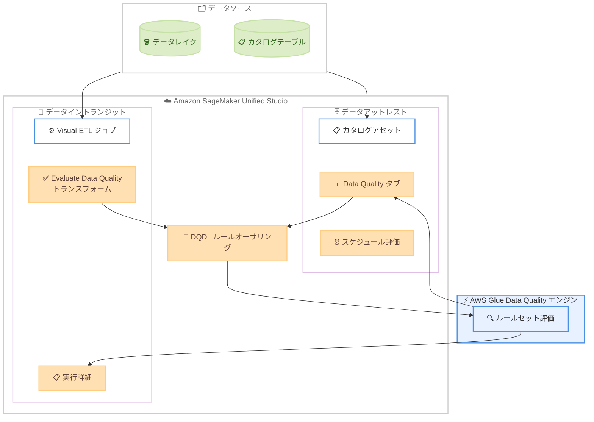

# Amazon SageMaker Unified Studio - データ品質ルールのオーサリングと評価

**リリース日**: 2026 年 5 月 20 日
**サービス**: Amazon SageMaker Unified Studio
**機能**: データ品質ルールオーサリングおよび評価 (Data Quality Rule Authoring and Evaluation)

📊 [このアップデートのインフォグラフィックを見る](https://takech9203.github.io/aws-news-summary/20260520-smus-data-quality.html)

## 概要

Amazon SageMaker Unified Studio にデータ品質ルールのオーサリングと評価機能が追加された。この機能は AWS Glue Data Quality を基盤としており、データエンジニア、アナリスト、データサイエンティストが SageMaker Unified Studio 内で直接データ品質ルールを定義し、ルールセットの評価を実行し、結果を確認できるようになった。

本機能は「データアットレスト」(カタログテーブル内の静的データ) と「データイントランジット」(Visual ETL ジョブ内の移動中データ) の 2 つのワークフローに対応している。これにより、品質に問題のあるデータがデータレイクに入り込んだり、下流の分析や機械学習ワークロードに悪影響を与える前に問題を検出できる。

ルール定義には AWS Glue Data Quality で使用されている Data Quality Definition Language (DQDL) と同じ言語が使用され、既存の Glue Data Quality の知識をそのまま活用できる。

**アップデート前の課題**

- データ品質ルールの定義と評価には AWS Glue Data Quality コンソールまたは Glue ジョブ内で設定する必要があり、SageMaker Unified Studio のワークフローから離れる必要があった
- カタログアセットのデータ品質を確認するために複数のサービスコンソールを行き来する必要があった
- Visual ETL ジョブのパイプライン内でデータ品質を評価し、その結果を一元的に確認する手段が限られていた

**アップデート後の改善**

- SageMaker Unified Studio 内で直接データ品質ルールを作成・評価・結果確認が可能になった
- カタログアセットに専用の Data Quality タブが追加され、ルールオーサリングからオンデマンド/スケジュール評価、ルールごとの合否結果まで一箇所で管理できるようになった
- Visual ETL ジョブに Evaluate Data Quality トランスフォームを追加し、ジョブ実行詳細の一部としてデータ品質結果を確認できるようになった

## アーキテクチャ図



SageMaker Unified Studio 内からデータ品質ルールを DQDL で定義し、AWS Glue Data Quality エンジンで評価を実行する。カタログアセットの静的データと Visual ETL ジョブの移動中データの両方に対応している。

## サービスアップデートの詳細

### 主要機能

1. **DQDL ルールオーサリング**
   - AWS Glue Data Quality で使用される Data Quality Definition Language (DQDL) を使用してルールを定義
   - 完全性 (Completeness)、一意性 (Uniqueness)、鮮度 (Freshness)、正確性 (Accuracy) など多数の品質ディメンションに対応
   - 既存の Glue Data Quality ルールの知識がそのまま活用可能

2. **データアットレストの品質評価**
   - カタログアセットに専用の Data Quality タブを追加
   - オンデマンドまたはスケジュールでの評価実行に対応
   - ルールごとの合否結果 (pass/fail) を詳細に表示

3. **データイントランジットの品質評価**
   - Visual ETL ジョブに Evaluate Data Quality トランスフォームを追加可能
   - ジョブ実行詳細の一部としてデータ品質結果を確認
   - パイプライン内でデータ品質ゲートとして機能

## 技術仕様

### 対応する品質ディメンション

| ディメンション | 説明 |
|------|------|
| Completeness | カラムの NULL 値や欠損値の割合をチェック |
| Uniqueness | カラム値の一意性を検証 |
| Freshness | データの更新頻度や最終更新日時を確認 |
| Accuracy | データ値の正確性をルールに基づいて評価 |
| Custom Rules | DQDL 構文によるカスタムルール定義 |

### サポートされるドメインタイプ

| ドメインタイプ | サポート状況 |
|------|------|
| AWS IAM Identity Center ベース | 対応 |
| IAM ベース | 対応 |

### API 変更履歴

| 日付 | サービス | 変更内容 |
|------|----------|----------|
| 2026/05/19 | [Amazon SageMaker Service](https://awsapichanges.com/archive/changes/7f1dfc-api.sagemaker.html) | 4 updated api methods - Notebook Instances に ml.p5.4xlarge / ml.p5en.48xlarge サポート追加 |

※ データ品質ルール機能自体の API 変更は SageMaker Unified Studio のコンソール機能として提供されるため、上記は同時期の関連する SageMaker API 変更として記載。

## 設定方法

### 前提条件

1. Amazon SageMaker Unified Studio が利用可能な AWS リージョンであること
2. SageMaker Unified Studio のドメイン (IAM Identity Center ベースまたは IAM ベース) が設定済みであること
3. データカタログにテーブルが登録されている、または Visual ETL ジョブが構成されていること

### 手順

#### ステップ 1: データアットレストでの品質ルール作成

SageMaker Unified Studio のカタログでアセットを選択し、Data Quality タブを開く。

```
1. SageMaker Unified Studio コンソールでカタログアセットを選択
2. [Data Quality] タブをクリック
3. [Create ruleset] を選択
4. DQDL 構文でルールを定義
```

DQDL ルールの例:

```
Rules = [
    Completeness "customer_id" > 0.99,
    Uniqueness "order_id" = 1.0,
    Freshness "last_updated" <= 24 hours
]
```

上記のルールセットは、customer_id カラムの完全性が 99% 以上、order_id の一意性が 100%、last_updated が 24 時間以内であることを検証する。

#### ステップ 2: オンデマンドまたはスケジュール評価の実行

```
1. 作成したルールセットを選択
2. [Run evaluation] でオンデマンド実行、または
3. [Schedule] でスケジュール設定（例: 毎日、毎時間）
4. 評価完了後、ルールごとの pass/fail 結果を確認
```

定義したルールセットに対して、即時実行またはスケジュール実行を設定する。

#### ステップ 3: Visual ETL ジョブでのデータ品質評価

```
1. SageMaker Unified Studio で Visual ETL ジョブを開く
2. ジョブキャンバスに [Evaluate Data Quality] トランスフォームを追加
3. ルールセットを定義または既存のルールセットを選択
4. ジョブを実行し、実行詳細でデータ品質結果を確認
```

Visual ETL のパイプライン内にデータ品質チェックポイントを組み込む。

## メリット

### ビジネス面

- **データ品質の早期検出**: 不良データがデータレイクや下流システムに到達する前に問題を検出し、ビジネス上の意思決定品質を向上
- **運用効率の向上**: 複数サービスを行き来する必要がなくなり、データ品質管理のワークフローが統合される
- **コンプライアンス対応**: スケジュール評価により定期的なデータ品質監視を自動化し、データガバナンス要件に対応

### 技術面

- **統一されたワークフロー**: SageMaker Unified Studio 内でデータ探索から品質チェック、ETL まで一貫して実行可能
- **既存知識の再利用**: AWS Glue Data Quality と同じ DQDL を使用するため、既存のルール定義スキルがそのまま活用可能
- **柔軟な評価方式**: オンデマンド評価とスケジュール評価の両方に対応し、ユースケースに応じた運用が可能

## デメリット・制約事項

### 制限事項

- AWS Glue Data Quality の DQDL 構文に依存するため、DQDL でサポートされていない品質チェックは実装できない
- SageMaker Unified Studio が利用可能なリージョンに限定される
- Visual ETL ジョブでのデータ品質評価はジョブ実行時のみ実施され、リアルタイム評価ではない

### 考慮すべき点

- ルールセットの評価にはデータスキャンが必要なため、大規模データセットでは評価時間とコストに影響がある
- 既存の AWS Glue Data Quality で運用しているルールセットとの一元管理方法を検討する必要がある

## ユースケース

### ユースケース 1: データレイクへの取り込み前品質ゲート

**シナリオ**: 外部ソースからデータレイクにデータを取り込む Visual ETL パイプラインにおいて、品質基準を満たさないデータの混入を防止したい。

**実装例**:
```
Rules = [
    Completeness "email" > 0.95,
    Uniqueness "customer_id" = 1.0,
    ColumnValues "age" between 0 and 150,
    ColumnValues "country_code" in ["JP", "US", "GB", "DE", "FR"]
]
```

**効果**: Visual ETL ジョブに Evaluate Data Quality トランスフォームを追加することで、不正なデータがデータレイクに書き込まれる前に検出し、データレイクの品質を維持できる。

### ユースケース 2: ML トレーニングデータの品質モニタリング

**シナリオ**: 機械学習モデルのトレーニングに使用するデータセットの品質を定期的に監視し、モデル精度の低下を事前に防止したい。

**実装例**:
```
Rules = [
    Completeness "feature_1" = 1.0,
    Completeness "feature_2" = 1.0,
    Freshness "data_timestamp" <= 7 days,
    DatasetMatch "reference_dataset" >= 0.9
]
```

**効果**: カタログアセットの Data Quality タブでスケジュール評価を設定することで、トレーニングデータの品質劣化を早期に検出し、モデル再トレーニングの判断材料を得られる。

### ユースケース 3: データガバナンスコンプライアンス

**シナリオ**: 規制要件に基づき、特定のカタログテーブルのデータ品質を定期的に測定・報告する必要がある。

**実装例**:
```
Rules = [
    Completeness "ssn" > 0.999,
    ColumnValues "ssn" matches "[0-9]{3}-[0-9]{2}-[0-9]{4}",
    Uniqueness "account_id" = 1.0,
    Freshness "audit_timestamp" <= 24 hours
]
```

**効果**: スケジュール評価の結果を定期的に確認することで、データガバナンスポリシーへの準拠状況を継続的にモニタリングし、監査対応を効率化できる。

## 料金

本機能は Amazon SageMaker Unified Studio の一部として提供される。データ品質評価の実行時には、基盤となる AWS Glue Data Quality の料金体系が適用される。

### 料金例

| 項目 | 料金 (概算) |
|--------|------------------|
| AWS Glue Data Quality ルール評価 | 評価リクエストあたりの従量課金 |
| Visual ETL ジョブ実行 | AWS Glue ETL ジョブの DPU 時間に基づく料金 |

※ 具体的な料金は [AWS Glue 料金ページ](https://aws.amazon.com/glue/pricing/) を参照。

## 利用可能リージョン

Amazon SageMaker Unified Studio が利用可能なすべての AWS リージョンで使用可能。IAM Identity Center ベースおよび IAM ベースの両方のドメインタイプに対応している。

## 関連サービス・機能

- **AWS Glue Data Quality**: 本機能の基盤エンジン。DQDL ルール言語とルール評価エンジンを提供
- **Amazon SageMaker Unified Studio Visual ETL**: データイントランジットでの品質評価を統合するパイプラインオーサリング環境
- **AWS Glue Data Catalog**: データアットレストの品質評価対象となるカタログテーブルを管理
- **Amazon SageMaker Lakehouse**: データレイクとウェアハウスの統合管理基盤

## 参考リンク

- 📊 [インフォグラフィック](https://takech9203.github.io/aws-news-summary/20260520-smus-data-quality.html)
- [公式発表 (What's New)](https://aws.amazon.com/about-aws/whats-new/2026/05/smus-data-quality/)
- [ドキュメント](https://docs.aws.amazon.com/sagemaker-unified-studio/latest/userguide/data-quality-catalog.html)
- [AWS Glue Data Quality ドキュメント](https://docs.aws.amazon.com/glue/latest/dg/glue-data-quality.html)
- [AWS Glue 料金ページ](https://aws.amazon.com/glue/pricing/)

## まとめ

Amazon SageMaker Unified Studio にデータ品質ルールのオーサリングと評価機能が追加されたことで、データチーム はデータ探索、品質管理、ETL パイプラインを統一されたインターフェースで管理できるようになった。既存の AWS Glue Data Quality の DQDL ルール言語をそのまま活用できるため、学習コストを抑えながらデータ品質管理を SageMaker Unified Studio ワークフローに組み込むことを推奨する。特にデータレイクへのデータ取り込みパイプラインや ML トレーニングデータの品質監視において、早期の導入検討が有効である。
