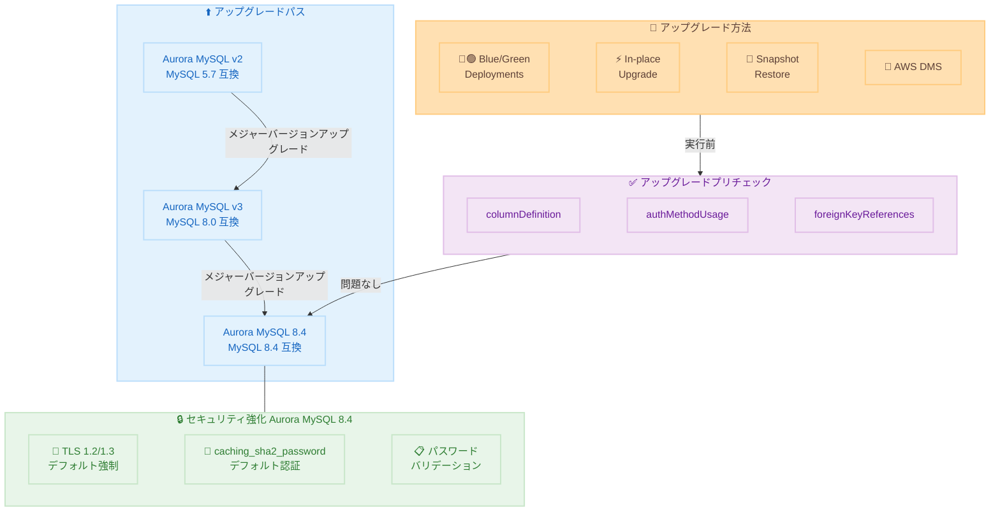

# Amazon Aurora MySQL 8.4 - 一般提供開始

**リリース日**: 2026 年 5 月 21 日
**サービス**: Amazon Aurora MySQL-Compatible Edition
**機能**: MySQL 8.4 LTS メジャーバージョンサポート

📊 [このアップデートのインフォグラフィックを見る](https://takech9203.github.io/aws-news-summary/20260521-8-4.html)

## 概要

Amazon Aurora MySQL-Compatible Edition が MySQL 8.4 をサポートし、一般提供 (GA) を開始した。MySQL 8.4 はコミュニティ MySQL の Long Term Support (LTS) メジャーバージョンであり、Aurora MySQL 8.4 はコミュニティ MySQL 8.4.7 との互換性を持つ。

今回のリリースで最も注目すべき変更点は、Aurora MySQL のバージョン番号がコミュニティ MySQL と一致するよう整合されたことである。従来の Aurora MySQL 3.x という独自番号体系から脱却し、Aurora 上で実行するバージョン番号がコミュニティ MySQL のバージョンと直接対応するようになった。また、セキュリティデフォルトの強化、自動アップグレードプリチェック、明確なリリースケイデンスの公約も含まれている。

**アップデート前の課題**

- Aurora MySQL のバージョン番号 (例: Aurora MySQL 3.x) とコミュニティ MySQL のバージョン番号 (例: MySQL 8.0.x) が異なり、互換性の把握が困難だった
- TLS 接続がデフォルトでは強制されておらず、セキュリティ設定を手動で構成する必要があった
- アップグレード時の互換性問題がオフライン後に発覚し、ダウンタイムが長期化するリスクがあった
- パスワード認証に旧式の mysql_native_password がデフォルトで使用されていた

**アップデート後の改善**

- バージョン番号がコミュニティ MySQL と完全に一致し、互換性の確認が直感的になった
- TLS 1.2/1.3 がデフォルトで強制され、新規クラスターのセキュリティが自動的に強化される
- 自動プリチェックがアップグレード前に互換性問題を検出し、オフラインになる前に対処できる
- caching_sha2_password がデフォルト認証プラグインとなり、セキュリティが向上した
- メジャーバージョンは LTS リリース後 12 か月以内、マイナーバージョンは 3 か月以内というリリース目標が明確化された

## アーキテクチャ図



Aurora MySQL 8.4 へのアップグレードパスと、新バージョンで強化されたセキュリティデフォルトの構成を示す。アップグレード前に自動プリチェックが実行され、互換性問題を事前に検出する。

## サービスアップデートの詳細

### 主要機能

1. **バージョン番号の整合**
   - Aurora MySQL のバージョン番号がコミュニティ MySQL と一致するようになった
   - 「Aurora MySQL 8.4」はコミュニティ MySQL 8.4.7 と互換
   - バージョン構造: `8.4.7` (8.4 = メジャー、7 = Aurora MySQL マイナー)
   - AWS がパッチを自動管理し、ユーザーはメジャー/マイナーバージョンのみ選択

2. **セキュリティデフォルトの強化**
   - TLS がデフォルトで強制 (require_secure_transport = ON)
   - TLS 1.0/1.1 を廃止、TLS 1.2 と TLS 1.3 のみサポート
   - caching_sha2_password がデフォルト認証プラグインに変更
   - パスワードバリデーションがクラスターパラメータグループで設定可能に

3. **自動アップグレードプリチェック**
   - クラスターがオフラインになる前に互換性問題を自動検出
   - FLOAT/DOUBLE カラムの AUTO_INCREMENT 検出
   - 非推奨認証メソッドの使用状況レポート
   - 外部キー制約の問題検出
   - エラー時はアップグレードをキャンセルし、修復手順を含むログを生成

4. **リリースケイデンスの明確化**
   - メジャーバージョン: コミュニティ MySQL LTS リリース後 12 か月以内
   - マイナーバージョン: コミュニティマイナーリリース後 3 か月以内
   - Aurora LTS マイナー: Aurora メジャーバージョンリリース後 12 か月以内

5. **レプリケーション用語の刷新**
   - MASTER/SLAVE 用語を完全に廃止
   - `SHOW MASTER STATUS` → `SHOW BINARY LOG STATUS`
   - `SHOW SLAVE STATUS` → `SHOW REPLICA STATUS`
   - `CHANGE MASTER TO` → `CHANGE REPLICATION SOURCE TO`

## 技術仕様

### バージョン互換性

| 項目 | 詳細 |
|------|------|
| Aurora MySQL バージョン | 8.4 |
| コミュニティ MySQL 互換 | 8.4.7 |
| 前バージョン | Aurora MySQL 3.x (MySQL 8.0 互換) |
| アップグレード元 | Aurora MySQL version 3 |

### セキュリティ仕様

| 項目 | 詳細 |
|------|------|
| デフォルト認証 | caching_sha2_password |
| TLS バージョン | TLS 1.2、TLS 1.3 のみ |
| TLS 1.2 暗号スイート | ECDHE + AES-GCM / ChaCha20-Poly1305 |
| TLS 1.3 暗号スイート | TLS_AES_128_GCM_SHA256、TLS_AES_256_GCM_SHA384、TLS_CHACHA20_POLY1305_SHA256 |
| mysql_native_password | 後方互換のため有効 (コミュニティ版は無効化) |

### リリースケイデンス目標

| リリースタイプ | 目標タイムライン |
|------|------|
| メジャーバージョン | コミュニティ MySQL LTS 初回マイナーリリース後 12 か月以内 |
| マイナーバージョン | コミュニティ MySQL マイナーリリース後 3 か月以内 |
| Aurora LTS マイナーバージョン | Aurora メジャーバージョンリリース後 12 か月以内 |

### 廃止された機能

| 廃止機能 | 影響 |
|------|------|
| FLOAT/DOUBLE の AUTO_INCREMENT | 完全に削除 (MySQL 8.0 で非推奨) |
| TLS 1.0/1.1 | サポート終了 |
| MASTER/SLAVE レプリケーション用語 | 包括的な用語に置換 |
| rds_*_master* ストアドプロシージャ名 | 包括的な名前のみ利用可能 |

## 設定方法

### 前提条件

1. 既存クラスターが Aurora MySQL version 3 (MySQL 8.0 互換) であること
2. History List Length (HLL) が 100,000 以下であること (推奨)
3. アップグレードプリチェックで報告される互換性問題が解決済みであること

### 手順

#### ステップ 1: プリチェックの実行と問題の確認

```bash
# mysqlcheck を使用してアップグレード互換性を確認
mysqlcheck --check-upgrade --all-databases -h your-cluster-endpoint -u admin -p
```

データベーススキーマとオブジェクト定義の互換性を事前に確認する。FLOAT/DOUBLE カラムの AUTO_INCREMENT 使用、非推奨認証プラグインの使用状況などを特定する。

#### ステップ 2: Blue/Green Deployments によるアップグレード (推奨)

```bash
# Blue/Green Deployment を作成
aws rds create-blue-green-deployment \
  --blue-green-deployment-name aurora-mysql-84-upgrade \
  --source arn:aws:rds:ap-northeast-1:123456789012:cluster:my-aurora-cluster \
  --target-engine-version 8.4.7

# デプロイメント状態を確認
aws rds describe-blue-green-deployments \
  --blue-green-deployment-identifier aurora-mysql-84-upgrade
```

Blue/Green Deployments は本番環境で推奨されるアップグレード方法。同期されたステージング環境を作成し、最小限のダウンタイムで切り替えを実行する。

#### ステップ 3: 切り替えの実行

```bash
# Green 環境の検証が完了した後、スイッチオーバーを実行
aws rds switchover-blue-green-deployment \
  --blue-green-deployment-identifier aurora-mysql-84-upgrade \
  --switchover-timeout 300
```

スイッチオーバーにより、Green 環境 (Aurora MySQL 8.4) が本番エンドポイントを引き継ぐ。タイムアウト値は秒単位で指定する。

#### ステップ 4: パラメータグループの更新

```bash
# MySQL 8.4 互換のカスタムパラメータグループを作成
aws rds create-db-cluster-parameter-group \
  --db-cluster-parameter-group-name my-aurora-mysql84-params \
  --db-parameter-group-family aurora-mysql8.4 \
  --description "Custom parameters for Aurora MySQL 8.4"
```

Aurora MySQL 8.4 では新しいパラメータグループファミリーが必要。既存のカスタムパラメータをレビューし、新しいグループに適切な値を設定する。

## メリット

### ビジネス面

- **運用の簡素化**: バージョン番号がコミュニティ MySQL と一致し、互換性確認やコミュニケーションが容易になる
- **セキュリティコンプライアンス**: TLS 強制とモダンな認証がデフォルトで有効となり、監査対応の工数が削減される
- **予測可能なアップグレード計画**: 明確なリリースケイデンスにより、アップグレードの計画と予算策定が容易になる

### 技術面

- **ダウンタイムリスクの低減**: 自動プリチェックがオフライン前に問題を検出し、予期しないアップグレード失敗を防止する
- **最新セキュリティ標準**: TLS 1.2/1.3 と caching_sha2_password により、暗号化と認証のセキュリティが現代の標準に適合する
- **長期サポート**: MySQL 8.4 LTS に基づくため、長期間の安定したサポートが期待できる
- **柔軟なアップグレードパス**: Blue/Green Deployments、In-place、Snapshot Restore、DMS の 4 種類から選択可能

## デメリット・制約事項

### 制限事項

- Aurora MySQL version 2 (MySQL 5.7 互換) からの直接アップグレードは不可。まず version 3 にアップグレードする必要がある
- FLOAT/DOUBLE カラムの AUTO_INCREMENT を使用しているテーブルは、アップグレード前に修正が必要
- TLS 1.0/1.1 のみをサポートする古いクライアントアプリケーションは接続できなくなる
- バイナリログレプリケーションのソースが RDS for MySQL またはオンプレミス MySQL の場合、In-place アップグレードは使用不可

### 考慮すべき点

- mysql_native_password を使用しているアプリケーションは、Aurora では引き続き動作するが、将来のバージョンで廃止される可能性があるため早期の移行を推奨
- Aurora MySQL 3 の標準サポートは 2028 年 4 月 30 日まで継続。それ以降は RDS Extended Support に移行するため、計画的なアップグレードが必要
- パスワードバリデーションポリシーの変更により、既存のアカウント作成スクリプトに影響する可能性がある
- レプリケーション用語の変更により、既存の監視スクリプトやツールの更新が必要になる場合がある

## ユースケース

### ユースケース 1: 本番環境の最小ダウンタイムアップグレード

**シナリオ**: 24 時間稼働が求められる E コマースプラットフォームで、Aurora MySQL 3 から 8.4 にアップグレードしたい。

**実装例**:
```bash
# Blue/Green Deployment でステージング環境を作成
aws rds create-blue-green-deployment \
  --blue-green-deployment-name ecommerce-upgrade \
  --source arn:aws:rds:ap-northeast-1:123456789012:cluster:ecommerce-prod \
  --target-engine-version 8.4.7

# Green 環境でアプリケーション互換性テスト実施後、スイッチオーバー
aws rds switchover-blue-green-deployment \
  --blue-green-deployment-identifier ecommerce-upgrade \
  --switchover-timeout 300
```

**効果**: 数秒程度のダウンタイムでメジャーバージョンアップグレードを完了。切り戻しが必要な場合も Blue 環境が残存する。

### ユースケース 2: セキュリティコンプライアンス強化

**シナリオ**: PCI DSS 準拠が求められる金融系アプリケーションで、TLS 暗号化とモダンな認証方式を強制したい。

**実装例**:
```sql
-- Aurora MySQL 8.4 ではデフォルトで TLS 強制済み
-- パスワードポリシーをカスタマイズ
SET GLOBAL validate_password.length = 14;
SET GLOBAL validate_password.mixed_case_count = 1;
SET GLOBAL validate_password.number_count = 1;
SET GLOBAL validate_password.special_char_count = 1;

-- 既存アカウントの認証プラグインを確認
SELECT user, host, plugin FROM mysql.user WHERE plugin = 'mysql_native_password';
```

**効果**: アップグレードするだけで TLS 1.2/1.3 強制と caching_sha2_password がデフォルトで有効になり、コンプライアンス要件を自動的に満たす。

### ユースケース 3: 大規模データベースの安全なアップグレード検証

**シナリオ**: 数 TB 規模のデータベースを持つ SaaS プラットフォームで、アップグレードの影響を事前に検証したい。

**実装例**:
```bash
# クラスターのクローンを作成してテスト環境を構築
aws rds restore-db-cluster-to-point-in-time \
  --source-db-cluster-identifier saas-prod-cluster \
  --db-cluster-identifier saas-upgrade-test \
  --restore-type copy-on-write \
  --use-latest-restorable-time

# テストクラスターで In-place アップグレードを実行
aws rds modify-db-cluster \
  --db-cluster-identifier saas-upgrade-test \
  --engine-version 8.4.7 \
  --apply-immediately
```

**効果**: 本番データを使用したアップグレードテストにより、プリチェックの結果確認、所要時間の見積もり、アプリケーション互換性の検証を事前に実施できる。

## 料金

Aurora MySQL 8.4 の利用に追加料金は発生しない。既存の Aurora MySQL と同じ料金体系が適用される。

### 料金例

| 項目 | 料金 (東京リージョン概算) |
|--------|------------------|
| db.r6g.large (オンデマンド) | 約 $0.313/時間 |
| db.r6g.xlarge (オンデマンド) | 約 $0.626/時間 |
| Aurora I/O-Optimized ストレージ | $0.253/GB/月 |
| Aurora Standard ストレージ | $0.12/GB/月 + I/O 課金 |

## 利用可能リージョン

Aurora MySQL が利用可能なすべての AWS リージョンで提供される。東京リージョン (ap-northeast-1) を含む全商用リージョンで利用可能。

## 関連サービス・機能

- **Amazon RDS Blue/Green Deployments**: Aurora MySQL 8.4 への最小ダウンタイムアップグレードに推奨される手法
- **AWS Database Migration Service (DMS)**: 外部 MySQL ソースから Aurora MySQL 8.4 への移行に使用
- **Aurora Global Database**: Aurora MySQL 8.4 でもマルチリージョンレジリエンスを提供
- **Aurora Serverless**: Aurora MySQL 8.4 でもスケールトゥゼロのサーバーレスコンピューティングが利用可能
- **Percona XtraBackup**: 大規模な自己管理 MySQL からの物理的な移行に使用

## 参考リンク

- 📊 [インフォグラフィック](https://takech9203.github.io/aws-news-summary/20260521-8-4.html)
- [公式発表 (What's New)](https://aws.amazon.com/about-aws/whats-new/2026/05/amazon-aurora-mysql/8-4/)
- [AWS Blog - Amazon Aurora MySQL 8.4 is now generally available](https://aws.amazon.com/blogs/database/amazon-aurora-mysql-8-4-is-now-generally-available/)
- [Aurora and RDS open source release calendar announcement](https://aws.amazon.com/blogs/database/knowing-when-new-open-source-database-engine-versions-release-on-amazon-aurora-and-amazon-rds/)
- [Aurora MySQL メジャーバージョンアップグレードガイド](https://docs.aws.amazon.com/AmazonRDS/latest/AuroraUserGuide/AuroraMySQL.Updates.MajorVersionUpgrade.html)
- [Amazon RDS Blue/Green Deployments ドキュメント](https://docs.aws.amazon.com/AmazonRDS/latest/UserGuide/blue-green-deployments.html)
- [Aurora MySQL ドキュメント](https://docs.aws.amazon.com/AmazonRDS/latest/AuroraUserGuide/Aurora.AuroraMySQL.html)
- [Aurora MySQL リージョン対応表](https://docs.aws.amazon.com/AmazonRDS/latest/AuroraUserGuide/Concepts.RegionsAndAvailabilityZones.html#Aurora.Overview.Availability.MySQL)

## まとめ

Amazon Aurora MySQL 8.4 の GA は、バージョン番号の整合化、セキュリティデフォルトの強化、明確なリリースケイデンスの公約という 3 つの重要な改善を含む大規模なアップデートである。特に TLS 1.2/1.3 のデフォルト強制と caching_sha2_password への移行は、セキュリティ要件が厳しい環境にとって大きな前進となる。Aurora MySQL 3 の標準サポートが 2028 年 4 月まで継続するため、計画的なアップグレード検証を開始し、Blue/Green Deployments を活用した安全な移行を推奨する。
