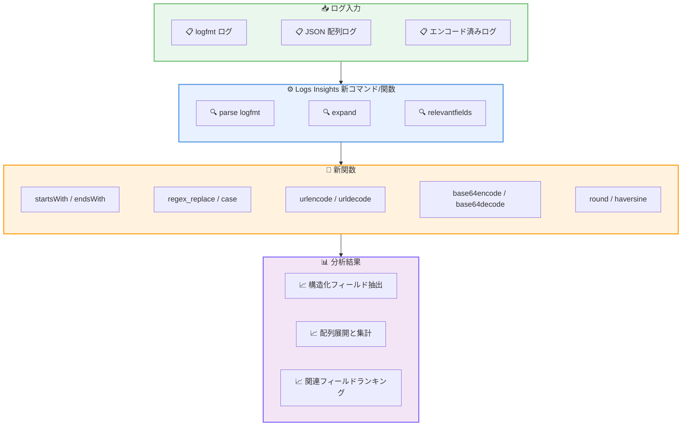

# Amazon CloudWatch Logs Insights - 新しいクエリコマンドと関数の追加

**リリース日**: 2026 年 5 月 21 日
**サービス**: Amazon CloudWatch Logs
**機能**: Logs Insights クエリ言語の新コマンドおよび関数

📊 [このアップデートのインフォグラフィックを見る](https://takech9203.github.io/aws-news-summary/20260521-amazon-cloudwatch-logs-insights.html)

## 概要

Amazon CloudWatch Logs Insights のクエリ言語に 13 の新しいコマンドと関数が追加された。文字列操作、エンコード/デコード、地理的距離計算、構造化ログのパース、配列の展開、関連フィールドの自動検出など、ログ分析の能力が大幅に強化されている。

今回のアップデートにより、これまで外部ツールやカスタムスクリプトに頼らざるを得なかった高度なログ分析を CloudWatch Logs Insights 内で直接実行できるようになった。特に logfmt 形式のログパース、Base64/URL エンコーディングの処理、正規表現による文字列置換など、運用現場で頻繁に必要となる機能が標準サポートされた。

**アップデート前の課題**

- logfmt 形式の構造化ログを Logs Insights で直接パースできず、glob パターンや正規表現で個別にフィールドを抽出する必要があった
- URL エンコードや Base64 エンコードされたフィールド値をクエリ内でデコードできず、外部ツールでの前処理が必要だった
- JSON 配列を含むログイベントを個別レコードに展開して集計する手段がなかった
- 高カーディナリティのログ群から関連性の高いフィールドを特定するには手動での分析が必要だった
- 地理的座標間の距離計算がクエリ内でサポートされておらず、外部処理が必要だった

**アップデート後の改善**

- `parse logfmt` コマンドにより logfmt 形式のログを直接キー・バリューペアとしてパース可能になった
- `urlencode`/`urldecode`、`base64encode`/`base64decode` でエンコード/デコードをクエリ内で実行可能になった
- `expand` コマンドで JSON 配列を個別レコードに展開し、各要素を独立して集計できるようになった
- `relevantfields` コマンドで条件に対して最も関連性の高いフィールドを自動的にランキング表示できるようになった
- `haversine` 関数で 2 点間の地理的距離をキロメートル単位で直接計算できるようになった

## アーキテクチャ図



今回追加された新コマンドと関数がログデータの処理パイプラインでどのように機能するかを示す。各種形式のログが新コマンドでパースされ、新関数で変換・計算された後、分析結果として出力される。

## サービスアップデートの詳細

### 主要機能

1. **新コマンド: `parse logfmt`**
   - logfmt 形式のログ行をキー・バリューペアのマップとして自動パース
   - ドット記法でフィールドにアクセス可能 (例: `lf.level`、`lf.duration`)
   - `@message` 以外の任意のフィールドからもパース可能
   - Go 言語や Ruby のアプリケーションログで広く使われる形式に対応

2. **新コマンド: `expand`**
   - JSON 配列を含むフィールドを個別のログイベントに展開
   - 元のログイベントの他のフィールドは各新レコードに複製される
   - 配列要素ごとの集計や分析が可能に

3. **新コマンド: `relevantfields`**
   - 指定条件に対して最も関連性の高いフィールドを自動ランキング
   - ベースライン全体と条件合致サブセットを比較し、関連度スコア (0-1) を算出
   - カテゴリカルフィールドでは頻度シフトの大きいエントリを表示
   - 数値フィールドでは条件合致/非合致それぞれの中央値を表示

4. **文字列関数: `startsWith`、`endsWith`、`regex_replace`**
   - `startsWith`: 文字列が指定プレフィックスで始まるかを判定 (1/0 を返却)
   - `endsWith`: 文字列が指定サフィックスで終わるかを判定 (1/0 を返却)
   - `regex_replace`: RE2 正規表現構文による文字列置換

5. **エンコード/デコード関数: `urlencode`、`urldecode`、`base64encode`、`base64decode`**
   - URL エンコード/デコードとBase64 エンコード/デコードをクエリ内で直接実行
   - エンコードされたペイロードをインラインで変換して分析可能

6. **数値・条件関数: `round`、`haversine`、`case`**
   - `round(a, d)`: 数値を指定小数点桁数で丸め (引数 1 つで整数丸め)
   - `haversine(lat1, lon1, lat2, lon2)`: 2 点間の大圏距離をキロメートルで計算
   - `case(cond1, val1, cond2, val2, ..., default)`: 条件分岐ロジック (最大 10 分岐)

## 技術仕様

### 新関数一覧

| 関数 | カテゴリ | 戻り値型 | 説明 |
|------|----------|----------|------|
| `round(a [, d])` | 数値 | number | 数値を丸める。d を指定すると小数点以下 d 桁に丸め |
| `haversine(lat1, lon1, lat2, lon2)` | 数値 | number | 2 点間の大圏距離をキロメートルで計算 |
| `case(cond1, val1, ..., [default])` | 汎用 | LogField | 条件分岐。最大 10 分岐 |
| `startsWith(str, searchValue)` | 文字列 | number | 文字列が searchValue で始まれば 1、それ以外は 0 |
| `endsWith(str, searchValue)` | 文字列 | number | 文字列が searchValue で終われば 1、それ以外は 0 |
| `regex_replace(field, pattern, replacement)` | 文字列 | string | 正規表現パターンにマッチする部分を置換。RE2 構文 |
| `urlencode(str)` | 文字列 | string | 文字列を URL エンコード |
| `urldecode(str)` | 文字列 | string | URL エンコードされた文字列をデコード |
| `base64encode(str)` | 文字列 | string | 文字列を Base64 エンコード |
| `base64decode(str)` | 文字列 | string | Base64 文字列をデコード |

### 新コマンド一覧

| コマンド | 構文 | 説明 |
|----------|------|------|
| `parse logfmt` | `parse {field} logfmt as {alias}` | logfmt 形式のログをマップにパース |
| `expand` | `expand {fieldName}` | JSON 配列フィールドを個別レコードに展開 |
| `relevantfields` | `relevantfields [fields] where {condition}` | 条件に関連するフィールドを自動ランキング |

### API 変更履歴

| 日付 | サービス | 変更内容 |
|------|----------|----------|
| 2026/05/04 | [Amazon CloudWatch Logs](https://awsapichanges.com/archive/changes/f687cc-logs.html) | 4 updated api methods - PutDeliverySource に deliverySourceConfiguration フィールド追加 |
| 2026/05/01 | [Amazon CloudWatch Logs](https://awsapichanges.com/archive/changes/6338dd-logs.html) | 1 updated api method - ListLogGroups にタグフィルタリング追加 |
| 2026/04/24 | [Amazon CloudWatch Logs](https://awsapichanges.com/archive/changes/435c9a-logs.html) | 1 updated api method - GetQueryResults にページネーション追加 |

### クエリ構文の注意点

- `parse logfmt` の結果はマップ型であり、ドット記法 (`alias.key`) でアクセスする
- `expand` は `unnest` と類似するが、JSON 配列フィールドに特化している
- `relevantfields` の出力フィールド: `@fieldName`、`@relevanceScore`、`@topRelevanceContributors`、`@conditionalMedian`、`@baselineMedian`
- `case` 関数は最大 10 分岐をサポートし、最後の引数をデフォルト値として使用可能

## 設定方法

### 前提条件

1. CloudWatch Logs にログデータが収集されていること
2. IAM ポリシーで `logs:StartQuery`、`logs:GetQueryResults` 権限が付与されていること
3. クエリ対象のロググループが Standard ログクラスであること (Infrequent Access クラスでも利用可能)

### 手順

#### ステップ 1: parse logfmt によるログパース

```
parse @message logfmt as lf
| filter lf.level = "error"
| display lf.msg, lf.duration, lf.host
```

logfmt 形式 (`level=error msg="request failed" duration=1234 host=web-01`) のログメッセージをパースし、エラーレベルのログのみをフィルタリングして表示する。

#### ステップ 2: expand による配列展開と集計

```
fields @timestamp, @message
| parse @message "items=*" as items_json
| fields jsonParse(items_json) as items
| expand items
| stats count(*) by items
```

JSON 配列フィールドを個別レコードに展開し、各要素の出現回数を集計する。

#### ステップ 3: relevantfields による原因分析

```
relevantfields where @duration > 5000
```

レイテンシが 5000ms を超えるリクエストに最も関連するフィールドを自動的に特定する。調査のどこから着手すべきかの指針が得られる。

#### ステップ 4: エンコード/デコード処理

```
fields @timestamp, urldecode(request_path) as decoded_path, base64decode(payload) as decoded_payload
| filter startsWith(decoded_path, "/api/v2")
```

URL エンコードされたリクエストパスと Base64 エンコードされたペイロードをデコードし、特定の API バージョンのリクエストをフィルタリングする。

#### ステップ 5: haversine による距離計算

```
fields @timestamp, haversine(src_lat, src_lon, dst_lat, dst_lon) as distance_km
| filter distance_km > 1000
| sort distance_km desc
```

送信元と送信先の座標間の地理的距離をキロメートル単位で計算し、長距離リクエストを特定する。

## メリット

### ビジネス面

- **運用効率の向上**: 外部ツールを使わずに CloudWatch コンソール内で高度なログ分析を完結でき、トラブルシューティング時間を短縮
- **コスト最適化**: 追加のログ処理パイプラインや ETL ツールが不要になり、ログ分析のインフラコストを削減
- **障害対応の迅速化**: `relevantfields` による自動的な原因分析で MTTR (平均修復時間) を短縮

### 技術面

- **logfmt ネイティブサポート**: Go、Ruby など logfmt 形式を採用するアプリケーションのログ分析が格段に容易に
- **クエリ内データ変換**: エンコード/デコード処理をクエリパイプライン内で実行でき、データ前処理が不要
- **配列データの分析**: `expand` により正規化されていない JSON 配列データを効率的に分析可能
- **地理空間分析**: `haversine` により CDN やエッジコンピューティングのアクセスパターン分析が容易に

## デメリット・制約事項

### 制限事項

- `relevantfields` の `@relevanceScore` はヒューリスティックな指標であり、因果関係を保証するものではない
- `case` 関数は最大 10 分岐に制限されている
- `parse logfmt` はマップ型を返すため、`dedup`、`pattern`、`sort`、`stats` でマップ全体を直接使用することはできない (個別フィールドを指定する必要がある)
- `expand` で展開される配列サイズが大きい場合、クエリのスキャンデータ量が増加する可能性がある

### 考慮すべき点

- `regex_replace` は RE2 構文を使用するため、PCRE 固有の機能 (後方参照、先読みなど) は使用できない
- `haversine` の入力は度単位の緯度経度であり、ラジアン変換は不要
- 新コマンド・関数は Standard ログクラスと Infrequent Access ログクラスの両方で利用可能

## ユースケース

### ユースケース 1: マイクロサービスの logfmt ログ分析

**シナリオ**: Go 言語で構築されたマイクロサービスが logfmt 形式でログを出力しており、エラー率とレイテンシの相関を分析したい。

**実装例**:
```
parse @message logfmt as lf
| filter lf.level = "error"
| stats count(*) as error_count, avg(lf.duration) as avg_duration by lf.service, bin(5m)
| sort avg_duration desc
```

**効果**: logfmt ログを手動でパースするための複雑な正規表現が不要になり、サービスごとのエラー傾向とレイテンシの関係を迅速に把握できる。

### ユースケース 2: API Gateway ログのデコードと分析

**シナリオ**: API Gateway のアクセスログに URL エンコードされたクエリパラメータや Base64 エンコードされたリクエストボディが含まれており、特定パターンのリクエストを調査したい。

**実装例**:
```
fields @timestamp, urldecode(queryString) as decoded_query, base64decode(requestBody) as decoded_body
| filter startsWith(decoded_query, "action=")
| parse decoded_query "action=*&" as action_type
| stats count(*) by action_type, bin(1h)
```

**効果**: エンコードされたデータの外部デコード処理が不要になり、リアルタイムでリクエストパターンの分析が可能になる。

### ユースケース 3: レイテンシ急増の根本原因調査

**シナリオ**: 本番環境でレイテンシの急増が発生しており、どのフィールド (リージョン、インスタンスタイプ、API エンドポイントなど) が最も関連しているかを迅速に特定したい。

**実装例**:
```
relevantfields Controller, Region, InstanceType, APIEndpoint where @duration > 3000
```

**効果**: 手動で各フィールドを個別にフィルタリングして分析する代わりに、機械学習ベースの関連度スコアで即座にボトルネックの原因候補を絞り込める。

## 料金

CloudWatch Logs Insights のクエリ料金はスキャンされたデータ量に基づいて課金される。今回追加された新コマンド・関数を使用するための追加料金は発生しない。

### 料金例

| 項目 | 料金 |
|------|------|
| データスキャン | $0.0076/GB (東京リージョン) |
| 無料利用枠 | 5 GB/月 (ログ取り込み、アーカイブストレージ、Logs Insights スキャンの合計) |

※ `expand` コマンドで配列を展開すると結果行数が増加するが、課金はスキャンされたデータ量に基づくため、展開自体による追加コストは発生しない。

## 利用可能リージョン

すべての AWS 商用リージョンで利用可能。

## 関連サービス・機能

- **Amazon CloudWatch Logs**: ログの収集・保存基盤。Logs Insights はこのサービスのクエリエンジン
- **Amazon CloudWatch Contributor Insights**: 高カーディナリティフィールドのトップ N 分析。`relevantfields` と相補的に使用可能
- **AWS X-Ray / CloudWatch ServiceLens**: 分散トレーシング。`haversine` と組み合わせた地理的分析と連携可能
- **Amazon OpenSearch Service**: より複雑なログ分析ニーズに対応。Logs Insights で対応できない場合の代替選択肢

## 参考リンク

- 📊 [インフォグラフィック](https://takech9203.github.io/aws-news-summary/20260521-amazon-cloudwatch-logs-insights.html)
- [公式発表 (What's New)](https://aws.amazon.com/about-aws/whats-new/2026/06/amazon-cloudwatch-logs-insights/)
- [CloudWatch Logs Insights クエリ構文ドキュメント](https://docs.aws.amazon.com/AmazonCloudWatch/latest/logs/CWL_QuerySyntax.html)
- [関数リファレンス](https://docs.aws.amazon.com/AmazonCloudWatch/latest/logs/CWL_QuerySyntax-operations-functions.html)
- [料金ページ](https://aws.amazon.com/cloudwatch/pricing/)

## まとめ

今回の CloudWatch Logs Insights への 13 の新コマンド・関数追加は、ログ分析ワークフローを大幅に強化するアップデートである。特に `parse logfmt`、`expand`、`relevantfields` の 3 つの新コマンドは、構造化ログの処理、配列データの分析、障害原因の迅速な特定において即座に活用できる。追加料金なしで全商用リージョンで利用可能なため、既存の Logs Insights クエリに新関数を組み込んで分析能力を向上させることを推奨する。
