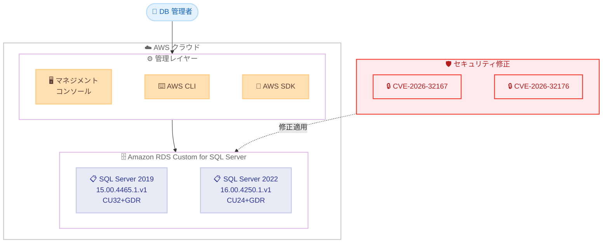

# Amazon RDS Custom for SQL Server - 最新 GDR セキュリティアップデートのサポート

**リリース日**: 2026 年 5 月 21 日
**サービス**: Amazon RDS Custom for SQL Server
**機能**: Microsoft SQL Server 最新 GDR (General Distribution Release) アップデート対応

📊 [このアップデートのインフォグラフィックを見る](https://takech9203.github.io/aws-news-summary/20260521-amazon-custom-sql-server-latest-gdr-updates-microsoft-sql-server.html)

## 概要

Amazon RDS Custom for SQL Server が Microsoft SQL Server の最新 GDR (General Distribution Release) アップデートをサポートした。今回の GDR アップデートは、CVE-2026-32167 および CVE-2026-32176 として報告されたセキュリティ脆弱性に対処するもので、SQL Server 2019 (CU32+GDR) および SQL Server 2022 (CU24+GDR) の両バージョンに適用される。

RDS Custom for SQL Server は、管理者アクセスとカスタマイズ機能を提供するマネージドデータベースサービスであり、従来の RDS では対応できない特殊なワークロードに対応する。今回のアップデートにより、セキュリティパッチの適用を AWS マネジメントコンソール、AWS SDK、または AWS CLI から実行可能となった。

本アップデートは、SQL Server ワークロードをクラウド上で運用しているエンタープライズのデータベース管理者やセキュリティチームを対象としており、重要なセキュリティ脆弱性への迅速な対応を可能にする。

**アップデート前の課題**

- GDR セキュリティパッチが利用可能になるまで、既知の脆弱性に対する公式パッチを適用できなかった
- セキュリティ脆弱性 CVE-2026-32167 および CVE-2026-32176 への対処手段が限定されていた
- SQL Server 2019/2022 の最新累積アップデートとセキュリティ修正を組み合わせたバージョンが利用できなかった

**アップデート後の改善**

- SQL Server 2019 CU32+GDR (KB5084816) および SQL Server 2022 CU24+GDR (KB5083252) が適用可能になった
- CVE-2026-32167 および CVE-2026-32176 のセキュリティ脆弱性を修正できるようになった
- AWS マネジメントコンソール、SDK、CLI から簡単にアップグレードを実行可能になった

## アーキテクチャ図



RDS Custom for SQL Server インスタンスに対して、管理者が AWS の各管理ツールを通じて GDR セキュリティアップデートを適用するフローを示す。CVE-2026-32167 および CVE-2026-32176 の修正が SQL Server 2019/2022 の両バージョンに適用される。

## サービスアップデートの詳細

### 主要機能

1. **SQL Server 2019 CU32+GDR サポート**
   - RDS バージョン: 15.00.4465.1.v1
   - Microsoft KB: KB5084816
   - 累積アップデート 32 にセキュリティ修正を含む GDR を統合

2. **SQL Server 2022 CU24+GDR サポート**
   - RDS バージョン: 16.00.4250.1.v1
   - Microsoft KB: KB5083252
   - 累積アップデート 24 にセキュリティ修正を含む GDR を統合

3. **セキュリティ脆弱性への対処**
   - CVE-2026-32167: Microsoft SQL Server に関するセキュリティ脆弱性の修正
   - CVE-2026-32176: Microsoft SQL Server に関するセキュリティ脆弱性の修正
   - GDR チャネルを通じた重要セキュリティパッチの提供

## 技術仕様

### サポートバージョン一覧

| SQL Server バージョン | アップデート種別 | KB 番号 | RDS バージョン |
|------|------|------|------|
| SQL Server 2019 | CU32+GDR | KB5084816 | 15.00.4465.1.v1 |
| SQL Server 2022 | CU24+GDR | KB5083252 | 16.00.4250.1.v1 |

### 対処されるセキュリティ脆弱性

| CVE ID | 対象 | 修正方法 |
|------|------|------|
| CVE-2026-32167 | Microsoft SQL Server | GDR アップデート適用 |
| CVE-2026-32176 | Microsoft SQL Server | GDR アップデート適用 |

### API 変更履歴

直近 14 日間において、RDS に関連する API 変更は検出されなかった。本アップデートは既存の RDS API (ModifyDBInstance 等) を使用してバージョンアップグレードを実行するため、新規 API の追加は不要である。

## 設定方法

### 前提条件

1. Amazon RDS Custom for SQL Server インスタンスが既に作成されていること
2. 対象インスタンスが SQL Server 2019 または SQL Server 2022 を実行していること
3. 適切な IAM 権限 (rds:ModifyDBInstance) を持つユーザーまたはロールがあること

### 手順

#### ステップ 1: 現在のエンジンバージョンを確認

```bash
aws rds describe-db-instances \
  --db-instance-identifier my-rds-custom-instance \
  --query 'DBInstances[0].EngineVersion'
```

現在のインスタンスで実行されている SQL Server のエンジンバージョンを確認する。

#### ステップ 2: 利用可能なアップグレードターゲットを確認

```bash
aws rds describe-db-engine-versions \
  --engine custom-sqlserver-ee \
  --engine-version 15.00.4465.1.v1 \
  --query 'DBEngineVersions[0].ValidUpgradeTarget'
```

アップグレード先のバージョンが利用可能であることを確認する。SQL Server 2022 の場合はエンジンバージョンを `16.00.4250.1.v1` に変更する。

#### ステップ 3: GDR アップデートを適用

```bash
aws rds modify-db-instance \
  --db-instance-identifier my-rds-custom-instance \
  --engine-version 15.00.4465.1.v1 \
  --apply-immediately
```

`--apply-immediately` を指定すると即座にアップグレードが開始される。メンテナンスウィンドウで適用する場合はこのオプションを省略する。アップグレード中はインスタンスの再起動が発生する。

## メリット

### ビジネス面

- **コンプライアンス遵守**: セキュリティ脆弱性への迅速なパッチ適用により、PCI DSS や SOX などのコンプライアンス要件を満たすことができる
- **リスク低減**: 既知の CVE に対する修正を速やかに適用し、セキュリティインシデントのリスクを軽減する
- **運用効率向上**: AWS マネージドサービスを通じたパッチ適用により、手動でのパッチ管理工数を削減する

### 技術面

- **統合パッチ管理**: 累積アップデートとセキュリティ修正が統合されたバージョンにより、パッチの複雑性を軽減する
- **柔軟な適用タイミング**: 即時適用またはメンテナンスウィンドウでの適用を選択可能
- **マルチバージョン対応**: SQL Server 2019 と 2022 の両方に対応し、段階的な移行計画を維持できる

## デメリット・制約事項

### 制限事項

- アップグレード中にインスタンスの再起動が発生し、一時的なダウンタイムが生じる
- RDS Custom 固有のカスタマイズ (カスタム CEI、エージェント等) がアップグレードと互換性があることを事前に確認する必要がある
- GDR アップデートはロールバックが容易ではなく、事前のスナップショット取得が推奨される

### 考慮すべき点

- 本番環境への適用前に、テスト環境で動作確認を行うことが強く推奨される
- アプリケーションの互換性テストを実施し、CU32/CU24 に含まれる変更がワークロードに影響しないことを確認する
- Multi-AZ 構成の場合、フェイルオーバーの手順とタイミングを計画する

## ユースケース

### ユースケース 1: セキュリティコンプライアンス対応

**シナリオ**: 金融機関のデータベース管理チームが、PCI DSS 要件に基づき既知の脆弱性を 30 日以内にパッチ適用する義務がある。

**実装例**:
```bash
# テスト環境で事前検証
aws rds modify-db-instance \
  --db-instance-identifier test-sql-instance \
  --engine-version 16.00.4250.1.v1 \
  --apply-immediately

# 検証後、本番環境にメンテナンスウィンドウで適用
aws rds modify-db-instance \
  --db-instance-identifier prod-sql-instance \
  --engine-version 16.00.4250.1.v1
```

**効果**: コンプライアンス要件を満たしつつ、計画的なダウンタイムでリスクを最小化する。

### ユースケース 2: マルチバージョン環境での段階的パッチ適用

**シナリオ**: 企業が SQL Server 2019 と 2022 の混在環境を運用しており、両方のバージョンにセキュリティパッチを適用する必要がある。

**実装例**:
```bash
# SQL Server 2022 インスタンスを先にアップグレード
aws rds modify-db-instance \
  --db-instance-identifier app-sql2022 \
  --engine-version 16.00.4250.1.v1 \
  --apply-immediately

# 動作確認後、SQL Server 2019 インスタンスをアップグレード
aws rds modify-db-instance \
  --db-instance-identifier legacy-sql2019 \
  --engine-version 15.00.4465.1.v1 \
  --apply-immediately
```

**効果**: バージョンごとに段階的にパッチを適用し、問題発生時の影響範囲を限定する。

### ユースケース 3: 自動化されたパッチ管理パイプライン

**シナリオ**: DevOps チームが定期的なセキュリティパッチ適用を自動化し、手動運用を排除したい。

**実装例**:
```python
import boto3

rds = boto3.client('rds')

# スナップショット取得後にアップグレード実行
rds.create_db_snapshot(
    DBSnapshotIdentifier='pre-gdr-backup-20260521',
    DBInstanceIdentifier='prod-sql-instance'
)

# スナップショット完了後にバージョンアップグレード
rds.modify_db_instance(
    DBInstanceIdentifier='prod-sql-instance',
    EngineVersion='16.00.4250.1.v1',
    ApplyImmediately=True
)
```

**効果**: 自動化により人的ミスを排除し、迅速かつ確実なパッチ適用を実現する。

## 料金

Amazon RDS Custom for SQL Server の GDR アップデート適用自体に追加料金は発生しない。通常の RDS Custom for SQL Server インスタンスの料金体系が適用される。

### 料金例

| インスタンスタイプ | 月額料金 (概算、us-east-1) |
|--------|------------------|
| db.m5.xlarge (SQL Server Enterprise) | 約 $2,000 - $3,000 |
| db.r5.2xlarge (SQL Server Enterprise) | 約 $4,000 - $6,000 |

※ 料金はインスタンスタイプ、リージョン、SQL Server エディション、ストレージ構成により異なる。最新の料金は AWS 公式料金ページを参照。

## 利用可能リージョン

Amazon RDS Custom for SQL Server が利用可能なすべてのリージョンで本アップデートが適用可能である。主要なリージョンとして以下が含まれる。

- 米国東部 (バージニア北部、オハイオ)
- 米国西部 (オレゴン)
- 欧州 (アイルランド、フランクフルト、ロンドン)
- アジアパシフィック (東京、シンガポール、シドニー)

最新のリージョン対応状況は AWS 公式ドキュメントを確認すること。

## 関連サービス・機能

- **Amazon RDS for SQL Server**: フルマネージドの SQL Server サービス。RDS Custom ほどのカスタマイズは不要な場合に適する
- **AWS Systems Manager Patch Manager**: EC2 上のセルフマネージド SQL Server のパッチ管理に使用
- **Amazon RDS Blue/Green Deployments**: ダウンタイムを最小化したバージョンアップグレードの選択肢

## 参考リンク

- 📊 [インフォグラフィック](https://takech9203.github.io/aws-news-summary/20260521-amazon-custom-sql-server-latest-gdr-updates-microsoft-sql-server.html)
- [公式発表 (What's New)](https://aws.amazon.com/about-aws/whats-new/2026/05/amazon-custom-sql-server-latest-gdr-updates-microsoft-sql-server/)
- [Amazon RDS Custom for SQL Server ドキュメント](https://docs.aws.amazon.com/AmazonRDS/latest/UserGuide/custom-upgrading-sqlserver.html)
- [Amazon RDS Custom 製品ページ](https://aws.amazon.com/rds/custom/)
- [KB5084816 - SQL Server 2019 CU32+GDR](https://support.microsoft.com/help/5084816)
- [KB5083252 - SQL Server 2022 CU24+GDR](https://support.microsoft.com/help/5083252)

## まとめ

Amazon RDS Custom for SQL Server が SQL Server 2019 CU32+GDR および SQL Server 2022 CU24+GDR をサポートしたことで、CVE-2026-32167 および CVE-2026-32176 のセキュリティ脆弱性に対する修正を迅速に適用可能になった。データベース管理者は、AWS マネジメントコンソール、CLI、または SDK からアップグレードを実行し、セキュリティコンプライアンスを維持することが推奨される。本番環境への適用前に、テスト環境での動作検証とスナップショットの取得を実施すること。
