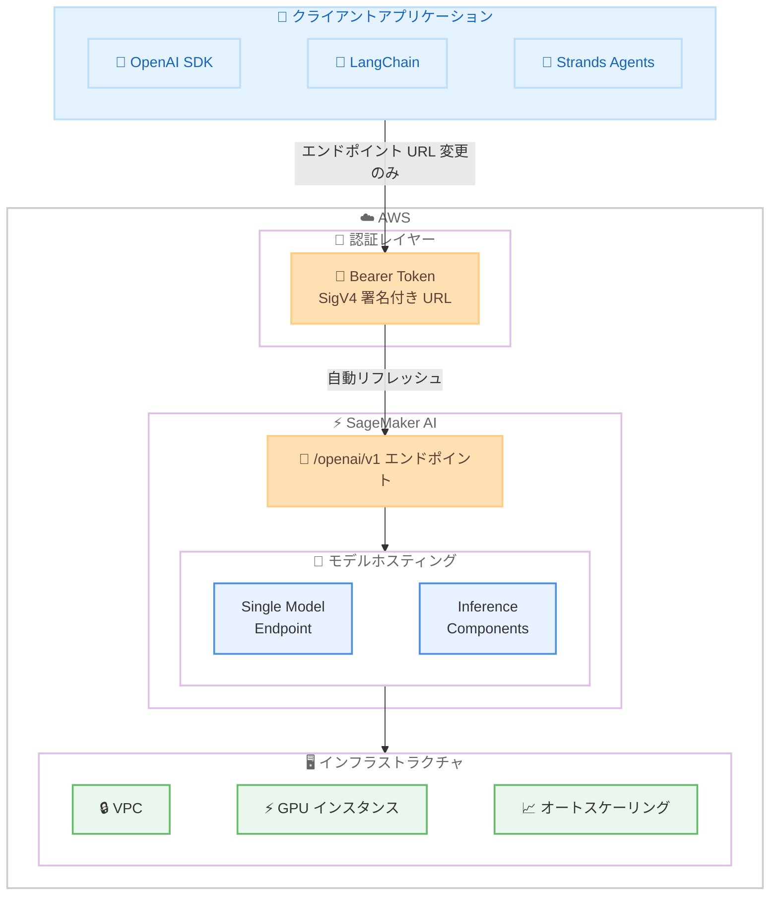

# Amazon SageMaker AI - OpenAI 互換 API サポート

**リリース日**: 2026年5月21日
**サービス**: Amazon SageMaker AI
**機能**: 推論エンドポイントにおける OpenAI 互換 API サポート

📊 [このアップデートのインフォグラフィックを見る](https://takech9203.github.io/aws-news-summary/20260521-amazon-sagemaker-ai-openai-apis.html)

## 概要

Amazon SageMaker AI の推論エンドポイントが OpenAI 互換 API をサポートするようになりました。これにより、OpenAI SDK、LangChain、Strands Agents などの既存ツールを使用しているユーザーは、エンドポイント URL を変更するだけで SageMaker AI エンドポイントに接続できます。

このアップデートは、オープンソースモデルやファインチューニングしたモデルを自社の VPC 内で運用しつつ、既存の OpenAI 互換エコシステムを活用したい企業に向けたものです。カスタム統合コード、SDK ラッパー、コードの書き換えが一切不要で、既存の SDK 呼び出し、ストリーミングロジック、フレームワーク統合がそのまま動作します。

認証には既存の AWS 認証情報が使用され、自動トークンリフレッシュにより長時間稼働するアプリケーションでも追加の認証管理が不要です。

**アップデート前の課題**

- SageMaker AI エンドポイントを呼び出すためにはカスタム統合コードや SDK ラッパーの開発が必要だった
- OpenAI SDK ベースの既存アプリケーションを SageMaker AI に移行するには大規模なコード書き換えが必要だった
- LangChain や Strands Agents などのフレームワークから SageMaker AI エンドポイントを直接利用することが困難だった

**アップデート後の改善**

- エンドポイント URL を変更するだけで既存の OpenAI 互換クライアントから SageMaker AI エンドポイントを利用可能になった
- SDK 呼び出し、ストリーミングロジック、フレームワーク統合がそのまま動作するようになった
- AWS 認証情報による自動トークンリフレッシュにより、追加の認証コード実装が不要になった

## アーキテクチャ図



OpenAI 互換クライアントからのリクエストが Bearer Token 認証を経て SageMaker AI エンドポイントの `/openai/v1` パスにルーティングされ、VPC 内の GPU インスタンスでホストされたモデルが推論を実行する流れを示しています。

## サービスアップデートの詳細

### 主要機能

1. **OpenAI 互換 API パスの提供**
   - SageMaker AI エンドポイントに `/openai/v1` パスが自動的に公開される
   - Chat Completions リクエストを受け付け、ストリーミングレスポンスに対応
   - エンドポイント作成時に自動有効化され、追加設定は不要

2. **Bearer Token 認証**
   - SigV4 署名付き URL を Base64 エンコードしたトークンを使用
   - トークンの有効期限は最大 12 時間 (1 秒から設定可能)
   - ローカルで生成されるためネットワーク呼び出しが不要
   - `sagemaker.core.token_generator` で自動リフレッシュパターンを実装可能

3. **マルチモデルホスティング (Inference Components)**
   - 1 つのエンドポイントに複数のモデルを配置可能
   - モデルごとに専用のコンピューティングリソースを割り当て
   - 共有接続プールによる TLS セッション再利用で効率的な通信を実現

4. **フレームワーク互換性**
   - OpenAI Python SDK
   - LangChain
   - Strands Agents
   - Vercel AI SDK やカスタム LLM ゲートウェイなど、OpenAI 互換の任意のクライアント

## 技術仕様

### URL パターン

| エンドポイントタイプ | URL パターン |
|------|------|
| シングルモデル | `https://runtime.sagemaker.<REGION>.amazonaws.com/endpoints/<ENDPOINT_NAME>/openai/v1` |
| Inference Components | `https://runtime.sagemaker.<REGION>.amazonaws.com/endpoints/<ENDPOINT>/inference-components/<IC_NAME>/openai/v1` |

### 必要な IAM 権限

| 権限 | リソース | 用途 |
|------|----------|------|
| `sagemaker:InvokeEndpoint` | エンドポイント ARN | エンドポイント呼び出し |
| `sagemaker:CallWithBearerToken` | `*` (ワイルドカード必須) | Bearer Token 認証 |

### API 変更履歴

| 日付 | サービス | 変更内容 |
|------|----------|----------|
| 2026/05/19 | [Amazon SageMaker Service](https://awsapichanges.com/archive/changes/7f1dfc-api.sagemaker.html) | 4 updated api methods - ml.p5.4xlarge および ml.p5en.48xlarge インスタンスのサポート追加 |

### IAM ポリシー設定例

```json
{
    "Version": "2012-10-17",
    "Statement": [
        {
            "Effect": "Allow",
            "Action": "sagemaker:InvokeEndpoint",
            "Resource": "arn:aws:sagemaker:<REGION>:<ACCOUNT_ID>:endpoint/<ENDPOINT_NAME>"
        },
        {
            "Effect": "Allow",
            "Action": "sagemaker:CallWithBearerToken",
            "Resource": "*"
        }
    ]
}
```

## 設定方法

### 前提条件

1. AWS アカウントと SageMaker AI エンドポイント作成権限を持つ IAM ロール
2. SageMaker Python SDK のインストール (`pip install sagemaker`)
3. OpenAI Python SDK のインストール (`pip install openai`)
4. デプロイ対象のモデル (Hugging Face Hub またはカスタムモデル)

### 手順

#### ステップ 1: エンドポイントのデプロイ

```python
import boto3

sagemaker_client = boto3.client("sagemaker", region_name="us-west-2")

# モデル作成
sagemaker_client.create_model(
    ModelName="qwen3-4b-model",
    PrimaryContainer={
        "Image": "763104351884.dkr.ecr.us-west-2.amazonaws.com/vllm:0.20.2-gpu-py312-cu130-ubuntu22.04-sagemaker",
        "Environment": {
            "HF_MODEL_ID": "Qwen/Qwen3-4B",
            "SM_VLLM_TENSOR_PARALLEL_SIZE": "1",
            "SM_VLLM_MAX_NUM_SEQS": "4",
            "SM_VLLM_ENABLE_AUTO_TOOL_CHOICE": "true",
            "SM_VLLM_TOOL_CALL_PARSER": "hermes",
            "SAGEMAKER_ENABLE_LOAD_AWARE": "1",
        },
    },
    ExecutionRoleArn="arn:aws:iam::<ACCOUNT_ID>:role/<ROLE_NAME>",
)
```

SageMaker vLLM Deep Learning Container を使用してモデルを作成します。`HF_MODEL_ID` にデプロイしたいモデル名を指定します。

#### ステップ 2: エンドポイント設定と起動

```python
# エンドポイント設定
sagemaker_client.create_endpoint_config(
    EndpointConfigName="qwen3-4b-config",
    ProductionVariants=[{
        "VariantName": "default",
        "ModelName": "qwen3-4b-model",
        "InstanceType": "ml.g6.2xlarge",
        "InitialInstanceCount": 1,
    }],
)

# エンドポイント起動
sagemaker_client.create_endpoint(
    EndpointName="qwen3-4b-endpoint",
    EndpointConfigName="qwen3-4b-config",
)
```

`ml.g6.2xlarge` (NVIDIA L4 GPU x1) インスタンスでエンドポイントを起動します。エンドポイントが `InService` になるまで通常 5 - 10 分かかります。

#### ステップ 3: OpenAI SDK からの呼び出し

```python
from openai import OpenAI
from sagemaker.core.token_generator import generate_token

REGION = "us-west-2"
ENDPOINT_NAME = "qwen3-4b-endpoint"

client = OpenAI(
    base_url=f"https://runtime.sagemaker.{REGION}.amazonaws.com/endpoints/{ENDPOINT_NAME}/openai/v1",
    api_key=generate_token(region=REGION),
)

response = client.chat.completions.create(
    model="",
    messages=[
        {"role": "system", "content": "You are a helpful assistant."},
        {"role": "user", "content": "Explain transformers in ML."},
    ],
    stream=True,
)

for chunk in response:
    if chunk.choices[0].delta.content:
        print(chunk.choices[0].delta.content, end="")
```

`base_url` を SageMaker AI エンドポイントの URL に変更し、`api_key` に `generate_token()` で生成したトークンを指定するだけで、既存の OpenAI SDK コードがそのまま動作します。

## メリット

### ビジネス面

- **移行コストの最小化**: エンドポイント URL の変更のみで既存アプリケーションを移行可能。開発工数を大幅に削減
- **ベンダーロックインの回避**: OpenAI 互換の標準 API を使用するため、将来的なモデルやプラットフォームの切り替えが容易
- **マルチモデル戦略の実現**: Inference Components により 1 つのエンドポイントで複数モデルを運用し、インフラコストを最適化

### 技術面

- **エコシステムの活用**: OpenAI SDK、LangChain、Strands Agents など豊富なツールチェーンをそのまま利用可能
- **エンタープライズセキュリティ**: VPC 分離、IAM 認証、自動トークンリフレッシュによる堅牢なセキュリティ
- **柔軟なスケーリング**: オートスケーリングポリシーにより負荷に応じた自動的なリソース調整が可能

## デメリット・制約事項

### 制限事項

- `sagemaker:CallWithBearerToken` 権限はリソースレベルの制限をサポートしていない (ワイルドカード `*` が必須)
- エンドポイントは稼働中トラフィックの有無にかかわらず課金が発生する
- Bearer Token のセキュリティは AWS 認証情報と同等のため、適切な取り扱いが必要

### 考慮すべき点

- トークンをディスク、環境変数、設定ファイル、データベース、キャッシュに保存してはならない
- トークンのログ出力は禁止。HTTPS 経由のみで送信すること
- `AdministratorAccess` や `SageMakerFullAccess` を持つロールからトークンを生成しない。IAM ロールは必要最小限の権限に絞ること
- トークンの有効期限はワークロードが必要とする最短の期間に設定すること

## ユースケース

### ユースケース 1: 既存 OpenAI アプリケーションの SageMaker AI 移行

**シナリオ**: OpenAI API を使用して構築された本番チャットボットアプリケーションを、コスト削減とデータ主権の観点から自社管理のオープンソースモデルに移行したい。

**実装例**:
```python
from openai import OpenAI
from sagemaker.core.token_generator import generate_token

# 変更前: OpenAI API
# client = OpenAI(api_key="sk-...")

# 変更後: SageMaker AI エンドポイント
client = OpenAI(
    base_url="https://runtime.sagemaker.us-west-2.amazonaws.com/endpoints/my-model/openai/v1",
    api_key=generate_token(region="us-west-2"),
)
```

**効果**: コードの変更は 2 行のみ。既存のストリーミングロジック、エラーハンドリング、リトライロジックがすべてそのまま動作する。

### ユースケース 2: マルチモデルエージェントシステム

**シナリオ**: Strands Agents を使用して、異なる専門性を持つ複数の AI エージェントを 1 つのインフラ上で運用したい。

**実装例**:
```python
from strands import Agent
from strands.models.openai import OpenAIModel
from openai import AsyncOpenAI
from sagemaker.core.token_generator import generate_token

base_url = "https://runtime.sagemaker.us-west-2.amazonaws.com/endpoints/my-ep/inference-components"

coding_client = AsyncOpenAI(
    base_url=f"{base_url}/coder-ic/openai/v1",
    api_key=generate_token(region="us-west-2"),
)

reviewer_client = AsyncOpenAI(
    base_url=f"{base_url}/reviewer-ic/openai/v1",
    api_key=generate_token(region="us-west-2"),
)

coder = Agent(model=OpenAIModel(client=coding_client, model_id=""))
reviewer = Agent(model=OpenAIModel(client=reviewer_client, model_id=""))
```

**効果**: 1 つのエンドポイントで複数の専門モデルをホストし、Inference Components によるリソース分離とオートスケーリングを実現。

### ユースケース 3: LangChain パイプラインの移行

**シナリオ**: LangChain で構築された RAG パイプラインのバックエンドモデルを、VPC 内で自社管理するファインチューニング済みモデルに切り替えたい。

**実装例**:
```python
from langchain_openai import ChatOpenAI
from sagemaker.core.token_generator import generate_token

llm = ChatOpenAI(
    base_url="https://runtime.sagemaker.us-west-2.amazonaws.com/endpoints/my-finetuned/openai/v1",
    api_key=generate_token(region="us-west-2"),
    model="",
    streaming=True,
)

# 既存の RAG チェーンはそのまま動作
chain = retriever | prompt | llm | output_parser
```

**効果**: LangChain の既存パイプラインを変更せずに、データが VPC 外に出ないセキュアな推論環境を実現。

## 料金

SageMaker AI 推論エンドポイントの標準料金が適用されます。OpenAI 互換 API 機能自体に追加料金はありません。

### 料金例

| インスタンスタイプ | 月額料金 (概算、us-west-2) |
|--------|------------------|
| ml.g6.2xlarge (NVIDIA L4 x1) | 約 $730/月 (24 時間稼働) |
| ml.g6.12xlarge (NVIDIA L4 x4) | 約 $4,380/月 (24 時間稼働) |
| ml.p5.48xlarge (NVIDIA H100 x8) | 約 $78,000/月 (24 時間稼働) |

※ エンドポイントは稼働中トラフィックの有無にかかわらず課金が発生します。オートスケーリングを設定して最小インスタンス数を 0 にすることでコスト最適化が可能です。

## 利用可能リージョン

14 リージョンで利用可能です。

| リージョン | コード |
|------|------|
| 米国東部 (バージニア北部) | us-east-1 |
| 米国西部 (オレゴン) | us-west-2 |
| 米国東部 (オハイオ) | us-east-2 |
| アジアパシフィック (東京) | ap-northeast-1 |
| アジアパシフィック (ソウル) | ap-northeast-2 |
| アジアパシフィック (ムンバイ) | ap-south-1 |
| アジアパシフィック (ジャカルタ) | ap-southeast-3 |
| アジアパシフィック (シンガポール) | ap-southeast-1 |
| アジアパシフィック (シドニー) | ap-southeast-2 |
| 欧州 (アイルランド) | eu-west-1 |
| 欧州 (フランクフルト) | eu-central-1 |
| 欧州 (ロンドン) | eu-west-2 |
| 南米 (サンパウロ) | sa-east-1 |
| カナダ (中部) | ca-central-1 |

## 関連サービス・機能

- **Amazon Bedrock**: AWS のフルマネージド生成 AI サービス。SageMaker AI はより細かいインフラ制御が必要な場合に適している
- **SageMaker Inference Components**: 1 つのエンドポイントで複数モデルをホストするマルチテナントアーキテクチャ
- **Amazon SageMaker vLLM DLC**: 高性能な LLM 推論のための Deep Learning Container。OpenAI 互換 API のバックエンドとして動作

## 参考リンク

- 📊 [インフォグラフィック](https://takech9203.github.io/aws-news-summary/20260521-amazon-sagemaker-ai-openai-apis.html)
- [公式発表 (What's New)](https://aws.amazon.com/about-aws/whats-new/2026/05/amazon-sagemaker-ai-openai-apis/)
- [AWS Blog - Announcing OpenAI-compatible API support for Amazon SageMaker AI endpoints](https://aws.amazon.com/blogs/machine-learning/announcing-openai-compatible-api-support-for-amazon-sagemaker-ai-endpoints/)
- [ドキュメント - Real-time Endpoints OpenAI Compatible](https://docs.aws.amazon.com/sagemaker/latest/dg/realtime-endpoints-openai-compatible.html)
- [SageMaker AI 料金ページ](https://aws.amazon.com/sagemaker/pricing/)

## まとめ

Amazon SageMaker AI の OpenAI 互換 API サポートは、OpenAI エコシステムとエンタープライズグレードのインフラ管理を両立させる重要なアップデートです。既存のアプリケーションコードをほぼ変更せずに、自社 VPC 内でオープンソースモデルを運用できるため、データ主権とコスト最適化を求める組織にとって即座に検討すべき機能です。まずは開発環境で既存の OpenAI SDK ベースのコードを SageMaker AI エンドポイントに接続し、移行の容易さを検証することを推奨します。
