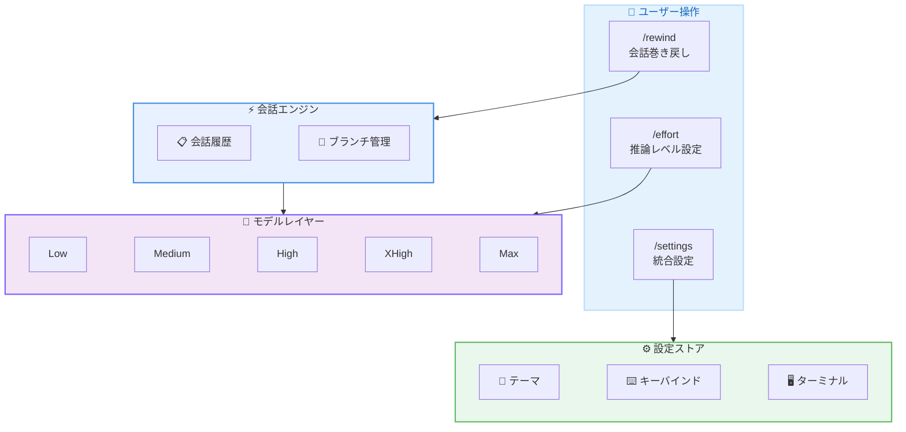

# Kiro CLI 2.4.0 - 会話の巻き戻し、推論エフォート制御、統合設定メニュー

**リリース日**: 2026 年 5 月 21 日
**サービス**: Kiro (AWS が提供する AI 搭載 IDE)
**バージョン**: 2.4.0 (パッチ 2.4.1)

📊 [このアップデートのインフォグラフィックを見る](https://takech9203.github.io/aws-news-summary/20260521-kiro-changelog-2026-05-21.html)

## 概要

Kiro CLI 2.4.0 は、AI エージェントとの会話フローとモデルの思考プロセスをより細かく制御できるアップデートである。会話の任意の時点に巻き戻して別のアプローチを探索する機能、モデルごとの推論エフォートレベル設定、そして複数の設定項目を一元管理する統合設定メニューが追加された。

加えて、ワークスペースの初期化が 88% 高速化 (652ms から 76ms) されており、日常的な開発体験が大幅に改善されている。本リリースは Kiro CLI ユーザー全体に影響する重要なアップデートであり、特にエージェント主導の開発ワークフローにおいて試行錯誤の効率を飛躍的に向上させる。

**アップデート前の課題**

- 会話中にエージェントが取った方向性を変更したい場合、最初からやり直す必要があった
- モデルの推論量を制御できず、簡単なタスクでも同じレベルの処理時間とコストが発生していた
- テーマ、キーバインド、ターミナル設定がそれぞれ別のコマンドに分散していた
- ワークスペースの初期化に 652ms かかり、起動時に待ち時間が発生していた

**アップデート後の改善**

- `/rewind` コマンドで会話の任意のターンに戻り、元のスレッドを保持したまま別の方向を探索可能に
- `/effort` コマンドで 5 段階の推論レベルを設定し、タスクの複雑さに応じてコストと速度を最適化可能に
- `/settings` コマンドから全設定を一元的にアクセス・管理可能に
- ワークスペース初期化が 76ms に短縮され、ほぼ瞬時に作業開始可能に

## アーキテクチャ図



ユーザーの 3 つの新しいスラッシュコマンドが、会話エンジン、モデルレイヤー、設定ストアにそれぞれ対応し、開発体験を統合的に制御する構成を示している。

## サービスアップデートの詳細

### 主要機能

1. **会話の巻き戻し (Rewind Conversations)**
   - `/rewind` コマンドで会話内の任意のプロンプトに戻れる
   - 選択したターンから新しいセッションとして分岐し、元のスレッドは保持される
   - エージェントが取った方向を元に戻したい場合や、別のアプローチを試したい場合に最適
   - 会話を最初からやり直す必要がなくなり、探索的な開発が効率化

2. **モデル推論エフォート制御 (Model Reasoning Effort)**
   - `/effort` コマンドでモデルの思考量を 5 段階で制御可能
   - レベル: `low`、`medium`、`high`、`xhigh`、`max`
   - 低いエフォートは単純なタスクに対して高速かつ低コストなレスポンスを実現
   - 高いエフォートは複雑な問題に対してモデルにより多くの推論時間を与える
   - モデルごとに個別設定が可能

3. **統合設定メニュー (Unified Settings Menu)**
   - `/settings` コマンドで全設定に一元的にアクセス
   - `/settings theme`: カラーテーマの変更
   - `/settings keybindings`: キーボードショートカットの表示
   - `/settings terminal`: `Shift+Enter` / `Option+Enter` によるマルチライン入力の有効化
   - 既存の `/theme` コマンドはショートカットとして引き続き動作

4. **ワークスペース初期化の高速化**
   - 起動時間が 652ms から 76ms に短縮 (88% 高速化)
   - ファイル監視のセットアップをバックグラウンドタスクに移行することで実現

### その他の改善点

| 項目 | 詳細 |
|------|------|
| `/changelog` コマンド | ターミナルを離れずに最新のリリースノートを確認可能 |
| シェルエスケープ | `!` コマンドが `$SHELL` 環境変数を参照し、zsh や fish ユーザーに適切な環境を提供 |
| モデル利用不可エラー | モデルが利用できない場合、`/model` コマンドへの切り替えを提案するメッセージを表示 |
| MCP 無効時の改善 | プロファイル API 失敗時に具体的な修復手順を表示 |
| エージェントコンテキスト | 現在のモデル名がエージェントのコンテキストに含まれ、スキルやプロンプトがモデルに応じた動作を適応可能に |

### バグ修正

- MCP サーバーの環境変数がシェル環境変数によって上書きされる問題を修正
- 未サポート言語での tree-sitter パーサーパニックに対するパターン検索と書き換えの堅牢化
- `/clear` がロード済みスキルを frontmatter のみの状態にリセットしない問題を修正
- macOS での不要な MallocStackLogging 警告を修正
- リモート MCP サーバーの OAuth ディスカバリ失敗時のエラーメッセージを改善
- `@` ファイルピッカーがネストされた `.gitignore` ファイルを無視し、大規模ディレクトリで遅延する問題を修正
- `--help` 出力に `--classic` フラグが表示されない問題を修正
- 画像サイズ超過などのバリデーションエラーで生の理由コードが表示される問題を修正
- スラッシュコマンドの自動補完でビルトインコマンドがスキルより優先されるように修正
- knowledgeBase リソースが通常のコンテキストファイルとしてロードされ、コンテンツが重複する問題を修正
- エージェント切り替え時にナレッジストアが更新されず、前のエージェントの古い情報が残る問題を修正
- 引数なし MCP ツール呼び出し時の無限リトライループを修正

### パッチ 2.4.1 (2026 年 5 月 21 日)

- MCP サーバー設定における `${VAR_NAME}` 構文の環境変数展開が認識されない問題を修正

## 技術仕様

### 推論エフォートレベル

| レベル | 用途 | 特徴 |
|--------|------|------|
| low | 単純な質問、フォーマット変更 | 最速レスポンス、最低コスト |
| medium | 一般的なコーディングタスク | バランスの取れた速度とコスト |
| high | 複数ファイルの変更、設計判断 | 標準的な推論 |
| xhigh | 複雑なリファクタリング、アーキテクチャ設計 | 深い推論 |
| max | 高度なアルゴリズム、セキュリティ分析 | 最大限の推論時間 |

### コマンドリファレンス

| コマンド | 説明 |
|----------|------|
| `/rewind` | 会話内のターンを選択して巻き戻し |
| `/effort <level>` | 推論エフォートレベルを設定 |
| `/settings` | 統合設定メニューを表示 |
| `/settings theme` | テーマ設定 |
| `/settings keybindings` | キーバインド設定 |
| `/settings terminal` | ターミナル設定 |
| `/changelog` | 最新リリースノートを表示 |

## 設定方法

### 前提条件

1. Kiro CLI 2.4.0 以上がインストールされていること
2. 有効な Kiro サブスクリプション (Free、Pro、Pro+、Power のいずれか)

### 手順

#### ステップ 1: Kiro CLI のアップデート

```bash
# Kiro CLI を最新バージョンにアップデート
kiro update
```

バージョン 2.4.0 以上であることを確認する。`kiro --version` でバージョンを確認できる。

#### ステップ 2: 会話の巻き戻し

```bash
# 会話中に巻き戻しを実行
/rewind
```

プロンプトの一覧が表示されるので、戻りたいターンを選択する。選択後、新しいセッションとして分岐し、元のスレッドはそのまま保持される。

#### ステップ 3: 推論エフォートの設定

```bash
# エフォートレベルを設定
/effort high

# 簡単なタスクには低いレベルを使用
/effort low
```

タスクの複雑さに応じてレベルを切り替える。設定はモデルごとに保持される。

#### ステップ 4: 統合設定の利用

```bash
# 設定メニュー全体を表示
/settings

# マルチライン入力を有効化
/settings terminal
```

`Shift+Enter` または `Option+Enter` でマルチライン入力が可能になる。

## メリット

### ビジネス面

- **開発コストの最適化**: エフォート制御によりタスクの複雑さに応じたコスト管理が可能
- **生産性の向上**: 巻き戻し機能により試行錯誤の時間を大幅に削減
- **オンボーディングの簡素化**: 統合設定により新規ユーザーの初期設定が容易に

### 技術面

- **探索的開発の効率化**: 会話ブランチにより複数のアプローチを安全に比較検討可能
- **起動時間の劇的改善**: 88% の高速化によりワークフローの中断が最小化
- **シェル環境の尊重**: `$SHELL` 対応により zsh/fish ユーザーの開発体験が向上
- **MCP 統合の安定性向上**: 環境変数上書き問題や無限リトライの修正により信頼性が向上

## デメリット・制約事項

### 制限事項

- 巻き戻し後の元スレッドは読み取り専用となり、続行はできない
- エフォートレベルの効果はモデルによって異なる場合がある
- 統合設定メニューは CLI 版のみの機能であり、IDE 版とは設定体系が異なる

### 考慮すべき点

- 高いエフォートレベルではレスポンス時間が長くなるため、インタラクティブな作業では適切なレベル選択が重要
- 巻き戻しはセッション内の会話にのみ適用され、ファイルシステムへの変更は自動的には元に戻らない

## ユースケース

### ユースケース 1: リファクタリングの方向性探索

**シナリオ**: 大規模なリファクタリングでエージェントが提案したアプローチに不満がある場合

**実装例**:
```
> 認証モジュールをリファクタリングして
# エージェントが Session ベースのアプローチを提案
# しかし JWT ベースにしたい場合...

/rewind
# リファクタリング開始前のターンを選択

> 認証モジュールを JWT ベースでリファクタリングして
# 別のアプローチで再開
```

**効果**: 最初からやり直すことなく、代替アプローチを効率的に探索できる

### ユースケース 2: コスト効率の最適化

**シナリオ**: 日常的なコーディングタスクとアーキテクチャ設計を同一セッションで切り替える

**実装例**:
```
# 簡単な変数名の変更
/effort low
> getUserName を fetchUserName にリネームして

# 複雑な設計タスク
/effort max
> マイクロサービス間の認証フローを設計して
```

**効果**: タスクの複雑さに応じてコストを最適化し、必要な場面でのみ高いエフォートを使用

### ユースケース 3: チーム開発環境の標準化

**シナリオ**: チームメンバーの Kiro CLI 環境を統一設定で管理する

**実装例**:
```
# ターミナル設定でマルチライン入力を有効化
/settings terminal

# チームで統一したテーマを設定
/settings theme

# よく使うキーバインドを確認
/settings keybindings
```

**効果**: 分散していた設定を一元管理し、チーム全体の開発環境を効率的に標準化

## 料金

Kiro CLI は以下のプランで利用可能。

| プラン | 月額料金 | クレジット/月 |
|--------|----------|---------------|
| Free | $0 | 50 |
| Pro | $20 | 1,000 |
| Pro+ | $40 | 2,000 |
| Power | $200 | 10,000 |

エフォートレベルが高いほどクレジット消費が多くなる点に留意。`low` はクレジット効率が最も高く、`max` は最も多くのクレジットを消費する。

## 利用可能リージョン

グローバル (Kiro はリージョンに依存しないグローバルサービスとして提供)

## 関連サービス・機能

- **Kiro IDE**: デスクトップ版の AI 搭載 IDE。CLI と設定の一部を共有
- **Kiro Web**: ブラウザベースの AI エージェント環境。GitHub ネイティブなワークフローに対応
- **Kiro Specs**: 仕様駆動開発機能。要件分析からタスク実行までを自動化
- **MCP サーバー**: Model Context Protocol によるツール連携。本リリースで安定性が向上

## 参考リンク

- 📊 [インフォグラフィック](https://takech9203.github.io/aws-news-summary/20260521-kiro-changelog-2026-05-21.html)
- [Kiro Changelog](https://kiro.dev/changelog/)
- [Rewind ドキュメント](https://kiro.dev/docs/cli/chat/rewind/)
- [Effort ドキュメント](https://kiro.dev/docs/cli/chat/effort/)
- [Kiro 料金ページ](https://kiro.dev/pricing/)

## まとめ

Kiro CLI 2.4.0 は、AI エージェントとの会話制御を根本的に改善するアップデートである。特に `/rewind` による会話の巻き戻しは、試行錯誤を伴うエージェント主導の開発において非常に有用な機能であり、探索的なコーディングの効率を大幅に向上させる。エフォート制御と合わせて活用することで、コスト効率と開発品質の両立が可能になる。まずは `/effort` で日常タスクのコスト最適化から始め、複雑な作業では `/rewind` を活用した並行探索を試すことを推奨する。
