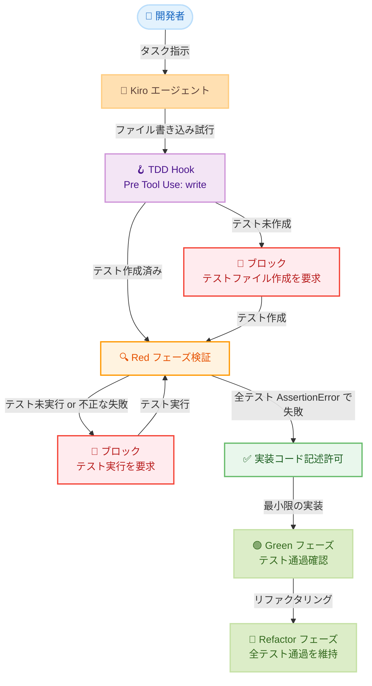

# Kiro - テスト駆動開発 (TDD) の Hook 自動化

**リリース日**: 2026年5月21日
**サービス**: Kiro
**機能**: TDD Hook による Red-Green-Refactor サイクル自動化

📊 [このアップデートのインフォグラフィックを見る](https://takech9203.github.io/aws-news-summary/20260521-kiro-how-tdd-should-feel.html)

## 概要

Kiro の Agent Hooks 機能を活用して、テスト駆動開発 (TDD) の Red-Green-Refactor サイクルを自動的に強制する手法を紹介するブログ記事が公開された。Kiro の「Pre Tool Use」イベントに Hook を設定することで、ファイル書き込み時に TDD プロセスの遵守を自動的にチェックし、テストが先に書かれていない場合は実装コードの記述を阻止する。

著者の Mike George 氏は、TDD の理念には賛同しつつも、テストコードと実装コードの間のコンテキストスイッチングや、テスト記述の煩雑さが実践の障壁であったと述べている。Kiro の Hook を活用することで、TDD に必要な「規律」をエージェントに委任し、開発者は TDD のメリットのみを享受できるようになるとしている。

**アップデート前の課題**

- TDD はコード品質向上に有効だが、テストコードと実装コード間のコンテキストスイッチングが煩雑だった
- Red-Green-Refactor サイクルを一貫して維持するには高い規律が必要で、多くの開発者が継続できなかった
- 手動でテストの作成順序や失敗状態を追跡する必要があり、認知的負荷が高かった

**アップデート後の改善**

- Hook が自動的に TDD サイクルの遵守をチェックし、テストなしの実装コード記述を阻止する
- Kiro が Red フェーズ (テスト失敗) を確認してから Green フェーズ (実装) に進む一連のフローを自動化
- コンテキストスイッチングの負担なく TDD のメリット (高品質コード、バグ削減、安全なリファクタリング) を享受可能に

## アーキテクチャ図



Kiro がファイルを書き込もうとするたびに TDD Hook が発動し、テストファイルの存在と Red フェーズの正当性を検証するフローを示している。全テストが AssertionError で失敗している状態のみ実装コードの記述が許可される。

## サービスアップデートの詳細

### 主要機能

1. **TDD Hook の設定**
   - 「Pre Tool Use」イベントで `write` ツールをトリガーとする Hook を作成
   - アクションを「Ask Kiro」に設定し、TDD ルールをエージェント指示として記述
   - Kiro タブの Agent Hooks ウィンドウから手動で Hook を作成

2. **Red-Green-Refactor サイクルの自動強制**
   - Red フェーズ: 全テストが AssertionError で失敗することを検証
   - Green フェーズ: テスト通過に必要な最小限のコードのみ記述
   - Refactor フェーズ: リファクタリング後に全テストの通過を再確認

3. **Spec 駆動開発との連携**
   - 要件フェーズでユーザーストーリーと受け入れ基準を定義
   - 設計フェーズでアーキテクチャと実装アプローチを決定
   - タスクフェーズで実行可能なタスクリストを生成し、各タスクで TDD Hook が適用

4. **例外ファイルの自動判別**
   - テストファイル (`*test*.py`, `*.spec.*` など) は Hook をバイパス
   - 設定ファイル (`package.json`, `Dockerfile` など) は例外として処理
   - `.kiro/` ディレクトリ内のファイルも例外扱い

## 技術仕様

### Hook 設定

| 項目 | 詳細 |
|------|------|
| Title | TDD: Test First |
| Event | Pre Tool Use |
| Tool name | write |
| Action | Ask Kiro |

### Red フェーズの有効/無効判定

| 状態 | 判定 |
|------|------|
| 全テストが AssertionError で失敗 | 有効な Red フェーズ |
| 一部テストがパス | 無効 (テストが不十分) |
| ImportError / ModuleNotFoundError | 無効 (モジュール未作成) |
| SyntaxError | 無効 |

### 例外ファイル一覧

| カテゴリ | パターン |
|----------|----------|
| テストファイル | `*test*.py`, `*.spec.*`, `*.test.*`, `test_*.py`, `*_test.go` |
| 設定ファイル | `package.json`, `tsconfig.json`, `Dockerfile`, `.env`, `.gitignore` など |
| Kiro ファイル | `.kiro/` ディレクトリ配下 |
| 型定義 | `.d.ts`, Protocol クラス |
| ドキュメント | `.md`, `.txt`, `.rst`, LICENSE, README |
| データファイル | `.json`, `.yaml`, `.xml`, `.csv`, `.html`, `.css` |

### Hook 指示テンプレート

```text
STOP! You are about to write code. Follow TDD by writing the TEST FIRST.

ACTION REQUIRED:
1. If this is a test file (*test*.py, *.spec.*, etc.) - PROCEED
2. If this is an exception (config, docs, .kiro/) - PROCEED
3. If a corresponding test file exists AND has been run showing ALL tests
   FAILED (RED phase) - PROCEED
4. Otherwise - STOP and write the test file first:
   a. Create test_<filename>.py (or equivalent)
   b. Write tests that will FAIL with actual assertions (not just imports)
   c. Run tests to verify they ALL fail with assertion errors
   d. THEN come back and write this implementation

TDD CYCLE:
- RED: Write failing test first (ALL new tests MUST fail on assertions)
- GREEN: Write minimal code to pass
- REFACTOR: Clean up while tests stay green
```

## 設定方法

### 前提条件

1. Kiro IDE がインストールされていること
2. テスト対象プロジェクトのテストフレームワーク (pytest、Jest など) が設定済みであること

### 手順

#### ステップ 1: Hook の作成

Kiro IDE の Kiro タブを開き、Agent Hooks ウィンドウの「+」ボタンをクリックし、「manually create a hook」を選択する。

#### ステップ 2: Hook パラメータの入力

以下の情報を入力する。

- **Title**: `TDD: Test First`
- **Description**: `Enforces Test-Driven Development by prompting to write failing tests before any production code. Follows the red/green/refactor cycle: write a test that fails (red), write minimal code to pass (green), then refactor.`
- **Event**: `Pre Tool Use`
- **Tool name**: `write`
- **Action**: `Ask Kiro`
- **Instructions for Kiro agent**: 上記の Hook 指示テンプレートを貼り付け

#### ステップ 3: Hook の保存

画面下部の「Create Hook」ボタンをクリックして Hook を保存する。以降、Kiro がファイルを書き込もうとするたびに TDD チェックが自動実行される。

#### ステップ 4: Spec セッションでの活用 (オプション)

Spec セッションを開始して要件を定義し、タスクリストを生成する。各タスク実行時に TDD Hook が自動的に Red-Green-Refactor サイクルを強制する。

## メリット

### ビジネス面

- **コード品質の向上**: TDD の一貫した適用によりバグの早期検出と修正コスト削減を実現
- **開発者体験の改善**: TDD の「つらさ」をエージェントに委任し、開発者が創造的な作業に集中可能に
- **チーム全体の TDD 導入**: 個人の規律に依存せず、Hook による自動強制で全チームメンバーが TDD を実践

### 技術面

- **テストカバレッジの保証**: 実装コードの前にテストが必ず存在する状態を維持
- **リファクタリングの安全性向上**: 全テストが常にパスする状態を維持するため、安全にリファクタリング可能
- **Red フェーズの厳格な検証**: テストが「空のパス」にならないよう、AssertionError での失敗を要求する仕組み

## デメリット・制約事項

### 制限事項

- Hook は Kiro エージェント経由のファイル書き込みにのみ適用され、手動エディタ操作には効かない
- テストフレームワークの実行環境がプロジェクト内に適切に構成されている必要がある
- 複雑なインテグレーションテストや外部依存を持つテストには追加設定が必要な場合がある

### 考慮すべき点

- AI 生成コードはセキュリティ観点でのレビューが引き続き必要 (認証、認可、入力検証、データ処理)
- ブログ記事の例では認証なしのオープン API を使用しているが、本番環境では包括的なセキュリティコントロールが必要
- 組織での導入時はガバナンスポリシー (アクセス管理、コード品質モニタリング、検証プロセス) の整備を推奨

## ユースケース

### ユースケース 1: REST API の段階的構築

**シナリオ**: タスク管理システムの REST API を新規構築する。CRUD 操作、入力バリデーション、エラーハンドリングなど多数の要件がある。

**実装例**:
```
Spec セッションで要件定義 → 設計ドキュメント生成 → タスクリスト生成
タスク: GET /tasks/{task_id} ルートハンドラの実装
→ Hook 発動: テスト未作成のため実装をブロック
→ Kiro がテストを作成、実行して Red フェーズを確認
→ 最小限の実装コードを記述して Green フェーズを確認
→ 全既存テストの通過を再確認
```

**効果**: 各ルートハンドラに対して確実にテストが先行し、API 仕様との整合性をテストレベルで保証する。

### ユースケース 2: アルゴリズム実装のプロトタイピング

**シナリオ**: モンティホール問題のシミュレーションプログラムなど、アルゴリズムの正確性が重要な実装を行う。

**実装例**:
```
指示: "モンティホール問題を実証するプログラムを書いて"
→ Hook 発動: テスト作成を要求
→ Kiro がユニットテストを作成
→ ModuleNotFoundError で失敗 (無効な Red フェーズ)
→ 基本モジュールを作成し AssertionError での失敗を確認
→ 最小限の実装でテストをパス
```

**効果**: アルゴリズムの期待動作がテストとして明文化され、実装の正確性を検証可能にする。

### ユースケース 3: レガシーコードのリファクタリング

**シナリオ**: 既存のテストがないレガシーコードに対して安全にリファクタリングを行いたい。

**実装例**:
```
指示: "このモジュールをリファクタリングして可読性を向上させて"
→ Hook 発動: 既存テストの存在を確認
→ テスト未作成の場合、現在の動作を保証するテストを先に作成
→ 全テスト通過を確認してからリファクタリング開始
→ 各変更後に全テストの通過を再確認
```

**効果**: リファクタリング前に現在の動作を保証するテストが作成され、回帰バグのリスクを最小化する。

## 料金

Kiro の Hook 機能は全プランで利用可能である。

| プラン | 月額 | クレジット |
|--------|------|-----------|
| Free | $0 | 50 クレジット/月 |
| Pro | $20 | 1,000 クレジット/月 |
| Pro+ | $40 | 2,000 クレジット/月 |
| Power | $200 | 10,000 クレジット/月 |

詳細は [Kiro Pricing ページ](https://kiro.dev/pricing) を参照。

## 利用可能リージョン

グローバル (Kiro はグローバルサービスとして提供)

## 関連サービス・機能

- **Kiro Specs**: 要件定義から設計、タスクリスト生成までの 3 フェーズワークフロー。TDD Hook と組み合わせることでタスクごとに TDD を自動適用
- **Kiro Agent Hooks**: IDE 内の特定イベントに応じて自動実行されるオートメーションツール。TDD 以外にも Lint、セキュリティチェックなどに応用可能
- **Kiro Web**: ブラウザベースの自律開発環境。Web 経由のタスク実行でも同様の品質管理が可能
- **Kiro CLI**: コマンドラインインターフェース。CI/CD パイプラインとの連携に活用

## 参考リンク

- 📊 [インフォグラフィック](https://takech9203.github.io/aws-news-summary/20260521-kiro-how-tdd-should-feel.html)
- [公式ブログ記事 - Test Driven Development (TDD) with Kiro: this is how it should feel](https://kiro.dev/blog/how-tdd-should-feel/)
- [Kiro Hooks ドキュメント](https://kiro.dev/docs/hooks/)
- [Kiro 公式サイト](https://kiro.dev)
- [Kiro Changelog](https://kiro.dev/changelog/)
- [Kiro 料金ページ](https://kiro.dev/pricing)

## まとめ

Kiro の Agent Hooks を活用した TDD 自動化は、テスト駆動開発の理想と実践のギャップを埋める実用的なアプローチである。Hook による Red-Green-Refactor サイクルの自動強制により、個人の規律に依存せず TDD の恩恵 (高品質コード、バグ削減、安全なリファクタリング) を得られる。TDD の導入に苦戦してきた開発者やチームは、ブログ記事で公開されている Hook 設定をコピーして小規模なプロジェクトから試してみることを推奨する。
