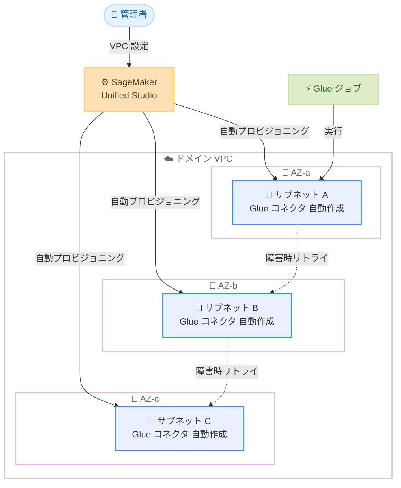

# SageMaker Unified Studio - Glue コネクタのクロスサブネットジョブリトライ自動プロビジョニング

**リリース日**: 2026年5月21日
**サービス**: Amazon SageMaker Unified Studio
**機能**: AWS Glue コネクタの自動プロビジョニング (クロスサブネットジョブリトライ)

📊 [このアップデートのインフォグラフィックを見る](https://takech9203.github.io/aws-news-summary/20260521-sagemaker-unified-studio-glue.html)

## 概要

Amazon SageMaker Unified Studio が AWS Glue ジョブのクロスサブネットリトライに対応する Glue コネクタの自動プロビジョニング機能をリリースした。この機能により、Glue ジョブがプライマリサブネットで失敗した際に、別のサブネットのコネクタを使用して自動的にリトライが実行される。

管理者がドメイン VPC に複数のアベイラビリティゾーンにまたがるプライベートサブネットを設定するだけで、システムが自動的にすべてのサブネットに対して Glue コネクタをプロビジョニングする。IP アドレスの枯渇や AZ の劣化といった障害シナリオにおいて、ユーザーの手動介入なしにジョブが継続実行される。これにより、計画外のダウンタイムを削減し、SLA を満たすデータパイプラインの構築が容易になる。

**アップデート前の課題**

- Glue ジョブが特定のサブネットで失敗した場合、手動でネットワーク接続を再構成し別のサブネットでリトライする必要があった
- IP アドレスの枯渇や AZ 障害時に、データパイプラインが停止し SLA 違反のリスクがあった
- 複数サブネットにまたがる Glue コネクタを手動で作成・管理する運用負荷が高かった

**アップデート後の改善**

- ドメイン VPC 設定に基づき、Glue コネクタが全サブネットに自動プロビジョニングされる
- サブネット障害時に自動的に別サブネットへリトライが実行され、ダウンタイムが削減される
- 初期 VPC 設定以降はユーザーの介入が不要で、運用負荷が大幅に低減される

## アーキテクチャ図



管理者がドメイン VPC を複数サブネットで設定すると、SageMaker Unified Studio が各サブネットに Glue コネクタを自動作成する。Glue ジョブ実行時にサブネット障害が発生した場合、別のサブネットへ自動リトライが行われる。

## サービスアップデートの詳細

### 主要機能

1. **Glue コネクタの自動プロビジョニング**
   - ドメイン VPC 設定に定義された全プライベートサブネットに対して Glue コネクタを自動作成
   - 新規プロジェクトに対して自動的にコネクタがプロビジョニングされる
   - 手動でのコネクタ作成・管理が不要

2. **クロスサブネット自動リトライ**
   - プライマリサブネットが利用不可になった場合、別サブネットのコネクタを使用して自動リトライ
   - IP アドレス枯渇シナリオに対応
   - AZ 劣化シナリオに対応

3. **ゼロオペレーション設計**
   - 初期 VPC 設定後はユーザーアクションが不要
   - 既存のドメイン VPC 設定フレームワーク内で動作
   - 管理者による追加設定や監視が最小限

## 技術仕様

### ネットワーク構成要件

| 項目 | 詳細 |
|------|------|
| VPC 構成 | 複数のプライベートサブネットが必要 |
| サブネット配置 | 複数の AZ にまたがる配置を推奨 |
| 対象 | 新規プロジェクト |
| 障害検知 | IP アドレス枯渇、AZ 劣化を自動検知 |
| リトライ動作 | 別サブネットのコネクタへ自動フェイルオーバー |

### API 変更履歴

| 日付 | サービス | 変更内容 |
|------|----------|----------|
| 2026/05/21 | [Amazon SageMaker Service](https://awsapichanges.com/archive/changes/8bd61f-api.sagemaker.html) | 3 updated methods - ドメインでの Home EFS ファイルシステム作成無効化サポート追加 |

### 前提となる権限

ドメイン VPC 設定に必要な IAM 権限として、以下のアクションへのアクセスが必要と想定される。

```json
{
  "Version": "2012-10-17",
  "Statement": [
    {
      "Effect": "Allow",
      "Action": [
        "glue:CreateConnection",
        "glue:DeleteConnection",
        "glue:GetConnection",
        "ec2:DescribeSubnets",
        "ec2:DescribeVpcs",
        "ec2:DescribeSecurityGroups"
      ],
      "Resource": "*"
    }
  ]
}
```

## 設定方法

### 前提条件

1. Amazon SageMaker Unified Studio ドメインが設定済みであること
2. ドメイン VPC に複数の AZ にまたがるプライベートサブネットが構成されていること
3. ドメイン管理者権限を持つ IAM ロールがあること

### 手順

#### ステップ 1: ドメイン VPC の確認

SageMaker Unified Studio のドメイン設定で、VPC に複数のプライベートサブネットが異なるアベイラビリティゾーンに配置されていることを確認する。

```bash
# VPC 内のサブネット一覧を確認
aws ec2 describe-subnets \
  --filters "Name=vpc-id,Values=vpc-xxxxxxxx" \
  --query "Subnets[].{SubnetId:SubnetId,AZ:AvailabilityZone,CidrBlock:CidrBlock}" \
  --output table
```

VPC 内のサブネットとそのアベイラビリティゾーンを一覧表示し、マルチ AZ 構成を確認する。

#### ステップ 2: ドメイン VPC 設定の更新

ドメイン VPC 設定に複数のサブネットを含めて設定する。この設定により、Glue コネクタの自動プロビジョニングが有効になる。

```bash
# SageMaker ドメインの VPC 設定を確認
aws sagemaker describe-domain \
  --domain-id d-xxxxxxxx \
  --query "DefaultUserSettings.SecurityGroups"
```

ドメインの現在の VPC 設定を確認し、複数サブネットが含まれていることを検証する。

#### ステップ 3: 新規プロジェクトでの動作確認

新規プロジェクトを作成し、Glue コネクタが各サブネットに自動的にプロビジョニングされていることを確認する。

```bash
# Glue コネクション一覧を確認
aws glue get-connections \
  --filter '{"ConnectionType": "NETWORK"}' \
  --query "ConnectionList[].{Name:Name,Subnet:PhysicalConnectionRequirements.SubnetId}"
```

自動作成された Glue ネットワークコネクションとそれぞれのサブネット割り当てを確認する。

## メリット

### ビジネス面

- **SLA 遵守の向上**: サブネット障害時の自動リカバリにより、データパイプラインのダウンタイムが削減される
- **運用コスト削減**: 手動でのコネクタ管理やリトライ対応が不要になり、運用チームの負荷が軽減される
- **信頼性の向上**: マルチ AZ のレジリエンスが自動的に確保され、ビジネスクリティカルなデータ処理の信頼性が向上する

### 技術面

- **自動フェイルオーバー**: IP 枯渇や AZ 劣化を自動検知し、別サブネットへシームレスにリトライ
- **インフラ管理の簡素化**: Glue コネクタのライフサイクルが自動管理され、設定ドリフトのリスクが排除される
- **スケーラビリティ**: 新規プロジェクト作成時に自動的にマルチサブネット対応となるため、スケール時も一貫した可用性が維持される

## デメリット・制約事項

### 制限事項

- 新規プロジェクトに対してのみ適用され、既存プロジェクトへの自動適用については明示されていない
- ドメイン VPC に複数の AZ にまたがるプライベートサブネットが事前に構成されている必要がある
- リトライ対象は Glue ジョブに限定され、他のコンピュートサービスには適用されない

### 考慮すべき点

- 複数サブネットにコネクタが自動作成されるため、VPC 内のリソース制限 (ENI 数など) に注意が必要
- 自動リトライの動作ロジック (リトライ回数、タイムアウトなど) の詳細仕様は公式ドキュメントで確認が推奨される

## ユースケース

### ユースケース 1: 大規模 ETL パイプラインの高可用性確保

**シナリオ**: 毎日数百の Glue ジョブが実行される大規模 ETL パイプラインで、特定の AZ で IP アドレスが枯渇しジョブが失敗するケースが頻発していた。

**実装例**:
```bash
# ドメイン VPC に 3 つの AZ のサブネットを設定
# サブネット A: subnet-aaa (ap-northeast-1a)
# サブネット B: subnet-bbb (ap-northeast-1c)
# サブネット C: subnet-ccc (ap-northeast-1d)

# Glue ジョブが subnet-aaa で IP 枯渇により失敗
# -> 自動的に subnet-bbb でリトライ実行
```

**効果**: IP アドレス枯渇による Glue ジョブの失敗率が大幅に減少し、SLA 99.9% の達成が容易になる

### ユースケース 2: マルチ AZ データ統合ワークロード

**シナリオ**: 複数のデータソースからデータを収集・統合する Glue ジョブが、単一 AZ の障害でバッチ処理全体が停止していた。

**実装例**:
```bash
# SageMaker Unified Studio でプロジェクト作成時に
# 自動的にマルチサブネット Glue コネクタがプロビジョニング

# AZ 劣化発生時のフロー:
# 1. Glue ジョブが AZ-a で実行開始
# 2. AZ-a で劣化検知
# 3. 自動的に AZ-c のコネクタでリトライ
# 4. ジョブ完了 (ユーザー介入なし)
```

**効果**: AZ 障害時のバッチ処理停止がゼロになり、データの鮮度と可用性が向上する

### ユースケース 3: 規制対応が必要なデータパイプライン

**シナリオ**: 金融機関のデータパイプラインで、規制要件として処理の継続性とデータ処理 SLA の遵守が求められている。

**実装例**:
```bash
# ドメイン VPC 設定で複数 AZ のプライベートサブネットを指定
# 自動フェイルオーバーにより規制要件の継続性を確保

# 監査ログで確認:
aws glue get-job-runs \
  --job-name "compliance-etl-job" \
  --query "JobRuns[].{Status:JobRunState,StartedOn:StartedOn}"
```

**効果**: 障害発生時も自動リカバリにより処理が継続し、規制当局への SLA 遵守報告が容易になる

## 料金

この機能自体に追加料金は発生しない。料金は通常の SageMaker Unified Studio および AWS Glue の使用量に基づく。

| 項目 | 料金体系 |
|------|----------|
| Glue コネクタ作成 | 無料 |
| Glue ジョブ実行 | 標準の Glue ジョブ料金 (DPU 時間単位) |
| リトライ時のジョブ実行 | 追加の Glue ジョブ実行料金が発生 |
| VPC リソース | ENI 等の VPC リソース使用量に準じる |

## 利用可能リージョン

Amazon SageMaker Unified Studio がサポートされている以下のリージョンで利用可能。

- 米国東部 (バージニア北部)
- 米国東部 (オハイオ)
- 米国西部 (オレゴン)
- アジアパシフィック (東京)
- アジアパシフィック (ソウル)
- アジアパシフィック (シンガポール)
- アジアパシフィック (シドニー)
- アジアパシフィック (ムンバイ)
- 欧州 (アイルランド)
- 欧州 (フランクフルト)
- 欧州 (ロンドン)
- 欧州 (パリ)
- 欧州 (ストックホルム)
- カナダ (中部)
- 南米 (サンパウロ)

## 関連サービス・機能

- **Amazon SageMaker Unified Studio**: データ分析、ML、AI アプリケーション開発の統合環境
- **AWS Glue**: サーバーレスデータ統合サービス。ETL ジョブの実行基盤
- **Amazon VPC**: 仮想ネットワーク環境。マルチ AZ サブネット構成の基盤
- **AWS Glue Connection**: Glue ジョブがデータソースにアクセスするためのネットワーク接続設定

## 参考リンク

- 📊 [インフォグラフィック](https://takech9203.github.io/aws-news-summary/20260521-sagemaker-unified-studio-glue.html)
- [公式発表 (What's New)](https://aws.amazon.com/about-aws/whats-new/2026/05/sagemaker-unified-studio-glue/)
- [SageMaker Unified Studio ドキュメント](https://docs.aws.amazon.com/sagemaker-unified-studio/latest/adminguide/what-is-sagemaker-unified-studio.html)
- [サポートリージョン一覧](https://docs.aws.amazon.com/sagemaker-unified-studio/latest/adminguide/supported-regions.html)

## まとめ

SageMaker Unified Studio の Glue コネクタ自動プロビジョニング機能は、データパイプラインの可用性を大幅に向上させるアップデートである。IP アドレス枯渇や AZ 劣化といった障害シナリオに対して、管理者の初期 VPC 設定だけで自動フェイルオーバーが実現される。大規模な ETL ワークロードを運用する組織にとって、運用負荷の削減と SLA 遵守の両立を可能にする重要な機能強化である。
