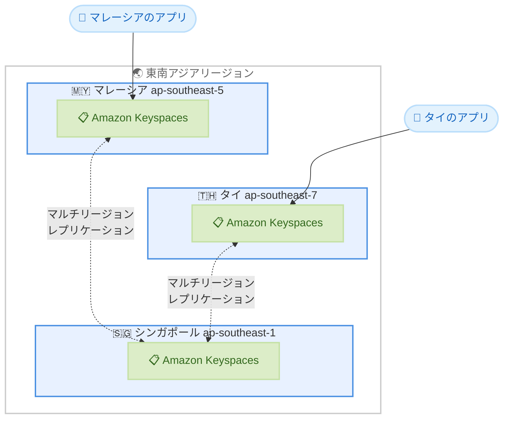

# Amazon Keyspaces - アジアパシフィック (マレーシア) およびアジアパシフィック (タイ) リージョン拡大

**リリース日**: 2026 年 5 月 22 日
**サービス**: Amazon Keyspaces (for Apache Cassandra)
**機能**: アジアパシフィック (マレーシア) および アジアパシフィック (タイ) リージョンでの利用開始

📊 [このアップデートのインフォグラフィックを見る](https://takech9203.github.io/aws-news-summary/20260522-amazon-keyspaces-malaysia-thailand.html)

## 概要

Amazon Keyspaces (for Apache Cassandra) が、アジアパシフィック (マレーシア) リージョン (ap-southeast-5) およびアジアパシフィック (タイ) リージョン (ap-southeast-7) で利用可能になった。これにより、マレーシアおよびタイのユーザーは、Apache Cassandra 互換のワークロードをより低いレイテンシーで実行でき、データレジデンシー要件にも対応できるようになった。

Amazon Keyspaces は、フルマネージドでサーバーレスの Apache Cassandra 互換データベースサービスである。サーバーのプロビジョニング、パッチ適用、管理が不要で、使用したリソースに対してのみ課金される。今回の拡大により、東南アジア地域での選択肢がさらに広がり、シンガポールリージョンに加えてマレーシアおよびタイからもサービスを利用できるようになった。

**アップデート前の課題**

- マレーシアおよびタイのユーザーは、最寄りのシンガポールリージョン (ap-southeast-1) を利用する必要があり、レイテンシーが発生していた
- データレジデンシー要件により、マレーシアやタイ国内にデータを保持する必要があるワークロードでは Amazon Keyspaces を利用できなかった
- 東南アジア地域での Cassandra ワークロードのデプロイ先が限られていた

**アップデート後の改善**

- マレーシアおよびタイのユーザーが自国リージョンで Amazon Keyspaces を利用でき、レイテンシーが大幅に低減された
- データレジデンシー要件を満たしながら、フルマネージドの Cassandra 互換データベースを活用できるようになった
- マルチリージョンレプリケーションの選択肢が増え、東南アジア地域での高可用性構成がより柔軟になった

## アーキテクチャ図



新しいリージョンでの Amazon Keyspaces の構成と、マルチリージョンレプリケーションによる東南アジア地域内での高可用性アーキテクチャを示している。

## サービスアップデートの詳細

### 主要機能

1. **フルマネージド Cassandra 互換データベース**
   - サーバーレスアーキテクチャにより、インフラストラクチャの管理が不要
   - Cassandra Query Language (CQL) を使用したアクセス
   - 既存の Cassandra アプリケーションコードおよびドライバーとの互換性

2. **新リージョンで利用可能な全機能**
   - ポイントインタイムリカバリ (PITR)
   - マルチリージョンレプリケーション
   - CDC ストリーム (Change Data Capture)
   - IPv6 サポート (デュアルスタックエンドポイント)

3. **マルチリージョンレプリケーション**
   - 東南アジア地域内でのデータ複製による高可用性
   - シンガポール、マレーシア、タイ間でのレプリケーションが可能
   - ディザスタリカバリ構成の柔軟性向上

## 技術仕様

### エンドポイント情報

| リージョン | リージョンコード | エンドポイント |
|------|------|------|
| アジアパシフィック (マレーシア) | ap-southeast-5 | cassandra.ap-southeast-5.amazonaws.com |
| アジアパシフィック (タイ) | ap-southeast-7 | cassandra.ap-southeast-7.amazonaws.com |

### デュアルスタックエンドポイント

| リージョン | エンドポイント |
|------|------|
| アジアパシフィック (マレーシア) | cassandra.ap-southeast-5.api.aws |
| アジアパシフィック (タイ) | cassandra.ap-southeast-7.api.aws |

### 接続プロトコル

| アクセス方法 | ポート | プロトコル |
|------|------|------|
| cqlsh / Cassandra ドライバー | 9142 | TLS |
| AWS CLI | 443 | HTTPS |
| AWS SDK | 443 | HTTPS |

## 設定方法

### 前提条件

1. AWS アカウントがアジアパシフィック (マレーシア) または アジアパシフィック (タイ) リージョンで有効化されていること
2. IAM ユーザーまたはロールに Amazon Keyspaces へのアクセス権限が設定されていること
3. TLS 接続用の Amazon Trust Services ルート CA 証明書が準備されていること

### 手順

#### ステップ 1: キースペースの作成

```bash
aws keyspaces create-keyspace \
    --keyspace-name my_keyspace \
    --region ap-southeast-5
```

マレーシアリージョンに新しいキースペースを作成する。`--region` を `ap-southeast-7` に変更するとタイリージョンに作成される。

#### ステップ 2: テーブルの作成

```bash
aws keyspaces create-table \
    --keyspace-name my_keyspace \
    --table-name my_table \
    --schema-definition '{
        "allColumns": [
            {"name": "id", "type": "uuid"},
            {"name": "name", "type": "text"},
            {"name": "created_at", "type": "timestamp"}
        ],
        "partitionKeys": [{"name": "id"}]
    }' \
    --region ap-southeast-5
```

作成したキースペース内にテーブルを定義する。スキーマは CQL のデータ型に対応している。

#### ステップ 3: cqlsh での接続

```bash
cqlsh cassandra.ap-southeast-5.amazonaws.com 9142 \
    --ssl \
    --auth-provider "PlainTextAuthProvider" \
    -u "ServiceUserName" \
    -p "ServicePassword"
```

TLS を使用してマレーシアリージョンの Amazon Keyspaces エンドポイントに接続する。サービス固有の認証情報は IAM コンソールから生成できる。

## メリット

### ビジネス面

- **データレジデンシーコンプライアンス**: マレーシアおよびタイの法規制に準拠したデータ保存が可能になり、規制産業での採用障壁が解消される
- **低レイテンシーアクセス**: 地理的に近いリージョンからのアクセスにより、エンドユーザー体験が向上する
- **事業継続性の強化**: 東南アジア地域内での複数リージョン構成が可能になり、DR 対策の選択肢が広がる

### 技術面

- **マルチリージョン構成の柔軟性**: ap-southeast-1、ap-southeast-5、ap-southeast-7 間でのレプリケーションにより、東南アジア地域内で高可用性アーキテクチャを構築できる
- **サーバーレスの運用負荷軽減**: 新リージョンでもインフラストラクチャ管理不要のサーバーレスモデルが適用される
- **CDC ストリーム対応**: 新リージョンでも Change Data Capture が利用可能で、リアルタイムデータ連携パイプラインを構築できる

## デメリット・制約事項

### 制限事項

- 新リージョンの初期段階では、他のリージョンと比較して一部の AWS サービスとの連携が制限される可能性がある
- マレーシアおよびタイリージョンの料金は他のアジアパシフィックリージョンと異なる場合がある (リージョン別料金を確認すること)
- プロビジョンドキャパシティモードの予約容量やセービングプランの適用条件はリージョンにより異なる場合がある

### 考慮すべき点

- 既存のシンガポールリージョンで稼働しているワークロードを移行する場合、マルチリージョンレプリケーションを活用した段階的な移行を推奨する
- 新リージョンでの AWS PrivateLink の利用可能性を事前に確認すること

## ユースケース

### ユースケース 1: マレーシアの金融サービス企業

**シナリオ**: マレーシアの金融機関が、Bank Negara Malaysia のデータ規制に準拠するため、顧客トランザクションデータを国内に保持する必要がある。

**実装例**:
```sql
CREATE KEYSPACE financial_data
    WITH REPLICATION = {'class': 'SingleRegionStrategy'}
    AND TAGS = {'environment': 'production', 'compliance': 'bnm'};

CREATE TABLE financial_data.transactions (
    account_id uuid,
    transaction_time timestamp,
    amount decimal,
    currency text,
    PRIMARY KEY (account_id, transaction_time)
) WITH CLUSTERING ORDER BY (transaction_time DESC);
```

**効果**: データレジデンシー要件を満たしつつ、低レイテンシーでのトランザクション処理を実現する。

### ユースケース 2: タイの E コマースプラットフォーム

**シナリオ**: タイの大手 E コマース企業が、商品カタログと注文履歴を高スループットで処理する必要がある。従来はシンガポールリージョンを使用していたが、タイ国内ユーザーへのレスポンス改善が求められている。

**実装例**:
```sql
CREATE KEYSPACE ecommerce
    WITH REPLICATION = {'class': 'SingleRegionStrategy'};

CREATE TABLE ecommerce.product_catalog (
    category text,
    product_id uuid,
    name text,
    price decimal,
    stock_count int,
    PRIMARY KEY (category, product_id)
);
```

**効果**: タイ国内のユーザーに対してミリ秒レベルのレスポンスタイムを実現し、購買体験を向上させる。

### ユースケース 3: 東南アジアマルチリージョン IoT プラットフォーム

**シナリオ**: 東南アジア全域に展開するスマートシティプラットフォームが、各国のセンサーデータを収集し、レプリケーションによる高可用性と各国でのデータ主権を両立させたい。

**実装例**:
```bash
# マルチリージョンキースペースの作成
aws keyspaces create-keyspace \
    --keyspace-name iot_platform \
    --replication-specification '{
        "regionList": [
            {"region": "ap-southeast-1"},
            {"region": "ap-southeast-5"},
            {"region": "ap-southeast-7"}
        ],
        "replicationStrategy": "MULTI_REGION"
    }'
```

**効果**: シンガポール、マレーシア、タイの 3 リージョンでデータをレプリケーションし、各国のデータ主権要件を満たしながら、リージョン障害時のフェイルオーバーも自動化される。

## 料金

Amazon Keyspaces はサーバーレスモデルを採用しており、使用したリソースに対してのみ課金される。

### 料金体系

| 項目 | 説明 |
|------|------|
| オンデマンド読み取り | Read Request Units (RRU): 4 KB あたり 1 RRU |
| オンデマンド書き込み | Write Request Units (WRU): 1 KB あたり 1 WRU |
| プロビジョンド読み取り | Read Capacity Units (RCU): 4 KB/秒あたり 1 RCU |
| プロビジョンド書き込み | Write Capacity Units (WCU): 1 KB/秒あたり 1 WCU |
| ストレージ | 使用量に応じた GB 単位の課金 |
| PITR バックアップ | 有効化したテーブルサイズに基づく課金 |

### 無料利用枠

新規アカウントは最初の 3 か月間、毎月以下を無料で利用可能。

| 項目 | 無料枠 |
|------|------|
| オンデマンド書き込み | 3,000 万 WRU |
| オンデマンド読み取り | 3,000 万 RRU |
| ストレージ | 1 GB |

## 利用可能リージョン

Amazon Keyspaces は現在、以下のリージョンで利用可能 (今回追加された 2 リージョンを含む全 24 リージョン以上)。

**今回追加されたリージョン:**
- アジアパシフィック (マレーシア) - ap-southeast-5
- アジアパシフィック (タイ) - ap-southeast-7

**アジアパシフィック地域の利用可能リージョン:**
- アジアパシフィック (東京) - ap-northeast-1
- アジアパシフィック (ソウル) - ap-northeast-2
- アジアパシフィック (シンガポール) - ap-southeast-1
- アジアパシフィック (シドニー) - ap-southeast-2
- アジアパシフィック (マレーシア) - ap-southeast-5 **[NEW]**
- アジアパシフィック (タイ) - ap-southeast-7 **[NEW]**
- アジアパシフィック (香港) - ap-east-1
- アジアパシフィック (ムンバイ) - ap-south-1

## 関連サービス・機能

- **Amazon DynamoDB**: 同じくフルマネージドの NoSQL データベースだが、Cassandra 互換性が不要な場合の選択肢
- **AWS Database Migration Service (DMS)**: 既存の Cassandra クラスターから Amazon Keyspaces への移行をサポート
- **Amazon Kinesis Data Streams**: CDC ストリームと連携したリアルタイムデータ処理パイプラインの構築
- **AWS PrivateLink**: VPC 内からのプライベート接続によるセキュアなアクセス

## 参考リンク

- 📊 [インフォグラフィック](https://takech9203.github.io/aws-news-summary/20260522-amazon-keyspaces-malaysia-thailand.html)
- [公式発表 (What's New)](https://aws.amazon.com/about-aws/whats-new/2026/05/amazon-keyspaces-malaysia-thailand/)
- [Amazon Keyspaces ドキュメント](https://docs.aws.amazon.com/keyspaces/latest/devguide/what-is-keyspaces.html)
- [サービスエンドポイント一覧](https://docs.aws.amazon.com/keyspaces/latest/devguide/programmatic.endpoints.html)
- [料金ページ](https://aws.amazon.com/keyspaces/pricing/)

## まとめ

Amazon Keyspaces のアジアパシフィック (マレーシア) およびアジアパシフィック (タイ) リージョンへの拡大は、東南アジア地域でデータレジデンシー要件を持つ企業や、低レイテンシーアクセスを必要とするワークロードに大きな価値をもたらす。既存の Cassandra ワークロードをこれらの新リージョンに展開することで、コンプライアンス対応とパフォーマンス改善を同時に達成できる。マルチリージョンレプリケーションを活用した東南アジア地域内の高可用性構成も検討を推奨する。
