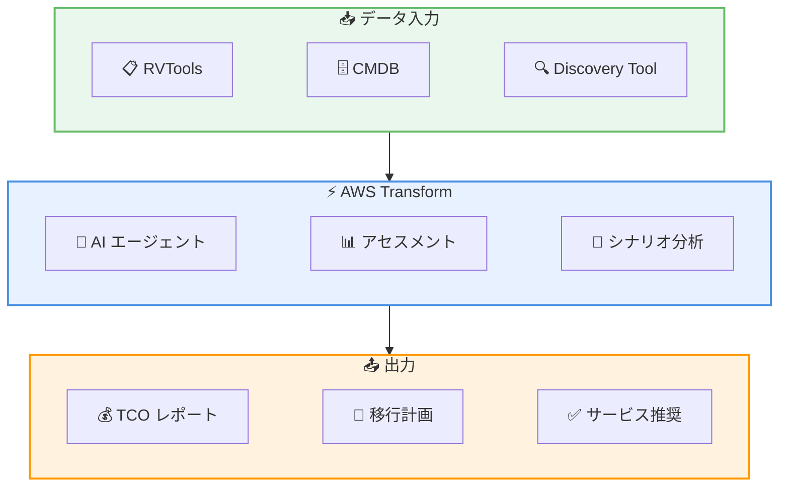

# AWS Transform - エージェント型マイグレーションアセスメント機能

**リリース日**: 2026 年 5 月 22 日
**サービス**: AWS Transform
**機能**: Agentic Migration Assessment Capabilities

📊 [このアップデートのインフォグラフィックを見る](https://takech9203.github.io/aws-news-summary/20260522-assessment-capabilities-transform.html)

## 概要

AWS Transform に新しいエージェント型マイグレーションアセスメント機能が追加された。この機能により、オンプレミス環境のワークロードを自動的に検出・分析し、AWS への移行計画を作成できる。AI エージェントが TCO (Total Cost of Ownership) の算出、What-if シナリオの比較、最適な AWS サービスの推奨を自動で行い、手動作業を大幅に削減する。

AWS Transform は 1 年前にローンチされたエンタープライズ IT 変革のためのワークベンチであり、数十の専門 AI エージェントがアセスメント、コード分析、リファクタリング、依存関係マッピング、変革計画を自動化する。今回のアップデートにより、マイグレーションの初期段階であるアセスメントフェーズが大幅に効率化される。

**アップデート前の課題**

- マイグレーションアセスメントには手動でのインフラデータ収集・分析が必要で、数週間から数か月を要していた
- TCO 分析を行うために複数のスプレッドシートやツールを使い分ける必要があった
- What-if シナリオの比較を手動で行う必要があり、最適な移行パスの特定が困難だった

**アップデート後の改善**

- RVTools、CMDB データ、サードパーティツールなど既存のインフラデータをそのまま取り込み可能になった
- AI エージェントがカスタマイズ可能な前提条件で複数の What-if シナリオを自動生成・比較するようになった
- EC2、FSx、S3、SQL Server on EC2、仮想デスクトップを対象とした包括的な TCO 分析が数分で完了するようになった

## アーキテクチャ図



既存のインフラデータを入力として AI エージェントが自動分析し、TCO レポートや移行計画を生成するフローを示している。

## サービスアップデートの詳細

### 主要機能

1. **What-if シナリオ分析**
   - カスタマイズした前提条件で複数のマイグレーションシナリオを作成可能
   - リージョン、リソース使用率、サービスマッピングなどのパラメータを調整可能
   - シナリオ間の比較を自動化し、最適な移行パスを提示

2. **柔軟なデータ入力**
   - RVTools エクスポート、CMDB データ、AWS Transform Discovery Tool のエクスポートに対応
   - サードパーティの Discovery ツールからのデータも受け入れ可能
   - 「手持ちのデータで即座に開始」できる設計

3. **包括的な TCO コストモデリング**
   - EC2、FSx、S3、SQL Server on EC2、仮想デスクトップのコストモデリングをサポート
   - Cloud Value Framework の柱 (スタッフ生産性、運用レジリエンス、ビジネスアジリティ、サステナビリティ) による拡張分析が可能

4. **エージェント型自動化**
   - 専門 AI エージェントがディスカバリ、分析、プランニングを自動実行
   - MCP (Model Context Protocol) 対応により、IDE やオーケストレーターからの呼び出しが可能
   - Human-in-the-loop 設計で、エージェントの作業を人間がレビュー・修正可能

## 技術仕様

### 対応ワークロードタイプ

| ワークロード | コストモデリング | 説明 |
|------|------|------|
| EC2 | 対応 | コンピュートインスタンスの移行分析 |
| FSx | 対応 | ファイルストレージの移行分析 |
| S3 | 対応 | オブジェクトストレージの移行分析 |
| SQL Server on EC2 | 対応 | データベースの移行分析 |
| 仮想デスクトップ | 対応 | VDI 環境の移行分析 |

### Cloud Value Framework の柱

| 柱 | 説明 |
|------|------|
| コスト削減 | TCO の削減効果を定量化 |
| スタッフ生産性 | 運用効率の向上を評価 |
| 運用レジリエンス | 可用性・信頼性の改善を分析 |
| ビジネスアジリティ | 市場投入速度の向上を評価 |
| サステナビリティ | 環境負荷の削減効果を算定 |

### 対応データソース

| データソース | 説明 |
|------|------|
| RVTools | VMware 環境のインベントリエクスポート |
| CMDB | Configuration Management Database からのエクスポート |
| AWS Transform Discovery Tool | AWS Transform 専用の検出ツール |
| サードパーティツール | その他の Discovery ツールからのデータ |

## 設定方法

### 前提条件

1. AWS Transform ワークスペースが作成済みであること
2. 対象リージョンで AWS Transform が利用可能であること
3. インフラデータ (RVTools エクスポート、CMDB データなど) が準備されていること

### 手順

#### ステップ 1: ワークスペースの作成

AWS Transform コンソールにアクセスし、ワークスペースを作成する。ワークスペースはコネクタやジョブのパーミッション境界として機能する。

#### ステップ 2: インフラデータの取り込み

既存のインフラデータ (RVTools エクスポート、CMDB データ、サードパーティ Discovery ツールのエクスポート) をアップロードする。手持ちのデータでそのまま開始できる。

#### ステップ 3: What-if シナリオの作成

カスタマイズ可能な前提条件 (リージョン、リソース使用率、サービスマッピング) を設定し、複数のマイグレーションシナリオを作成する。

#### ステップ 4: シナリオ比較とレポート生成

AI エージェントが各シナリオを分析し、TCO 比較レポートと最適な移行計画を自動生成する。Cloud Value Framework の柱を追加して、コスト以外の観点も含めた包括的なビジネスケースを構築できる。

## メリット

### ビジネス面

- **移行意思決定の迅速化**: 手動で数週間かかっていたアセスメントが数分で完了し、移行プロジェクトの開始を加速
- **包括的なビジネスケース構築**: TCO だけでなく、生産性・レジリエンス・アジリティ・サステナビリティを含む多角的な評価が可能
- **リスクの低減**: What-if シナリオで複数のオプションを事前に比較し、最適な移行パスを選択可能

### 技術面

- **データソース非依存**: RVTools、CMDB、サードパーティツールなど既存のデータをそのまま活用可能
- **AI エージェントによる自動化**: 依存関係マッピングやサービス推奨を自動化し、人的エラーを削減
- **MCP 対応**: IDE やオーケストレーターから直接呼び出し可能で、既存のワークフローに統合しやすい

## デメリット・制約事項

### 制限事項

- コストモデリングの対象ワークロードは現時点で EC2、FSx、S3、SQL Server on EC2、仮想デスクトップに限定
- 利用可能リージョンが限定されている (8 リージョン)
- エージェントの推奨結果は前提条件の設定に依存するため、入力データの品質が重要

### 考慮すべき点

- 複雑なレガシーアプリケーションの依存関係は、自動検出だけでは完全に把握できない場合がある
- What-if シナリオの前提条件設定には、移行の目的やビジネス要件の理解が前提となる
- Human-in-the-loop レビューによる検証を推奨

## ユースケース

### ユースケース 1: 大規模 VMware 環境の移行計画

**シナリオ**: 数百台の VM を持つオンプレミス VMware 環境を AWS へ移行する際に、最適なアプローチと TCO を評価したい。

**実装例**:
```
1. RVTools で VMware 環境のインベントリをエクスポート
2. AWS Transform にデータをアップロード
3. EC2 移行シナリオと Amazon EVS 移行シナリオを作成・比較
4. TCO レポートから最適な移行パスを選択
```

**効果**: 手動分析に比べ数週間の工数削減。複数シナリオの定量比較により、ステークホルダーへの説明が容易になる。

### ユースケース 2: マルチワークロードの統合アセスメント

**シナリオ**: コンピュート、ストレージ、データベースが混在するオンプレミス環境の包括的な移行アセスメントを実施したい。

**実装例**:
```
1. CMDB からサーバー、ストレージ、データベースのデータをエクスポート
2. AWS Transform に全ワークロードデータを取り込み
3. EC2 + FSx + S3 + SQL Server on EC2 のコストモデリングを実行
4. Cloud Value Framework の全柱を含むビジネスケースを生成
```

**効果**: 個別ワークロードではなく環境全体を統合的に評価でき、移行の全体像とビジネスインパクトを把握可能。

### ユースケース 3: 経営層向け移行ビジネスケースの作成

**シナリオ**: クラウド移行プロジェクトの承認を得るために、経営層向けの定量的なビジネスケースを迅速に作成したい。

**実装例**:
```
1. 既存の Discovery データを AWS Transform に取り込み
2. 保守的シナリオと楽観的シナリオの 2 パターンを作成
3. コスト削減 + スタッフ生産性 + 運用レジリエンスの観点で比較
4. 経営層向けサマリーレポートを出力
```

**効果**: 数日以内に経営層が意思決定可能な定量データを含むビジネスケースを作成可能。

## 料金

AWS Transform の利用に追加料金は発生しない。ドキュメントに「There are no additional charge to use AWS Transform」と明記されている。移行後に使用する AWS サービス (EC2、S3 など) の標準料金のみが発生する。

## 利用可能リージョン

以下の 8 リージョンで利用可能。

| リージョン | コード |
|------|------|
| 米国東部 (バージニア北部) | us-east-1 |
| 欧州 (フランクフルト) | eu-central-1 |
| アジアパシフィック (ムンバイ) | ap-south-1 |
| アジアパシフィック (シドニー) | ap-southeast-2 |
| アジアパシフィック (東京) | ap-northeast-1 |
| 欧州 (ロンドン) | eu-west-2 |
| アジアパシフィック (ソウル) | ap-northeast-2 |
| カナダ (中部) | ca-central-1 |

東京リージョン (ap-northeast-1) で利用可能。

## 関連サービス・機能

- **AWS Application Migration Service (MGN)**: 実際のサーバー移行を実行するサービス。Transform のアセスメント結果と連携して移行を実行
- **AWS Migration Hub**: 移行の進捗を一元管理。Transform のアセスメント結果を全体のマイグレーションポートフォリオに統合
- **Amazon Bedrock**: Transform の AI エージェント基盤。エージェント型ワークフローを支える生成 AI プラットフォーム
- **Kiro**: AWS Transform と統合された AI 搭載 IDE。Agent Builder Toolkit で Transform のカスタムエージェントを構築可能

## 参考リンク

- 📊 [インフォグラフィック](https://takech9203.github.io/aws-news-summary/20260522-assessment-capabilities-transform.html)
- [公式発表 (What's New)](https://aws.amazon.com/about-aws/whats-new/2026/05/assessment-capabilities-transform)
- [AWS Blog - AWS Weekly Roundup: AWS Transform at 1 year](https://aws.amazon.com/blogs/aws/aws-weekly-roundup-aws-transform-at-1-year-claude-platform-on-aws-ec2-m3-ultra-mac-instances-and-more-may-18-2026/)
- [ドキュメント](https://docs.aws.amazon.com/transform/latest/userguide/what-is-service.html)
- [AWS Transform 製品ページ](https://aws.amazon.com/transform/)
- [利用可能リージョン](https://docs.aws.amazon.com/transform/latest/userguide/regions.html)

## まとめ

AWS Transform のエージェント型マイグレーションアセスメント機能は、移行プロジェクトの初期フェーズを大幅に効率化する重要なアップデートである。既存のインフラデータをそのまま活用でき、AI エージェントが自動的に TCO 分析や What-if シナリオ比較を行うため、移行意思決定の迅速化に直結する。東京リージョンでも利用可能であり、追加料金なしで利用できるため、AWS への移行を検討している組織は早期にアセスメント機能を試し、移行計画の策定を開始することを推奨する。
